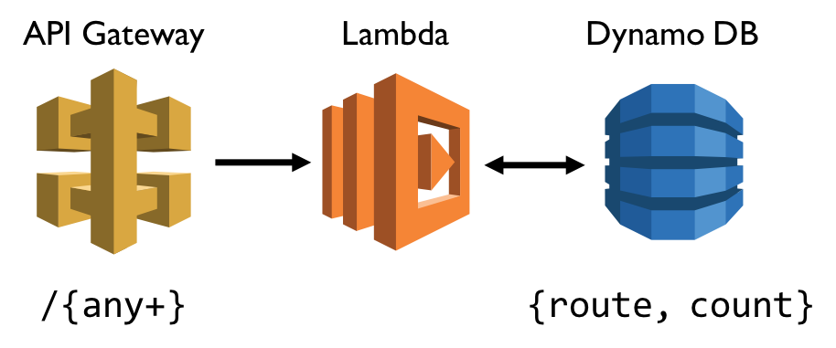
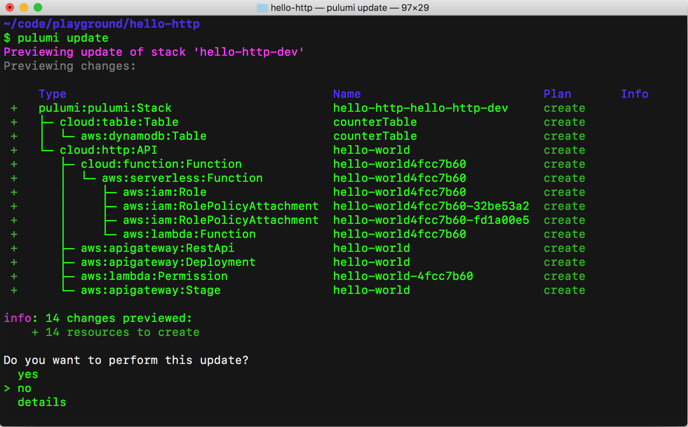
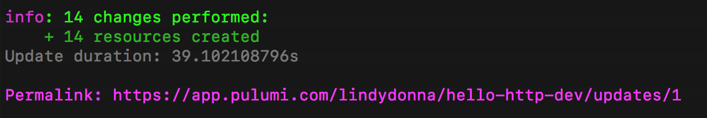
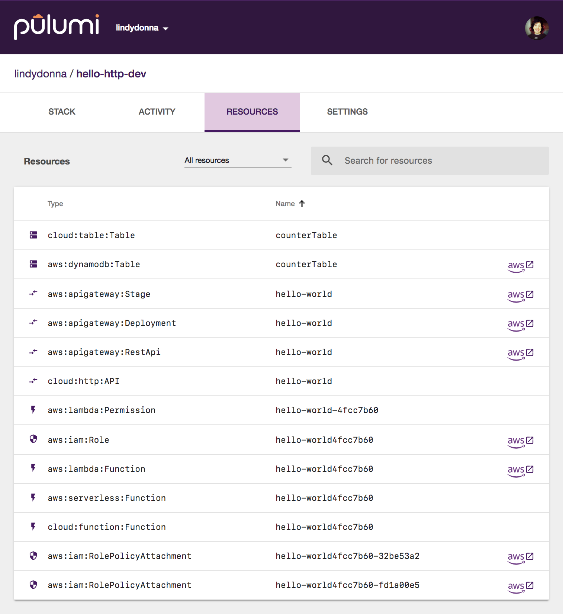

Pulumi makes it easy to build serverless
applications and connect to other cloud resources. In this blog post,
we'll create a simple REST API that counts the number of times a route
has been hit, using JavaScript to define both the infrastructure and
application code.

In Pulumi, you define your application infrastructure in regular code,
using JavaScript, Python or Go, and you can target AWS, Azure, GCP, or
Kubernetes. The Pulumi command line tool transforms your into a
declarative plan, following the best practices of immutable
infrastructure. You can write your app code in any language supported by
your serverless platform.

## Example app: serverless route counter

In this tutorial, we'll build a simple REST API that counts the number
of times a route has been hit. For example:

    $ curl $URL/wow
    {"route":"wow","count":1}

    $ curl $URL/pulumi
    {"route":"pulumi","count":1}

    $ curl $URL/wow
    {"route":"wow","count":2}

We'll implement this using API Gateway, Lambda, and Dynamo DB:



## Setup

If this is your first time using Pulumi, go to <https://app.pulumi.com> and sign in with
GitHub.

Then, run the following command to install the Pulumi CLI:

    $ curl -fsSL https://get.pulumi.com/ | sh

If you're on Windows, run this:

    @"%SystemRoot%System32WindowsPowerShell1.0powershell.exe" -NoProfile -InputFormat None -ExecutionPolicy Bypass -Command "iex ((New-Object System.Net.WebClient).DownloadString('https://get.pulumi.com/install.ps1'))" 
    SET "PATH=%PATH%;%USERPROFILE%.pulumiin"

You'll deploy this app to your own AWS account, so follow the steps to
[configure your AWS account]().

Make sure you have [Node.js](https://nodejs.org/en/download/) installed,
with a version of 6.10.x or later.

## Create the App

First we'll create a Pulumi project and add code for both the
infrastructure definitions and application code.

1.  To create a new Pulumi project, run the following commands:

``` {style="padding-left: 30px;"}
mkdir hello-http && cd hello-http
pulumi new aws-javascript
```

This creates a new project in the directory `hello-http`.

2. Replace the contents of `index.js` with the following:

``` {style="padding-left: 30px;"}
const cloud = require("@pulumi/cloud-aws"); 

/* Create a mapping from 'route' to a count */ 
let counterTable = new cloud.Table("counterTable", "route"); 

/* Create an REST API endpoint */ 
let endpoint = new cloud.API("hello-world"); 

endpoint.get("/{route+}", (req, res) => { 
    let route = req.params["route"]; 
    console.log(`Getting count for '${route}'`); 

    /* get previous value and increment */
    /* reference outer counterTable object */
    counterTable.get({ route }).then(value => {
        let count = (value && value.count) || 0;
        counterTable.insert({ route, count: ++count }).then(() => {
            res.status(200).json({ route, count });
            console.log(`Got count ${count} for '${route}'`);
        });
    });
}); 

exports.endpoint = endpoint.publish().url;
```

The definition for `counterTable` stores a counter for each route, using
`cloud.Table`. On AWS, this provisions a DynamoDB instance. To create a
new API Gateway instance, we create an instance of `cloud.API`. New
routes can be added to this endpoint using functions such as `get`,
`post`, `put` etc.

The function passed to `get` is the interesting part: this becomes the
body of a new AWS Lambda function that is called on a GET request to the
API Gateway. The body of this function can use variables defined in the
main program, such as `counterTable`. This is translated to a lookup on
the provisioned DynamoDB instance; there is no need to store the table
name in an environment variable.

3. Finally, add `@pulumi/cloud-aws` NPM package:

    $ npm install --save @pulumi/cloud @pulumi/cloud-aws

## Deploy the App

To deploy both the infrastructure and app code, we'll run
`pulumi update`. This command first shows a preview of all the resources
that will be created and prompts for confirmation.



Choose the "yes" option to deploy to AWS. At the end of the update,
you'll see a link to the Pulumi Console that shows the details of the
deployment.



Go to this link and click the **Resources** tab. You'll see all the
resources you've created, including links to the AWS Console.



## Test the App

Now that the app is deployed, let's try it out! With the Pulumi CLI,
you can easily view output properties for your stack. This line in the
JavaScript code creates a **stack output**.

```javascript
exports.endpoint = endpoint.publish().url;
```

You can view stack outputs in the Pulumi Console, or via
`pulumi stack output`:

    $ pulumi stack output 
    Current stack outputs (1): 
    OUTPUT    VALUE 
    endpoint  https://5e8xrktey3.execute-api.us-west-2.amazonaws.com/stage/

Now, let's curl some routes!

    $ curl $(pulumi stack output endpoint)/wow
    {"route":"wow","count":1}

    $ curl $(pulumi stack output endpoint)/pulumi
    {"route":"pulumi","count":1}

    $ curl $(pulumi stack output endpoint)/wow
    {"route":"wow","count":2}

You can also view logs for the Lambda via `pulumi logs`. To get a log
tail, use the `--follow` or `-f` flag:

    $ pulumi logs
    Collecting logs for stack hello-http-dev since 2018-06-15T12:53:35.000-07:00.

     2018-06-15T13:52:30.123-07:00[           hello-world4fcc7b60] Getting count for 'wow'
     2018-06-15T13:52:34.361-07:00[           hello-world4fcc7b60] Got count 1 for 'wow'
     2018-06-15T13:52:39.621-07:00[           hello-world4fcc7b60] Getting count for 'pulumi'
     2018-06-15T13:52:39.757-07:00[           hello-world4fcc7b60] Got count 1 for 'pulumi'
     2018-06-15T13:52:42.189-07:00[           hello-world4fcc7b60] Getting count for 'wow'
     2018-06-15T13:52:42.325-07:00[           hello-world4fcc7b60] Got count 2 for 'wow'

## Clean up

To clean up the resources, run `pulumi destroy`.

## Next steps

The
[sample code for this application](https://github.com/pulumi/examples/tree/master/cloud-js-httpserver)
is available in the Pulumi examples repo on GitHub. For an end-to-end
TypeScript application with a frontend, see the
[URL shortener sample](https://github.com/pulumi/examples/tree/master/cloud-ts-url-shortener).
