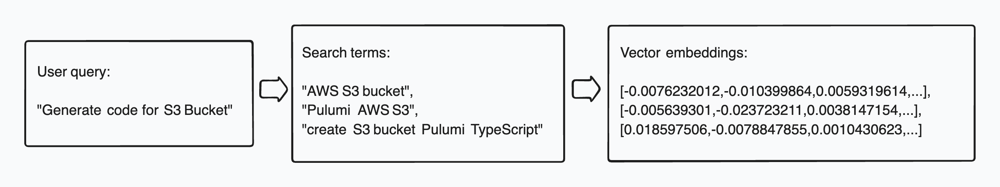
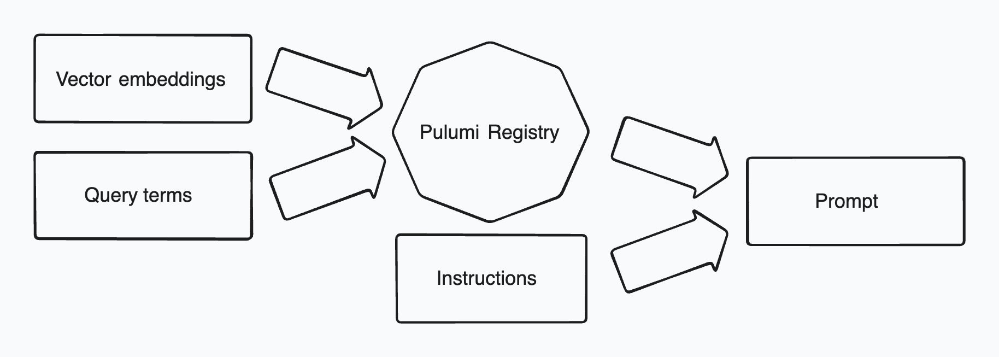

When asked about his research process, Anthony Bourdain would describe how he'd blend his formal culinary training with deep dives into local food culture - from market stalls to family recipes. Modern AI code generation follows a similar path: it can't just rely on what it knows - it must tap into continuously evolving, domain-specific knowledge bases. Just as Bourdain would combine his classical French training with techniques learned from local kitchens, AI code generators blend their built-in knowledge with retrieved code snippets and type definitions to generate code that accurately represents the user's intent.

This fusion of base knowledge with contextual understanding is especially valuable for Infrastructure as Code (IaC), where rapidly evolving cloud providers and libraries make manual development challenging, traditional debugging cycles impractical, and errors catastrophically expensive.

The role of IaC won't diminish in the age of AI - if anything, it will become even more central as systems grow increasingly complex and automated. Trustworthy code generators will be a key ingredient in the recipe for modern infrastructure management.

In this post, we share how we developed code generation for Pulumi and what we learned, based on both our production IaC generator powering [Pulumi AI](/solutions/ai/) and [Pulumi Copilot](/product/copilot/), as well as features and approaches we're still exploring.

## Using RAG for code generation

Pulumi supports over [120 providers](https://www.pulumi.com/registry/), including major cloud providers such as AWS, Azure, Google Cloud, and Kubernetes, as well as many other services and platforms. New providers are continuously added, and existing providers change as their capabilities grow.

Our goal is to generate the most accurate code for every provider - code that is not only correct but also reflects their latest capabilities.

LLMs are great at generating code however they are limited to what they have learned before their knowledge cutoff date. This means that the latest changes in the providers will not be reflected in the generated code. This also could lead to hallucinations when the model struggles to answer a question that requires up to date knowledge.

To help us solve this, we rely on the technique known as the _Retrieval Augmented Generation_ (RAG). RAG helps code generation by integrating information retrieved from external data sources. In Pulumi, we call this data source the _Registry_ - it's the database we maintain that contains type schema and usage information for every provider.

At a high level, using RAG involves the following steps:

1. Analyze user's question.
2. Look up the pertinent information from the Registry.
3. Format that information in a system prompt that LLM can understand.
4. Make the LLM call asking it to generate the code using the additional information in the prompt.

There is lot of fascinating details here, so let's dig in!

## The anatomy of Pulumi Copilot RAG

Before going into the details, let’s consider a simple yet essential insight: an effective dataset for RAG must meet two key requirements:

1. It must _contain_ the necessary information.
2. The information must be easily _searchable_.

Let's take a sample user query:

> "Generate code for S3 Bucket"

To fulfil the request, the system needs to intuit the following:

- The **cloud provider**. This can be determined based on the fact that S3 is a common storage solution in AWS, and possibly the fact that the user's [organization has stated](https://www.pulumi.com/blog/copilot-system-prompts/) AWS as their preferred cloud provider.
- The **programming language**. This information can again come directly from the organizational preferences, or from the user's prior conversations.
- The information about the **type** (or types) that must be created - its name and schema, the package it is in, and the capabilities it supports. Some of this information comes from the built-in LLM knowledge, supported and augmented by the Registry.

Putting it all together, we can now expand the original user query into the following prompt that is going to guide the code generation:

> "Generate TypeScript code for S3 Bucket, the AWS resource defined in package `@pulumi/aws`, type `aws.s3.Bucket`
> with its schema defined as follows: ...

While we had to rely on some guesswork to come up with this prompt, fortunately this process can be iterative - if we don't get all of it right the first time, we can try again with additional information that will help us refine the results. This is an important point we return to later in the post. <!-- ref to self-debugging -->

### Assessing search quality using recall and precision

To assess how effective the RAG is, we need to first understand the two fundamental concepts used in the information retrieval systems: the _recall_ and the _precision_. Imagine that you're looking for apple pie recipes in one of Jamie Oliver's cookbooks. The book has a recipe for a classic American apple pie, a Dutch apple pie and a modern take on a French apple tart. Due to the book's narrative approach with the recipes woven into the stories and context, you've managed to retrieve only the first two recipes but missed the French apple tart. Having retrieved 2 ouf 3 relevant documents, you have achieved a **67% recall**.

Because you were looking for the word "pie", you also retrieved a recipe for a Shepherd's pie, which, while delicious, does not qualify as an apple pie. Another document that came up was a fish pie - a classic British dish that does not contain apples or even a pastry crust. Since only 2 of your 4 retrieved documents can be legitimately classified as apple pies, you have achieved a **50% precision**.

Now let's formalize this a bit. Recall measures the ratio of the relevant documents retrieved to the total number of relevant documents in RAG dataset:

$$Recall = \frac{N(Retrieved \cap Relevant)}{N(Relevant)}$$

Where

- $N(Retrieved \cap Relevant)$ is the number of documents that are both retrieved and relevant.
- $N(Relevant)$ is the total number of relevant documents in the database.

Good recall means that many documents relevant to the query were retrieved.

Precision is the ratio of the relevant documents retrieved to the total number of retrieved documents:

$$Precision = \frac{N(Retrieved \cap Relevant)}{N(Retrieved)}$$

Where $N(Retrieved)$ is the total number of documents that were retrieved.

High precision means that many of the retrieved documents were relevant.

Naturally, we want to maximize both the recall and the precision. It's [been said](https://buduroiu.com/blog/rag-llm-recall-problem) that high recall is essential to ensure relevant content is available to the code generator while precision is the parameter you want to optimize for to avoid hallucinations.

### Practical concerns

Precision and recall are essential in understanding the information retrieval quality, but they are quite hard to measure in practice. Unlike a cookbook, Pulumi registry contains thousands of ever changing documents, and evaluating how many of them are relevant for every user-submitted query is impractical. This makes recall evaluation for live traffic next to impossible. Things are a little easier with precision, where we're dealing with a small number of documents, but even that metric requires a non-trivial evaluation of relevance, which needs an LLM call or a human judge.

Fortunately, other metrics that often can effectively estimate retrieval quality have been developed. We have found a metric that can predict, with some degree of accuracy, whether the generated code will successfully compile. For this metric, we compare the _tokens_ present in the LLM-produced prompt with the number of tokens present in the generated code. (By token here we understand a compiler token - an identifier such as the name of a class, method or a field and not a traditional LLM token concept),
Intuitively, if a token present in the prompt also appears in the generated program, it can be assumed that the token contributed to the generated program. Tokens in the generated program that were not part of the prompt are not necessarily wrong but they are less trusted (they can come from the LLM built-in knowledge or were guessed)

$$prompt \ coverage = \frac{N(\text{Tokens in prompt} \cap \text{Tokens in code})}{N(\text{Tokens in code})}$$

<!-- Note: our documents call is Recall, which is not how industry uses this term (see above) -->

Prompt coverage is a metric we can observe in production, and it's one of several metrics we use when updating providers to ensure we haven't regressed the quality of the RAG.

### Semantic search with vector embeddings

Semantic search is based on the conceptual similarity of the term you're looking for with the elements in the data store. For example, searching for "dumplings" can return terms like pierogi and gyoza - words with different spelling but both representing different types of filled dough preparations.

A common way to determine the similarity between the two strings is to first turn these strings into _vector embeddings_ - arrays of floating point values representing the semantic meaning of each string - and then calculate the _cosine similarity_ between the two vectors, which is the cosine of the angle between the vectors. [Various methods](https://huggingface.co/blog/matryoshka) of producing vector embeddings are fascinating but we will not cover them here in depth.

For Pulumi code generation we are using the OpenAI's [Ada-002 embedding model](https://www.downelink.com/a-deep-dive-into-openais-text-embedding-ada-002-unlocking-the-power-of-semantic-understanding/) which at this moment represents a good balance between performance and cost.

Producing vector embeddings from the user query is the standard approach in this situation. However, for Pulumi code generator we added a little twist - to increase the odds of getting more relevant information from the Registry (i.e. to increase the recall) we first make an LLM call to generate a small set of relevant search terms that will produce an array of vector embeddings.

<div style="text-align: center; width: 100%; margin: 0 auto;">
    
    <figcaption>
        <i>Getting vector embeddings from user query</i>
    </figcaption>
</div>

We then use the array of vector embeddings to retrieve the set of relevant documents from the Registry.

### Full text vs semantic search

While semantic search is essential for any modern information retrieval system, we should not forget simple and effective methods for text search already exist. The "S3 Bucket" part of the user search happens to be easily searchable using traditional text search operations (such as SQL `LIKE` operator).

To be effective, our RAG must be able to handle queries that require semantic understanding (such as "simple storage service in AWS") as well as the traditional text search to support situations where the user knows exactly what they are looking for. To that end, the industry has adopted an approach known as the "hybrid search", in which the results of full-text search and semantic search are combined to provide the final result.

For each of these search terms we generate a query that combines the full text search with the semantic search. The resulting documents are then evaluated based on the following criteria:

- _Dense score_: Vector similarity using cosine distance between query embedding and stored embeddings
- _Sparse score_: Text search relevance according to the full-using algorithm (PostgreSQL full-text search in our case)

Both the dense and the sparse scores contribute to the final score that is used to sort the documents. Even though the final score is the average of the two in our current implementation, it would not be correct to say that they have the same weight, or the influence on the end result. This is so because the normalization of the scores must take into account their distribution in the real-world queries and calculating that is quite complex.

Boosting the influence of one score relative to the other is an area we're actively exploring, and achieving the optimal result depends highly on what parameters we decide to optimize for - high quality code, time to result and so on.

Finally, we apply the rank-based scoring technique in which the results are penalized based on their position in the ranking. This creates separation between results that might have similar initial scores and gives preference to results that appear earlier in the ranking.

### Pruning the results

Our Pulumi code generator employs a two-phase document selection strategy. The first phase casts a wide net, gathering all potentially relevant documentation to maximize recall. The second phase applies precision-focused filtering to distill this collection down to the most pertinent documents.

This filtering step serves two purposes. First, it prevents LLM hallucinations that arise from similarly-named types across different providers. Second, it optimizes performance by keeping prompts concise - a critical consideration given that larger prompts increase both latency and computational costs, even when within context window constraints.

Through empirical testing with the Pulumi Registry search, we've established these baseline parameters: a maximum of 10 documents per query term selected by relevance score, and a 20K token ceiling for prompts. While these parameters have yielded good results in practice, they are likely not optimal for all scenarios. We continue to iterate on these values through ongoing experimentation.

### Prompt generation

We're now ready to create the system prompt for the code generation LLM call! We've already discussed some of the elements needed to build the effective prompt - the original user query, the search terms and the vector embeddings that produce the set of documents that will guide the code generation process.

There is another element that goes into the prompt - a concise set of instructions produced by an LLM call based on the original user's query. The approach when the output of one prompt is used as input for another is known as "prompt chaining", and we used it to provide step-by-step instructions to the code generator. For our query, this set of instructions can look as follows:

> Create an S3 bucket using Pulumi in TypeScript using the following steps:
>
> 1. Import the necessary Pulumi AWS package.
> 2. Define a new S3 bucket resource with basic configuration.
> 3. Export the bucket name as an output.

<div style="text-align: center; width: 100%; margin: 0 auto;">
    
    <figcaption>
        <i>Composition of the system prompt for code generation</i>
    </figcaption>
</div>

Finally, we use the resulting prompt to call the LLM and ask it to generate the code. We're done!

### Self-debugging

Unfortunately, this isn't always the final step of the process. Despite our best efforts, the code produced by the LLM will not always be correct.

At this point, it's worth pondering what "correct code" means. The generated program might have the following problems:

- It might be syntactically or semantically incorrect, i.e. it might not compile or fail to typecheck.
- It might fail at runtime - for example by referring to a non-existing resource, a region and so on.
- It might run "successfully" but not do what the user intended - either because the user did not express themselves clearly or because the request was misunderstood.
- Finally, the code might run and do exactly what the user wants, but lead to an undesired outcome, for example loss of an asset, or a security vulnerability.

Solutions to many of these problems go well beyond the domain of code generation.

However, the first of these problems can be addressed by the approach known as "self-debugging".

We observed that many generated TypeScript programs that fail to typecheck contain only a few errors, and asking the LLM to fix these errors often produces a valid program. While this approach is still experimental, we see promising results where getting to a correct program requires only 1-2 iterations of self-debugging. The biggest challenge with this approach is doing it in real-time. The user is staring at the screen waiting for an answer, so latency is a major concern.

Monitoring these typechecking errors in production can also provide valuable insight into the quality of the data used by the RAG and even suggest specific solutions. For example, failure to typecheck a member-access expression is a likely indicator of a missing type schema (a recall problem) or a "wrong" schema brought in by an irrelevant document (a precision problem).

Self-debugging can also be extended to include the `pulumi preview` command, which is a "dry run" operation before the actual deployment and can detect many real or potential problems such as destructive actions, incorrect configurations that cannot be detected at compile time, dependency conflicts, and policy violations.

## From kitchen to table: testing what works

The landscape of LLM-based code generation is moving fast, and we need to keep learning and adapting as we go. But with all this rapid technological change, it's crucial to ground our decisions in real numbers. We need to make sure each new advancement actually makes things better, both in our test environments and out in the real world.

The probabilistic nature of LLM-based code generation means we can't rely solely on pre-production testing. Instead, we adopt multiple layers of quality control working together. Here's what we've learned works best:

### Building confidence through testing

Our testing strategy combines several approaches:

1. **Systematic experimentation**: We run "what-if" scenarios against various test datasets to understand how the system behaves under different conditions.

2. **Local evaluation pipeline**: While local testing has its limitations, it helps catch obvious issues early in development. We evaluate the performance of the code generator and run the code through the typechecker.

3. **Deterministic generation**: We set the LLM temperature to 0 to ensure consistent outputs. For code generation, consistency and repeatability matters more than creative variations.

### Monitoring quality in production

We track several key metrics to ensure the system performs well:

1. **RAG effectiveness**: We measure prompt coverage to evaluate how well our retrieval system performs.

2. **Code quality indicators**: We track the percentage of generated code that successfully typechecks for all supported languages along with how this metric responds to system changes.

3. **User feedback**: Every "thumbs down" report gets analyzed to identify patterns and potential improvements. This direct user feedback has been invaluable in refining our system.

## Wrapping up

Building an effective AI-powered code generator requires carefully balancing multiple concerns: the raw capabilities of LLMs with retrieved contextual knowledge, semantic search with traditional text matching, and thorough testing with real-world scenarios.

Our experience has taught us that success lies in treating code generation like a delicate soufflé - it requires precise measurements, careful monitoring, and constant refinement of technique. The key ingredients are:

- A robust RAG system with well-tuned recall and precision.
- End-to-end testing and monitoring across development and production.
- Self-debugging capabilities to handle common issues like type checking errors.

As we continue to evolve Pulumi's code generation capabilities, we're excited about expanding our self-debugging features and further refining our RAG implementation.

We invite you to try these capabilities in your own projects and share your experiences. Your feedback helps us continue improving and advancing the state of AI-assisted infrastructure development.

<!--raw material 

1.2. get multiple "Pulumi Registry schema" elements (40 in our case, 29 unique) - some of them less relevant. 
(We call them tokens internally but they are really type names)
This search uses vector embeddings

Resource metadata:

{
  "name": "aws-native",
  "version": "0.90.0",
  "token": "aws-native:s3:Bucket",
  "kind": "resource"
}

AWS native looks like this:

```
{
  name: "aws-native",
  version: "0.90.0",
  token: "aws-native:s3:Bucket",
  dense_score: 0.8639781475067139,
  sparse_score: 0,
  score: 0.3887901663780213,
  dense_score_boosted: 0.7775803327560425,
  sparse_score_boosted: 0,
  kind: "resource",
  text: "Create an S3 Bucket on AWS Native (preview)",
  definition: {
    ...
```

They include the Definition structure that defines the JSON schema type for every such token.

Less relevant providers like yandex:

```
{
  name: "yandex",
  version: "0.13.0",
  token: "yandex:index/storageBucket:StorageBucket",
  ...
```

They are then sorted by their density score.

Resulting generated prompt can be 1K or more lines of Yaml

4. Full text search and BM25

BM25: 
- Inverse Document Frequency: how rare is the query term
- Term frequency in the document: how often does the term appear in the document
Detailed explanation: https://emschwartz.me/understanding-the-bm25-full-text-search-algorithm/

5. Vector embeddings, combine the two
similarity metrics like cosine similarity.

6. Reranking 

6.1. It's good to have good recall - you can throw everything and the kitchen sink at the LLM - but too much information can actually be counterproductive:

- Context window limitation: LLMs have limits on how much text they can process, known as the “context window.” Even though modern LLMs support bigger context window, there is always a limit.
- Accuracy: recall relevant information.
- Cost: we pay by the token.

We need to pare if down.
Reranker analyzes the documents and assigns it a relevance score. It may consider additional features such as organizational preferences or user's prior history that can make the document more relevant.

## Evaluate quality of code generation

1. Does RAG even help? For many common providers, LLMs can already produce reasonably good code. How do we know that RAG adds value?
Ultimately, the only measure of quality that matters is whether the generated code correctly represents the user's intent. However, this is hard to test in an automated way.
One measure is recall: <TODO: define>

What about precision?

2. Evaluate generated programs

How do we assess the quality of our RAG? Intuitively, we want two things to be true:
- Useful information must be in the database
- We must have effective ways of finding that information

- Recall
- Typecheck
- `pulumi up` - a "dry run" before the actual deployment and can detect many real or potential problems such potentially destructive actions, incorrect configurations that cannot be detected at compile time, dependency conflicts and policy violations. 

-->
