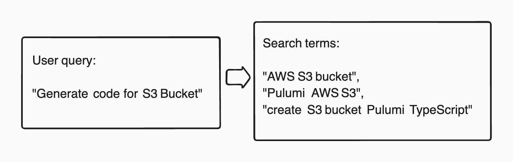

## Reliable code generation in the age of AI

When asked about his research process, Anthony Bourdain would describe how he'd blend his formal culinary training with deep dives into local food culture - from market stalls to family recipes. Modern AI code generation follows a similar path: it can't just rely on what it knows - it must tap into continuously evolving, domain-specific knowledge bases. Just as Bourdain would combine his classical French training with techniques learned from local kitchens, AI code generators blend their built-in knowledge with retrieved code snippets and type definitions to generate code that accurately represents user's intent.

This fusion of base knowledge with contextual understanding is especially valuable for Infrastructure as Code (IaC), where rapidly evolving cloud providers and libraries make manual development challenging, traditional debugging cycles impractical, and errors catastrophically expensive.

The role of IaC won't diminish in the age of AI - if anything, it will become even more central as systems grow increasingly complex and automated. Trustworthy code generators will be a key ingredient in the recipe for modern infrastructure management.

In this post, we want to share the learnings from developing code generation for Pulumi, based on both our production IaC generator powering the [Pulumi AI](www.pulumi.com/ai) and the Pulumi Copilot, as well as features and approaches we're still exploring.

## Using RAG for code generation

Pulumi supports over [120 providers](https://www.pulumi.com/registry/), including major cloud providers such as AWS, Azure, Google Cloud, and Kubernetes, as well as many other services and platforms. New providers are being added continuously, and the existing providers change as their capabilities grow.

Our goals is to to generate the most accurate code for every provider -- code that is not only correct but also reflects their latest capabilities.

LLMs are great at generating code however they are limited to what they have learned before their knowledge cutoff date. This means that the latest changes in the providers will not be reflected in the generated code. This also could lead to hallucinations when the model struggles to answer a question that requires up to date knowledge.

To help us solve this, we rely on the technique known as the _Retrieval Augmented Generation_ (RAG). RAG helps code generation by integrating information retrieved from external data sources. In Pulumi, we call this data source the _Registry_ - it's the database we maintain that containing type schema and usage information for every provider.

At a high level, using RAG involves following steps:

1. Analyze user's question.
2. Look up the pertinent information from the Registry.
3. Format that information in a system prompt that LLM can understand.
4. Make the LLM call asking it to generate the code using the additional information in the prompt.

There is lot of fascinating details here, so let's dig in!

## The anatomy of Pulumi Copilot RAG

Before going into the details, let’s consider a simple yet essential insight: for a RAG to be useful, it must meet two key requirements:

1. It must _contain_ the necessary information.
2. The information must be easily _searchable_.

Let's take a sample user query:

> "Generate code for S3 Bucket"

To fulfil the request, the system needs to intuit the following:

- The **cloud provider**. This can be determined based on the fact that S3 is a common storage solution in AWS, and possibly the fact that the user's [organization has stated](https://www.pulumi.com/blog/copilot-system-prompts/) AWS as their preferred cloud provider.
- The **programming language**. This information can again come directly from the organizational preferences, or from the user's prior conversations.
- The information about the **type** (or types) that must be created - its name and schema, the package it is in, and the capabilities it supports.

While all three of the above can be conceptually called the RAG, only the last information is actually stored in the Registry. We can now expand the original user query into the following system prompt that is going to guide the code generation:

> "Generate TypeScript code for S3 Bucket, the AWS resource defined in package `@pulumi/aws`, type `aws.s3.Bucket`
> with its schema defined as follows: ...

While we had to rely on some guesswork to come up with this prompt, the good thing is that this process can be iterative - if we don't get all of it right the first time, we can try again with additional information that will help us refine the results. This is an important point we return to later in the post. <!-- ref to self-debugging -->

### Full text vs semantic search

The "S3 Bucket" search term happens to be easily searchable using traditional text search operations (such as SQL `LIKE` operator).

But imagine if the user had asked for a "simple storage solution in AWS". Generating code for such a query requires a _semantic_ understanding of the query, i.e. the fact that "simple storage" likely refers to AWS' Simple Storage Service, i.e. the S3.

To support both types of search, the industry has adopted an approach known as the "hybrid search", in which the results of full-text search and semantic search are combined to provide the final result. We will cover that in more detail later in the post, but we need to take another digression that will help us understand the challenges with the search - good ingredients take time so stay patient!

### Assessing search quality using recall and precision

To assess how good our RAG is, we need to first understand the two fundamental concepts used in the information retrieval systems: the _precision_ and the _recall_. Imagine that you're looking for an apple pie recipes in one of Jamie Oliver's cookbooks. The book has a recipe for a classic American apple, a Dutch apple pie and a modern take on a French apple tart. Due to the book's narrative approach with the recipes woven into the stories and context, you've managed to retrieve only the first two recipes but failed to consider the French apple tart. Having succeeded in retrieving 2 ouf 3 relevant documents, you have achieved a **66% recall**.

Because you were looking for the word "pie", you also retrieved a recipe for a Shepherd's pie, which, while delicious, does not qualify as an apple pie. Another document that came up was a fish pie - a classic British dish that, alas, does not contain apples or even a pastry crust. Since only 2 of your 4 retrieved documents can be legitimately classified as apple pies, you have achieved a **50% precision**.

Now let's formalize this a bit. Recall measures the ratio of the relevant documents retrieved to the total number of relevant docuemtns in RAG:

$$Recall = \frac{N(Retrieved \cap Relevant)}{N(Relevant)}$$

Where

- $N(Retrieved \cap Relevant)$ is the number of documents that are both retrieved and relevant.
- $N(Relevant)$ is the total number of relevant documents in the database.

Good recall means that many documents relevant to the query were retrieved.

$$Precision = \frac{N(Retrieved \cap Relevant)}{N(Retrieved)}$$

Where $N(Retrieved\_documents)$ is the total number of documents that were retrieved.

High precision means that many of the retrieved documents were relevant.

Naturally, an effective RAG maximizes both the recall and the precision. It's [been said](https://buduroiu.com/blog/rag-llm-recall-problem) that high recall is essential to ensure relevant content is available to the code generator while precision is the parameter you want to optimize for to avoid hallucinations.

### Practical concerns

Precision and recall are essential in understanding the information retrieval quality, but they are quite hard to measure in practice. Unlike a cookbook, Pulumi registry contains thousands of ever changing documents, and evaluating how many of them are relevant for every user-submitted query is impractical making recall evaluation for live traffic next to impossible. Things a little easier with precision, where we're dealing with a small number of documents, but even that metric requires a non-trivial evaluation of relevance, which requires an LLM call or a human judge where the number of documents is small.

Fortunately, other metrics that often can effectively estimate retrieval quality have been developed. We have found a metric that can predict, with some degree of accuracy, whether the generated code will successfully compile. For this metric, we compare the _tokens_ present in the prompted produced by the LLM with the number of tokens present in the actually generated code. (By token here we understand a compiler token - an identifier such as the name of a class, method or a field and not a traditional LLM token concept),
Intuitively, if a token present in the prompt also appears in the generated program, we can assume that the token effectively contributed to the generated program. Tokens in the generated program that were not part of the prompt are not necessarily wrong but they are less trusted (they can come from the LLM built-in knowledge or were, ahem, hallucinated)

1:
$$prompt \ coverage = \frac{N(Tokens\_in\_prompt \cap Tokens\_in\_code)}{N(Tokens\_in\_code)}$$

2:
$$prompt \ coverage = \frac{N(\text{Tokens\_in\_prompt} \cap \text{Tokens\_in\_code})}{N(\text{Tokens\_in\_code})}$$

3:

$$prompt \ coverage = \frac{N(\text{Tokens_in_prompt} \cap \text{Tokens_in_code})}{N(\text{Tokens_in_code})}$$

4:
$$prompt \ coverage = \frac{N(\text{Tokens in prompt} \cap \text{Tokens in code})}{N(\text{Tokens in code})}$$

<!-- Note: our documents call is Recall, which is not how industry uses this term (see above) -->

Prompt coverage is a metric we can observe in production, and it's one of several metrics we use when updating providers to ensure we haven't regressed the quality of the RAG.

<div style="text-align: center; width: 50%; margin: 0 auto;">
    
    <figcaption>
        <i>Flow of blah</i>
    </figcaption>
</div>

more text...

<!--raw material 

1.1. "generate code for S3 bucket" -> get search terms:

```
[
  "AWS S3 bucket",
  "Pulumi AWS S3",
  "create S3 bucket Pulumi TypeScript",
]
```

For each of these search terms we generate a vector embedding, which is an array of 1536 elements. 
These vector embeddings serve as input for the registry search, together with the search terms themselves.

For each of these search terms we generate a combined fullTextSearchQuery + semanticSearchQuery

- dense_score: Vector similarity using cosine distance (<#> operator) between query embedding and stored embeddings
- sparse_score: Text search relevance using PostgreSQL's full-text search (ts_rank_cd)
- Rank-based decay

Rank-based decay is a scoring technique where results are penalized based on their position in the ranking, using an exponential decay function: score * (0.9 ^ rank)

Each subsequent result gets increasingly penalized. This achieves two things:
Creates separation between results that might have similar initial scores
Gives preference to results that appear earlier in the ranking
This is useful in search systems to help differentiate between similarly scored results while maintaining a reasonable scoring range.

In Pulumi registry search, rank-based decay is used when we need to limit the size of the resulting prompt to 20K tokens (TODO: no need to mention the size)

1.2. get multiple "Pulumi Registry schema" elements (40 in our case, 29 unique) - some of them less relevant. 
(We call them tokens internally but they are really type names)
This search uses vector embeddings

Resource metadata:

{
  "name": "aws-native",
  "version": "0.90.0",
  "token": "aws-native:s3:Bucket",
  "kind": "resource"
}

AWS native looks like this:

```
{
  name: "aws-native",
  version: "0.90.0",
  token: "aws-native:s3:Bucket",
  dense_score: 0.8639781475067139,
  sparse_score: 0,
  score: 0.3887901663780213,
  dense_score_boosted: 0.7775803327560425,
  sparse_score_boosted: 0,
  kind: "resource",
  text: "Create an S3 Bucket on AWS Native (preview)",
  definition: {
    ...
```

They include the Definition structure that defines the JSON schema type for every such token.

Less relevant providers like yandex:

```
{
  name: "yandex",
  version: "0.13.0",
  token: "yandex:index/storageBucket:StorageBucket",
  ...
```

They are then sorted by their density score.

Resulting generated prompt can be 1K or more lines of Yaml

2. Hybrid search - why is it needed?
  Examples: 
    - "I want a simple storage solution for AWS", vector search
    - "Create an S3 BucketV2", FTS

3. Explain vector embeddings

4. Full text search and BM25

BM25: 
- Inverse Document Frequency: how rare is the query term
- Term frequency in the document: how often does the term appear in the document
Detailed explanation: https://emschwartz.me/understanding-the-bm25-full-text-search-algorithm/

5. Vector embeddings, combine the two
similarity metrics like cosine similarity.

6. Reranking 

6.1. It's good to have good recall - you can throw everything and the kitchen sink at the LLM - but too much information can actually be counterproductive:

- Context window limitation: LLMs have limits on how much text they can process, known as the “context window.” Even though modern LLMs support bigger context window, there is always a limit.
- Accuracy: recall relevant information.
- Cost: we pay by the token.

We need to pare if down.
Reranker analyzes the documents and assigns it a relevance score. It may consider additional features such as organizational preferences or user's prior history that can make the document more relevant.

## Evaluate quality of code generation

1. Does RAG even help? For many common providers, LLMs can already produce reasonably good code. How do we know that RAG adds value?
Ultimately, the only measure of quality that matters is whether the generated code correctly represents the user's intent. However, this is hard to test in an automated way.
One measure is recall: <TODO: define>

What about precision?

2. Evaluate generated programs

How do we assess the quality of our RAG? Intuitively, we want two things to be true:
- Useful information must be in the database
- We must have effective ways of finding that information

- Recall
- Typecheck
- `pulumi up` - a "dry run" before the actual deployment and can detect many real or potential problems such potentially destructive actions, incorrect configurations that cannot be detected at compile time, dependency conflicts and policy violations. 

## Self-debugging

aa

## Evaluate code quality in production

When dealing with an inherently probabalistic system, no amount of testing can really ensure correct behavior of the tool when it runs in production. The testing is necessarily a defense in depth:

1. Experimentation framework to run "what if" scenarios against a large enough test bed.
2. Local evals - "it works on my machine" but it's better than nothing.
3. Component testing to test RAG quality, such as recall
4. Production monitoring
5. Customer reports and anecdotal data.

-->
