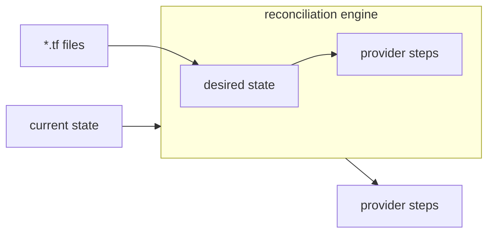

[Pulumi HCL](/docs/iac/languages-sdks/hcl/) has at its core a simple promise:

> A program that works for `tofu apply` will also work for `pulumi up`.

This *must* be true to allow Terraform modules to be shared between `tofu` config and Pulumi programs. This property makes testing Pulumi HCL simple. Let me explain.

<!--more-->

At the end of the day, Pulumi is a system to translate actual state & desired state into a series of imperative actions, so actual state can be reconciled to desired state. Terraform is a system to translate actual state & desired state into a series of imperative actions, so actual state can be reconciled to desired state. How desired state is expressed can be radically different, and the underlying reconciliation engine can be radically different, but at the end of the day, both tools do the same thing:

Executing a Terraform program looks like this:



Executing a Pulumi program is more dynamic, because the reconciliation engine is in more active dialog with the user's program. That said, the diagram is the same shape. To [match semantics](/blog/terraforms-data-model-on-pulumis-engine/#providers), Pulumi HCL dynamically bridges [any Terraform provider in the registry](/registry/packages/terraform-provider/). This means that, for the subset of Pulumi programs that are valid OpenTofu programs, both programs take the same input (`*.tf` files) and produce the same step output (Terraform provider steps). Providers are the part of our model that generates user-observable behavior, which means if we match what providers see, we match what users see. This gives us a really nice definition of correctness for Pulumi HCL[^1]:

> Pulumi HCL correctly interprets an HCL program when it generates the same set of provider steps as `tofu` does.

{}
If you are familiar with property-based testing, you might be thinking this looks like a testable property. You're right.
{}

[^1]: Pulumi HCL accepts a superset of what OpenTofu accepts. This method only applies to the subset of programs that OpenTofu accepts.

## How we compatibility test Pulumi HCL

We have created a framework to assert on the property above for Pulumi HCL: [`tfcompat`](https://github.com/pulumi/pulumi-hcl/tree/master/tests/tfcompat). Each `tfcompat` test has 2 components:

- The files of the HCL program
- The providers the program uses

I'll walk you through an example test case, then explain how the framework works.

### An example `tfcompat` test

This Go test is the full code of [`TestL2SimpleResource`](https://github.com/pulumi/pulumi-hcl/blob/b966ee6fd0a6d08389856b3d98cb28e58072927d/tests/tfcompat/l2_simple_resource_test.go#L24-L31):

```go
// tests/tfcompat/l2_simple_resource_test.go

func TestL2SimpleResource(t *testing.T) {
	t.Parallel()
	tfcompat.RunCase(t, "l2_simple_resource", tfcompat.Case{
		Providers: []tfcompat.Provider{
			{Name: "simple", Factory: providers.SimpleProvider},
		},
	})
}
```

`Factory` is a function that produces a new in-memory Terraform provider called `"simple"`. The `"l2_simple_resource"` in the test is the folder that contains the actual HCL program under test:

```tf
# tests/tfcompat/testdata/cases/l2_simple_resource/main.tf

resource "simple_resource" "a_resource" {
  input_one = "hello"
  input_two = true
}

output "some_output" {
  value = simple_resource.a_resource.result
}
```

This test asserts that Pulumi HCL & OpenTofu both:

- [ConfigureProvider](https://developer.hashicorp.com/terraform/plugin/framework/internals/rpcs#configureprovider-rpc) the simple provider the same way.
- Call the same [plan](https://developer.hashicorp.com/terraform/plugin/framework/internals/rpcs#planresourcechange-rpc) RPC during `pulumi preview` & `tofu plan`.
- Call the same [ApplyResourceChange](https://developer.hashicorp.com/terraform/plugin/framework/internals/rpcs#applyresourcechange-rpc) to create the resource.
- Pulumi HCL or OpenTofu didn't call any other provider RPCs.

One really important takeaway is that nowhere in this test case do we write down what Pulumi HCL should do. `tfcompat.RunCase` takes a scenario, but it doesn't take accepted behavior. This will be important later. Before we get there, let me explain how `tfcompat.RunCase` works.

### The anatomy of `tfcompat.RunCase`

Every [`tfcompat.RunCase`](https://github.com/pulumi/pulumi-hcl/blob/b966ee6fd0a6d08389856b3d98cb28e58072927d/tests/testutil/tfcompat/harness.go#L191) runs 2 parallel processes, then compares the results:

- **The Terraform Side:** `tfcompat.RunCase` runs each Terraform provider in-memory, then copies the files in its test directory to a temp dir and runs `tofu plan`, then `tofu apply` against the temp dir. We use [`TF_REATTACH_PROVIDERS`](https://developer.hashicorp.com/terraform/plugin/debugging#running-terraform-with-a-provider-in-debug-mode) to have `tofu` attach to our in-memory Terraform providers.

- **The Pulumi Side:** `tfcompat.RunCase` runs each Terraform provider in-memory & copies the test files in its test directory to a separate test dir, and runs `pulumi preview`, then `pulumi up` against the temp dir. We use [`PULUMI_BRIDGE_REATTACH_PROVIDERS`](https://github.com/pulumi/pulumi-terraform-bridge/pull/3559) to instruct [our dynamic bridge](/registry/packages/terraform-provider/) to attach to our in-memory provider.

**For both** Pulumi & Terraform, the test harness [records each provider's gRPC calls](https://github.com/pulumi/pulumi-hcl/blob/b966ee6fd0a6d08389856b3d98cb28e58072927d/tests/testutil/tfexec/recorder.go#L50) for all providers and it records the stack outputs for both invocations.

After both runs have completed, the test asserts that the outputs of the Pulumi program & the Terraform program match, and that the providers saw the same operations. A test case passes if and only if the providers for OpenTofu & Pulumi saw the same operations, and stack outputs were equal.

## Writing tests with LLMs

Because tfcompat tests assert that Pulumi HCL matches OpenTofu, and not the test author's idea of correctness, we can use LLMs to effectively hunt for bugs. Without additional constraints, telling Claude or Codex to find a bug will produce mostly false positives. Because our tests need only a scenario to test, it is very hard[^2] for LLMs to produce false positives. This allows useful bug finding runs with as simple a prompt as:

> I'd like you to do a pass trying to find bugs. You will prove each bug with a genuine failing tfcompat test. Start with 10 sub-agents. Bugs should not be duplicates and bugs should not reflect existing issues. Each failure should be stood up as a draft PR with just the failing test added. These PRs will fail CI. That is intentional. Don't try to fix the bugs you solved. Keep the sub-agents running until you have found 10 failures. You are responsible for validating that the bugs are real and ensuring that the sub-agents do not create duplicate bugs, so you should create the PRs directly.

This is supported by [a](https://github.com/pulumi/pulumi-hcl/blob/571fedb720fe7cd7d8f37ce01990c7c2df384658/.claude/skills/find-tfcompat-bug/SKILL.md) [couple](https://github.com/pulumi/pulumi-hcl/blob/571fedb720fe7cd7d8f37ce01990c7c2df384658/.claude/skills/swarm-tfcompat-bugs/SKILL.md) [of](https://github.com/pulumi/pulumi-hcl/blob/2709fcb5d5825f69d1213c9d176f40d6bc52c98e/.claude/skills/farm-tfcompat-bugs/SKILL.md) [skills](https://github.com/pulumi/pulumi-hcl/blob/571fedb720fe7cd7d8f37ce01990c7c2df384658/.claude/skills/fix-tfcompat-bug/SKILL.md), but this strategy does [genuinely](https://github.com/pulumi/pulumi-hcl/pull/447) [find](https://github.com/pulumi/pulumi-hcl/pull/397) [high-quality](https://github.com/pulumi/pulumi-hcl/pull/411) [bugs](https://github.com/pulumi/pulumi-hcl/pull/422).

Because of how easy it is to send LLMs to hunt bugs, I think of this almost as a property-based test with LLMs as both the case generator and the reducer.

[^2]: Typically, false positives come from an LLM finding a scenario where `tofu apply` errors, but `pulumi up` behaves correctly.

## Conclusion

Having a strong and testable definition for Pulumi HCL makes it easy & fast to write integration tests, ensuring that our implementation is correct. LLMs are excellent at finding bugs when given the ability to write tests that fail if and only if they show a real divergence between our HCL implementation & OpenTofu, letting us hunt for bugs at LLM scale. All this testing has made us pretty confident that [what we've shipped](/releases/terraform-state-backend-modules-hcl/) is pretty close to full parity with OpenTofu, and we'd love it if you [gave it a try](/docs/iac/languages-sdks/hcl/).
