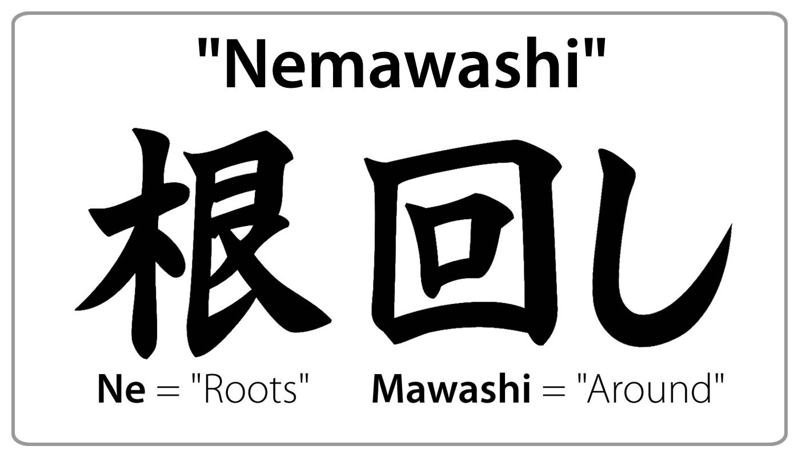

*This post is based on our video interview with Daniel Ward, a Software Developer/Consultant at Lean TECHniques and Microsoft MVP. Daniel shares his strategies for moving teams from configuration chaos to programming languages for infrastructure, including the 10% rule for change, viral adoption, and why Pulumi beats YAML for complex systems. Watch the video below or read on. - Adam Gordon Bell*



Imagine your infrastructure codebase has evolved from a few files to thousands of lines across dozens of configuration files. Your team spends hours deciphering CloudFormation templates, your AWS CDK deployments take 30+ minutes, and introducing any change becomes a multi-day effort. This is the reality many organizations face when their infrastructure-as-code approach outgrows their tooling.

As a consultant and developer who helps organizations improve their software delivery processes, I've seen firsthand how the right technologies—specifically using actual programming languages like C#—can transform infrastructure management instead of forcing teams to use declarative configuration files.

## My Background: Coaching Teams Through Technical Transformation

My background is primarily as a .NET developer—I'm now a Microsoft MVP in my first year—though I work with TypeScript and other languages as needed. About six years ago, I moved into consulting, or what we call "coaching" at Lean Techniques.

The idea isn't just to write code for clients or tell them what to do and leave. Our goal is that once we leave, they don't need us anymore. We're essentially trying to put ourselves out of a job.

Organizations bring me in for various reasons—from implementing automated testing after costly failures to migrating from mainframes to the cloud. Sometimes it's about product delivery challenges, like month-long sprints that never complete on time.

It's about bringing places up to a modern standard. As we say at Lean Techniques, turning IT from a cost center into a competitive advantage.

**If you’re ready to move from sprawling configuration files to code-centric infrastructure, here are eight practical steps to guide you:**

## 1. Follow the 10% Rule for Sustainable Change

One of my guiding principles comes from Gerald Weinberg's book "The Secrets of Consulting": the 10% rule. When entering a new team or organization, don't try to improve more than 10% at a time.

There are a few reasons for this. One is that you can actually end up making the client look bad. If you improve everything at once, their boss might ask why this consultant fixed everything in six months when the team couldn't fix it in five years.

But there's a deeper reason related to social dynamics. Any social group, in programming or outside of work—if you come in new and try to change how the group works before familiarizing yourself with it, people will be resistant. They'll ask "Who do you think you are? You just got here!" And they're right—you could be wrong about some things. You have to understand how they work to understand what the problems are.

This applies directly to introducing new technologies like infrastructure as code. Rather than overhauling everything at once, I recommend starting small.

If a place is completely new to infrastructure as code, I'll tell them to start small. None of their engineers know how to do this yet, and I'm not going to do all the work for them and leave, because then none of their engineers will know how to maintain it.

## 2. Quantify the Cost of Inaction to Overcome Resistance

Even with a measured approach, resistance is inevitable. I've experienced teams that are exceptionally open to improvement, often coming from difficult situations and eager for change. I've also worked with teams that resist most suggestions, where engineers feel the consultant was forced upon them by management.

It's always easier if you can do pull-based versus push-based change—where the team has asked for your help instead of the manager telling them "I'm inflicting this help on you."

For those looking to influence change within their organization, I've found that influencing upper-level management comes down to numbers. They deal with too many teams to get into specifics—they want numbers. If you can show how many hours your team spends each week manually pushing code or waiting on another team, and multiply that by engineer salaries, you're showing how much money is being wasted.

This approach is far more effective than what can come across as "Here's a new tool I want to play with"—an anti-pattern that reinforces the stereotype of technical people just wanting to use new technologies.

## 3. Build Consensus with Nemawashi Conversations

I've found a Japanese concept called "nemawashi" (literally "turning the roots") provides another effective approach to organizational change:

Before introducing an idea to a manager or the whole team, individually go to every person on the team first and get their thoughts. If most people respond positively, you can then approach the decision-maker saying, "Everyone on the team wants this—what do you think?"

This isn't just about collecting checkmarks but genuinely gathering feedback. If you're getting pushback from every single person, maybe it's not as great an idea as you thought. Either way, you learn something from it.

## 4. Drive Viral Adoption Through Early Wins

Rather than forcing change on resistant teams, I prefer what I call "viral adoption":

We try to work with teams that ask for our help instead of being pushed onto teams. People are way less resistant if you can show them you're making their job easier. We work with one team who wants our help, make them really effective, and then other teams notice: "How come they're releasing so many times a week? How do they have so few defects? How is their pipeline so fast?"

This success creates natural curiosity, leading other teams to either request similar help or study and adopt the successful team's practices. Either way, I'm happy that things are improving.

## 5. Align Dev and Ops with Infrastructure as Code

When it comes to infrastructure as code specifically, I've noticed it's becoming table stakes for many organizations, though implementation quality varies widely.

It's hard to have actual continuous delivery without infrastructure as code. Without it, developers can't define their own infrastructure and have to wait on another team to do it. By continuous, I mean teams should be able to deploy every 30 minutes if they want. If you have to wait one to three business days for the operations team to create your resources, that's not continuous.

Resistance to infrastructure as code typically comes from two directions:

1. **From developers**: "I already have my plate full—now I have to learn cloud and deployment too?"
2. **From operations**: "That's my job—I don't want to lose it."

I see this as a win-win opportunity for both sides. For operations teams, the job shifts from mundane tasks like "create a lambda for me" or "replace this code bundle" to more creative platform engineering work. For developers, the benefit is clear: no more waiting on operations to proceed with their work.

## 6. Invest in Platform Engineering for Reusable Components

Platform engineering has emerged as a solution to these challenges. Instead of every team reinventing solutions for common needs like logging, monitoring, or deployment pipelines, platform teams create standardized, reusable components.

It seems wasteful if every single team has to manage their own side of the Splunk instance or Dynatrace. These are solved problems that every team needs. A platform team can look across the organization, see what can be standardized, and remove those problems from individual teams.

This approach is particularly powerful with tools like Pulumi, which allows creating reusable component resources for common patterns: "It's very common for teams to create a Lambda-backed API Gateway or a Lambda hooked up to SQS. These are super common things, so here's a component resource for that so you don't have to write it yourself."

The key difference in mindset is that platform teams aren't enforcing rules—they're building tools that make developers' lives easier. Instead of saying "You must do logging this way," it's "Here's an endpoint you can use—you're good to go."

## 7. Avoid YAML Pitfalls: Embrace Programming Languages

One of my pain points is the limitations of configuration languages like YAML for complex infrastructure. I recently gave a presentation about a GitHub Actions workflow that grew to over 1,000 lines, calling shared actions that call other shared actions, making it nearly impossible to understand what's happening.

I couldn't use breakpoints or the normal libraries I would use. I've seen a 69,000-line YAML file for Prometheus and Kubernetes—that's an auto-generated example, but even a thousand lines calling several other files is too much.

The fundamental issue is abstraction. Programming languages allow loops, conditionals, and functions to remove repetition and build larger structures. Configuration languages often lack these capabilities, leading to copy-pasting and unmanageable growth.

With declarative approaches, you end up using a lot of magic strings. It's easy to forget one when you change values. The tooling is also an issue—I'm familiar with IDEs and libraries for programming languages, but the equivalent tools for YAML just aren't as mature.

## 8. Choose Pulumi for Flexible, Code-First IaC

When comparing infrastructure-as-code options, I see three major players: AWS CDK, Terraform, and Pulumi. While AWS CDK offers similar capabilities to Pulumi for AWS resources, it relies on CloudFormation under the hood:

CloudFormation is just a black box—it's proprietary. If something goes wrong, you have to hope someone's already asked about it on GitHub. When deployments take 15-30 minutes, there's not much you can do—it's just how CloudFormation works.

Compared to Terraform, which uses HCL (HashiCorp Configuration Language), Pulumi offers the flexibility of actual programming languages:

There's nothing wrong with declarative approaches in some cases, but at a certain point—when you have big systems and chunks of resources you want to share between teams—it becomes more cumbersome than helpful. That's why Terraform is working on their own CDK now.

What sets Pulumi apart is its flexibility: Even if you have platform teams who aren't developers and want to set standards, they can use YAML with Pulumi and then transform those component resources into other languages for dev teams to use. You get the best of all worlds.

## Start Small, Think Big: Small Changes, Big Impact

Whether you're introducing infrastructure as code or any significant technical change, my advice remains consistent: start small, focus on solving real problems, and let success spread naturally.

By understanding the human elements of change—the 10% rule, nemawashi, and viral adoption—you can transform resistance into enthusiasm. And by choosing tools like Pulumi that bridge the gap between developers and operations, you can create infrastructure that's both powerful and maintainable.

I'm currently writing a blog series on Pulumi at [daninacan.com](https://daninacan.com). I'm not selling anything there—it's just a mostly .NET technical blog. I also speak at conferences occasionally, so check out my speaking page if you're interested.

*Ready to escape configuration chaos? Start small, focus on solving real problems, and [get started with Pulumi](https://www.pulumi.com/docs/get-started/) to leverage the full power of programming languages for infrastructure. Join [our community Slack](https://slack.pulumi.com/) to connect with engineers making the same transformation.*
