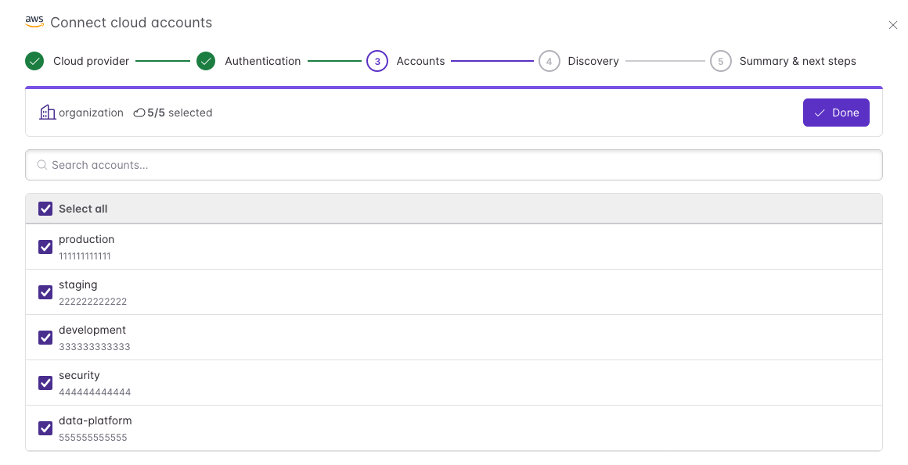
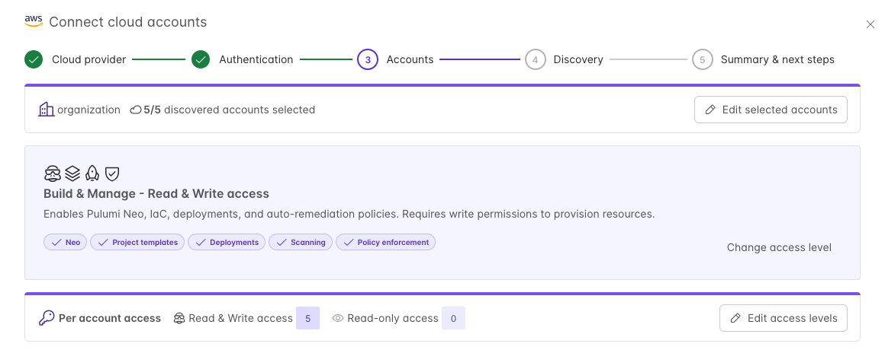
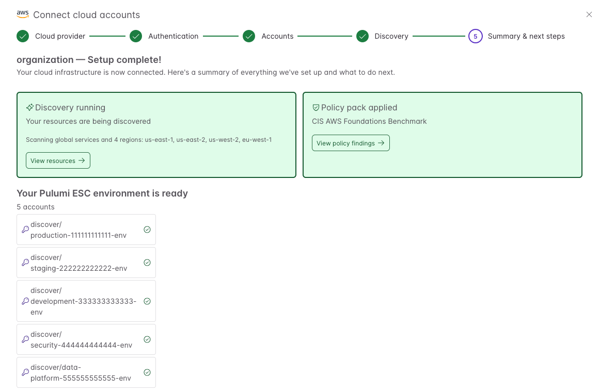

[Pulumi Insights](/docs/insights/) gives you visibility and governance across your entire cloud footprint, but that visibility is only as complete as the set of accounts you've connected. Until now, connecting an account meant repeating a manual setup for each one: OIDC configuration, hand-written [Pulumi ESC](/docs/esc/) environments, and per-account scan and policy setup. For an organization with dozens or hundreds of AWS accounts, Azure subscriptions, or Google Cloud projects, that per-account friction was the biggest obstacle to getting a complete picture. Today, the new **Connect cloud accounts** wizard removes it: discover every account in your cloud organization, select the ones you want, and onboard them all in a single guided flow.

<!--more-->

## From hours of setup to a single flow

The time savings are real: connecting a batch of accounts across AWS, Azure, and Google Cloud takes about three minutes end to end. Setting up those same accounts with the manual per-account workflow would take hours to days.

The wizard handles the entire onboarding lifecycle for AWS, Microsoft Azure, and Google Cloud:

- **Bulk discovery**: Authenticate once with your cloud organization and the wizard lists every account, subscription, or project you can access. Accounts that are already connected are recognized and skipped.
- **Automatic OIDC setup**: The recommended flows configure each account with short-lived credentials based on OpenID Connect (OIDC) and workload identity federation. No long-lived cloud secrets are stored in Pulumi Cloud.
- **ESC environments, created for you**: The wizard generates [Pulumi ESC](/docs/esc/) environments that follow the best practices from the manual OIDC guides — environments that previously had to be authored one by one.
- **Scans and policies from day one**: By default, scheduled discovery scans and a [pre-built policy pack](/docs/insights/policy/policy-packs/pre-built-packs/) are applied to every account as part of setup: the Pulumi Best Practices pack on the Team and Enterprise editions, or a compliance pack — CIS or NIST 800-53 — on Business Critical.

## How it works

The wizard walks you through five steps: choose a provider, authenticate, select accounts, configure discovery and policy, and review the results. You can open it from **Insights** > **Accounts** in the Pulumi Cloud console, or from the **Get to know Pulumi** card on the home dashboard.

Authentication uses each provider's native federation mechanism: IAM Identity Center (SSO) for AWS, Microsoft Entra ID workload identity federation for Azure, and Workload Identity Federation for Google Cloud. After you sign in, the wizard discovers the accounts in your organization and pre-selects everything that isn't already connected. You can search, select all, or toggle individual accounts.

### Choose the right access level for your security posture

Not every team wants to grant write access on day one. The wizard offers two access levels, and you can set them per account:

- **Build & Manage (read and write)**: Enables the full platform: [Pulumi Neo](/product/neo/), infrastructure as code, deployments, and policies that remediate issues automatically (Business Critical).
- **Discovery & Policy (read-only)**: Limited to discovery scanning and inventory. Pulumi can't modify your infrastructure.

If your security review requires it, start everything read-only and raise access for specific accounts later.

### Everything set up, nothing hidden

When setup completes, the summary shows exactly what was created: the ESC environments grouped by access level, the state of discovery scanning, and the policy pack applied. If any account fails to connect, the summary lists it with the specific error so you can fix the cause and re-run the wizard. Accounts that connected successfully are skipped on retry.

For security reviewers, the docs include a full accounting of [what the wizard creates](/docs/insights/discovery/connect-cloud-accounts/#what-the-wizard-creates) in your cloud provider and in Pulumi Cloud: the IAM roles, app registrations, and service accounts on the cloud side, and the ESC environments and Insights accounts on the Pulumi side.

## Get started

The Connect cloud accounts wizard is available now for all Pulumi Cloud organizations. To connect your first accounts:

1. Navigate to [**Insights** > **Accounts**](https://app.pulumi.com/) in the Pulumi Cloud console and select **Connect cloud accounts**.
1. Follow the guided flow for AWS, Azure, or Google Cloud.
1. Explore your [discovered resources](/docs/insights/discovery/search/) and [policy findings](/docs/insights/policy/policy-findings/).

To learn more:

- [Connect cloud accounts documentation](/docs/insights/discovery/connect-cloud-accounts/) — prerequisites, each wizard step in detail, and troubleshooting
- [Insights & Governance overview](/docs/insights/) — full documentation for discovery and policy capabilities
- [Pulumi ESC](/docs/esc/) — how the generated environments manage cloud credentials with OIDC
