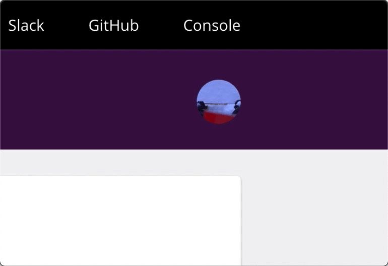
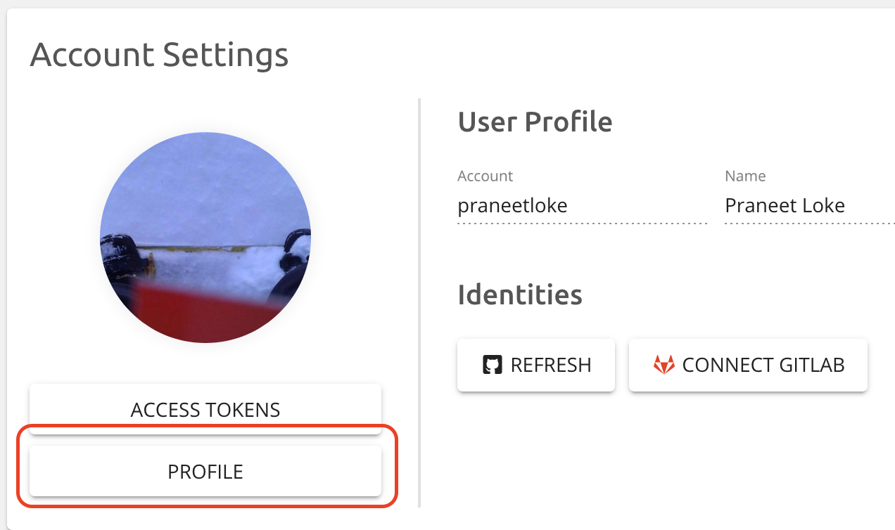

Hot on the heels of our
[GitLab sign-in support](),
we've just released support for multiple identities for a single Pulumi
account in the Pulumi Cloud Console. Previously, you could only sign-up
for a new Pulumi account using a GitHub or GitLab identity. Starting
today, you can connect your Pulumi account with additional identities,
beyond what you first signed-up with.
<!--more-->

For example, if you signed-in to Pulumi with your GitHub account, you
could only add GitHub organizations to the Pulumi Service, or
collaborate with other GitHub users. With multiple identities, you can
now also connect your Pulumi account to a GitLab identity too!

To connect an identity, first sign-in as usual on
https://app.pulumi.com, then go to your Profile page as shown below.

Based on the example, on the Profile page, you would see a new button to
connect a GitLab account. Conversely, if you signed-up originally using
your GitLab account onto Pulumi, then you would see a button to connect
your GitHub account.

Connecting multiple identities to Pulumi has advantages:

- You can then add your GitHub organizations or GitLab groups, to
  collaborate with the respective members of those organizations using
  Pulumi.
- A single Pulumi account connected to additional identities allows
  for more ways to sign into the Pulumi Service.

However, you don't have to associate multiple identities with the same
Pulumi account. Whenever you sign-in with a new identity for the first
time on <https://app.pulumi.com>, a new Pulumi account is created. You
can then choose to add additional identities at a later time.
