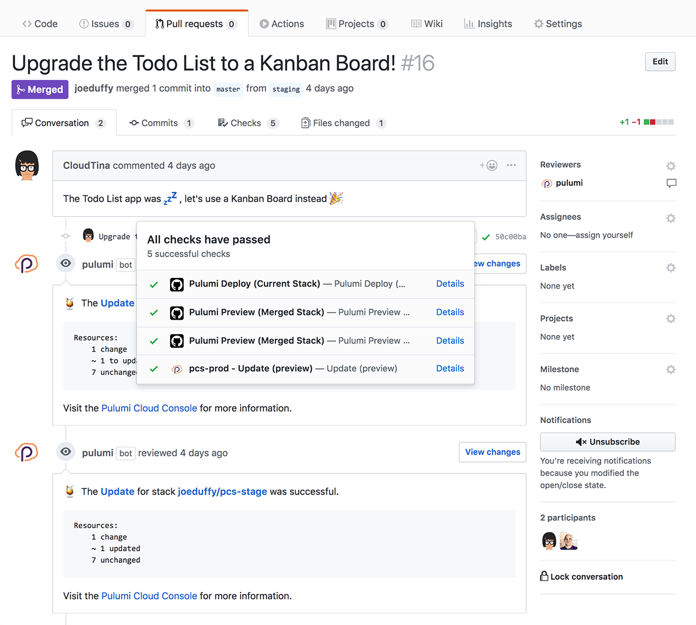
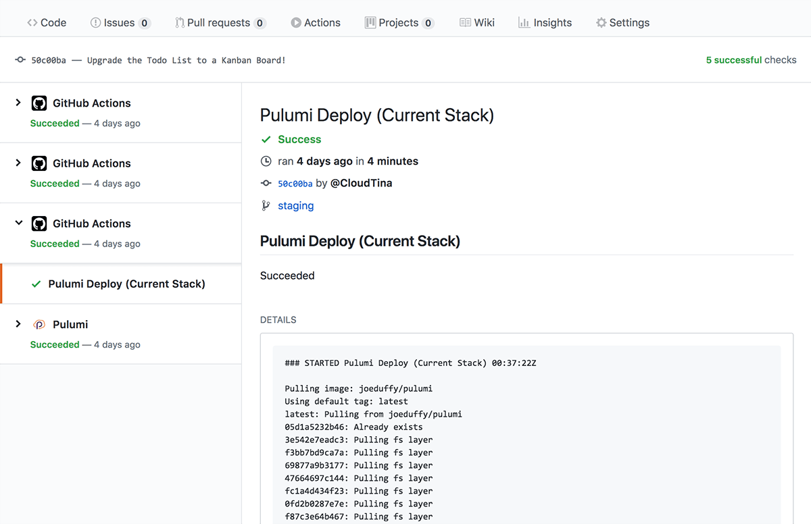

Today we announced our partnership with GitHub on the [new GitHub
Actions feature](https://github.com/features/actions). We are super
excited about this bold and innovative technology, especially as it
relates to Pulumi, and CI/CD more broadly. We truly believe that Pulumi
plus GitHub Actions delivers the easiest, most capable, and
friction-free way to achieve continuous delivery of cloud applications
and infrastructure, no matter your cloud -- AWS, Azure, Google Cloud,
Kubernetes, or even on-premises. In this post, we'll dig deeper to see
why, and how to get up and running. It's refreshingly easy!
<!--more-->

## GitHub Actions + Pulumi == ❤️

Pulumi's lets you write cloud applications and infrastructure in your
favorite language. This includes containers, serverless, and even
VM-based infrastructure. Combined with GitHub Actions, we can get
continuous deployment to any cloud -- AWS, Azure, Google Cloud,
Kubernetes, or even on-premises -- all straight from GitHub.

GitHub Actions gives us a way to run compute in GitHub's cloud,
triggered by any GitHub event -- commits, pull requests, and more. This
enables us to run Pulumi in response to these events, giving us the
benefits of
[infrastructure as code](https://en.wikipedia.org/wiki/Infrastructure_as_Code)
seamlessly integrated into a lovable workflow. We can edit any files --
application- or infrastructure-related -- to do end-to-end continuous
delivery, without any of the YAML, tedious bash scripting, or manual,
error-prone steps.

This capability enables some exciting scenarios:

-   Deploy cloud changes anytime a commit is made, including
    -   Provisioning entirely new cloud environments
    -   Updating existing infrastructure, like scaling things up or
        modifying config
    -   Rebuilding and redeploying app containers to your cluster
-   Preview deployments before they're actually made, integrated with
    Pull Requests
-   Use Git branches to achieve GitOps-style promotion from test/staging
    to production

To see things in action, check out the video shown at the GitHub
Universe keynote today:

In this short video, we see a Ruby on Rails application that is
continuously deployed to our Kubernetes cluster ([full code available
here](https://github.com/pulumi/actions-example-gke-rails)). It's just a
standard Rails application, with a
[Dockerfile](https://github.com/pulumi/actions-example-gke-rails/blob/master/app/Dockerfile),
and a
[complete Pulumi infrastructure specification](https://github.com/pulumi/actions-example-gke-rails/tree/master/infra),
which are just a collection of TypeScript modules. (We could have used
Python or Go.) This includes a fully functioning
[Google Kubernetes cluster](https://github.com/pulumi/actions-example-gke-rails/blob/master/infra/cluster.ts),
[hosted PostgreSQL database](https://github.com/pulumi/actions-example-gke-rails/blob/master/infra/db.ts)
(for easier management!),
[Kubernetes definitions](https://github.com/pulumi/actions-example-gke-rails/blob/46c29ad4fa935398f3b7dc3715c2c56fb4809afc/infra/index.ts#L24),
and
[automatic building and publishing of our Rails Docker image to the Docker Hub](https://github.com/pulumi/actions-example-gke-rails/blob/46c29ad4fa935398f3b7dc3715c2c56fb4809afc/infra/index.ts#L11),
which then gets auto-deployed to our cluster. And it works across three
entirely separate testing, staging, and production environments!

Notice that it's all ordinary code, so that it works great with GitHub,
in addition to our favorite IDEs and tools.

After committing our changes, Pulumi takes it from there. Deployments
can be previewed, diffed, and are recorded so that you'll always know
who changed what, when, and why -- all very "Git-like." Pulumi's
[GitHub App]() adds to this
and enables "GitOps" so that teams can propose, approve, and promote
code from "staging" to "production" using pull requests (more on that
below).

We've chosen GKE here as an illustration because it's amazing how
powerful such a simple example can be, but this works just as well if
you're using AKS, EKS, on-premises clusters -- and of course works for
non-Kubernetes scenarios, like VMs, ECS, and Serverless applications.

All of this with just handful of TypeScript and GitHub Actions set up to
work with Pulumi -- despite being quite capable, it's super easy to get
all of this up and running. Let's see how!

## Getting Up and Running

The full sequence of steps is available in our [GitHub Actions Getting
Started Guide]().

In summary, using GitHub Actions with Pulumi is as easy as [signing up
for Pulumi](https://app.pulumi.com/) (if you haven't already), creating
a `.github/main.workflow` file in your repo ([see here](https://github.com/pulumi/actions/blob/master/examples/main.workflow)),
configuring secrets, and adding a Pulumi program. Afterwards, you can
simply Commit and Pull Request away to deploy All The Things! GitHub
Actions will fire and run Pulumi tasks appropriately; you'll know it's
working if you see Pulumi actions show up alongside your PRs and
commits:

The two sorts of actions, defined by that `main.workflow` file, are

- **Pulumi Deploy (Current Stack)** -- deploys a commit to the current
  branch's stack (taken from the branch mappings file), by running
  a `pulumi up` command
- **Pulumi Preview (Merged Stack)** -- shows a preview of what would
  happen if a PR was merged into its target stack before doing it, by
  running a `pulumi preview` command

If either of these fail, you'll see the standard GitHub Checks red "x",
whereas success will give a green "checkmark"; click on either to get
the full Pulumi log output:

GitHub Actions' Logs page, plus Pulumi's Console, together give you
total insight into a deployment's status, including the Docker build
logs, Kubernetes status updates, and more -- so you'll always have the
full scoop on what's going on, good or bad, in your cloud deployments.

## Pulumi's GitHub App

GitHub Actions work with Pulumi without needing any extra configuration
beyond the workflow file and GitHub Secrets described above. That's why
it's so easy!

If you are going to use this setup in a real team setting, you'll
probably also want to use Pulumi's GitHub App. Simply by
[installing it into your repo](),
and combined with the above, you'll instantly get improved GitHub Checks API
integration and, more importantly, context added by the Pulumi bot to
your Pull Requests about what a deployment will do before it's even
done, as shown above.

Note that this is optional with GitHub Actions, but worthwhile -- it
much easier for your teams to collaborate on deployments, including
knowing whether a change might lead to downtime before it's even
triggered. "GitOps" ahoy!

## Learning More

There is so much more fun to have, and we're just getting started. Look
for more in the weeks to come. In the meantime, here are some follow up
links in case you want to learn more about GitHub Actions and Pulumi: 

- To learn more, [install Pulumi]() and then
  check out our [Getting Started guide]().
- In addition to [the keynote
  video](https://www.youtube.com/watch?v=59SxB2uY9E0), we have two
  other videos that you might enjoy watching to learn more:
  - In [this video](https://www.youtube.com/watch?v=MKbDVDBuKUA), we
    see the GitOps workflow for promoting from staging to
    production.
  - In [this longer-form video](https://www.youtube.com/watch?v=1Et2TkuxqJg), we explore
    more nuances of how the entire experience works.
- The Ruby on Rails App, deployed to Kubernetes, from the keynote, is
  [available for easy forking here](https://github.com/pulumi/actions-example-gke-rails).

This is an exciting day for developers, DevOps engineers, and SREs
alike. The combination of GitHub Actions and Pulumi gives us all an
easy, automated solution for continuous deployment of cloud applications
and infrastructure to any cloud, purely using code and Git. What's best
about it is that *it's fun *in the same way programming is fun.

If you're not yet in the GitHub Actions private beta, but want to try
Pulumi, head on over to our
[Pulumi Getting Started guide](). You'll be running CLI commands,
but we think that can be a lot of fun too!

We want to thank our GitHub partners for the bold and innovative work
that went into GitHub Actions, and for letting us in on the action -- we
can't wait to see what you, the Pulumi community, builds using this
magical combination!
