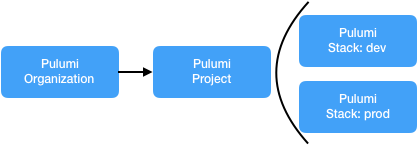
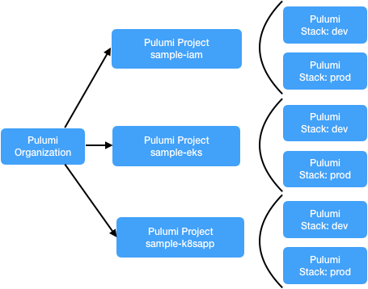
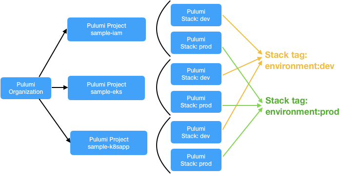
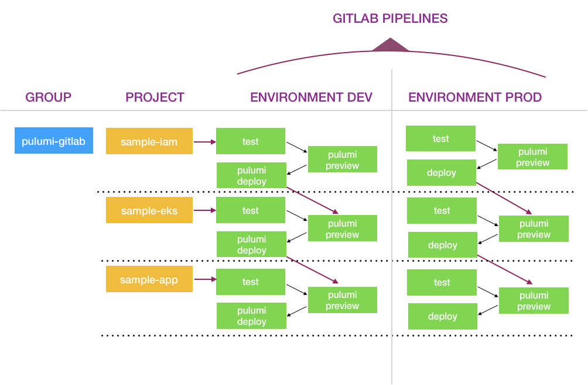

In this blog, we will work through an example that shows how to use Pulumi to enable GitLab-based
continuous delivery with your Kubernetes workloads on Amazon EKS. This integration will work just
as seamlessly for any Kubernetes cluster, including Azure AKS or Google GKE, using the relevant
Pulumi libraries for [Azure](https://github.com/pulumi/pulumi-azure) and
[GCP](https://github.com/pulumi/pulumi-gcp).
<!--more-->

## Prerequisites

- An account on [https://app.pulumi.com](https://app.pulumi.com/) with
  an organization.
- The latest `pulumi` CLI. Installation instructions are [here]().
- A bare repository. Set the remote URL to be your GitLab project.

## Concepts in Pulumi

### Organization of Pulumi Projects and Pulumi Stacks

All users in the Pulumi service will start with the hierarchy of an
organization. This can be a specific GitHub, GitLab or Atlassian
organization or your solo organization. Inside each organization, users
create Pulumi projects and stacks.

Pulumi [projects]()
and [stacks]()
are flexible to accommodate the diverse needs across teams, applications,
and infrastructure scenarios. Just like Git repos that work with varying
approaches Pulumi projects and stacks allow you to organize your code
within them. Immediate options include:

- **Monolithic project/stack structure:** A single project defines the
  infrastructure and application resources for an entire vertical
  service as represented in the image below:



- **Micro-stacks project/stack structure:** A project broken into
  separately managed smaller projects, often across different
  dimensions as represented in the image below:



Working with Inter-Stack Dependencies with the latter option is more
suited in a production setup giving users more flexibility and
boundaries between their teams. We will use this structure in our
example below. For more information on Pulumi projects and stacks,
please refer to our documentation
[here]().

### Use Tags to group Pulumi Stacks as Environments:

- Pulumi Stacks have associated metadata in the form of key/value
    tags.
- You can assign custom tags to stacks (when logged into the
  [web backend]() to customize how
  stacks are listed in the [Pulumi Cloud Console](https://app.pulumi.com/).
  - In our example below we have two environments _prod_ and _dev_.
    - To group stacks by environment we assign custom tags
      `environment: prod` and `environment: dev` to the respective
      stacks
    - In the Pulumi Cloud Console, you'll be able to group stacks by
      tag: `environment:dev` and tag: `environment:prod`.

Please read more about managing [stack tags in Pulumi]().



Let's now work through our example with GitLab Pipelines.

> Please replace the highlighted **`<org-name-in-pulumi>`** below with your Pulumi organization
> name to run through the steps successfully.

## GitLab Pipeline by Environment

1.  We created a GitLab Group called **pulumi-gitlab**.
2.  We created three GitLab projects called **sample-iam**,
    **sample-eks** and **sample-k8sapp**. These projects match the
    project names in Pulumi SaaS platform.
3.  We have two pipelines: **environment:dev** and **environment:prod**.
    In the two pipelines, we have a total of six pulumi stacks:
    -   `<org-name-in-pulumi>/sample-iam/dev`, and `<org-name-in-pulumi>/sample-iam/prod`.
    -   `<org-name-in-pulumi>/sample-eks/dev` and `<org-name-in-pulumi>/sample-eks/prod`.
    -   `<org-name-in-pulumi>/sample-k8sapp/dev` and `<org-name-in-pulumi>/sample-k8sapp/prod`.

`<org-name-in-pulumi>/sample-iam/dev` stack will trigger the
downstream stack `<org-name-in-pulumi>/sample-eks/dev`
provided the cycle of `pulumi preview` and `pulumi deploy` completes
without any failure.

Similarly, `<org-name-in-pulumi>/sample-eks/dev` will trigger
the downstream stack `<org-name-in-pulumi>/sample-k8sapp/dev`
provided the cycle of `pulumi preview` and `pulumi deploy` completes
without any failure.


4.  To use Pulumi within GitLab CI, there are a few environment
    variables you'll need to set for each build.
    -   The first is `PULUMI_ACCESS_TOKEN`, which is required to
        authenticate with [**pulumi.com**](http://pulumi.com) in order
        to perform the preview or update. You can create a new Pulumi
        access token specifically for your CI/CD job on your
        [Pulumi Account page](https://app.pulumi.com/account/tokens).
    -   Next, you will also need to set environment variables specific
        to your cloud resource provider. For example, if your stack is
        managing resources on AWS, `AWS_ACCESS_KEY_ID` and
        `AWS_SECRET_ACCESS_KEY`.

## Create Pulumi stacks and push the files to your GitLab project

If you run `pulumi` from any branch other than the `master` branch, you
will hit an error that the `PULUMI_ACCESS_TOKEN` environment variable
cannot be accessed. You can fix this by specifying a wildcard regex to
allow specific branches to be able to access the secret environment
variables. Please refer to the [GitLab
documentation](https://gitlab.com/help/user/project/protected_branches.md)
to understand this better.

First we set up three Pulumi stacks: **sample-iam**; **sample-eks** and
**sample-k8sapp** with group stack tag: `environment:dev`

**Step 1:** Create the pulumi stack "sample-IAM" and set stack tag
"key:value" = "environment:dev".
We update the `index.ts` file with the relevant code block as shown
below and run `pulumi up`.

```bash
$ pulumi new aws-typescript --dir <org-name-in-pulumi>/sample-iam/dev
$ cd <org-name-in-pulumi>/sample-iam/dev
```

Let's run `pulumi up` with the following `index.ts` file.

```typescript
import * as aws from "@pulumi/aws";
function createIAMRole(name: string): aws.iam.Role {
    // Create an IAM Role
    return new aws.iam.Role(`${name}`, {
        assumeRolePolicy: `{
            "Version": "2012-10-17",
            "Statement":[
              {
                "Sid": "",
                "Effect": "Allow",
                "Principal": {
                  "AWS": "arn:aws:iam::153052954103:root"
                },
                "Action": "sts:AssumeRole"
              }
            ]
        }`,
        tags: {
            "clusterAccess": `${name}-usr`,
        },
    });
}

// Administer automation role for use in pipelines, e.g. gitlab CI, Teamcity, etc.
export const automationRole = createIAMRole("automationRole");
export const automationRoleArn = automationRole.arn;
```

We then group the stack by initializing it with a new stack tag
"key:value" = "environment:prod" and run `pulumi up` with the same
`index.ts` file.

```bash
$ pulumi up

# Initialize new pulumi stack in the format:
# pulumi stack init <org-name-in-pulumi>/<project>/<stack>
$ pulumi stack init <org-name-in-pulumi>/sample-iam/prod
$ pulumi stack tag set environment prod
$ pulumi up
```

**Step 2:** Create the pulumi stack **sample-eks** and set stack tag
"key:value" = "environment:dev".

```bash
$ pulumi new aws-typescript --dir <org-name-in-pulumi>/sample-eks/dev
$ cd <org-name-in-pulumi>/sample-eks/dev
```

Update the `index.ts` file with the relevant code block as shown below:

```typescript
import * as aws from "@pulumi/aws";
import * as awsx from "@pulumi/awsx";
import * as eks from "@pulumi/eks";
import * as k8s from "@pulumi/kubernetes";
import * as pulumi from "@pulumi/pulumi";

const env = pulumi.getStack();
const iamstack = new pulumi.StackReference(`<org-name-in-pulumi>/sample-iam/${env}`);

const automationRoleArn = iamstack.getOutput("automationRoleArn")

/* * Single step deployment of EKS cluster with the most important variables and simple function to create two namespaces */

const vpc = new awsx.Network("vpc");
const cluster = new eks.Cluster("eks-cluster", {
    vpcId             : vpc.vpcId,
    subnetIds         : vpc.subnetIds,
    instanceType      : "t2.medium",
    nodeRootVolumeSize: 200,
    desiredCapacity   : 1,
    maxSize           : 2,
    minSize           : 1,
    deployDashboard   : false,
    vpcCniOptions     : {
        warmIpTarget    : 4,
    },
    roleMappings      : [
        // Map IAM role arn "automationRoleArn" to the k8s user with name "automation-usr", e.g. gitlab CI
        {
            groups    : ["pulumi:automation-grp"],
            roleArn   : automationRoleArn,
            username  : "pulumi:automation-usr",
        },
    ],
});

export const clusterName = cluster.eksCluster.name;

/* * Single Step deployment of k8s RBAC configuration */

new k8s.rbac.v1.Role("automationRole", {
    metadata: {
        name: "automationRole",
        namespace: "automation",
    },
    rules: [{
        apiGroups: ["*"],
        resources: ["*"],
        verbs: ["*"],
    }]
}, {provider: cluster.provider});

new k8s.rbac.v1.RoleBinding("automation-binding", {
    metadata: {
        name: "automation-binding",
        namespace: "automation",
    },
    subjects: [{
        kind: "User",
        name: "pulumi:automation-usr",
        apiGroup: "rbac.authorization.k8s.io",
    }],
    roleRef: {
        kind: "Role",
        name: "automationRole",
        apiGroup: "rbac.authorization.k8s.io",
    },
}, {provider: cluster.provider});

export const kubeconfig = cluster.kubeconfig.apply(JSON.stringify)
```

Let's download the additional npm packages for EKS and Kubernetes and
run `pulumi up` and initialize a new stack tag "key:value" =
"environment:prod" to run `pulumi up` with the same `index.ts` file.

```
$ npm install --save @pulumi/eks @pulumi/kubernetes
$ pulumi up

# Initialize new pulumi stack in the format:
# pulumi stack init <org-name-in-pulumi>/<project>/<stack>
$ pulumi stack init <org-name-in-pulumi>/sample-eks/prod
$ pulumi stack tag set environment prod
$ pulumi up
```

**Step 3:** Create the pulumi stack "sample-k8sapp" and set stack tag
"key:value" = "environment:dev".
We will then update the `index.ts` file with the relevant code block as
shown below:

```bash
$ pulumi new aws-typescript --dir <org-name-in-pulumi>/sample-k8sapp/dev
$ cd <org-name-in-pulumi>/sample-k8sapp/dev
```

```typescript
import * as aws from "@pulumi/aws";
import * as docker from "@pulumi/docker";
import * as k8s from "@pulumi/kubernetes";
import * as pulumi from "@pulumi/pulumi";

const env = pulumi.getStack();
const eksCluster = new pulumi.StackReference(`<org-name-in-pulumi>/sample-eks/${env}`);

const kubeconfig = eksCluster.getOutput("kubeconfig");

const k8sProvider = new k8s.Provider("eks-cluster", {
    kubeconfig: kubeconfig,
  });

/* * Single step deployment of one docker container in ECR */

function getImageRegistry(repo: aws.ecr.Repository) {
    return repo.registryId.apply(async registryId => {
        if (!registryId) {
            throw new Error("Expected registry ID to be defined during push");
        }
        const credentials = await aws.ecr.getCredentials({ registryId: registryId });
        const decodedCredentials = Buffer.from(credentials.authorizationToken, "base64").toString();
        const [username, password] = decodedCredentials.split(":");
        if (!password || !username) {
            throw new Error("Invalid credentials");
        }
        return {
            server: credentials.proxyEndpoint,
            username: username,
            password: password,
        };
    });
}

const ecr1 = new aws.ecr.Repository("breathe");
const image1 = new docker.Image("breathe", {
    imageName: ecr1.repositoryUrl,
    build: {
        context: "./app",
        cacheFrom: true,
    },
    registry: getImageRegistry(ecr1),
});

// Declare the docker container based deployment
const appLabels = { app: appName };
const breathecontainer = new k8s.apps.v1beta1.Deployment(appName, {
    spec: {
        selector: { matchLabels: appLabels },
        replicas: 1,
        template: {
            metadata: { labels: appLabels },
            spec: { containers: [{ name: appName, image: image1.imageName }] }
        }
    },
  }, { provider: k8sProvider });
```

We download the additional npm packages for EKS and Kubernetes and run
`pulumi up` and group a new stack by initializing it with a new stack
tag "key:value" = "environment:prod" and run `pulumi up` with the same
`index.ts` file.

```bash
$ npm install --save @pulumi/kubernetes @pulumi/docker
$ pulumi up

# Initialize new pulumi stack
$ pulumi stack init <org-name-in-pulumi>/sample-eks/prod
$ pulumi stack tag set environment prod
$ pulumi up
```

## Using GitLab Pipelines with the six Pulumi stacks in `environment:dev` and `environment:prod`

GitLab pipelines are configured using `.gitlab-ci.yml` files in the root
of each repository. GitLab Silver and above is capable of [running
pipelines that cross project
boundaries](https://docs.gitlab.com/ee/ci/multi_project_pipelines.html#passing-variables-to-a-downstream-pipeline),
so we will be using that to construct our pipeline.

All three `.gitlab-ci.yml` files that we use are very similar in
structure. The base one,`sample-iam`, looks like this:

```yaml
image:
  name: pulumi/pulumi:v0.17.10
  entrypoint:
    - '/usr/bin/env'
    - 'PATH=/usr/local/sbin:/usr/local/bin:/usr/sbin:/usr/bin:/sbin:/bin'

stages:
  - preview
  - update
  - downstream

Pulumi Preview:
  stage: preview
  script:
    - npm ci
    - pulumi stack select pulumi/sample-iam/$DEPLOY_ENVIRONMENT
    - pulumi preview

Pulumi Update:
  stage: update
  script:
    - npm ci
    - pulumi stack select pulumi/sample-iam/$DEPLOY_ENVIRONMENT
    - pulumi update --skip-preview

Update EKS:
  stage: downstream
  trigger: pulumi-gitlab/sample-eks
```

This file describes a three-stage pipeline for the `sample-iam` project:

1.  First, we run a preview for the requested deployment environment,
    failing the pipeline if the preview fails.
2.  If the preview was successful, we run `pulumi update`, which deploys
    the IAM changes.
3.  Finally, we trigger the pipeline in `pulumi-gilab/sample-eks`, which
    triggers the next pipeline in our pipeline daisy chain illustrated
    in the above image.

Despite being powerful, conceptually this setup is quite simple and
doesn't require much code to get right.



Upon a successful update, each tier's pipeline will trigger a pipeline
for the tiers that depend on it. Pulumi's StackReference feature ensures
that the dependent tiers receive new copies of the outputs exported from
the IAM stack, so the deployment flows naturally through the pipeline!

This brings us to the end of our CD solution with Pulumi and GitLab on
Amazon EKS. For more examples, refer to the [Pulumi examples](https://github.com/pulumi/examples)
repository. Refer to my previous post on
[Amazon EKS and k8s RBAC in Pulumi]().

