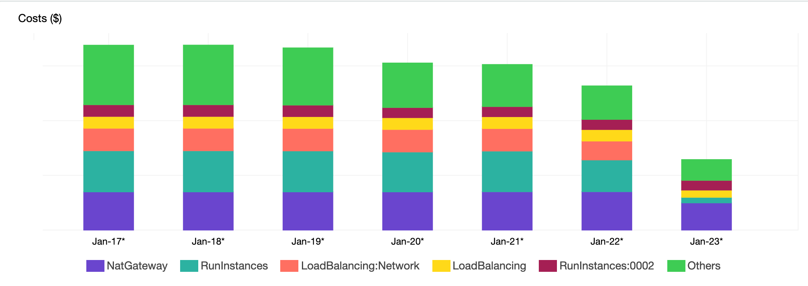

Due to the nature of the product we build, the Pulumi team needs to have access to several cloud providers to
develop and test the product. With an increasing number of cloud providers, can come an associated ever-increasing cost.

Giving a development team the ability to launch the resources they need in the cloud is both the best and most scary
thing that happens in a company. The flexibility for them to be able to achieve their goal is fantastic, but with this great
freedom can come problems. We depend on developers to clean up after themselves. Sometimes that doesn't happen. Throw in
automated testing failures that leak cloud resources and we can very quickly get ourselves into a situation where costs
spiral out of control

There are multiple ways that Pulumi can help you deal with this situation. Joe Duffy wrote a blog post on
[Automatically Enforcing Tagging Policies]()
to demonstrate how Policy as Code to ensure tags are automatically added to any Pulumi managed infrastructure.
If your company doesn't use Pulumi to build and manage their infrastructure, then you can still use Pulumi, in collaboration
with AWS Lambda, to be able to build and deploy an application that can monitor your cloud costs.

In order to keep our cloud costs down, Pulumi uses an AWS Lambda Go Application that is deployed to our AWS accounts that
removes wasteful resources daily. If a developer needs to protect their resources from being deleted, they simply need to
add a tag to their infrastructure of "Owner: <name>". This ensures the owner of a resource can be tracked at any time.

## Cloud Cost Lambda

Here's our application in it's simplest form.

```go
package main

import (
	"log"
	"os"
	"strconv"

	"github.com/aws/aws-lambda-go/lambda"
	"github.com/aws/aws-sdk-go-v2/aws/external"
)

var DeleteEnabled bool

func main() {
	lambda.Start(HandleRequest)
}

func HandleRequest() {
	destroyOperations, _ := os.LookupEnv("DESTROY_ENABLED")
	deleteEnabled, err := strconv.ParseBool(destroyOperations)
	if err != nil {
		log.Print("loading DESTROY_ENABLED envvar failed")
		log.Fatal(err)
	} else {
		DeleteEnabled = deleteEnabled
	}

	cfg, err := external.LoadDefaultAWSConfig()
	if err != nil {
		log.Print("loading AWS config failed")
		log.Fatal(err)
	}

	log.Printf("Running cleanup operations in %q", cfg.Region)
	log.Printf("Are destroy operations enabled? %q", destroyOperations)

    log.Print("Finished cleanup operations")
}
```

In order to deploy this application we need to build and package the lambda. To package a Go lambda, we need to compile
it for linux and then zip the lambda up. We can do this as follows:

```bash
$ GOOS=linux GOARCH=amd64 go build -o main main.go && zip deployment.zip main
```

After creating a new Pulumi application, we can write the following code to deploy this lambda for us:

```typescript
import * as aws from "@pulumi/aws";
import * as pulumi from "@pulumi/pulumi";

const lambdaRole = new aws.iam.Role("my-lambda-role", {
    name: "sample-role",
    assumeRolePolicy: aws.iam.assumeRolePolicyForPrincipal({ Service: "lambda.amazonaws.com" }),
});

const lambda = new aws.lambda.Function("my-lambda-function", {
    name: "sample-lambda",
    runtime: aws.lambda.Go1dxRuntime,
    timeout: 900,
    role: lambdaRole,
    handler: "main",
    memorySize: 1024,
    code: new pulumi.asset.FileArchive("deployment.zip"),
    environment: {
        variables: {
            "DESTROY_ENABLED": "true"
        }
    },
});
```

We can deploy the application using `pulumi up`:

```bash
$ pulumi up
Previewing update (dev):
     Type                    Name                Plan
 +   pulumi:pulumi:Stack     lambda-post-dev     create
 +   ├─ aws:iam:Role         my-lambda-role      create
 +   └─ aws:lambda:Function  my-lambda-function  create

Resources:
    + 3 to create

Do you want to perform this update? yes
Updating (dev):
     Type                    Name                Status
 +   pulumi:pulumi:Stack     lambda-post-dev     created
 +   ├─ aws:iam:Role         my-lambda-role      created
 +   └─ aws:lambda:Function  my-lambda-function  created

Resources:
    + 3 created

Duration: 27s
```

We can go to the AWS Lambda console and trigger the application. To do this, we must trigger a test event. Our application
doesn't actually accept any inputs so the test event will look as follows:


When we trigger the lambda, we should get an output as follows:

```
START RequestId: 0910c342-4c43-4946-aeca-cf57683aa36b Version: $LATEST
2020/04/07 21:37:01 Running cleanup operations in "us-east-1"
2020/04/07 21:37:01 Are destroy operations enabled? "true"
2020/04/07 21:37:01 Finished cleanup operations
END RequestId: 0910c342-4c43-4946-aeca-cf57683aa36b
REPORT RequestId: 0910c342-4c43-4946-aeca-cf57683aa36b	Duration: 1.96 ms	Billed Duration: 100 ms	Memory Size: 1024 MB	Max Memory Used: 38 MB	Init Duration: 99.32 ms
```

Our lambda application works!! But, it's not going to actually delete anything because we haven't told it what to delete. We
can start very small. Let's tell AWS to cleanup any EBS disks that are currently unattached.

```go
func handleUnattachedVolumes(cfg aws.Config) {
	log.Print("Running cleanup operations for unattached ebs volumes")
	svc := ec2.New(cfg)

	input := &ec2.DescribeVolumesInput{
		Filters: []ec2.Filter{
			{
				Name:   aws.String("status"),
				Values: []string{"available"},
			},
		},
	}
	volumes := make([]ec2.Volume, 0)

	for {
		req := svc.DescribeVolumesRequest(input)
		res, err := req.Send(context.Background())
		if err != nil {
			log.Fatal(err)
		}

		volumes = append(volumes, res.Volumes...)

		if res.NextToken == nil {
			break
		}

		input.NextToken = res.NextToken
	}

	for _, volume := range volumes {
		log.Printf("Killing EBS Volume %q as it's unattached", *volume.VolumeId)
		if DeleteEnabled {
			delReq := svc.DeleteVolumeRequest(&ec2.DeleteVolumeInput{
				VolumeId: volume.VolumeId,
			})
			_, err := delReq.Send(context.Background())
			if err != nil {
				log.Print(err)
				log.Printf("error deleting volume %q", *volume.VolumeId)
			}
		}
	}
}
```

We can then update our lambda handler to include this new ebs cleanup function:

```go
func HandleRequest() {
	destroyOperations, _ := os.LookupEnv("DESTROY_ENABLED")
	deleteEnabled, err := strconv.ParseBool(destroyOperations)
	if err != nil {
		log.Print("loading DESTROY_ENABLED envvar failed")
		log.Fatal(err)
	} else {
		DeleteEnabled = deleteEnabled
	}

	cfg, err := external.LoadDefaultAWSConfig()
	if err != nil {
		log.Print("loading AWS config failed")
		log.Fatal(err)
	}

	log.Printf("Running cleanup operations in %q", cfg.Region)
	log.Printf("Are destroy operations enabled? %q", destroyOperations)

	handleUnattachedVolumes(cfg)

	log.Print("Finished cleanup operations")
}
```

When we run `pulumi up`, Pulumi will understand that the source code of the lambda as changed:

```bash
$ pulumi up
Previewing update (dev):
     Type                    Name                Plan       Info
     pulumi:pulumi:Stack     lambda-post-dev
 ~   └─ aws:lambda:Function  my-lambda-function  update     [diff: ~code]

Resources:
    ~ 1 to update
    2 unchanged

Do you want to perform this update? yes
Updating (dev):
     Type                    Name                Status      Info
     pulumi:pulumi:Stack     lambda-post-dev
 ~   └─ aws:lambda:Function  my-lambda-function  updated     [diff: ~code]

Resources:
    ~ 1 updated
    2 unchanged

Duration: 22s
```

When we execute the lambda code, we will receive an error now:

```
START RequestId: dc34a4f0-55f3-434b-a7e4-7832132865d1 Version: $LATEST
2020/04/07 21:45:01 Running cleanup operations in "us-east-1"
2020/04/07 21:45:01 Are destroy operations enabled? "true"
2020/04/07 21:45:01 Running cleanup operations for unattached ebs volumes
2020/04/07 21:45:01 UnauthorizedOperation: You are not authorized to perform this operation.
	status code: 403, request id: c03efbf0-a3b4-4dd3-805b-02cec3523e0b
END RequestId: dc34a4f0-55f3-434b-a7e4-7832132865d1
REPORT RequestId: dc34a4f0-55f3-434b-a7e4-7832132865d1	Duration: 172.66 ms	Billed Duration: 200 ms	Memory Size: 1024 MB	Max Memory Used: 49 MB	Init Duration: 121.26 ms
RequestId: dc34a4f0-55f3-434b-a7e4-7832132865d1 Process exited before completing request
```

We haven't actually given our IAM Role permisson to interact with EBS. Let's attach a specific policy to the IAM Role that
allows us to interact with EBS:

```typescript
const lambdaRolePolicy = new aws.iam.Policy("my-policy", {
    name: "sample-lambda-plicy",
    policy: {
        Version: "2012-10-17",
        Statement: [{
            Action: [
                "ec2:DescribeVolumes",
                "ec2:DeleteVolume",
            ],
            Resource: "*",
            Effect: "Allow",
        }],
    },
});

const policyAttachment = new aws.iam.PolicyAttachment("my-attachment", {
    policyArn: lambdaRolePolicy.arn,
    roles: [lambdaRole],
});
```

After deploying this updated IAM role, we can then see the execution will be allowed to proceed:

```
START RequestId: 7ca595aa-0a0f-4662-ab64-835ab0b02258 Version: $LATEST
2020/04/07 21:49:28 Running cleanup operations in "us-east-1"
2020/04/07 21:49:28 Are destroy operations enabled? "true"
2020/04/07 21:49:28 Running cleanup operations for unattached ebs volumes
2020/04/07 21:49:28 Finished cleanup operations
END RequestId: 7ca595aa-0a0f-4662-ab64-835ab0b02258
REPORT RequestId: 7ca595aa-0a0f-4662-ab64-835ab0b02258	Duration: 182.97 ms	Billed Duration: 200 ms	Memory Size: 1024 MB	Max Memory Used: 26 MB
```

You can continue adding new segments to the cleanup lambda to help cleanup your AWS account.

## Deploying To Multiple Regions

We want to ensure that all of our regions are cleaned up; therefore, we need to change the structure of the code. We can
take advantage of [explicit provider configuration]({< relref "/docs/intro/concepts/programming-model#explicit-provider-configuration" >}})
to allow us to target the deployment of a resource to a specific region.

Let's assume we want to deploy our application to `us-east-1`, `us-east-2`, `eu-west-1`, `eu-west-2` and `us-west-2`. We can
create a map of Providers to do this as follows:

```typescript
const providers: {[key: string]: aws.Provider} = {
    "us-east-1": new aws.Provider("us-east-1", {region: "us-east-1"}),
    "us-east-2": new aws.Provider("us-east-2", {region: "us-east-2"}),
    "us-west-2": new aws.Provider("us-west-2", {region: "us-west-2"}),
    "eu-west-1": new aws.Provider("eu-west-1", {region: "eu-west-1"}),
    "eu-west-2": new aws.Provider("eu-west-2", {region: "eu-west-2"}),
};
```

We can iterate through the map and deploy our lambda to each of the configured regions as follows:

```typescript
const providers: {[key: string]: aws.Provider} = {
    "us-east-1": new aws.Provider("us-east-1", {region: "us-east-1"}),
    "us-east-2": new aws.Provider("us-east-2", {region: "us-east-2"}),
    "us-west-2": new aws.Provider("us-west-2", {region: "us-west-2"}),
    "eu-west-1": new aws.Provider("eu-west-1", {region: "eu-west-1"}),
    "eu-west-2": new aws.Provider("eu-west-2", {region: "eu-west-2"}),
};

for (const providerKey of Object.keys(providers)) {
    const provider = providers[providerKey];

    const lambda = new aws.lambda.Function(`my-lambda-function-${providerKey}`, {
        name: "sample-lambda",
        runtime: aws.lambda.Go1dxRuntime,
        timeout: 900,
        role: lambdaRole.arn,
        handler: "main",
        memorySize: 1024,
        code: new pulumi.asset.FileArchive("deployment.zip"),
        environment: {
            variables: {
                "DESTROY_ENABLED": "true"
            }
        },
    }, {provider});
}
```

Pulumi can then deploy the lambdas to all of the providers in the loop. If a new region requires cleaning, then
it needs to be added to the map of providers.

## In Conclusion

The Go application we built continues to evolve. There are new areas of our account that have started to accumulate costs.
After a few iterations of the application, we were able to drop 64% of our daily AWS costs.



We look forward to hearing the results of your work in this area!
