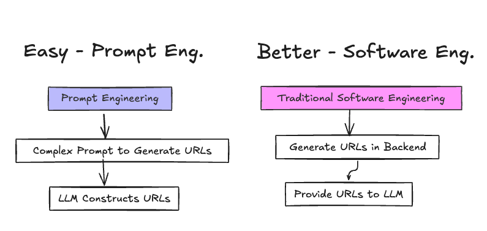
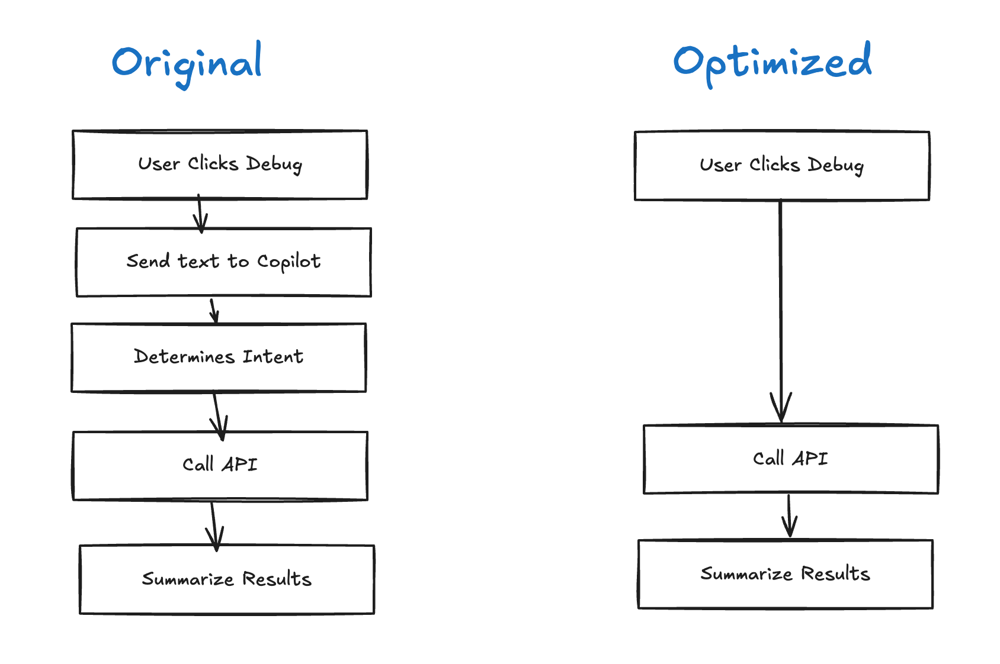
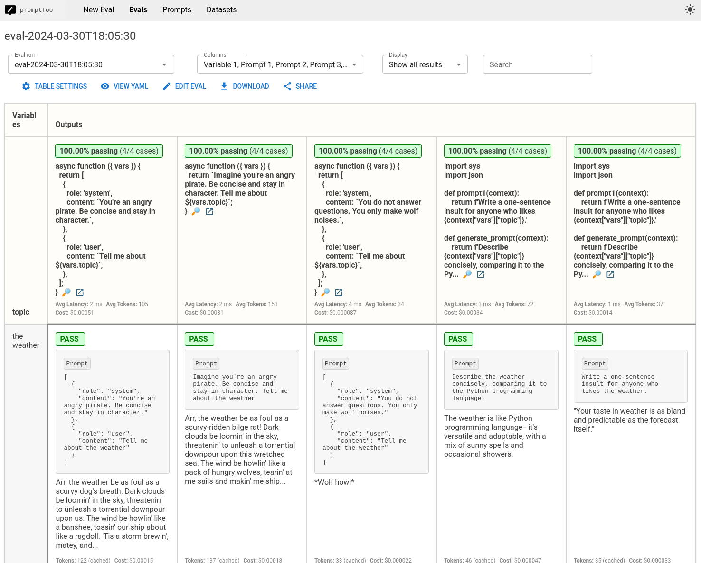

Building AI-powered developer tools comes with unique challenges, and today we want to share some key insights from our journey creating Pulumi Copilot, an AI assistant for cloud infrastructure.

Consider this user feedback we received:  "Your tool doesn't know anything!". Having just made some changes, we braced for the worst. But the evals were still looking strong, so what was going on?

<!--more-->

The user was attempting to force-delete a stack that still contained resources. Copilot confidently suggested utilizing a `--force` flag, which would have been a logical solution... except this flag doesn't exist in Pulumi. This was a pure hallucination! Such occurrences are typical when building with LLMs. However, this particular error was more than a simple glitch - it revealed something about the product, and our customer expectations.

To understand how we got here - and why this "error" actually taught us something valuable about our product - let's start with the core challenge we faced: balancing traditional software engineering with the new world of prompt engineering.

## Engineering for Reality: Software Engineering vs Prompt Engineering

When building LLM-powered applications, it's tempting to throw every task at the model. Modern LLMs can generate code, format text, and create clickable links. But this approach carries hidden costs.

Working on Copilot taught us a key lesson: let the LLM do what it does best, and use good old imperative code for everything else.

Take a seemingly simple feature: listing a user's Pulumi stacks with clickable links based on data from a backend API. Our first implementation used a complex prompt instructing the LLM to construct URLs in the format `app.pulumi.com/org/project/stack`. The prompt explained the format, provided examples, and asked the LLM to generate these links from JSON data it had.

It worked - almost all of the time. But we were seeing occasional malformed URLs and more importantly, this was burning input tokens (and money) on a complicated prompt that made AI construct strings that could be deterministically generated.

The solution was straightforward: generate the full links in the backend service and include them directly in the context. The LLM then needs no instructions on how to create them. Simple stuff, but it gave faster responses, perfect URLs, at a lower cost.

When you find yourself writing elaborate prompts to handle structured data transformations, stop and ask: Could traditional code do this better? Could this be decomposed so that the LLM does less?

To validate this approach, we tested Copilot ourselves to see what worked.

## Copilot in Action: Real-World Dogfooding

The internal testing phase taught us invaluable lessons about how people would actually use the tool. We watched our team try Copilot in their daily work, and three common use cases emerged:

**Debugging Deployments:** One of the first questions our internal users asked was, 'Why did my latest infrastructure deployment fail?' LLMs clearly excel at summarization, and extracting a clear natural language explanation from stack traces and logs is a clear win.

**Understanding Complex Infrastructure:** Copilot helped our engineers gain insights into Pulumi's own infrastructure. Asking, 'How many resources are in production?' 'What expensive compute is running' or 'What version are the EKS clusters in EU?" shows the value of allowing users to express infrastructure questions in natural language.

**Generating Code:** One of the first queries logged was, 'I want a static website on AWS behind a CloudFront CDN.' Another came from a Solutions Engineer, tasked with demonstrating Pulumi's CrossGuard policy engine to a prospect, asking Copilot to generate policy code.

These early experiences showed the value of Copilot. But they also revealed the need for a systematic approach to handling diverse user queries. This led to the development of what we call skills.

## Skillful Slicing: Modular Mastery

As Copilot grew, we broke it into smaller pieces we call skills. Each skill does one specific job. The Insights skill handles queries about resource usage and configuration ("How many S3 buckets do I have?"), the Cloud Skill interacts with the Pulumi Service API to manage infrastructure ("Show me my stacks."), the Code Skill generates Pulumi code snippets ("Write a Typescript program..."), and the Docs Skill retrieves information from Pulumi documentation ("How do I use [update plans](https://www.pulumi.com/docs/iac/concepts/update-plans/)?").  

When you ask Copilot something, it figures out what you need and picks the right skill for the job – like a manager deciding which expert to send your question to. This function-calling approach, orchestrated by a component we call the "outer loop," allows Copilot to access and process information beyond its internal knowledge base.

Fortunately, Pulumi Cloud already exposes a [rich API](https://www.pulumi.com/docs/pulumi-cloud/reference/cloud-rest-api/) - in fact, this what powers the Pulumi Console and the Pulumi CLI - so all we had to do is to build a *skill* that maps the user query to the appropriate Pulumi Cloud REST API. A question like "Show my my stacks" translates into the [List Stacks](https://www.pulumi.com/docs/pulumi-cloud/reference/cloud-rest-api/#list-stacks) API call. A question like 'Show me my untagged EC2 instances' is a bit more complex but it breaks down into clear components - resource type (EC2), filter condition (untagged) - that route to the Insights skill. This mapping helped us handle the many ways users phrase the same technical request.

Refining this routing system revealed another opportunity: streamlining the Debug button workflow.

## Debug Dispatch

Originally, when a user clicked 'Debug with Copilot', the system would send a text query like "Analyze this update and explain any errors." Copilot would then:

1. Determines the user wants to analyze an update
2. Identifies which API to call
3. Calls the API
4. Summarizes the results

Having the LLM figure out what the user wants is the right approach in general but in this case we already know the user's intent - they clicked a debug button. So, we can directly call the analysis API to get the results and use the LLM solely for what it does best: summarizing technical output into clear, actionable explanations.

This is another small win for the "Software Engineering over Prompt Engineering" approach. Traditional code handles the predictable parts, while AI focuses on the human-facing explanations.

But while minimizing the LLM workload helped with efficiency, we soon faced an even trickier challenge: the deceptive polish of AI-generated outputs.

## The Illusion of Correctness

Large language models excel at generating well-structured, grammatically correct output. They makes neat tables, tell good stories, and generally sound confident. That's what makes them dangerous because this polished presentation can mask underlying flaws in the information itself, creating a false sense of confidence for users.

One of our early testers, Pablo, encountered this firsthand. He posed a query to Pulumi Copilot, asking for a summary of resources within a specific project. The response he received was impeccably formatted, neatly categorizing resources by type and providing counts for each. It *looked* right, and for us humans sometimes looking right carries a lot of weight.

However, a closer inspection revealed the numbers were way off. Copilot had asked for the wrong data and then summarized it beautifully - but incorrectly. This highlighted our next challenge: how do you systematically test a system that can be confidently wrong while sounding completely right?

## Testing the Untestable: Validating LLM Outputs

When testing traditional code, we expect consistent, predictable outputs. With LLMs, even correct answers can vary. Here's how we tackle this challenge.

Our first approach was simple: keyword checks. For example, when testing the update analysis feature, we checked if the LLM’s response included the word “security” and described the error. This worked for straightforward cases but broke down quickly. Take a question like, “How many Lambdas am I running?” The LLM might give the right numbers but skip the word “running,” failing the test even though the answer was correct.

These early failures revealed the limitations of keyword-based validation and underscored the need for a more nuanced approach. Inspired by platforms like LangSmith and Promptfoo, we began leveraging LLMs themselves as evaluators. For deterministic tasks, simple keyword checks suffice, but for more complex scenarios—like assessing whether a response answers a specific question—we rely on an "LLM Judge." This approach balances efficiency and flexibility, reserving LLM evaluation for cases where it truly adds value. The test suite now integrates both methods, running against every code change to validate response content, accuracy, and format.

The eval suite keeps getting more robust, which means that when new AI models drop, we can quickly catch any weirdness before it hits production. The generative AI space moves crazy fast and the code changes a lot, but the evals are a safety net - catching hallucinations, maintaining quality, and making sure we don't ship anything that'll annoy our users.

So while hallucinations are now much more rare, what about that one with the `--force` flag? Yes, it's "just another bug", but it taught us something fascinating about these AI errors.

## LLMs think like humans (sort of)

The `--force` hallucination wasn't totally wrong - it was revealing what users intuitively expect from the CLI, and the LLM accidentally showed us what was missing. Force deletion is a common pattern across developer tools, and the LLM, trained on vast amounts of documentation and code, simply reflects these established conventions.

This has fundamentally changed how we view hallucinations. While the team works constantly to minimize them – and our eval work mean they happen way less frequently – some of them are clearly product signals. The LLM, in this light, becomes an unexpected source of user research, drawing on its training across thousands of developer tools and experiences.

This insight is one of the key lessons of building Copilot:

1. **Minimize LLM Usage:** Let traditional code handle deterministic tasks, reserve LLMs for natural language work
2. **Decompose into Skills:** Break complex tasks into modular units that combine LLM and traditional code appropriately
3. **Test Rigorously:** Use multiple validation approaches, including LLMs testing LLMs
4. **Learn from Hallucinations:** Sometimes incorrect outputs reveal user expectations
5. **Learn from Users Continuously:** User interactions improve our AI systems - from training better skills to catching hallucinations and revealing product opportunities.

These lessons helped shape our latest release: the Pulumi Copilot REST API, now available in preview. You can integrate these same capabilities and skills into your own tools and workflows. Whether you're building CLI extensions, chat integrations, or automated deployment checks, the API provides the contextual understanding of Copilot. [Try it out](docs.pulumi.com/Copilot-api).

We can't wait to see what you build!
