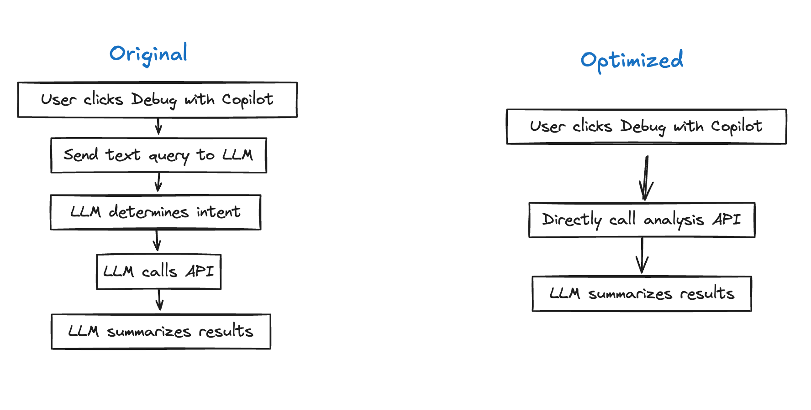

**Artur Laksberg and others have been working hard on Pulumi Copilot, an AI assistant for cloud engineeinfrastructure. Having worked extensively with conversational AIs at Microsoft before Pulumi, he brings unique insights into building with LLMs. Today he shares his lessons and an unexpected discovery he's learned along the way.**

Since joining Pulumi back in June, I've spend my mornings reviewing user feedback for Copilot, our AI assistant. Recently, one message caught my eye: "Your tool doesn't know anything!". Having just updated our code database and refined our prompts, I braced for the worst. But the evals we run were still looking strong, so what was going on?

<!--more-->

The user was trying to force-delete a stack that still had resources. Copilot confidently suggested using a `--force` flag - a perfectly logical solution, except this flag doesn't exist in Pulumi. This is a day in the life of building on LLMs – hallicinations are a fact of life.

But this particular error, this is a specific type of hallicination,  I now have a solution for and now that we've launched our REST API and Copilot has been running in production for a bit, I want to share some lessons we've learned building with LLMs.

Let's start with the fundamental tension between software engineering and prompt engineering.

## Engineering for Reality: Software Engineering vs Prompt Engineering

When building LLM-powered applications, the temptation is to throw every task at the model. After all, modern LLMs are remarkably capable - they can generate code, format text, and even create clickable links. But this approach comes with hidden costs.

The core principle we've learned building Pulumi Copilot is this: minimize LLM workload whenever possible by favoring traditional software engineering. Let me explain with an example.

Early in Copilot's development, we had a seemingly simple feature: listing a user's Pulumi stacks with clickable links based on data from a backend api. Our first implementation used a complex prompt instructing the LLM to construct URLs in the format `app.pulumi.com/org/project/stack`. The prompt explained the format, provided examples, and asked the LLM to generate these links from JSON data it had.

It worked - almost all of the time. But we were seeing occasional malformed URLs and more importantly, we were burning input tokens (and money) with our complicated prompt and having an AI construct strings that could be deterministically generated.

The solution was straightforward: generate the full links in the backend service and include them directly in the context. The LLM then needs no instructions on how to create them. Simple stuff, but it gave us faster responses, perfect URLs, and lower costs.

This pattern - identifying deterministic components and moving them out of the LLM - has become central to our engineering approach. When you find yourself writing elaborate prompts to handle structured data transformations, stop and ask: could traditional code do this better? Could this be decomposed so that the LLM did less?

To validate this approach and understand real user needs, we began extensive internal testing.

## Copilot in Action: Real-World Dog-Fooding

The internal testing phase was invaluable for uncovering bugs, refining our prompts, and, most importantly, understanding how real users would interact with the tool. Here are a few examples of how Copilot proved helpful, even in these early days:

**Debugging Deployments:** One of the first questions our internal users asked was, 'Why did my latest infrastructure deployment fail?' Even before the refinements to this sysetem mentioend above, LLMs clearly succeed at summarization and extracting a clear natural langauge explanation from stack traces and logs is a clear win. This early success demonstrated Copilot's potential to streamline debugging workflows.

**Understanding Complex Infrastructure:** Copilot helped our engineers gain insights into our own infrastructure. Asking 'How many resources are in production?'  or 'What expensive compute is running' or 'What version is the EKS cluters in EU" show that is an advantage to allow users to express infrastructure questions in natural langauge.

**Generating Code:** Even internally, the demand for code generation was strong. One of the first queries logged was, 'I want a static website on AWS behind a CloudFront CDN.' Another was a Solutions Engineers, tasked with demonstrating Pulumi's CrossGuard policy engine to a prospect, asked Copilot to generate a policy. This shows the helpfulness of LLMs in getting you started with things you aren't intimately familair with.

These early experiences revealed the need for a systematic approach to handling diverse user queries. This led us to develop what we call skills.

## Skillful Slicing: Modular Mastery

To manage the increasing complexity and enable Pulumi Copilot to handle a wide range of user queries, we extended this decomposition to what we call skills. Each "skill" represents a modular unit of functionality, designed to perform a specific task or access a particular data source. For example, the Insights Skill handles queries about resource usage and configuration ("How many S3 buckets do I have?"), the Cloud Skill interacts with the Pulumi Service API to manage infrastructure ("Create a new project."), the Code Skill generates Pulumi code snippets ("Write a Typescript program..."), and the Docs Skill retrieves information from Pulumi documentation ("How do I use [update plans](https://www.pulumi.com/docs/iac/concepts/update-plans/)?").  

When a user asks a question, the LLM analyzes the query, determines the user's intent, and selects the appropriate skill (or sequence of skills) to invoke. This function-calling approach, orchestrated by a component we call the "outer loop," allows Copilot to access and process information beyond its internal knowledge base.

Early in development, we faced the challenge of ensuring Copilot could effectively interpret the diverse ways users might phrase their questions. To address this, we undertook a skill mapping exercise, analyzing a large sample of real user queries and categorizing them based on the underlying Pulumi functionality required. This exercise,  allowed us to refine Copilot's intent recognition capabilities and ensure it could accurately route user queries to the appropriate skills. For example, a question like "Show me my untagged EC2 instances" would be mapped to the Insights Skill, with parameters specifying the resource type (EC2 instance) and the tag filter (untagged).

This structured approach enabled us to develop a more robust and nuanced system for understanding user intent. As we refined Copilot's architecture, we identified another key area for optimization in one of our most-used features: the Debug button workflow.

## Debug Dispatch

Originally, when a user clicks "Debug with Copilot" on a failed update, we would send a text query to CoPilot like "Analyze this update and explain any errors." The LLM then:

1. Determines the user wants to analyze an update
2. Identifies which API to call
3. Calls the API
4. Summarizes the results

But we already know the user's intent - they clicked a debug button. Having the LLM determine intent is unnecessary processing that adds latency and cost. Instead, we directly call the analysis API get the results and use the LLM solely for what it does best: summarizing technical output into clear, actionable explanations.

This is another small win for our "Software Engineering over Prompt Engineering" approach. Traditional code handles the predictable parts, while AI focuses on the human-facing explanations. But while minimizing LLM workload helped with efficiency, we soon faced an even trickier challenge: the deceptive polish of AI-generated outputs.

## The Illusion of Correctness

Large language models excel at generating well-structured, grammatically correct output. They can format tables, craft compelling narratives, and even mimic human conversational styles. But this polished presentation can mask underlying flaws in the information itself, creating a false sense of confidence for users.

One of our early testers, Pablo, encountered this firsthand. He posed a query to Pulumi Copilot, asking for a summary of resources within a specific project. The response he received was impeccably formatted, neatly categorizing resources by type and providing counts for each. It *looked* right, and for us humans sometimes looking right carries a lot of weight.

However, a closer inspection revealed the numbers were way off. Copilot had asked for the wrong data and then summarized it beautifully - but incorrectly. This highlighted our next challenge: how do you systematically test a system that can be confidently wrong while sounding completely right?

## Testing the Untestable: Validating LLM Outputs

When testing traditional code, we expect deterministic outputs. With LLMs, even successful outcomes can vary significantly. Here's how we tackle this challenge.

Our initial approach focused on keyword checking. For example, when testing our update analysis feature, we initiall had a specific test case where a security error occurs. Our test validates that the LLM's response mentions "security" and describes the specific error condition.

This worked for basic validation, but quickly showed its limitations.  For instance, when a user asked, "How many Lambdas am I running?", the LLM correctly identified the AWS Lambda resources but didn't use the word "running." failing the eval.

These early failures highlighted the brittleness of keyword checking and the need for a more nuanced approach. Inspired by platforms like LangSmith, we started leveraging LLMs themselves for validation.  We adopted Promptfoo for automated testing.  Our test suite now runs against every code change, validating both response content and format.

This LLM-as-judge approach provides more flexible validation. After implementing this approach, we saw a significant improvement in our ability to catch subtle errors that keyword checking missed.

Early internal dogfooding, where we analyzed logs of real user queries, was crucial.  Questions like, "How do I use update plans?" and "Show me my untagged EC2 instances" were turned into evals, ensuring our tests reflected real-world usage. This iterative process, starting with a small set of evals and expanding it based on user data, allowed us to continually refine our prompts and models.  We weren't just testing in the abstract—we were testing against the questions our users were actually asking.  This approach, combined with the flexibility of LLM-as-judge, allowed us to significantly improve the quality and reliability of Pulumi Copilot's responses.

CoPilot is getting better all the time, as we continue to build evals and when models change and get better, evals help us validate we have no regressions. In a quick moving space like generative AI, lots of our code may turn over and change as we continually refine things, but our evals wil contiue to stength our position, reduce our hallicinations and keep our users happy.

While our testing caught many hallucinations, that early user feedback about the '--force' flag still sticks with me today, because it revealed something unexpected about these errors.

## Errors Point the Way

The `--force` hallucination wasn't totally wrong - it was revealing what users intuitively expect from our CLI. We're planning on implementing the "--force" flag for stack deletion because our LLM accidentally showed us what was missing. Force deletion is a common pattern across developer tools, and the LLM, trained on vast amounts of documentation and code, was simply reflecting these established conventions.

This has fundamentally changed how I view hallucinations. While we constantly work to minimize them – and our eval works means they happen way less frequently – some of them are clearly product signals. The LLM, in this light, becomes an unexpected source of user research, drawing on its training across thousands of developer tools and experiences.

This insight, combined with our journey building Copilot, revealed five key principles for AI engineering:

1. **Minimize LLM Usage:** Let traditional code handle deterministic tasks, reserve LLMs for natural language work
2. **Decompose into Skills:** Break complex tasks into modular units that combine LLM and traditional code appropriately
3. **Test Rigorously:** Use multiple validation approaches, including LLMs testing LLMs
4. **Learn from Hallucinations:** Sometimes incorrect outputs reveal user expectations
5. **Learn from Users Continuously:** User interactions improve our AI systems - from training better skills to catching hallucinations and revealing product opportunities.

We've built these lessons into our latest release: the Pulumi Copilot REST API, now available in preview. You can integrate these same capabilities and skills into your own tools and workflows. Whether you're building CLI extensions, chat integrations, or automated deployment checks, the API provides the contextual understanding we've engineered into Copilot.

[Try it out](docs.pulumi.com/copilot-api).
