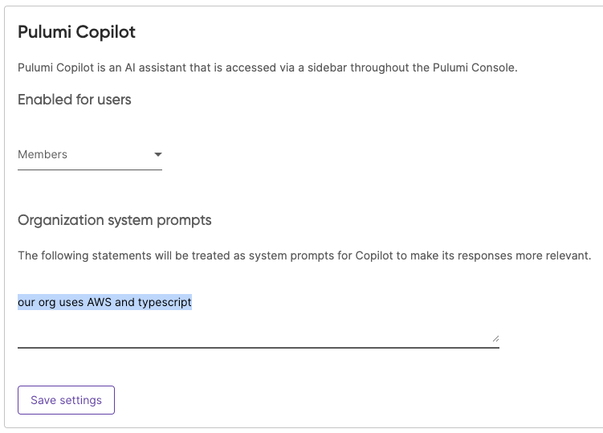

We are excited to announce a new feature for Pulumi Copilot: System Prompts. This enhancement empowers organizations to customize Pulumi Copilot's responses for your organization, making your interactions with our AI assistant even more personalized to save you even more time.

<!--more-->

[Pulumi Copilot](/docs/pulumi-cloud/copilot/) is a conversational chat interface integrated throughout Pulumi Cloud, enabling users to quickly accomplish a variety of cloud infrastructure management tasks by leveraging the power of large language models plus the rich capabilities of Pulumi Cloud. [We released Pulumi Copilot in June this year](/blog/pulumi-copilot/), and have seen remarkable uptake across our customer base. We are excited to be announcing enhancements on the Pulumi Copilot experience- keep an eye out for more to come in the near future.

System prompts allow organization administrators to set default preferences and guidelines for Pulumi Copilot. By configuring these prompts, you can tailor Pulumi Copilot's behavior to better suit your team's needs and policies. Here are some ways you might use organization system prompts:

- **Set a Default Programming Language:** Ensure that all code snippets and examples provided by Pulumi Copilot are in your team's preferred language.
- **Specify a Default Cloud Provider:** Streamline resource searches and code generation by focusing on your primary cloud environment. Specify providers your organization prefers to use, such as using Azure Native instead of Azure Classic.
- **Enforce Compliance Guidelines:** Instruct Copilot to generate code and provide guidance that adheres to specific compliance standards, such as SOC 2.
- **Standardize Infrastructure Components:** Provide example code templates for resources to ensure consistency across your organization's projects, such as "here is how we create VPCs"

## How to Set Organization System Prompts

Setting up system prompts is straightforward:

1. Log in to Pulumi Cloud and go to your organization's settings in the left hand navigation
2. Under the settings menu, select "Access Management."
3. In the Copilot section, you'll find the option to set your system prompts.

Though the system prompt supports 10k characters of context, we recommend keeping it concise to ensure optimal performance. See more information on setting system prompts [in our Pulumi Copilot documentation](/docs/pulumi-cloud/copilot/).

## Wrapping it up

This is just the beginning. We're dedicated to making Pulumi Copilot an indispensable part of your cloud infrastructure management toolkit. Stay tuned for more updates and enhancements based on your feedback.

If you have suggestions or encounter any issues, please let us know through our [Pulumi Cloud requests GitHub repository](https://github.com/pulumi/pulumi-cloud-requests).
