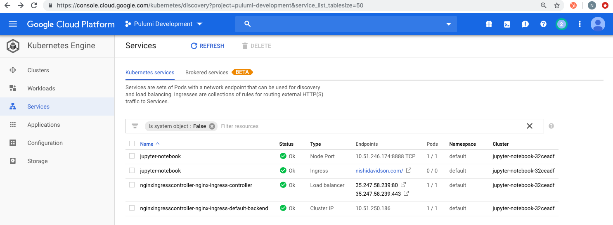
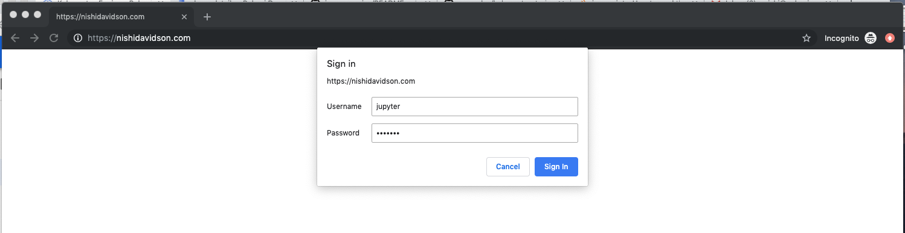
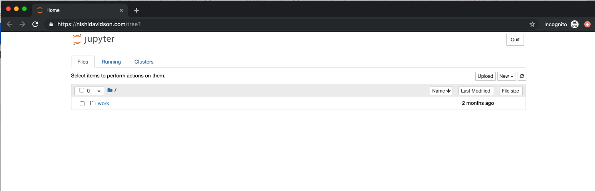

In this post, we will work through an example that shows how to use Pulumi to create Jupyter
Notebooks on Kubernetes. Having worked on Kubernetes since 2015, a couple of critical benefits
jump out that may resonate with you as well:

- You write everything in code - TypeScript in our example here.
- You need not initialize Tiller or Helm to work with existing Helm charts like
  `nginx-ingress-controller` that we use here.
- The security patterns in Helm and Tiller are no longer concerns, rather you get to focus on the
  RBAC of the actual service which is Jupyter-notebook in this example.
- You accomplish more with less YAML and iteratively work towards your use cases.
<!--more-->

## Prerequisites

- [Install Pulumi]()
- [Install Node.js version 6 or later](https://nodejs.org/en/download/)
- Install a package manager for Node.js, such as [npm](https://www.npmjs.com/get-npm) or [Yarn](https://yarnpkg.com/en/docs/install)
- [Install Google Cloud SDK](https://cloud.google.com/sdk/docs/downloads-interactive)
- [Install Helm](https://helm.sh/docs/using_helm/#installing-helm) and only initialize with `helm init —client-only`

We will work this example on a GKE cluster so lets first configure GCP Auth:

```bash
$ gcloud auth login
$ gcloud config set project <YOUR_GCP_PROJECT_HERE>
$ gcloud auth application-default login
```

## Step 1: Create a Pulumi Project and Stack with a Pulumi TypeScript Template

```bash
$ mkdir gke-jupyter-notebook && cd gke-jupyter-notebook
$ pulumi new typescript
$ npm install --save @pulumi/kubernetes @pulumi/gcp
```

## Step 2: Create a GKE Cluster

To create a GKE cluster, simply update the following code in `index.ts` file and run `pulumi up`.

```typescript
import * as k8s from "@pulumi/kubernetes";
import * as pulumi from "@pulumi/pulumi";
import * as gcp from "@pulumi/gcp";
import { readFileSync, fstat } from "fs";

const name = "jupyter-notebook";

/*
 * STEP 2: Create a GKE Cluster
 */
const cluster = new gcp.container.Cluster(name, {
    initialNodeCount: 2,
    minMasterVersion: "latest",
    nodeVersion: "latest",
    nodeConfig: {
        machineType: "n1-standard-1",
        oauthScopes: [
            "https://www.googleapis.com/auth/compute",
            "https://www.googleapis.com/auth/devstorage.read_only",
            "https://www.googleapis.com/auth/logging.write",
            "https://www.googleapis.com/auth/monitoring"
        ],
    },
});

// Export the Cluster name
export const clusterName = cluster.name;

// Manufacture a GKE-style kubeconfig. 
export const kubeconfig = pulumi.
    all([ cluster.name, cluster.endpoint, cluster.masterAuth ]).
    apply(([ name, endpoint, masterAuth ]) => {
        const context = `${gcp.config.project}_${gcp.config.zone}_${name}`;
        return `apiVersion: v1
clusters:
- cluster:
    certificate-authority-data: ${masterAuth.clusterCaCertificate}
    server: https://${endpoint}
  name: ${context}
contexts:
- context:
    cluster: ${context}
    user: ${context}
  name: ${context}
current-context: ${context}
kind: Config
preferences: {}
users:
- name: ${context}
  user:
    auth-provider:
      config:
        cmd-args: config config-helper --format=json
        cmd-path: gcloud
        expiry-key: '{.credential.token_expiry}'
        token-key: '{.credential.access_token}'
      name: gcp
`;
    });

// Create a Kubernetes provider instance that uses our cluster from above.
const clusterProvider = new k8s.Provider(name, { kubeconfig: kubeconfig });
```

## Step 3: Create a NGINX-Ingress-Controller to Generate Ingresses

You can use the default L7 load balancer in GCP but here we add an NGINX-Ingress-Controller to
the cluster. With Pulumi, you write four lines of typescript to reuse the stable NGINX ingress
controller helm chart and have the controller, default backends, RBAC, Service account, Config
map all running within seconds.

Add the following lines of code in `index.ts` file and run `pulumi up` once again.

/*
 * STEP 3: Create NGINX Ingress Controller in GKE
 */

const nginxingresscntlr = new k8s.helm.v2.Chart("nginxingresscontroller", {
    repo: "stable",
    chart: "nginx-ingress",
    version: "0.24.1",
    values: {},
}, { providers: { kubernetes: clusterProvider } }); 


## Step 4: Create a Jupyter Notebook Deployment and Service with Type NodePort

Bringing up Jupyter notebook deployment and service requires adding the following lines of code in
`index.ts` file and running `pulumi up` to apply the changes.

/*
 * STEP 4: Create Jupyter notebook deployment and service in the GKE cluster
 */

const appName = "jupyter-notebook";
const appLabels = { app: appName };
const jupyterNotebook = new k8s.apps.v1beta1.Deployment(appName, {
      metadata: { name: appName, labels: appLabels },
      spec: {
          selector: { matchLabels: appLabels },
          replicas: 1,
          template: {
              metadata: { labels: appLabels },
              spec: { 
                  containers: [
                      { 
                        name: appName, 
                        image: "jupyter/tensorflow-notebook",
                        ports: [{ containerPort: 8888 }],
                        command: ["start-notebook.sh"],
                        args: ["--NotebookApp.token=''"]
                }]
            }
        }
    }
}, { provider: clusterProvider });

const jupyterService = new k8s.core.v1.Service(appName, {
  metadata: { 
      name: appName,
      labels: appLabels
    },
  spec: { 
      type: "NodePort", 
      selector: appLabels, 
      ports: [{ protocol: "TCP", nodePort: 30040, port: 8888, targetPort: 8888 }], 
    }
}, { provider: clusterProvider });


## Step 5: Create a Secret that is used with your Jupyter Notebook Domain Name

We first create a local auth.txt file with the password using the following command:

```bash
htpasswd -c auth.txt jupyter
```

We then read this file synchronously, convert it to base64 and add it as a secret in the GKE
cluster. We use this secret as the TLS password to access the Jupyter notebook ingress endpoint
accessible from the domain name defined in the host section of the ingress declaration. The
annotations in the ingress declarations are required to enable this behavior on the ingress object.

```javascript
 * STEP 5: Create a secret to enable "basic-auth" for your Jupyter
 * notebook ingress and add it to the ingress declaration in the
 * GKE cluster
 */

const authContents = (readFileSync("<path-to-auth.txt-file>")).toString()

function toBase64(s: string): string {
    return Buffer.from(s).toString("base64");
}

const authContents_base64 = toBase64(authContents);

const jupyternotebooksecret = new k8s.core.v1.Secret("jupyter-notebook-tls", {
    metadata: { name: "basic-auth", namespace: "default" },
    type: "Opaque",
    data: { 
        auth: authContents_base64,
    }
}) 

export const jupyternotebookingress = new k8s.extensions.v1beta1.Ingress(appName, {
    metadata: { 
        name: appName,
        labels: appLabels,
        annotations: { 
            "kubernetes.io/tls-acme": "true", 
            "kubernetes.io/ingress.class": "nginx", 
            "nginx.ingress.kubernetes.io/auth-type": "basic",
            "nginx.ingress.kubernetes.io/auth-secret": "basic-auth",
            "nginx.ingress.kubernetes.io/auth-realm": "Authentication Required - jupyter"
        },
    },
    spec: { 
        rules: [{
            host: "nishidavidson.com", 
            http: {
                paths: [{
                    path: "/", 
                    backend: { serviceName: "jupyter-notebook", servicePort: 8888 }
                }]
            }
        }],
        tls: [{
            secretName: "jupyter-notebook-tls", 
            hosts: ["nishidavidson.com"]
        }],
    }
}, { provider: clusterProvider });
```

Once complete, you will see the GKE cluster components show up as follows:



Open a browser to access the jupyter-notebook Service using the domain name declared in the host
section of your ingress code above. In our example, I used the domain name `nishidavidson.com`.

When you open your DNS, you will be asked for the "username: jupyter" and "password" for the secret
you created in auth.txt file as shown below:



As soon as the password is accepted, You should now be able to go to your website from anywhere in
the world and access your password-protected Jupyter notebook running on GKE on secure SSL connection.



Success! We worked through a simple example of creating a GKE cluster, an NGINX ingress controller
and stood up our password protected Jupyter notebook Ingress, Service, and Deployment with a simple
secret for authentication.

You can get started today using more solutions on Kubernetes from our
[Pulumi examples](https://github.com/pulumi/examples) repository.
