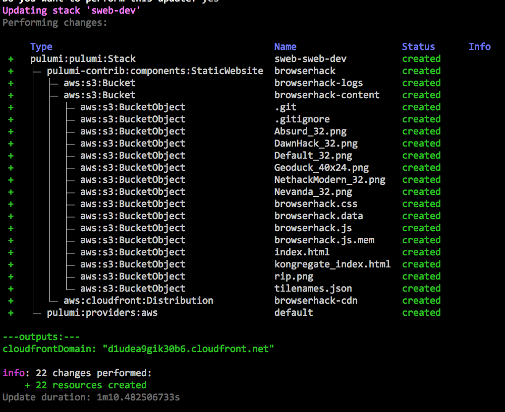

Hello! A few weeks back I wrote
a post on [serving static websites on AWS with Pulumi])
detailing how to host a static website on AWS. Pulumi allowed me to wire four
different AWS products together in only 200 lines of code. It would be a
shame, however if I needed to copy and paste that code every time I
wanted to to stand up a new website. Instead, we can package up, share,
and reuse our code just like any other Node.js library. It just so
happens that this one can be used to create cloud infrastructure.
<!--more-->

## Creating a Package

To create a reusable package for the static website example, I simply
put the code into a new
[GitHub repo](https://github.com/chrsmith/static-website-aws) and
[publish it to NPM](https://www.npmjs.com/package/static-website-aws).
We'll walk through exactly how to do that below, but afterwards anyone
who wants to stand up a static website on AWS can just reuse that
package.

The `static-website-aws` package exports a `StaticWebsite` class, which
is a logical, reusable cloud "component" resource. This class offers a
simple constructor that internally does all of the hard work of creating
the assortment of AWS cloud resources in the prior blog post -- an S3
Bucket and objects per piece of static content, CloudFront Distribution,
and Route53 DNS A-Record -- and exposes them afterwards as readonly
properties:

```typescript
/**
 * Static website using Amazon S3, CloudFront, and Route53.
 */
export declare class StaticWebsite extends pulumi.ComponentResource  {
    readonly contentBucket: aws.s3.Bucket;
    readonly logsBucket: aws.s3.Bucket;
    readonly cdn: aws.cloudfront.Distribution;
    readonly aRecord?: aws.route53.Record;

    /**
    * Creates a new static website hosted on AWS.
    * @param name  The _unique_ name of the resource.
    * @param contentArgs  The arguments to configure the content being served.
    * @param domainArgs  The arguments to configure the domain and DNS settings.
    * @param opts  A bag of options that control this resource's behavior.
    */

    constructor(name: string , contentArgs: ContentArgs,
                domainArgs?: DomainArgs, opts?: pulumi.ResourceOptions);
}
```

This class is placed into an NPM package as usual, including a
[package.json](https://github.com/chrsmith/static-website-aws/blob/master/package.json)
file that gives it a name and a version. After doing this, we can
[publish it to NPM](https://docs.npmjs.com/getting-started/publishing-npm-packages)
simply by running

```bash
$ npm publish
```

All the complexities of creating, configuring, and wiring up the
necessary AWS resources -- admittedly only 200 lines of code, but still
intricate -- has now been hidden beneath an ultra-simple component
resource named `StaticWebsite`.

That's how you create a new package. The great thing about packages,
however, is that you define them once and then use them a lot. So now
let's turn to see see how standing up a new CDN-backed website can now
become just a few lines of very simple, understandable code.

## Reusing Infrastructure as Code

To use this new package, head on over to a Pulumi program, or
[create a new one]()
(for instance, with `pulumi new aws-typescript`).
Then just add a reference like any other dependency:

```
$ npm install static-website-aws
```

At that point, we can import our `StaticWebsite` class from the
`static-website-aws` package like usual in Node.js programs, either
using require

```
let swa = require("static-website-aws");
```

or using the new ES6 module import syntax, supported by TypeScript and
modern JavaScript

```
import { StaticWebsite } from "static-website-aws";
```

Afterwards, we'll just `new` up a `StaticWebsite` object, which
internally creates everything for us. Of course, to create a useful
website, we'll need to supply some interesting parameters . In this
case, let's just pass a path to the content on disk (which will
automatically get uploaded into S3 objects during a `pulumi up`) in
addition to a path to a custom 404 HTML page:

```javascript
import  { StaticWebsite } from "static-website-aws";

const website  = new StaticWebsite ("browserhack", {
    pathToContent:"./browserhack",
    custom404Path:"/404.html",
});

export let cloudfrontDomain  = website .cdn .domainName ;
```

As soon as we have our program, we can stand it up with a single
`pulumi up`  command:

```bash
$ pulumi up
```

This will show us the entire resource graph so that we can see what it's
creating internally and once it's done the resulting domain name will be
printed out:



Let's then curl it to see whether it worked:

```
$ curl $(pulumi stack output cloudfrontDomain)`[<!doctype html>
]{style="color: red; font-family: Menlo, Monaco, Consolas, 'Courier New', monospace; font-size: 13px;"}[<!--
vim: set sw=2 ts=2 et : -->
]{style="color: red; font-family: Menlo, Monaco, Consolas, 'Courier New', monospace; font-size: 13px;"}[<html>
]{style="color: red; font-family: Menlo, Monaco, Consolas, 'Courier New', monospace; font-size: 13px;"}[ 
 <head>
]{style="color: red; font-family: Menlo, Monaco, Consolas, 'Courier New', monospace; font-size: 13px;"}[...
etc, etc, etc
...]{style="color: red; font-family: Menlo, Monaco, Consolas, 'Courier New', monospace; font-size: 13px;"}
```

Huzzah! (Note that new CloudFront Domains can take a while to spin
up; if you get an error "Could not resolve host: xxx.cloudfront.net",
just wait a little bit and try again.)

The full source code for this example is available at
[chrsmith/browserhack-demo](https://github.com/chrsmith/browserhack-demo).
This program deploys an instance of [BrowserHack](http://coolwanglu.github.io/BrowserHack/)
(a web-based port of the seminal console game [NetHack](https://www.nethack.org/)).
The repo also includes an example of assigning a custom domain name and
[ACM-managed SSL certificate](https://docs.aws.amazon.com/acm/latest/userguide/acm-overview.html),
useful capabilities supported by `StaticWebsite` but omitted here for
brevity .

## Resource Components

We glossed over what components are earlier on. This is an advanced
concept, so feel free to skip this section; but if you want to
understand how components work under the hood, read on.

The `StaticWebsite` type extends `pulumi.ComponentResource`. A
`ComponentResource` is a Pulumi-managed resource that aggregates other
resources into a higher-level abstraction.

Pulumi will manage creating and updating the underlying resources like
normal, and you will see updates to them in the resource tree. The
difference is that by using the `ComponentResource` abstraction we can
present those resources as logically grouped into a new, static website
type.

This parent/child relationship between resources is declared using the
optional `pulumi.ResourceOptions` type passed to Pulumi resources.

Here's a code snippet from the code, where we create the S3 bucket and
specify its logical parent resource. Every child resource created is
passed `defaultResourceOptions`, which sets the parent property to this
(the instance of StaticWebsite ).

```javascript
// Default resource options for this component's child resources.
const defaultResourceOptions: pulumi.ResourceOptions = { parent:this };

...

// Create the logs bucket to store CloudFront request logs.

this.logsBucket = new aws.s3.Bucket(`${name }-logs`,
    { acl:"private" },
    defaultResourceOptions,
);
```

Components are a powerful construct in Pulumi, and let you build larger
first class resources out of smaller ones. There are other benefits,
including seeing resource attribution in the CLI tree view, and the
richer visualization in the [pulumi.com](http://pulumi.com) console:


If you want to learn more about components, see the
[documentation]().

## Package Everything!

In this blog, you've seen how Pulumi's code-centric approach to
infrastructure can make you more productive programming the cloud.
"Code" has a lot of advantages over static configuration languages, for
example rich IDE support. Another big advantage of using code, however,
is that it allows you to create useful abstractions that can be reused
in other programs

With Pulumi being able to take advantage of existing package managers,
it's super easy to create high-quality reusable components. We
demonstrated NPM here for Node.js programs, but Pulumi also supports
PyPI for Python, and traditional library techniques for Go.

But don't just take our words for it. Recently Mikhail Shilkov
[blogged](https://mikhail.io/2018/08/aws-lambda-warmer-as-pulumi-component/)
about creating a Pulumi component to keep AWS Lambda functions warm. And
James Nugent [open sourced a component](https://github.com/jen20/pulumi-aws-vpc)
that creates a properly subnetted AWS VPC. This is a great way to encode and share best
practices broadly. Over time, we look forward to seeing the many other
battle-tested components the community creates for common cloud
applications and infrastructure needs.

If you've created a Pulumi component that is useful or want some design
advice, come and join us in the [Pulumi Community
Slack](https://slack.pulumi.io/) -- we'd love to hear from you!
