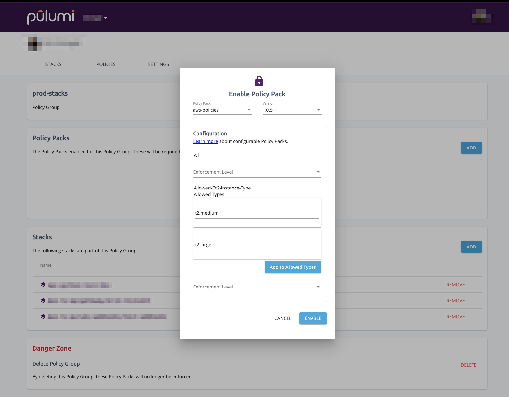

In a [previous blog post](), I introduced CrossGuard, Pulumi's Policy as Code solution. As part of our [2.0 release](), CrossGuard is now generally available and has some awesome new features to improve the user experience around managing Policy Packs.

<!--more-->

## General Availability

CrossGuard is now enabled for all enterprise organizations in the Pulumi Console and as always the open source offering is available for all to use.

### Improved CLI support

We have added richer CLI support for CrossGuard. Organization administrators can now manage their Policy Packs from the CLI. In additional to being able to publish Policy Packs, you may now enable a Policy Pack by simply running:

```bash
$ pulumi policy enable <organization>/<pack-name> <version>
```

This same command can be used upgrade an already enabled Policy Pack.

Organization administrators may also disable a Policy Pack by running:

```bash
$ pulumi policy disable <organization>/<pack-name>
```

By default, the `enable` and `disable` commands use an organization's default Policy Group. Using the `--policy-group` flag, you can specify another Policy Group. You can also specify `latest` instead of a specific Policy Pack version to enable the latest version of that Policy Pack.

### Options, Parent, and Dependencies

Policies now have access to more information about the resources under review. With access to the options, parent and dependencies of a resource, you can now write even more thorough policies.

You may access a [resource's options]() via the `ResourceValidationArgs` parameter. In the below example, we enforce that all DynamoDB tables be `protected` to prevent data loss.

```typescript
new PolicyPack("aws-policies", {
    policies: [
        {
            name: "dyanmodb-table-protected",
            description: "DynamoDB tables must be protected.",
            enforcementLevel: "mandatory",
            validateResource: validateResourceOfType(aws.dynamodb.Table, (_, args, reportViolation) => {
                if (!args.opts.protect) {
                    reportViolation(`DynamoDB tables must be protected to prevent data loss.`);
                }
            }),
        },
    ],
});
```

Access to the parent and dependencies of a resource allow you to author policies about the relationship between resources. For example, you may want to make sure that each DynamoDB table in a stack has an attached scaling policy.

```typescript
new PolicyPack("aws-policies", {
    policies: [
        {
            name: "dyanmodb-table-protected",
            description: "DynamoDB tables should have an autoscaling policy.",
            enforcementLevel: "advisory",
            validateStack: (args, reportViolation) => {
                const tables = args.resources.filter(r => r.isType(aws.dynamodb.Table))

                for (const table of tables) {
                    const scalingPolicies = table.dependencies.filter(r => r.isType(aws.appautoscaling.Policy));
                    if (!scalingPolicies || scalingPolicies.length === 0) {
                        reportViolation(`DynamoDB table ${table.name} is missing a scaling policy.`);
                    }
                }
            }
        },
    ],
});
```

## Python Support

As of our 2.0 launch, you can now author Policy Pack in Python. Our multi-language approach allows you to author a Policy Pack using our NodeJS or Python SDK and enforce the pack on a stack written in any language.

The Python-based Policy Pack prohibits public permission of Azure Storage Blob Containers.

```python
def storage_container_no_public_read_validator(args: ResourceValidationArgs, report_violation: ReportViolation):
    if args.resource_type == "azure:storage/container:Container" and "containerAccessType" in args.props:
        access_type = args.props["containerAccessType"]
        if access_type == "blob" or access_type == "container":
            report_violation(
                "Azure Storage Container must not have blob or container access set. " +
                "Read more about read access here: " +
                "https://docs.microsoft.com/en-us/azure/storage/blobs/storage-manage-access-to-resources")

storage_container_no_public_read = ResourceValidationPolicy(
    name="storage-container-no-public-read",
    description="Prohibits setting the public permission on Azure Storage Blob Containers.",
    validate=storage_container_no_public_read_validator,
)

PolicyPack(
    name="azure-python",
    enforcement_level=EnforcementLevel.MANDATORY,
    policies=[
        storage_container_no_public_read,
    ],
)
```

## Configuration

And lastly, the feature I am most excited to share with you all is Configurable Policy Packs. Using configuration, you can author Policy Packs that are reusable and flexible for your organization's various needs.

For example, you may have a policy that restricts the allowed EC2 instance types. This set of instance may vary between your non-production stack and production stacks.

```typescript
new PolicyPack("aws-policies", {
    policies: [
        {
            name: "allowed-ec2-instance-type",
            description: "EC2 instance type must be of an approved type.",
            enforcementLevel: "mandatory",
            configSchema: {
                properties: {
                    allowedTypes: {
                        type: "array",
                        default: ["t2.nano", "t2.micro", "t2.small"]
                    },
                },
            },
            validateResource: validateResourceOfType(aws.ec2.Instance, (instance, args, reportViolation) => {
                const config = args.getConfig<{ allowedTypes?: string[] }>();
                if (!config.allowedTypes) {
                    reportViolation(`No EC2 instance types have been approved.`);
                    return;
                }
                if (!config.allowedTypes.includes(instance.instanceType)) {
                    reportViolation(`EC2 type must be an allowed instance type: ${config.allowedTypes}. ` +
                        `${instance.instanceType} is not allowed type.`);
                }
            }),
        },
    ],
});
```

Using configuration, you can make this deviation, allowing larger, more costly instances only in production. We can enable this configurable Policy Pack for our Policy Group `prod-stacks` using configuration that allows for other instance types.

```json
{
   "allowed-ec2-instance-type": {
      "allowedTypes": ["t2.medium", "t2.large"]
   }
}
```

To enable the pack with this configuration, we can save the JSON to a file called `prod-policy-config.json` and then run:

```bash
pulumi policy enable aws-policies latest --policy-group prod-stacks --config prod-policy-config.json
```

Alternatively, we can enable the Policy Pack from the Pulumi Console, as shown below.



Configuration allows organization administrators to quickly and easily tweak Policy Packs to meet a variety of use cases.

## Wrapping Up

We've invested in improving the user experience for authoring and managing policy. Whether you're an enterprise customer or an open source user, you can get started by taking CrossGuard for a spin.

* [Getting Started with Pulumi]()
* [Getting Started with CrossGuard]()
* [Example Policy Packs](https://github.com/pulumi/examples/tree/master/policy-packs)

The Getting Started with Policy as Code webinar recording is also a great resource for seeing these features in action.


