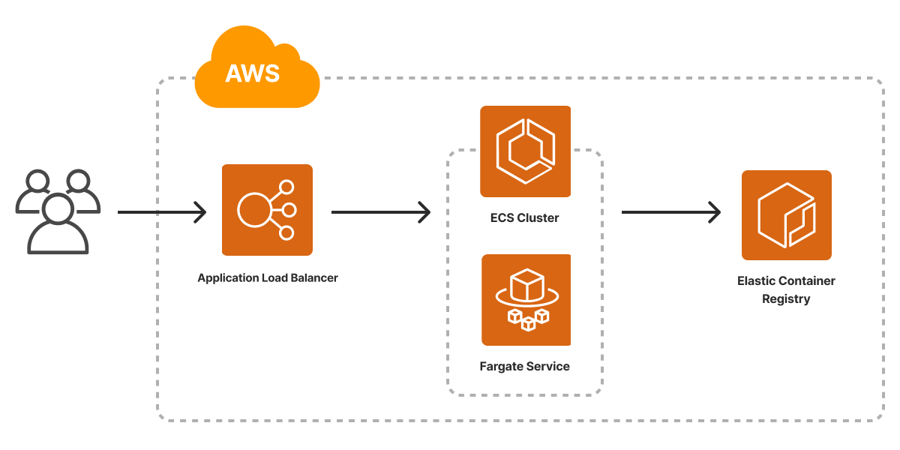
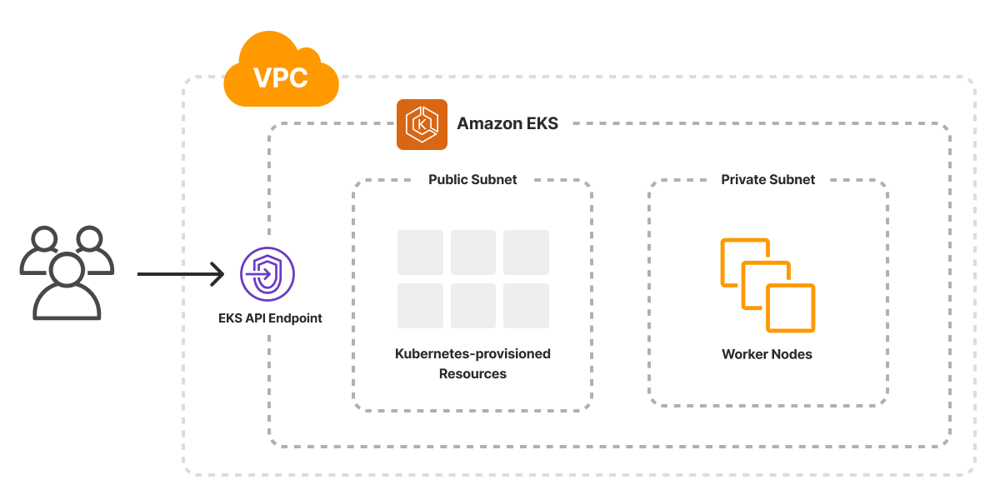

{}
Portions of this blog post are out of date. See the [AWS guides](/docs/clouds/aws/guides/) for an updated overview and examples.
{}

We introduced [Crosswalk for AWS](https://www.pulumi.com/docs/clouds/aws/guides/) three years ago as a library of components on top of the core AWS platform to make it easier to get from zero to production on AWS, easier to adopt AWS best practices by default, and easier to evolve your AWS infrastructure as your application needs mature.  Since then, we’ve added many new capabilities, expanded the portfolio of libraries, and made these libraries [available to all Pulumi languages](https://www.pulumi.com/blog/crosswalk-for-aws-all-languages/).  We’ve also seen thousands of Pulumi customers, including more than 25% of all Pulumi AWS users, adopting one or more of the Crosswalk for AWS components to aid in delivering their AWS-based applications and services.

Today, we’re excited to deliver the 1.0 releases of the three core libraries that make up Crosswalk for AWS: [AWSX 1.0](https://www.pulumi.com/registry/packages/awsx/), [EKS 1.0](https://www.pulumi.com/registry/packages/eks/) and [AWS API Gateway 1.0](https://www.pulumi.com/registry/packages/aws-apigateway/).  These 1.0 releases offer a stable supported foundation, available in all Pulumi languages, for these rich infrastructure components.



## Why Crosswalk for AWS?

Pulumi provides access to 100 providers (and counting!) for working with a wide variety of cloud and SaaS platforms.  But since the very beginning of our work on Pulumi, [AWS](https://www.pulumi.com/registry/packages/aws/) has been the most used platform, both by the number of organizations using the provider, and by the average number of cloud resources managed per organization.

One of our guiding lights for Pulumi has always been to help organizations to scale up the complexity, capability, and richness of what they can build in the cloud, and in specific on the AWS platform.  AWS offers an enormous number of powerful building block services, and organizations can stitch those building blocks together in countless ways to accomplish their needs.  Pulumi brings a variety of software engineering tools to bear to help with this - rich programming languages, IDE productivity, testing, policy, and fast iteration.  But none is more important than Pulumi’s focus on enabling the creation of [reusable infrastructure components](https://www.pulumi.com/docs/concepts/resources/components/) - higher level components that provide their own API interface built from the powerful building blocks of the underlying cloud resources.

The Crosswalk for AWS libraries offer components that help address many of the most common use cases we’ve seen AWS users need to tackle - configuring the many components of their VPC network setup, running containers on Amazon ECS and Fargate, configuring a fully featured and production ready Amazon EKS Cluster, and setting up the infrastructure and functions needed as part of a serverless architecture.  All with just a few lines of code that offers AWS best practices out of the box, while offering the ability to scale up into the full features of the AWS platform.

## Crosswalk for AWS 1.0

The 1.0 releases of the [`awsx`](https://www.pulumi.com/registry/packages/awsx/), [`eks`](https://www.pulumi.com/registry/packages/eks/) and [`aws-apigateway`](https://www.pulumi.com/registry/packages/aws-apigateway/) packages offer a stable and supported foundation, available in all Pulumi languages, for these rich infrastructure components.  They are available in the Pulumi Registry, and in all of the supported Pulumi package managers.

> **Note**: For TypeScript users, the `1.0.0` version of the `awsx` package contains some breaking changes from the `0.40.*` versions that were available only in TypeScript. The previously supported APIs are now available in the `@pulumi/awsx/classic` module inside the TypeScript `awsx` package. Users migrating from `0.40.*` to `1.0.*` can choose to either adapt their code and resources to the new APIs (which might require replacement or `import` of resources), or else to continue to use the `classic` submodule.

A few of the most significant components and libraries available in Crosswalk for AWS 1.0 are highlighted in the examples below, all available as part of Pulumi's [Architecture Templates](https://www.pulumi.com/templates/).

### Containers (ECS)



Amazon Elastic Container Service (ECS) provides foundational services for running containers directly on the AWS platform, both against self-managed EC2 clusters, as well as in AWS Fargate’s managed serverless container platform.

The AWSX 1.0 package provides components that make it incredibly easy to take a container, or even just a folder with a `Dockerfile`, and run it in a production-ready environment in AWS.  And unlike some bespoke solutions for container deployment, with AWSX, configuring networking, load-balancing, secrets, managed databases, or anything else needed is just a few lines of code away.

Our recently released [Container Service on AWS](https://www.pulumi.com/templates/container-service/aws/) template provides a great starting point for leveraging the AWSX 1.0 support for ECS, Fargate, ECR and ALB.



{}

```ts
import * as pulumi from "@pulumi/pulumi";
import * as aws from "@pulumi/aws";
import * as awsx from "@pulumi/awsx";

const config = new pulumi.Config();
const containerPort = config.getNumber("containerPort") || 80;
const cpu = config.getNumber("cpu") || 512;
const memory = config.getNumber("memory") || 128;

// An ECS cluster to deploy into
const cluster = new aws.ecs.Cluster("cluster", {});

// An ALB to serve the container endpoint to the internet
const loadbalancer = new awsx.lb.ApplicationLoadBalancer("loadbalancer", {});

// An ECR repository to store our application's container image
const repo = new awsx.ecr.Repository("repo", {});

// Build and publish our application's container image from ./app to the ECR repository
const image = new awsx.ecr.Image("image", {
    repositoryUrl: repo.url,
    path: "./app",
});

// Deploy an ECS Service on Fargate to host the application container
const service = new awsx.ecs.FargateService("service", {
    cluster: cluster.arn,
    assignPublicIp: true,
    taskDefinitionArgs: {
        container: {
            image: image.imageUri,
            cpu: cpu,
            memory: memory,
            essential: true,
            portMappings: [{
                containerPort: containerPort,
                targetGroup: loadbalancer.defaultTargetGroup,
            }],
        },
    },
});

// The URL at which the container's HTTP endpoint will be available
export const url = pulumi.interpolate`http://${loadbalancer.loadBalancer.dnsName}`;
```

{}

{}

```py
from pulumi import Config, Output, export
import pulumi_aws as aws
import pulumi_awsx as awsx

config = Config()
container_port = config.get_int("containerPort", 80)
cpu = config.get_int("cpu", 512)
memory = config.get_int("memory", 128)

# An ECS cluster to deploy into
cluster = aws.ecs.Cluster("cluster")

# An ALB to serve the container endpoint to the internet
loadbalancer = awsx.lb.ApplicationLoadBalancer("loadbalancer")

# An ECR repository to store our application's container image
repo = awsx.ecr.Repository("repo")

# Build and publish our application's container image from ./app to the ECR repository
image = awsx.ecr.Image(
    "image",
    repository_url=repo.url,
    path="./app")

# Deploy an ECS Service on Fargate to host the application container
service = awsx.ecs.FargateService(
    "service",
    cluster=cluster.arn,
    assign_public_ip=True,
    task_definition_args=awsx.ecs.FargateServiceTaskDefinitionArgs(
        container=awsx.ecs.TaskDefinitionContainerDefinitionArgs(
            image=image.image_uri,
            cpu=cpu,
            memory=memory,
            essential=True,
            port_mappings=[awsx.ecs.TaskDefinitionPortMappingArgs(
                container_port=container_port,
                target_group=loadbalancer.default_target_group,
            )],
        ),
    ))

# The URL at which the container's HTTP endpoint will be available
export("url", Output.concat("http://", loadbalancer.load_balancer.dns_name))
```

{}

{}

```go
package main

import (
	"github.com/pulumi/pulumi-aws/sdk/v5/go/aws/ecs"
	"github.com/pulumi/pulumi-awsx/sdk/go/awsx/ecr"
	ecrx "github.com/pulumi/pulumi-awsx/sdk/go/awsx/ecr"
	ecsx "github.com/pulumi/pulumi-awsx/sdk/go/awsx/ecs"
	lbx "github.com/pulumi/pulumi-awsx/sdk/go/awsx/lb"
	"github.com/pulumi/pulumi/sdk/v3/go/pulumi"
	"github.com/pulumi/pulumi/sdk/v3/go/pulumi/config"
)

func main() {
	pulumi.Run(func(ctx *pulumi.Context) error {
		cfg := config.New(ctx, "")
		containerPort := 80
		if param := cfg.GetInt("containerPort"); param != 0 {
			containerPort = param
		}
		cpu := 512
		if param := cfg.GetInt("cpu"); param != 0 {
			cpu = param
		}
		memory := 128
		if param := cfg.GetInt("memory"); param != 0 {
			memory = param
		}

		// An ECS cluster to deploy into
		cluster, err := ecs.NewCluster(ctx, "cluster", nil)
		if err != nil {
			return err
		}

		// An ALB to serve the container endpoint to the internet
		loadbalancer, err := lbx.NewApplicationLoadBalancer(ctx, "loadbalancer", nil)
		if err != nil {
			return err
		}

		// An ECR repository to store our application's container image
		repo, err := ecrx.NewRepository(ctx, "repo", nil)
		if err != nil {
			return err
		}

		// Build and publish our application's container image from ./app to the ECR repository
		image, err := ecrx.NewImage(ctx, "image", &ecr.ImageArgs{
			RepositoryUrl: repo.Url,
			Path:          pulumi.String("./app"),
		})
		if err != nil {
			return err
		}

		// Deploy an ECS Service on Fargate to host the application container
		_, err = ecsx.NewFargateService(ctx, "service", &ecsx.FargateServiceArgs{
			Cluster: cluster.Arn,
            AssignPublicIp: pulumi.Bool(true),
			TaskDefinitionArgs: &ecsx.FargateServiceTaskDefinitionArgs{
				Container: &ecsx.TaskDefinitionContainerDefinitionArgs{
					Image:     image.ImageUri,
					Cpu:       pulumi.Int(cpu),
					Memory:    pulumi.Int(memory),
					Essential: pulumi.Bool(true),
					PortMappings: ecsx.TaskDefinitionPortMappingArray{
						&ecsx.TaskDefinitionPortMappingArgs{
							ContainerPort: pulumi.Int(containerPort),
							TargetGroup:   loadbalancer.DefaultTargetGroup,
						},
					},
				},
			},
		})
		if err != nil {
			return err
		}

		// The URL at which the container's HTTP endpoint will be available
		ctx.Export("url", pulumi.Sprintf("http://%s", loadbalancer.LoadBalancer.DnsName()))
		return nil
	})
}
```

{}

{}

```csharp
using System.Collections.Generic;
using Pulumi;
using Aws = Pulumi.Aws;
using Awsx = Pulumi.Awsx;

return await Deployment.RunAsync(() =>
{
    var config = new Config();
    var containerPort = config.GetInt32("containerPort") ?? 80;
    var cpu = config.GetInt32("cpu") ?? 512;
    var memory = config.GetInt32("memory") ?? 128;
    var cluster = new Aws.Ecs.Cluster("cluster");

    var loadbalancer = new Awsx.Lb.ApplicationLoadBalancer("loadbalancer");

    var repo = new Awsx.Ecr.Repository("repo");

    var image = new Awsx.Ecr.Image("image", new()
    {
        RepositoryUrl = repo.Url,
        Path = "./app",
    });

    var service = new Awsx.Ecs.FargateService("service", new()
    {
        Cluster = cluster.Arn,
        AssignPublicIp = true,
        TaskDefinitionArgs = new Awsx.Ecs.Inputs.FargateServiceTaskDefinitionArgs
        {
            Container = new Awsx.Ecs.Inputs.TaskDefinitionContainerDefinitionArgs
            {
                Image = image.ImageUri,
                Cpu = cpu,
                Memory = memory,
                Essential = true,
                PortMappings = new[]
                {
                    new Awsx.Ecs.Inputs.TaskDefinitionPortMappingArgs
                    {
                        ContainerPort = containerPort,
                        TargetGroup = loadbalancer.DefaultTargetGroup,
                    },
                },
            },
        },
    });

    return new Dictionary<string, object?>
    {
        ["url"] = loadbalancer.LoadBalancer.Apply(loadBalancer => Output.Format($"http://{loadBalancer.DnsName}")),
    };
});
```

{}

{}

```yaml
name: aws-container
description: Containers on AWS
runtime: yaml

config:
  containerPort:
    default: 80
  cpu:
    default: 512
  memory:
    default: 128

resources:
  # An ECS cluster to deploy into
  cluster:
    type: aws:ecs:Cluster
  # An ALB to serve the container endpoint to the internet
  loadbalancer:
    type: awsx:lb:ApplicationLoadBalancer
  # An ECR repository to store our application's container image
  repo:
    type: awsx:ecr:Repository
  # Build and publish our application's container image from ./app to the ECR repository
  image:
    type: awsx:ecr:Image
    properties:
      repositoryUrl: ${repo.url}
      path: ./app
  # Deploy an ECS Service on Fargate to host the application container
  service:
    type: awsx:ecs:FargateService
    properties:
      cluster: ${cluster.arn}
      taskDefinitionArgs:
        container:
          image: ${image.imageUri}
          cpu: ${cpu}
          memory: ${memory}
          essential: true
          portMappings:
          - containerPort: ${containerPort}
            targetGroup: ${loadbalancer.defaultTargetGroup}

outputs:
  # The URL at which the container's HTTP endpoint will be available
  url: http://${loadbalancer.loadBalancer.dnsName}
```

{}

{}

## Kubernetes (EKS)



Amazon Elastic Kubernetes Service (EKS) offers a managed Kubernetes service for standing up a best practices Kubernetes cluster within AWS.

The EKS 1.0 package offers support for configuring the many building blocks needed to configure a complete EKS cluster, across both AWS resources as well as in-cluster Kubernetes resources using Pulumi's native `kubernetes` provider.  With `eks.Cluster`, `eks.NodeGroup`, `eks.NodeGroupV2` and `eks.ManagedNodeGroup` this package makes it easy to configure a cluster using any of the compute options available in AWS in just a few lines of code.

Our recently released [Kubernetes Cluster on AWS](https://www.pulumi.com/templates/kubernetes/aws/) template provides a great starting point for leveraging the `eks` 1.0 support for EKS, taking advantage of default support for private networking and EC2-based compute.



{}

```ts
import * as pulumi from "@pulumi/pulumi";
import * as awsx from "@pulumi/awsx";
import * as eks from "@pulumi/eks";

// Grab some values from the Pulumi configuration (or use default values)
const config = new pulumi.Config();
const minClusterSize = config.getNumber("minClusterSize") || 3;
const maxClusterSize = config.getNumber("maxClusterSize") || 6;
const desiredClusterSize = config.getNumber("desiredClusterSize") || 3;
const eksNodeInstanceType = config.get("eksNodeInstanceType") || "t2.medium";
const vpcNetworkCidr = config.get("vpcNetworkCidr") || "10.0.0.0/16";

// Create a new VPC
const eksVpc = new awsx.ec2.Vpc("eks-vpc", {
    enableDnsHostnames: true,
    cidrBlock: vpcNetworkCidr,
});

// Create the EKS cluster
const eksCluster = new eks.Cluster("eks-cluster", {
    // Put the cluster in the new VPC created earlier
    vpcId: eksVpc.vpcId,
    // Public subnets will be used for load balancers
    publicSubnetIds: eksVpc.publicSubnetIds,
    // Private subnets will be used for cluster nodes
    privateSubnetIds: eksVpc.privateSubnetIds,
    // Change configuration values to change any of the following settings
    instanceType: eksNodeInstanceType,
    desiredCapacity: desiredClusterSize,
    minSize: minClusterSize,
    maxSize: maxClusterSize,
    // Do not give the worker nodes public IP addresses
    nodeAssociatePublicIpAddress: false,
    // Uncomment the next two lines for a private cluster (VPN access required)
    // endpointPrivateAccess: true,
    // endpointPublicAccess: false
});

// Export some values for use elsewhere
export const kubeconfig = eksCluster.kubeconfig;
export const vpcId = eksVpc.vpcId;
```

{}

{}

```py
import pulumi
import pulumi_awsx as awsx
import pulumi_eks as eks

# Get some values from the Pulumi configuration (or use defaults)
config = pulumi.Config()
min_cluster_size = config.get_float("minClusterSize", 3)
max_cluster_size = config.get_float("maxClusterSize", 6)
desired_cluster_size = config.get_float("desiredClusterSize", 3)
eks_node_instance_type = config.get("eksNodeInstanceType", "t2.medium")
vpc_network_cidr = config.get("vpcNetworkCidr", "10.0.0.0/16")

# Create a VPC for the EKS cluster
eks_vpc = awsx.ec2.Vpc("eks-vpc",
    enable_dns_hostnames=True,
    cidr_block=vpc_network_cidr)

# Create the EKS cluster
eks_cluster = eks.Cluster("eks-cluster",
    # Put the cluster in the new VPC created earlier
    vpc_id=eks_vpc.vpc_id,
    # Public subnets will be used for load balancers
    public_subnet_ids=eks_vpc.public_subnet_ids,
    # Private subnets will be used for cluster nodes
    private_subnet_ids=eks_vpc.private_subnet_ids,
    # Change configuration values to change any of the following settings
    instance_type=eks_node_instance_type,
    desired_capacity=desired_cluster_size,
    min_size=min_cluster_size,
    max_size=max_cluster_size,
    # Do not give worker nodes a public IP address
    node_associate_public_ip_address=False,
    # Uncomment the next two lines for private cluster (VPN access required)
    # endpoint_private_access=true,
    # endpoint_public_access=false
    )

# Export values to use elsewhere
pulumi.export("kubeconfig", eks_cluster.kubeconfig)
pulumi.export("vpcId", eks_vpc.vpc_id)
```

{}

{}

```go
package main

import (
	"github.com/pulumi/pulumi-awsx/sdk/go/awsx/ec2"
	"github.com/pulumi/pulumi-eks/sdk/go/eks"
	"github.com/pulumi/pulumi/sdk/v3/go/pulumi"
	"github.com/pulumi/pulumi/sdk/v3/go/pulumi/config"
)

func main() {
	pulumi.Run(func(ctx *pulumi.Context) error {
		// Get some configuration values or set default values
		cfg := config.New(ctx, "")
		minClusterSize, err := cfg.TryInt("minClusterSize")
		if err != nil {
			minClusterSize = 3
		}
		maxClusterSize, err := cfg.TryInt("maxClusterSize")
		if err != nil {
			maxClusterSize = 6
		}
		desiredClusterSize, err := cfg.TryInt("desiredClusterSize")
		if err != nil {
			desiredClusterSize = 3
		}
		eksNodeInstanceType, err := cfg.Try("eksNodeInstanceType")
		if err != nil {
			eksNodeInstanceType = "t2.medium"
		}
		vpcNetworkCidr, err := cfg.Try("vpcNetworkCidr")
		if err != nil {
			vpcNetworkCidr = "10.0.0.0/16"
		}

		// Create a new VPC, subnets, and associated infrastructure
		eksVpc, err := ec2.NewVpc(ctx, "eks-vpc", &ec2.VpcArgs{
			EnableDnsHostnames: pulumi.Bool(true),
			CidrBlock:          &vpcNetworkCidr,
		})
		if err != nil {
			return err
		}

		// Create a new EKS cluster
		eksCluster, err := eks.NewCluster(ctx, "eks-cluster", &eks.ClusterArgs{
			// Put the cluster in the new VPC created earlier
			VpcId:                        eksVpc.VpcId,
			// Public subnets will be used for load balancers
			PublicSubnetIds:              eksVpc.PublicSubnetIds,
			// Private subnets will be used for cluster nodes
			PrivateSubnetIds:             eksVpc.PrivateSubnetIds,
			// Change configuration values above to change any of the following settings
			InstanceType:                 pulumi.String(eksNodeInstanceType),
			DesiredCapacity:              pulumi.Int(desiredClusterSize),
			MinSize:                      pulumi.Int(minClusterSize),
			MaxSize:                      pulumi.Int(maxClusterSize),
			// Do not give the worker nodes a public IP address
			NodeAssociatePublicIpAddress: pulumi.Bool(false),
			// Uncomment the next two lines for a private cluster (VPN access required)
			// EndpointPrivateAccess: 	      pulumi.Bool(true),
			// EndpointPublicAccess:         pulumi.Bool(false),
		})
		if err != nil {
			return err
		}

		// Export some values in case they are needed elsewhere
		ctx.Export("kubeconfig", eksCluster.Kubeconfig)
		ctx.Export("vpcId", eksVpc.VpcId)
		return nil
	})
}
```

{}

{}

```csharp
using Pulumi;
using Awsx = Pulumi.Awsx;
using Eks = Pulumi.Eks;
using System.Collections.Generic;

return await Deployment.RunAsync(() =>
{
    // Grab some values from the Pulumi configuration (or use default values)
    var config = new Config();
    var minClusterSize = config.GetInt32("minClusterSize") ?? 3;
    var maxClusterSize = config.GetInt32("maxClusterSize") ?? 6;
    var desiredClusterSize = config.GetInt32("desiredClusterSize") ?? 3;
    var eksNodeInstanceType = config.Get("eksNodeInstanceType") ?? "t2.medium";
    var vpcNetworkCidr = config.Get("vpcNetworkCidr") ?? "10.0.0.0/16";

    // Create a new VPC
    var eksVpc = new Awsx.Ec2.Vpc("eks-vpc", new()
    {
        EnableDnsHostnames = true,
        CidrBlock = vpcNetworkCidr,
    });

    // Create the EKS cluster
    var eksCluster = new Eks.Cluster("eks-cluster", new()
    {
        // Put the cluster in the new VPC created earlier
        VpcId = eksVpc.VpcId,

        // Public subnets will be used for load balancers
        PublicSubnetIds = eksVpc.PublicSubnetIds,

        // Private subnets will be used for cluster nodes
        PrivateSubnetIds = eksVpc.PrivateSubnetIds,

        // Change configuration values to change any of the following settings
        InstanceType = eksNodeInstanceType,
        DesiredCapacity = desiredClusterSize,
        MinSize = minClusterSize,
        MaxSize = maxClusterSize,

        // Do not give the worker nodes public IP addresses
        NodeAssociatePublicIpAddress = false,

        // Uncomment the next two lines for a private cluster (VPN access required)
        // EndpointPrivateAccess = true,
        // EndpointPublicAccess = false,
    });

    // Export some values for use elsewhere
    return new Dictionary<string, object?>
    {
        ["kubeconfig"] = eksCluster.Kubeconfig,
        ["vpcId"] = eksVpc.VpcId,
    };
});
```

{}

{}

```yaml
name: aws-kubernetes-cluster
description: Kubernetes Cluster on AWS
runtime: yaml
config:
  minClusterSize:
    default: 3
  maxClusterSize:
    default: 6
  desiredClusterSize:
    default: 3
  eksNodeInstanceType:
    default: t2.medium
  vpcNetworkCidr:
    default: 10.0.0.0/16
resources:
  # Create a VPC for the EKS cluster
  eks-vpc:
    type: awsx:ec2:Vpc
    properties:
      enableDnsHostnames: true
      cidrBlock: ${vpcNetworkCidr}
  # Create the EKS cluster
  eks-cluster:
    type: eks:Cluster
    properties:
      # Put the cluster in the new VPC created earlier
      vpcId: ${eks-vpc.vpcId}
      # Public subnets will be used for load balancers
      publicSubnetIds: ${eks-vpc.publicSubnetIds}
      # Private subnets will be used for cluster nodes
      privateSubnetIds: ${eks-vpc.privateSubnetIds}
      # Change configuration section above to change any of the following settings
      instanceType: ${eksNodeInstanceType}
      desiredCapacity: ${desiredClusterSize}
      minSize: ${minClusterSize}
      maxSize: ${maxClusterSize}
      # Do not give the worker nodes public IP addresses
      nodeAssociatePublicIpAddress: false
      # Uncomment next two lines for private cluster access (VPN access required)
      # endpointPrivateAccess: true
      # endpointPublicAccess: false
outputs:
  # Output the Kubeconfig for the cluster
  kubeconfig: ${eks-cluster.kubeconfig}
  vpcId: ${eks-vpc.vpcId}
```

{}

{}

### Serverless (Lambda, API Gateway)


AWS Lambda and the serverless architectures it enables provide native support for event based compute triggered off of a wide variety of events from within the AWS platform. Coupled with services like AWS API Gateway, this offers simple ways to serve HTTP-based APIs and much, much more.

Pulumi's built in support for AWS Lambda functions and the new `aws-apigateway` 1.0 package make it simple to compose these services to build serverless applications and services on AWS in just a few lines of code.

Our recently released [AWS Serverles Application](https://www.pulumi.com/templates/serverless-application/aws/) template provides a great starting point for leveraging the `aws-apigateway` 1.0 support for creating a complete API Gateway-based serverless application, serving both static content from Amazon S3 as well as dynamic backend logic from AWS Lambda.



{}

```ts
import * as pulumi from "@pulumi/pulumi";
import * as aws from "@pulumi/aws";
import * as apigateway from "@pulumi/aws-apigateway";

// A Lambda function to invoke
const fn = new aws.lambda.CallbackFunction("fn", {
    callback: async (ev, ctx) => {
        return {
            statusCode: 200,
            body: new Date().toISOString(),
        };
    }
})

// A REST API to route requests to HTML content and the Lambda function
const api = new apigateway.RestAPI("api", {
    routes: [
        { path: "/", localPath: "www"},
        { path: "/date", method: "GET", eventHandler: fn },
    ]
});

// The URL at which the REST API will be served.
export const url = api.url;
```

{}

{}

```py
import json
import pulumi
import pulumi_aws as aws
import pulumi_aws_apigateway as apigateway

# An execution role to use for the Lambda function
role = aws.iam.Role("role",
    assume_role_policy=json.dumps({
        "Version": "2012-10-17",
        "Statement": [{
            "Action": "sts:AssumeRole",
            "Effect": "Allow",
            "Principal": {
                "Service": "lambda.amazonaws.com",
            },
        }],
    }),
    managed_policy_arns=[aws.iam.ManagedPolicy.AWS_LAMBDA_BASIC_EXECUTION_ROLE])

# A Lambda function to invoke
fn = aws.lambda_.Function("fn",
    runtime="python3.9",
    handler="handler.handler",
    role=role.arn,
    code=pulumi.FileArchive("./function"))

# A REST API to route requests to HTML content and the Lambda function
api = apigateway.RestAPI("api",
  routes=[
    apigateway.RouteArgs(path="/", local_path="www"),
    apigateway.RouteArgs(path="/date", method=apigateway.Method.GET, event_handler=fn)
  ])

# The URL at which the REST API will be served.
pulumi.export("url", api.url)
```

{}

{}

```go
package main

import (
	"encoding/json"

	"github.com/pulumi/pulumi-aws-apigateway/sdk/go/apigateway"
	"github.com/pulumi/pulumi-aws/sdk/v5/go/aws/iam"
	"github.com/pulumi/pulumi-aws/sdk/v5/go/aws/lambda"
	"github.com/pulumi/pulumi/sdk/v3/go/pulumi"
)

func main() {
	pulumi.Run(func(ctx *pulumi.Context) error {
		// An execution role to use for the Lambda function
		policy, err := json.Marshal(map[string]interface{}{
			"Version": "2012-10-17",
			"Statement": []map[string]interface{}{
				map[string]interface{}{
					"Action": "sts:AssumeRole",
					"Effect": "Allow",
					"Principal": map[string]interface{}{
						"Service": "lambda.amazonaws.com",
					},
				},
			},
		})
		if err != nil {
			return err
		}

		role, err := iam.NewRole(ctx, "role", &iam.RoleArgs{
			AssumeRolePolicy: pulumi.String(policy),
			ManagedPolicyArns: pulumi.StringArray{
				iam.ManagedPolicyAWSLambdaBasicExecutionRole,
			},
		})
		if err != nil {
			return err
		}

		// A Lambda function to invoke
		fn, err := lambda.NewFunction(ctx, "fn", &lambda.FunctionArgs{
			Runtime: pulumi.String("python3.9"),
			Handler: pulumi.String("handler.handler"),
			Role:    role.Arn,
			Code:    pulumi.NewFileArchive("./function"),
		})
		if err != nil {
			return err
		}

		// A REST API to route requests to HTML content and the Lambda function
		localPath := "www"
		method := apigateway.MethodGET
		api, err := apigateway.NewRestAPI(ctx, "api", &apigateway.RestAPIArgs{
			Routes: []apigateway.RouteArgs{
				apigateway.RouteArgs{Path: "/", LocalPath: &localPath},
				apigateway.RouteArgs{Path: "/date", Method: &method, EventHandler: fn},
			},
		})
		if err != nil {
			return err
		}

		// The URL at which the REST API will be served
		ctx.Export("url", api.Url)
		return nil
	})
}
```

{}

{}

```csharp
using System.Collections.Generic;
using System.Text.Json;
using Pulumi;
using Aws = Pulumi.Aws;
using AwsApiGateway = Pulumi.AwsApiGateway;

return await Deployment.RunAsync(() =>
{
    var role = new Aws.Iam.Role("role", new()
    {
        AssumeRolePolicy = JsonSerializer.Serialize(new Dictionary<string, object?>
        {
            ["Version"] = "2012-10-17",
            ["Statement"] = new[]
            {
                new Dictionary<string, object?>
                {
                    ["Action"] = "sts:AssumeRole",
                    ["Effect"] = "Allow",
                    ["Principal"] = new Dictionary<string, object?>
                    {
                        ["Service"] = "lambda.amazonaws.com",
                    },
                },
            },
        }),
        ManagedPolicyArns = new[]
        {
            "arn:aws:iam::aws:policy/service-role/AWSLambdaBasicExecutionRole",
        },
    });

    var fn = new Aws.Lambda.Function("fn", new()
    {
        Runtime = "python3.9",
        Handler = "handler.handler",
        Role = role.Arn,
        Code = new FileArchive("./function"),
    });

    var api = new AwsApiGateway.RestAPI("api", new()
    {
        Routes =
        {
            new AwsApiGateway.Inputs.RouteArgs
            {
                Path = "/",
                LocalPath = "www",
            },
            new AwsApiGateway.Inputs.RouteArgs
            {
                Path = "/date",
                Method = AwsApiGateway.Method.GET,
                EventHandler = fn,
            },
        },
    });

    return new Dictionary<string, object?>
    {
        ["url"] = api.Url,
    };
});
```

{}

{}

```yaml
name: aws-serverless
description: Serverless on AWS
runtime: yaml

resources:
  # An execution role to use for the Lambda function
  role:
    type: aws:iam:Role
    properties:
      assumeRolePolicy:
        fn::toJSON:
          Version: 2012-10-17
          Statement:
            - Action: sts:AssumeRole
              Effect: Allow
              Principal:
                Service: lambda.amazonaws.com
      managedPolicyArns:
      - arn:aws:iam::aws:policy/service-role/AWSLambdaBasicExecutionRole

  # A Lambda function to invoke
  fn:
    type: aws:lambda:Function
    properties:
      runtime: python3.9
      handler: handler.handler
      role: ${role.arn}
      code:
        fn::fileArchive: ./function

  # A REST API to route requests to HTML content and the Lambda function
  api:
    type: aws-apigateway:RestAPI
    properties:
      routes:
      - path: /
        localPath: www
      - path: /date
        method: GET
        eventHandler: ${fn}

outputs:
  # The URL at which the REST API will be served.
  url: ${api.url}
```

{}

{}

## Migration from AWSx 0.x to 1.0

Before version 1, AWSx only supported components in TypeScript. All the existing components from the 0.x releases are now available in the `classic` namespace. The `classic` namespace will remain until the next major version release but will only receive updates for critical security fixes.

If you're currently using v0.x and want to upgrade to v1.x you can:

1. Change references from `@pulumi/awsx` to `@pulumi/awsx/classic` to maintain existing behaviour.
2. Refactor to replace the classic components with the new top-level components. This may require additional code changes and resource re-creation.

## What’s Next?

Crosswalk for AWS is free and open source, and you can [get started](https://www.pulumi.com/docs/clouds/aws/guides/) today.

For more on Crosswalk for AWS see:

- [Pulumi Crosswalk for AWS API Gateway documentation](/docs/clouds/aws/guides/api-gateway/)
- [Pulumi Crosswalk for AWS Elastic Container Registry (ECR) documentation](/docs/clouds/aws/guides/ecr)
- [Pulumi Crosswalk for AWS Elastic Kubernetes Service (EKS)](/docs/clouds/aws/guides/eks)
- [Pulumi Crosswalk for AWS Elastic Load Balancing (ELB)](/docs/clouds/aws/guides/elb)
- [Pulumi Crosswalk for AWS Virtual Private Cloud (VPC)](/docs/clouds/aws/guides/vpc)
