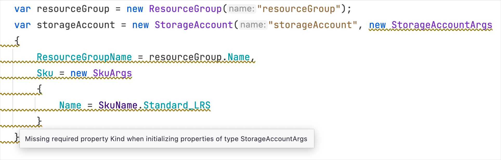
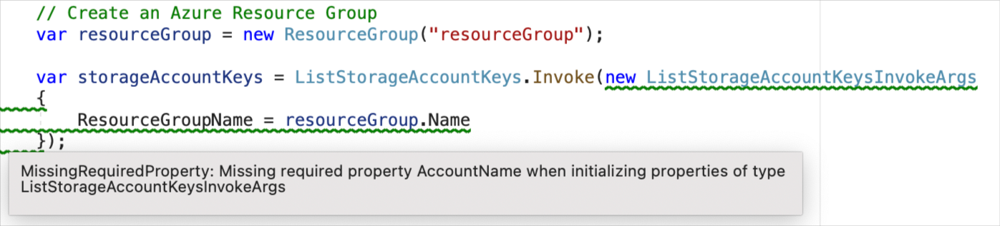
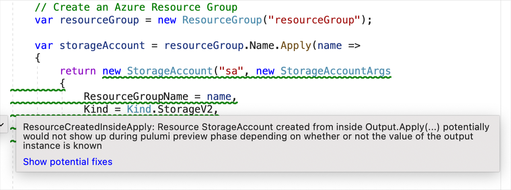

When I started using Pulumi for the first time, I used C# as my language of choice for defining infrastructure. I start by creating resources and providing their parameters through argument objects. The IDE helps me out with auto-completions and type errors as I go but the compiler didn't always detect some of the errors I eventually came across.

<!--more-->

Consider the following piece of code:

```cs
var resourceGroup = new ResourceGroup("resourceGroup");
var storageAccount = new StorageAccount("storageAccount", new StorageAccountArgs
{
    ResourceGroupName = resourceGroup.Name,
    Sku = new SkuArgs { Name = SkuName.Standard_LRS }
});
```

In this snippet, I create a resource group in Azure, then create a storage account that belongs to that resource group. Pretty simple stuff! The IDE tells me that the code is good and doesn't report any errors but just to be sure everything is as it should be, I build the project and the code compiles successfully. Now I am confident and ready to deploy the infrastructure.

I run `pulumi preview` and to my surprise, it fails. The C# program throws an exception at runtime:

```
Diagnostics:
  pulumi:pulumi:Stack (AzureExample-dev):
    error: Running program '/Users/zaid/projects/AzureExample/bin/Debug/net6.0/AzureExample.dll' failed with an unhandled exception:
    System.ArgumentNullException: [Input] Pulumi.AzureNative.Storage.StorageAccountArgs.Kind is required but was not given a value (Parameter 'Kind')
```

What happened? It turns out I didn't provide a required property `Kind` when instantiating the type `StorageAccountArgs` for the `StorageAccount`.

This is an unfortunate result because I had expected that when my  program compiled, that it was valid and ready to deploy.

In this case, the fix is simple:

```cs
var storageAccount = new StorageAccount("storageAccount", new StorageAccountArgs
{
    ResourceGroupName = resourceGroup.Name,
    Sku = new SkuArgs { Name = SkuName.Standard_LRS },
    // adding this property
    Kind = Kind.StorageV2
});
```

There is a bigger problem in the API of the resource creation. The compiler should tell you at compile-time that you missed a required property. The underlying cause is because we are using property initializers for `StorageAccountArgs` with a _parameterless_ contructor. This is the case when creating _any_ resource across the cloud providers available in the Pulumi ecosystem.

> See [Pulumi #3808](https://github.com/pulumi/pulumi/issues/3808) for more details and discussion on this issue.

What can we do to fix the problem?

First solution that comes to mind is to fix the generated .NET API for each cloud provider available with Pulumi: adding the required parameters as part of the contructor of arguments type and removing the _parameterless_ contructor.

This however means introducing a breaking change for each and every existing C# program running with Pulumi using the empty constructor. Here at Pulumi, we want to ensure that changes to our APIs are backward-compatible, so this is a no-go.

The problem above looks like the compiler _could_ have detected if it somehow knew which properties were required or and which were optional. In the case of the generated APIs, this requiredness information is only encoded on properties with a special attribute `[Input("propertyName", required: true)]` which unfortunately is Pulumi-specific and the compiler has no way of detecting it and reporting an error or a warning to the developer at compile-time.

## Solution

What do we do? Static code analysis to the rescue! If the compiler can't do it, we can build an extension and have detect these types of errors for the developers.

Enter [PulumiCSharpAnalyzer](https://github.com/Zaid-Ajaj/pulumi-csharp-analyzer): a Roslyn-based code analyzer that adds compile-time checks to your Pulumi code and reports it as part of the build.

Available today as a NuGet package, you can install the analyzer into your project as follows:

```
dotnet add package PulumiCSharpAnalyzer
```

Now your IDE, whether that is Rider, Visual Studio or VS Code with OmniSharp should report the error inside the IDE like any compile error or warning. Here is for example how it looks like inside Rider:



Not just your IDE, it integrates into your build pipeline too. When you `dotnet build` your project, the detected errors will show up there:

```bash
> dotnet build
Microsoft (R) Build Engine version 17.2.0+41abc5629 for .NET
Copyright (C) Microsoft Corporation. All rights reserved.

  Determining projects to restore...
  All projects are up-to-date for restore.
/Users/zaid/projects/AzureExample/Program.cs(11,63): warning MissingRequiredProperty: Missing required property Kind when initializing properties of type StorageAccountArgs [/Users/zaid/projects/AzureExample/AzureExample.csproj]
  AzureExample -> /Users/zaid/projects/AzureExample/bin/Debug/net6.0/AzureExample.dll

Build succeeded.
```

Besides detecting missing properties when creating resources, the analyzer also detects missing properties for function invokes which follow a similar pattern:



Finally, an anti-pattern that the analyzer can detect is creating resources within an `.Apply(...)` call:



We always recommend developers to avoid creating resources inside `.Apply(...)` calls because the execution plan of Pulumi will be different during the `pulumi preview` and `pulumi up` phase.

The reason is that when we have an instance of `Output<T>` from which we call `Apply`, the value of the instance is most likely _unknown_ during `pulumi preview` since it is only computed when Pulumi actually performs the deployment plan against APIs of cloud providers.

## Limitations

With the current features of the analyzer, it is already usable across all cloud provider SDKs. That said, there are limitations to the way the analyzer works. At the moment, when determining the missing properties, the logic only detects initialized properties when creating the object and diffs those against the required properties from the schema. This means that if you happened to use property _setters_ instead of property initializers, they are considered "not provided" and will report a warning. For example, the following piece of code will produce a false-positive warning...

```cs
var storageAccountArgs = new StorageAccountArgs();
storageAccountArgs.ResourceGroupName = resourceGroup.Name;
storageAccountArgs.Kind = Kind.StorageV2;
storageAccountArgs.Sku = new SkuArgs { Name = SkuName.Standard_LRS };
```

...even though it is logically equivalent to

```cs
new StorageAccountArgs
{
    ResourceGroupName = resourceGroup.Name,
    Kind = Kind.StorageV2,
    Sku = new SkuArgs
    {
        Name = SkuName.Standard_LRS
    }
};
```

This is something I will be working on in the near future and the fix is relatively doable, but it is just a heads-up that the analyzer is not perfect at the moment.

## Conclusion

Install the [analyzer](https://github.com/Zaid-Ajaj/pulumi-csharp-analyzer) today in your C# Pulumi projects and get better static-code analysis in your Pulumi projects. Keep in the mind the limitations outlined above and let us know if you encounter issues that we didn't take into account before.
