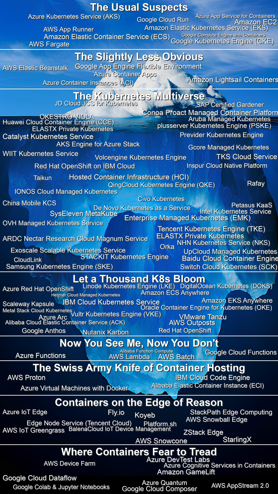

If a computer can be connected to the internet, someone has tried to run a [container](https://www.pulumi.com/containers) on it. From quantum computers to smart toasters, from phones in AWS racks to CI pipelines, there's many ways to deploy containers. While most people only know about the mainstream cloud providers at the surface, there's actually a vast world of increasingly unusual and specialized options beneath.

This guide serves two purposes: to showcase the surprising breadth of container options available today, and to help you understand the full spectrum of choices – from practical to very experimental. Whether you're looking for production-ready solutions or just curious about what's out there in the dark depths, you'll find something interesting here.

<!--more-->

## Constraints

But first, we need ground rules for our container adventures. All listed items should:

- **Technically possible:** Must work today with existing tech, even if the setup makes you question your life choices.
- **Runs real containers:** OCI containers only. No JavaScript "containers" pretending to be the real thing.
- **Actually doable:** You can set this up right now with a laptop and a credit card. No theoretical schemes allowed.

## Above the iceberg – The usual suspects

These are the familiar faces of container orchestration—the ones you'd introduce to your parents. Reliable, well-documented, and about as exciting as watching paint dry.

- **Amazon Elastic Kubernetes Service (EKS)**
- **Amazon Elastic Container Service (ECS)**
- **AWS Fargate**
- **Azure Kubernetes Service (AKS)**
- **Google Kubernetes Engine (GKE)**
- **Google Cloud Run**
- **Amazon EC2**
- **AWS App Runner**
- **Azure App Service for Containers**
- **Google Compute Engine with Containers**

## On the iceberg – The slightly less obvious

As we dip just below the surface, we find services like a rare B-side acoustic release from a big band. It's not as mainstream but still a respectable choice for running your containers.

- **AWS Elastic Beanstalk** – Deploy containers, debug YAML
- **Amazon Lightsail Containers** – AWS with the guard rails on
- **Azure Container Apps** – Serverless, but complicated
- **Google App Engine Flexible Environment** – PaaS for Containerized Apps
- **Azure Container Instances (ACI)** – Kubernetes without the chaos

## The kubernetes multiverse – Because one Universe of k8s wasn't enough

Diving deeper, we discover there's an entire multiverse of regional and specialty K8s providers, helpfully cataloged [by the CNCF](https://landscape.cncf.io/guide#platform--certified-kubernetes-hosted
). Think parallel universes, but instead of evil twins, you get slightly different container runtime implementations.

- **The Global Titans** – The international tech giants couldn't resist joining the K8s party: Huawei Cloud Container Engine, Tencent, and Baidu bring their own flavor of cloud-native orchestration to the mix. Add in Samsung, China Mobile KCS, JD Cloud, Inspur, and QingCloud, and you have enough options to start a diplomatic incident.

- **The European Union of Containers** – Europeans take their container privacy seriously: IONOS and plusserver bring German engineering to K8s, OVH adds French flair, Exoscale offers Swiss precision, and STACKIT, SysEleven, WIIT, Gcore, and Previder ensure your containers comply with every possible EU regulation. Conoa Proact throws in some Swedish design principles for good measure.

- **The Asia-Pacific Pod Party** – The APAC region isn't missing out: NHN brings Korean optimization to your clusters, while ARDC Nectar and Catalyst let you run containers upside down in Australia and New Zealand. TKS Cloud Service ensures your containers can run anywhere from Tokyo to Tasmania.

- **The Specialists' Society** – For when regular K8s isn't quirky enough: OKESTRO VIOLA orchestrates your containers with musical flair, while Petasus, De Novo, Aruba, and Taikun provide enough specialty K8s options to ensure every cluster is a unique snowflake.

## Below the water – Kubernetes everywhere – Let a thousand K8s bloom

Let's plunge deeper. Because one Kubernetes cluster is never enough, why not sprinkle them everywhere? On-premises, in the cloud, under your desk—there's a K8s solution for all that.

- **Amazon EKS Anywhere** – AWS container but in your own data center
- **Amazon ECS Anywhere** – Like EKS Anywhere but ECS
- **Azure Arc** – Hybrid cloud for masochists
- **Google Anthos** – Hybrid cloud something something
- **AWS Outposts** – AWS, now with hardware shipping delays
- **Azure Red Hat OpenShift** – Azure but with a fedora
- **VMware Tanzu** – Because VMware heard you like Kubernetes
- **Red Hat OpenShift** – Fedoras on AWS
- **IBM Cloud Kubernetes Service** – Kubernetes with a touch of enterprise nostalgia
- **Oracle Container Engine for Kubernetes (OKE)** – For the brave souls trusting Oracle
- **Alibaba Cloud Elastic Container Service (ACK)** – K8s with Chinese characteristics
- **DigitalOcean Kubernetes (DOKS)** – K8s in the ocean, hopefully no sharks
- **Linode Kubernetes Engine (LKE)** – Lightweight K8s for the minimalist
- **Vultr Kubernetes Engine (VKE)** – Yet another place to run your pods
- **Scaleway Kapsule** – French elegance meets Kubernetes
- **Hetzner Cloud Managed Kubernetes** – German engineering for your clusters
- **Nutanix Karbon** - Because regular Kubernetes wasn't converged enough
- **Metal Stack Cloud Kubernetes** - For when virtual machines are too virtual



## Middle of the iceberg – Serverless and function containers – Now you see me, now you don't

As we descend to the depths, we find containers with commitment issues. They appear, do their job, and disappear.

- **AWS Batch** – Containers that only work the night shift
- **AWS Lambda** – Lambda's containers for when a 250 MB zip file wasn't enough baggage.
- **Azure Functions** – Roll your own functions in containers and hope for the best.
- **Google Cloud Functions** – Containers pretending to be functions, but now on Google Cloud.
- **Alibaba Function Compute** – You get the idea.

## Bottom of the iceberg – Specialized and hybrid platforms – The swiss army knife of container hosting

Down here, containers run in ways that make people question your life choices. These platforms let you host containers in environments many fear to tread.

- **AWS Proton** – Automate your deployments and run a container
- **Azure Virtual Machines with Docker** – When you miss managing servers but love containers
- **IBM Cloud Code Engine** – Run anything, anywhere, if you can figure it out
- **Alibaba Elastic Container Instance (ECI)** – Containers that disappear faster than you can say "Jack Ma"

## Below the iceberg – Containers on the edge of reason

In these lightless depths, you want your containers to live life on the edge—literally. Because nothing says "enterprise-ready" like running production workloads on a smart toaster.

- **AWS IoT Greengrass** – Run AWS Lambda and Docker containers on everything from factory equipment to smart fridges. Nothing says "digital transformation" like your smart fridge running machine learning models.
- **Azure IoT Edge** – Like Greengrass, but only when your toaster prefers Windows updates.
- **AWS Snowball Edge** – For when 'cloud migration' means paying FedEx to move your containers. Yes, it's literally a box they mail you that can run containers.
- **AWS Snowcone** – An even smaller box that runs just enough containers to make you appreciate your data center. Perfect for when you need AWS in places where AWS doesn't want to build a region.
- **BalenaCloud IoT Device Management** – A platform that lets you remotely deploy and manage containers on fleets of Raspberry Pis. Because nothing says "enterprise IoT" like running your production stack on $35 computers.
- **Fly.io** – Global Edge Container Deployment, because apparently just picking one region was too simple.
- **Edge Node Service (Tencent Cloud)** – Edge deployment behind great firewall.
- **StackPath Edge Computing** – More edge containers.
- **Koyeb** – Serverless Edge containers.
- **Platform.sh** – Multi-Cloud Edge containers.
- **StarlingX** - Edge computing platform for when 5G and IoT buzzwords aren't enough
- **ZStack Edge** - Edge computing with Chinese characteristics, now at the edge of the network, too

## The abyss – Where containers fear to tread

And now we reach the darkest depths. For the bravest souls who look at conventional container platforms and think, "Not edgy enough." Here lie the most unusual ways to run containers in production.

- **Amazon GameLift** – Run your containerized services disguised as game servers. High scores may apply.
- **AWS Device Farm** – Deploy containers on hundreds of actual phones in AWS racks. Perfect for when "mobile-first" goes too far.
- **AWS AppStream 2.0** – Stream Windows to run Docker to stream containers. It's virtualization all the way down.
- **Google Cloud Dataflow** – Hide containerized services in pipeline steps named "daily_data_normalize_37". Hope your SRE enjoys debugging ETL.
- **Google Cloud Composer** – Your containerized microservice masquerades as an Airflow DAG. Because nothing says reliability like cron.
- **Google Colab & Jupyter Notebooks** – Run containers in `data_preprocessing_step.ipynb`. Watch ML teams debug production.
- **Azure Quantum** – Package quantum containers with `az quantum job submit`. Now, your uptime is truly uncertain.
- **Azure Cognitive Services in Containers** – Offline AI containers that promise not to become self-aware. Terms and conditions may apply.
- **Azure DevTest Labs** – Run containerized test environments that self-destruct like Mission Impossible tapes. Perfect for when temporary becomes permanent.

## Beyond the abyss

There you have it, the container iceberg. And I didn't even have room to add the extra cursed ways you can run containers. Here is some of what didn't make it:

- **Cloud IDEs and Workspaces** – Want to turn your development environment into a sneaky container platform? Take your pick: GitHub Codespaces, GitPod for the GitLab enthusiasts, or Eclipse Che for the masochists who miss Eclipse crashing locally. JetBrains Space or Replit? All this lets you run a container until you close your browser tab.

- **GitHub Actions et al.** – Ever wanted to run a production service disguised as a CI job? Just label your production API start-up script as "integration_test_step_42", add a `sleep 21600` and a call to retrigger itself, and hope nobody notices your "test" has been running for months. Apply this same trick to AWS CodeBuild, GitLab CI/CD, CircleCI, Azure Pipelines, Travis CI, Bitbucket Pipelines, Drone CI, Jenkins Cloud, TeamCity Cloud, and Google Cloud Build for Bonus points.

## Managing your container zoo with pulumi

Whether you're deploying containers to mainstream cloud providers or attempting to run them on quantum computers (really, please let us know how that goes), Pulumi helps you manage it all with real code instead of config file soup. Our [Kubernetes support](/registry/packages/kubernetes/) means you can wrangle your containers wherever they might roam – from AWS to Azure, GCP to Kubernetes, or even that smart toaster you're eyeing for production deployment.

With Pulumi, you get:

- [Cloud-native container orchestration](https://www.pulumi.com/registry/) across all major platforms and Kubernetes distributions
- [Infrastructure testing](/docs/iac/concepts/testing/) to ensure your containers deploy correctly (even in the weird places)
- [Provider templates](/blog/pulumi-go-boilerplate-v2/) for when you invent yet another way to run containers
- [Stack references](/docs/concepts/stack/#stackreferences) for managing multiple environments without losing your mind
- [Automation API](/docs/iac/packages-and-automation/automation-api/) for programmatically herding your container fleets

Ready to bring some sanity to your container deployment strategy? Get started with Pulumi:



## The final word

At this point, **105** options in, you might wonder: "Has cloud container hosting gone too far?" Well, I've a solution to propose:

At Pulumi, we've got providers for [all](https://www.pulumi.com/registry/packages/aws/api-docs/provider/) [the](https://www.pulumi.com/registry/packages/azure-native/) [usual](https://www.pulumi.com/registry/packages/gcp/) [suspects](https://www.pulumi.com/registry/packages/kubernetes/) and, surprisingly, many more in this container circus. And if you've figured out how to run containers on a quantum computer inside a data pipeline in New Zealand, you can write [a provider](https://github.com/pulumi/pulumi-provider-boilerplate/) for that, too.

So, use Pulumi and we will figure out how *RedHat-Tanzu-Greengrass-Icecore-Device-Farm* works and provide you a sane interface to it. You've got other things to worry about.
