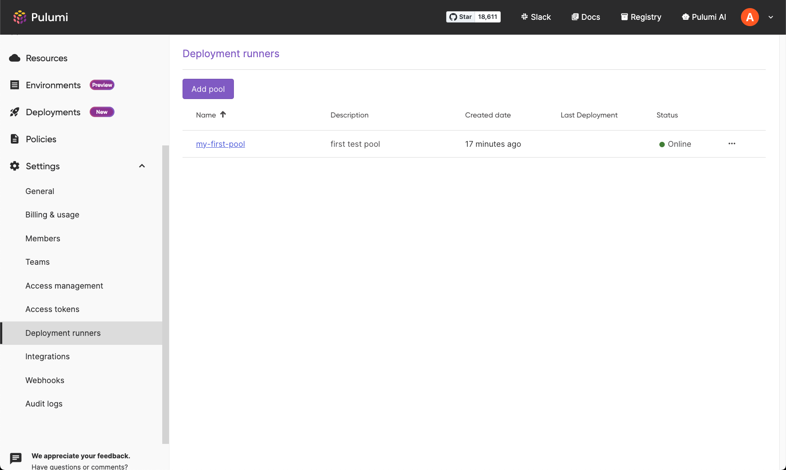
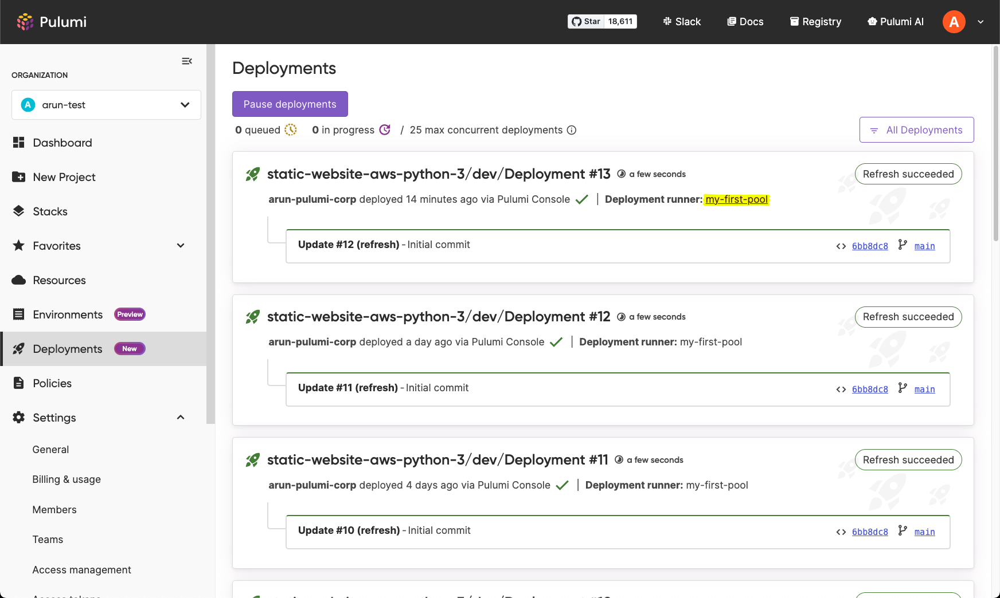

At Pulumi, we constantly strive to build solutions that not only simplify infrastructure management but also align with the diverse and specific needs of our customers. To that end, we're thrilled to announce the general availability of Customer-Managed Agents for Pulumi Deployments.

<!--more-->

## Primer on Pulumi Deployments

[Pulumi Deployments](/docs/pulumi-cloud/deployments/) is a fully managed platform for managing infrastructure at scale, providing easy-to-use building blocks that can be used as a simple CI/CD platform or to build a sophisticated self-serve platform to support thousands of engineers. [Traditional CI/CD platforms](/docs/pulumi-cloud/deployments/versus) focus on Git-push workflows which fall short when managing infrastructure where the same code base is used to create new infrastructure with no explicit Git-push event.  Pulumi Deployments goes beyond the Git-push based workflows to offer deployment triggers based on the [Pulumi Deployments REST API](/docs/pulumi-cloud/deployments/api), [click to deploy](/docs/pulumi-cloud/deployments/reference/#click-to-deploy) in the Pulumi Cloud console, [Review Stacks](/docs/pulumi-cloud/deployments/review-stacks), [remote Automation API](/docs/using-pulumi/automation-api), and many more features to come.

Since its launch, Pulumi Deployments has transformed how organizations manage their infrastructure, offloading the execution of Pulumi infrastructure as code (IaC) actions --- such as previews, updates, destroys, and refreshes --- to Pulumi Cloud. Our customers have used it to deploy and manage mission-critical services, driving efficiencies and reducing the operational burden of deploying and managing infrastructure.

## Deploy on Your Terms: Launching Customer-Managed Agents

With the launch of Customer-Managed Agents, you can now self-host the deployment agents within your infrastructure, bringing the same power and flexibility of Pulumi-hosted deployments to isolated environments. Customers with hard security and compliance requirements can now fully leverage Pulumi Deployments.

Newton, a leading crypto trading platform and a Pulumi Cloud customer, was in the private beta of Customer-Managed Agents. “Pulumi's rapid innovation and customer-centric approach never fail to impress. The introduction of Customer-Managed Agents is a testament to their ongoing commitment,” said Shaun Martin, Director of Engineering at Newton. “We're thrilled with the turnkey solutions Pulumi Deployments offer, enhancing our infrastructure management while upholding our stringent security requirements.”

## Key Benefits of Customer-Managed Deployment Agents

- **Host anywhere**: You can host the deployment agents anywhere to manage infrastructure, even within your fully private VPCs
- **Any hardware, any environment<sup>1</sup>**: Run the agents on any hardware of your choice and configure the environment that meets your needs
- **Mix & match**: You can use standard Pulumi-hosted deployments for your development stacks and use self-hosted Customer-Managed Agents for your private network infrastructure. You can mix and match to suit your unique needs
- **Multiple pools**: You can set up multiple deployment agent pools, assign stacks to specific pools, and scale agents dynamically to increase your deployment concurrency. Customers can have up to 150 concurrent deployments
- **Meet compliance**: You can configure the agents with the credentials needed to manage your infrastructure. This way your cloud provider credentials never leave your private network

<sup>1</sup> *Currently Linux and MacOS are supported*

Customer-Managed Agents support all the deployment triggers currently offered by Pulumi Deployments such as click to deploy, the Pulumi Deployments REST API, Git push to deploy, Review Stacks, and remote Automation API.

{}
Customer-Managed Agents is available on the Business Critical edition of Pulumi Cloud. [Contact sales](/contact/?form=sales) if you are interested and want to enable Customer-Managed Agents. If you are a self-hosted Pulumi Cloud customer, please [get in touch](https://share.hsforms.com/1YajiJ73sSuGn5RoTkyvKxg2mxud) to be notified when it is available.
{}

## How to get started

Before you begin, ensure you have installed the [Pulumi Github App](/docs/iac/packages-and-automation/continuous-delivery/github-app/) and update the [source control settings](/docs/pulumi-cloud/deployments/get-started). [Docker](https://docs.docker.com/engine/) is a requirement for the agent.

### Install and configure the agent

Go to **Deployment runners** under Organization Settings in the left-hand navigation menu. Once on the Deployment runners page, choose **Add a new pool**. Next, provide a name and description for your agent. You will then get a new access token for the pool. Be sure to copy and save this token in a secure location.



Download and install the agents using the command provided. Once installed, provide the access token previously copied to configure the agent.


If you run into issues, ensure docker is running before you configure and start the agents. Ensure you restart or refresh the shell session (example: `source ~/.zshrc`).




Now your first agent should be up and running! You can verify the status of the agent by refreshing the page. Additionally, you can use the same token to set up multiple agents to increase concurrency of your deployments and they will be assigned to the same pool.



Agents poll Pulumi Cloud every 30 seconds to check for pending deployments. In the pool page, you can see the last online status of the agents. Agents will disappear from the list after 1-2 hours of being offline. If you are running the agent inside a firewall ensure to allow outbound requests to api.pulumi.com.

### Configure Stack

Go to deployment settings, found under the settings tab on a stack under 'Deploy'. Scroll down and select the pool you created under the Deployment Runner pool drop-down.



Ensure that agents have the cloud provider credentials to be able to deploy in your environments. You have two methods:

1. Use [OpenID Connect (OIDC) to generate credentials](/docs/pulumi-cloud/oidc)
2. Directly provide credentials to agents through environment variables configured in the host, or passing the environment variables when invoking the binary. Example:

   ```bash
   VARIABLE=value customer-managed-deployment-agent run
   ```

   You also need to update the `pulumi-deployment-agent.yaml` configuration file by setting `env_forward_allowlist`. The configuration file can be found in the directory where the agent is extracted. `env_forward_allowlist` expects an array of strings. Example:

    ```yaml
    token: pul-d2d2….
    version: v0.0.5
    env_forward_allowlist:
        - key_one
        - key_two
        - key_three
    ```

### Verify setup

You have completed the setup. Try out the agent by doing `pulumi refresh` through the **Actions** drop-down in your stack page.



You should see the logs in the agent running on the machine you configured and also in the Pulumi Cloud console.

On the deployments page, you can see all the deployments including pending deployments, and which deployment agents were used in a deployment.



## Your Journey, Our Support
Customer-Managed Agents empower you to align your deployment strategies with the specific requirements of your infrastructure. Whether it's ensuring compliance, enhancing security, or customizing deployment processes, Customer-Managed Agents provide the flexibility you need.

Embark on this journey to simplify your infrastructure deployments with our new feature. We are here every step of the way to assist you. Share any feedback in the [Pulumi Cloud Requests repository](https://github.com/pulumi/pulumi-cloud-requests/issues/new/choose) with us.
