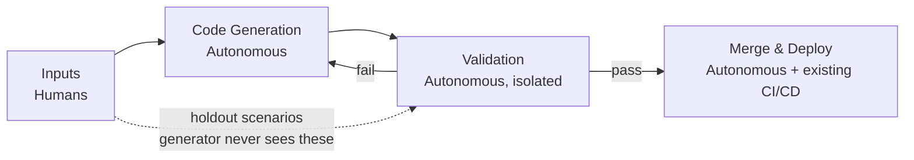

The original dark factory was Fanuc's robotics plant in Japan, where the lights are off because nobody is on the floor. Robots build robots. Parts move through the line for weeks at a time without a person walking past them.

The same pattern is now showing up in software. Stripe is reportedly shipping over [1,300 AI-authored pull requests per week](https://www.mindstudio.ai/blog/what-is-a-dark-factory-ai-coding). StrongDM has [a three-engineer team](https://simonwillison.net/2026/Feb/7/software-factory/) that has stopped writing code by hand. A [HackerNoon writeup from February](https://hackernoon.com/the-dark-factory-pattern-moving-from-ai-assisted-to-fully-autonomous-coding) gave the pattern a clean name and a five-level autonomy ladder. BCG started calling it [the dark software factory](https://www.bcgplatinion.com/insights/the-dark-software-factory).

Almost every public writeup is about application code. The harder question, and the one I want to walk through here, is what this looks like for infrastructure.

<!--more-->

## What a dark factory actually is

The working definition I like most comes from the HackerNoon piece: "no human writes code, no human reviews code, no human manually tests code. Humans write specs and acceptance criteria. That's it."

That sounds extreme until you put it on a ladder. The same article borrows the autonomy framing from self-driving cars:

| Level | What it looks like |
| ----- | ------------------ |
| 1 | AI finishes your sentences. You do everything else. |
| 2 | AI writes whole files. You review every change. |
| 3 | AI generates from specs. Acceptance scenarios gate quality. You approve the merge. |
| 3.5 | Same as 3, except some services auto-merge. |
| 4 | Full dark factory. Specs go in, tested code comes out merged, your existing pipeline deploys it. |

Most teams I talk to are at Level 2. A few are at 3. The interesting design problems all live in the gap between 2 and 4, and that gap is where infrastructure becomes the hardest case.

A dark factory is not a coding harness. A harness measures how well a model performs against a benchmark. A dark factory uses a harness to ship product. Copilot and Cursor are something else again: those are interactive, the human stays in the loop on every keystroke. The dark factory takes the human out of the per-change loop and puts them at the top, writing the spec and the acceptance criteria.

## The four layers and the wall between two of them

Strip the dark factory down to its layers and there are four of them.



The layer that does the work is Code Generation. The layer that decides if the work is good is Validation. The single most important design rule, lifted straight from how machine learning models get evaluated, is that those two layers must be isolated from each other. The generator never sees the acceptance scenarios. A separate evaluator does, and it judges the generator's output against scenarios the generator could not have memorized.

The HackerNoon piece calls these holdout scenarios: plain-English BDD acceptance tests in a directory the coding agent has no access to. Each scenario runs three times against an ephemeral deployment, two of three must pass, and the overall pass rate has to clear 90% before the PR can move forward. If the generator fails, it gets a one-line failure message ("SQL Injection Detection failed: endpoint returned 500"), not the scenario text. It cannot game the test.

Without that wall, you don't have a quality gate. You have theater.

## Why infrastructure is the hardest dark factory to build

Application code factories can lean on tests, linters, and type checkers. Infrastructure adds blast radius, drift, secrets, irreversible actions, and multi-region state. A failed application deploy rolls back. A failed infra change can leak data, drop a database, or burn a budget overnight.

Three things make this manageable on Pulumi specifically.

First, Pulumi already has a trustworthy context lake built in. The state file and the program graph are the source of truth for what is actually deployed. I covered this angle in [Grounded AI: Why Neo Knows Your Infrastructure](/blog/grounded-ai-why-neo-knows-your-infrastructure/). For a dark factory, that same context lake is what the validator reads when it asks "did this change actually do what the scenario asked for?"

Second, the orchestrator does not need to be invented. The [Pulumi Automation API](/automation/) gives you the engine as an SDK in Python, TypeScript, Go, .NET, Java, or YAML. The same primitives you use to build a developer portal are the primitives a dark factory orchestrator runs on.

Third, the governance pieces are already wired up. [Pulumi ESC and OIDC](/docs/esc/) issue short-lived credentials per run, so the agent never sees a long-lived secret. [CrossGuard](/docs/iac/using-pulumi/crossguard/) enforces deterministic policy at preview time. [Pulumi Cloud Deployments](/docs/pulumi-cloud/deployments/) acts as the governed runner, so agents submit changes as diffs that get applied inside your boundary, not from a laptop. [Pulumi Neo](/product/neo/) does the grounded reasoning and ships with three modes (Auto, Balanced, Review) that map cleanly onto Levels 3, 3.5, and 4. I wrote about the wider governance picture in [Agent Sprawl Is Here](/blog/agent-sprawl-iac-platform-is-the-answer/); the dark factory is what you point that governance at.

Mapped onto the four layers:

| Layer | Pulumi primitive |
| ----- | ---------------- |
| Inputs | Stack spec + holdout scenarios + [`AGENTS.md`](/blog/pulumi-neo-now-supports-agentsmd/) per repo |
| Code Generation | An agent (Neo, Claude Code, your choice) reading the spec, writing Pulumi code, running `pulumi preview`, opening a PR |
| Validation | CrossGuard (deterministic) + an isolated LLM evaluator that runs holdout scenarios against an ephemeral preview stack |
| Merge & Deploy | Pulumi Cloud Deployments running `pulumi up` with ESC-issued credentials |

## A minimal Python orchestrator

Here is the smallest useful version. It selects a stack, runs `preview()`, hands the preview to an isolated validator (the wall lives here), and branches on the verdict. The `validate_holdouts` function is a stub. In practice it is a separate process that never sees your generator's prompt or output, only the preview diff and the cloud state after the change.

```python
from dataclasses import dataclass
from enum import Enum
from pulumi.automation import LocalWorkspace, Stack


class Verdict(Enum):
    AUTO_APPLY = "auto_apply"
    REQUEST_APPROVAL = "request_approval"
    OPEN_PR_FOR_HUMAN = "open_pr_for_human"


@dataclass
class TaskSpec:
    project: str
    stack: str
    work_dir: str


def validate_holdouts(preview_result) -> Verdict:
    # Isolated evaluator. Reads the preview, runs holdout scenarios
    # against an ephemeral copy of the stack, returns a verdict.
    # Generator never sees this code or the scenarios it executes.
    ...


def run(task: TaskSpec) -> str:
    stack = Stack.create_or_select(
        stack_name=task.stack,
        project_name=task.project,
        workspace=LocalWorkspace(work_dir=task.work_dir),
    )
    preview = stack.preview(on_output=print)
    verdict = validate_holdouts(preview)

    if verdict is Verdict.AUTO_APPLY:
        result = stack.up(on_output=print)
        return f"applied v{result.summary.version}"
    if verdict is Verdict.REQUEST_APPROVAL:
        # Hand off to Pulumi Cloud Deployments with a required approval rule.
        return submit_deployment(task, requires_approval=True)
    return open_pr_for_human(task, preview)
```

Three things to notice. The orchestrator never holds a credential; the workspace inherits ESC. Every branch records a Pulumi Cloud update version that you can trace in the audit log, so the trail is automatic. The autonomy mode is one branch in one function, which is exactly where you want it when you are dialing trust up or down per stack. (`submit_deployment` and `open_pr_for_human` are stubs in the same way `validate_holdouts` is — the integration shape, not the wire-up.)

## A four-phase rollout for IaC

The same phased approach the HackerNoon piece used for application code works for infrastructure, with the gates tightened.

### Phase 1: better context, this afternoon

Write an `AGENTS.md` for your most active stack repo. Pulumi Neo [reads it natively](/blog/pulumi-neo-now-supports-agentsmd/), as do most coding agents. Then look at your CrossGuard rules and rewrite the error messages as instructions, not descriptions. Not "S3 bucket has no encryption" but "S3 bucket has no encryption. Set `serverSideEncryptionConfiguration` with SSE-KMS to fix." That single change is the difference between an agent flailing and an agent fixing the policy violation on the first try. Wire `pulumi preview` as a build-before-push gate so PRs do not show up just to fail CI.

### Phase 2: spec-driven with holdouts, this week

Pick one stack with a small blast radius. A review-stack lifecycle is ideal. Write five plain-English holdout scenarios for it: "after `pulumi up`, the bucket is private, has SSE-KMS, lives in eu-west-1, and is tagged `owner=team-x`." Build a janky evaluator: a script that runs `preview` and `up` against an ephemeral stack, queries the cloud, and asks an LLM whether the resulting state satisfies the scenario. Humans still approve every PR. Do not auto-merge yet. You are earning the data, not declaring trust.

### Phase 3: take the human out of the merge

Only after the three measurable gates from the HackerNoon piece hold over twenty PRs (scenario pass rate above 90%, false positive rate below 5%, human override rate below 10%) flip auto-apply on for that one stack. Add quality-maintenance agents: a weekly `pulumi refresh` that opens a cleanup PR if drift appears, going through the same scenario gate as everything else.

### Phase 4: lights out

Expand the auto-apply flag to every stack with strong scenario numbers. Wire your issue tracker so tickets tagged `infra:fix` auto-generate specs and flow through the pipeline. Add digital twins (localstack-backed mocks) for the cloud APIs that are slow or flaky enough to make scenario evaluation expensive. At this point the orchestrator is configuration, not architecture.

## What could go wrong

The validator approves a bad change. This is the obvious one and the answer is the same one StrongDM uses for code: triple-run with a 2-of-3 threshold, a 90% pass gate over the run set, a human audit of the first fifty auto-applied changes, and your existing CrossGuard policies still run after the validator says yes.

The agent gets a destroy permission it should not have. The fix is mechanical: ESC environments scope what each agent identity can do, and Pulumi Cloud Deployments approval rules force a human checkpoint on anything destructive. Start every stack at Review mode and only promote when you have data.

Costs blow up. Cap retries at three per spec, alert on token spend per run, and remember that StrongDM reported roughly $1,000 per day per engineer-equivalent. That is still cheaper than a salary, but only if you put the cap in place before you find out.

## Where to start

Most of what a dark factory needs is already in the box: the state graph is the context lake, the Automation API is the orchestrator SDK, ESC and OIDC are the pre-cleared credentials, CrossGuard is the deterministic validator, Deployments is the governed runner, the Pulumi Cloud audit log is the review trail, Neo is the grounded reasoning agent. The interesting work is not building the factory. It is writing the holdout scenarios that make the wall between generator and validator mean something.

If you want to try this, write an `AGENTS.md` and five holdout scenarios for one stack this week. That is enough to get a real signal on whether the pattern fits your team. The rest of it is the same problem the application-code factories have already solved, with the gates set tighter.
