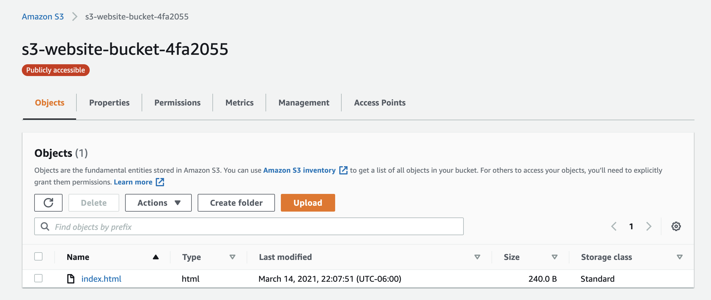
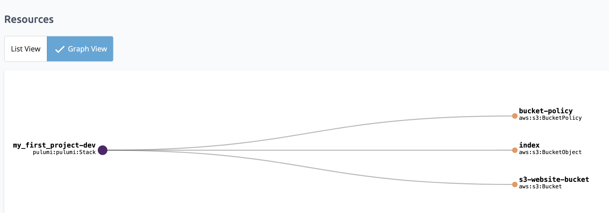
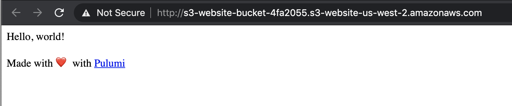

Data scientists typically work locally whether they use R or Jupyter notebooks. However they often store the input data for analyses and models in the cloud. The advantages for using cloud resources is apparent, i.e., managed storage and databases, low cost hosting of large data sets, and on demand availability of data. Many cloud providers offer SDKs for the APIs of cloud resources. For example, AWS offers the Python library, `boto3`, for creating and working with resources.

Although these libraries are useful, a data scientist must know how to create and manage cloud resources in addition to performing data science. The Pulumi Automation API changes this model and let's data scientists do their work without having to become versed in cloud APIs.

<!--more-->

## How Pulumi Automation API Improves on Cloud SDKs

Pick any cloud provider and you will find a cloud SDK in various languages, for example [AWS SDKs](https://aws.amazon.com/tools/), [Azure SDKs](https://azure.microsoft.com/en-us/downloads/), and [Google Cloud SDKs](https://cloud.google.com/sdk). These SDKs directly access cloud resources, letting data scientists provision resources as required. The drawback to using these libraries is that the data scientist is also responsible to provision resources reliably and securely, in addition to performing modeling and analysis.

Pulumi reduces the burden of creating and maintaining repeatable and robust deployments by providing uptodate language runtimes, concurrency management, support for diffing updates, and maintaining state with robust checkpoints. Your infrastructure will always be in a well defined and recoverable state.

[Automation API](https://github.com/pulumi/automation-api-examples) takes this one step further by providing an API overlay to Pulumi's Infrastructure as Code engine. A data scientist can build infrastructure programmatically within Jupyter to automate building and creating infrastructure as functions that they can call as needed. Let's take a look at two example Jupyter notebooks.

## Infrastructure as a function

The [first example](https://github.com/pulumi/automation-api-examples/blob/main/python/pulumi_via_jupyter/automation_api.ipynb) is a simple overview of Automation API that demonstrates a basic deployment of a static website from within a Jupyter notebook. This example uses an inline program to define infrastructure within a function alongside your other code. The function called `s3_static_site`, creates an s3 bucket, sets it up as a basic static website, and exports the URL. This is the equivalent of creating a Pulumi [stack]() using the CLI.

```python
from pulumi_aws import s3

def s3_static_site():
    # Create a bucket and expose a website index document
    site_bucket = s3.Bucket("s3-website-bucket", website=s3.BucketWebsiteArgs(index_document="index.html"))
    index_content = """
    <html>
        <head><title>Hello S3</title><meta charset="UTF-8"></head>
        <body>
            <p>Hello, world!</p>
            <p>Made with ❤️ with <a href="https://pulumi.com">Pulumi</a></p>
        </body>
    </html>
    """

    # Write our index.html into the site bucket
    s3.BucketObject("index",
                    bucket=site_bucket.id,  # reference to the s3.Bucket object
                    content=index_content,
                    key="index.html",  # set the key of the object
                    content_type="text/html; charset=utf-8")  # set the MIME type of the file

    # Set the access policy for the bucket so all objects are readable
    s3.BucketPolicy("bucket-policy", bucket=site_bucket.id, policy={
        "Version": "2012-10-17",
        "Statement": {
            "Effect": "Allow",
            "Principal": "*",
            "Action": ["s3:GetObject"],
            # Policy refers to bucket explicitly
            "Resource": [pulumi.Output.concat("arn:aws:s3:::", site_bucket.id, "/*")]
        },
    })

    # Export the website URL
    pulumi.export("website_url", site_bucket.website_endpoint)
```

We can write additional functions to [deploy and destroy](https://nbviewer.jupyter.org/github/pulumi/automation-api-examples/blob/main/python/pulumi_via_jupyter/automation_api.ipynb#Automating-your-deployment) the S3 static website. We deploy the stack by calling the `deploy_project` function and pass it the the s3_static_site function, the Pulumi AWS plugin, and the AWS region.

```python
s3_site = deploy_project("my_first_project",
                         s3_static_site,
                         plugins=[("aws", "v3.23.0")],
                         config={"aws:region": auto.ConfigValue(value="us-west-2")})
```

You can view the resources that the function created in two ways. The common method is to open the AWS console to see your resources.



You can also view them with the Pulumi console as a resource graph.



The Pulumi console also displays updates to the static site and the changes made.


Now that the static site has been deployed, we want to get the site URL. The `s3_static_site` function exports the website url. Pulumi returns the s3_site as an object with [outputs]() that we use to retrieve the URL. There are several ways to check if the site is working, but a simple way is to open the URL in a web browser.

```python
import webbrowser

outputs = s3_site.outputs()

webbrowser.open(url)
```



## Data Science Your Way

In this simple example we demonstrated how to create a static website from an S3 bucket, write content into the bucket, and set the access policy as a Python function. We called the function which created a stack for the website. The stack is returned as a Python object with the site URL as an output. You can manage the site and view updates using the Pulumi console.

Because it's code you can create a separate module containing all the functions to create your infrastructure, import it into your notebooks, and reuse it. Pulumi lets you perform analysis and build models within a familiar environment while reducing the burden of managing infrastructure. The complete example can be found on [Github](https://github.com/pulumi/automation-api-examples/tree/main/python/pulumi_via_jupyter) including a Jupyter notebook for [database migration](https://github.com/pulumi/automation-api-examples/blob/main/python/pulumi_via_jupyter/database_migration.ipynb).

Be sure to watch our video that explains the code in greater detail.




