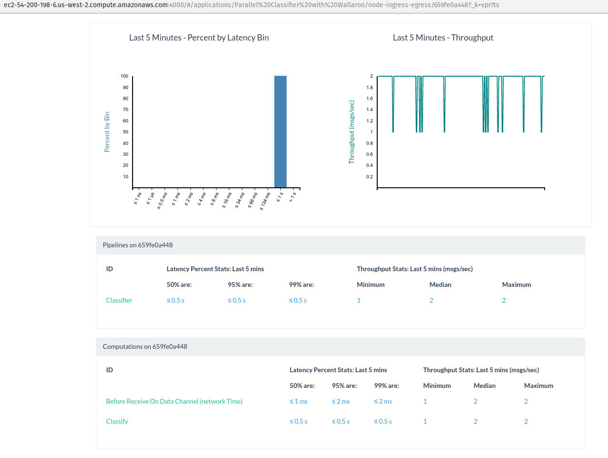

*This guest post is from Simon Zelazny of
[Wallaroo Labs](https://www.wallaroolabs.com/), and previously appeared on the
[Wallaroo Labs blog](https://blog.wallaroolabs.com/2018/10/spinning-up-a-wallaroo-cluster-is-easy/).
Find out how Wallaroo powered their cluster provisioning with Pulumi,
for data science on demand.*

## Oh no, more data!

Last month, we took a
[long-running pandas classifier](https://blog.wallaroolabs.com/2018/09/make-python-pandas-go-fast/)
and made it run faster by leveraging Wallaroo's parallelization
capabilities. This time around, we'd like to kick it up a notch and see
if we can keep scaling out to meet higher demand. We'd also like to be
as economical as possible: provision infrastructure as needed and
de-provision it when we're done processing.

If you don't feel like reading the post linked above, here's a short
summary of the situation: there's a batch job that you're running every
hour, on the hour. This job receives a CSV file and classifies each row
of the file, using a Pandas-based algorithm. The run-time of the job is
starting to near the one-hour mark, and there's concern that the
pipeline will break down once the input data grows past a particular
point.

In the blog post, we show how to split up the input data into smaller
dataframes, and distribute them among workers in an ad-hoc Wallaroo
cluster, running on one physical machine. Parallelizing the work in this
manner buys us a lot of time, and the batch job can continue processing
increasing amounts of data.
<!--more-->

Sure, we can handle a million rows in reasonable time, but what if the
data set grows by orders of magnitude? By running our classifier on a
local Wallaroo cluster, we were able to cut the processing time of a
million rows to ~16 minutes, thus fitting within our allotted time slot
of one hour. But if the input data is, say, 10x more, we're going to
have a hard time processing it all locally.

Let's see how we can keep up with the data growth by launching a
cloud-based Wallaroo cluster on-demand, running the job, collecting the
data, and shutting down the cluster, all in a fully automated fashion.

## Tools of the trade

Wallaroo's big idea is that your application doesn't have to know
whether it's running on one process, several local processes, or a
distributed system comprising many physical machines. In this sense,
there's no extra work involved in 'migrating' our classifier application
from the previous blog post.

We will need some tools to help us set up and manage our cluster in the
cloud. Wallaroo can work with a lot of different tools. Our friends at
Pulumi provide an excellent tool that removes the
headaches involved in provisioning infrastructure. We'll use Pulumi to
define, set up, and finally tear down our processing cluster in this
example.

We'll also need [Ansible](https://www.ansible.com/) to start, stop, and
inspect the state of our cluster, and, last but not least, we'll need
an [AWS](https://aws.amazon.com/) account where our machines will live.

Let's jump into it!

## A sample run

First of all, if you'd like to follow along (and spend some money
provisioning EC2 servers), please
[download and set up Pulumi]().

Next, [clone the wallaroo blog examples repo](https://github.com/WallarooLabs/wallaroo_blog_examples) and
navigate to `provisioned-classifier`. If you followed along with the
previous Pandas blog post, you'll find our old application nested away
here, under`classifier`. What's more interesting are the two new
directories: `pulumi` and `ansible`.

Without delving into details, let's see how to run our application on a
freshly-provisioned cluster in the EC2 cloud:

```bash
make up run-cluster get-results down INPUT_LINES=1000000 CLUSTER_SIZE=3
```


Let's break that down and see what's really going on here.

1) `make up CLUSTER_SIZE=3` configures the cluster to consist of 3
machines, and delegates to `pulumi up` the actual business of spinning
up the infrastructure. Our physical cluster will contain 3 nodes for
processing, and one extra metrics_host node for hosting our [Metrics
UI](https://docs.wallaroolabs.com/book/metrics/metrics-ui.html), and
collecting results.

2) Once provisioning is complete, the next make
task: `run-cluster INPUT_LINES=1000000` uses our Ansible playbooks to
upload application code from `classifier/*` to all 3 machines
provisioned above, and then start up a Wallaroo cluster with 7 worker
processes per machine.

Next, Ansible starts sending 1 million lines of our
[synthetic CSV data](https://github.com/WallarooLabs/wallaroo_blog_examples/blob/master/provisioned-classifier/bin/send.py),
and waits for 1 million lines to arrive at the `data_receiver` process.
When those lines arrive, they are compressed, and the cluster is shut
down.

3) `make get-results` pulls the compressed result file
to `output/results.tgz`,

4) And finally, `make down` destroys the cloud infrastructure that was
used to power our computation.

## The Pulumi cluster definition

Let's take a look at how our infrastructure is defined. This is the core
of the
[definition](https://github.com/WallarooLabs/wallaroo_blog_examples/blob/master/provisioned-classifier/pulumi/index.js):

```javascript
    function instance(name) {
      return new aws.ec2.Instance(
        name,
        {associatePublicIpAddress: true,
         instanceType: instanceType,
         securityGroups: [secGrp.name],
         ami: ami,
         tags: {"Name": name},
         keyName: keyPair.keyName})
    }

    let metrics_host = instance("classifier-metrics_host");
    let initializer = instance("classifier-initializer");
    let workers = [];
    for(var i=0; i<clusterSize-1; i++){
      workers.push(instance("classifier-"+(i+1).toString()));
    }
```

As you can see from the above, our little `instance()` function
encapsulates the common settings for every machine that we want to
provision.

The `metrics_host` and `initializer` are `ec2.Instance` objects with
descriptive names, while the `workers` are `ec2.Instance`s that are
distinguished solely by their ordinal number. Pulumi lets us define --
in code -- things like Security Groups, SSH keypairs, and practically
every other aspect of cloud infrastructure.

An example of this capability is the `keyPair` object that's used to
access the instances via SSH. Our Makefile ensures that an ssh key is
generated on-the-fly for our cluster, and Pulumi knows how to use it to
set up SSH access for newly-provisioned nodes:

```
let pubKey = fs.readFileSync("../ssh_pubkey_in_ec2_format.pub").toString();
let keyPair = new aws.ec2.KeyPair("ClassifierKey", {publicKey: pubKey});
```

With the relevant bits of our computing infrastructure thus defined, we
can tell Pulumi to take action in the real world and make it conform to
our definition:

When we run `make up CLUSTER_SIZE=3`, we'll see Pulumi output something
like the following:

    Performing changes:
     +  pulumi:pulumi:Stack classifier-classifier-demo creating
     +  aws:ec2:KeyPair ClassifierKey creating

    (...)

     +  aws:ec2:Instance classifier-2 created

        ---outputs:---
        metrics_host: [
            [0]: {
                name      : "classifier-metrics_host"
                private_ip: "172.31.47.236"
                public_dns: "ec2-54-245-53-87.us-west-2.compute.amazonaws.com"
            }

      (...)

        ]

    info: 7 changes performed:
        + 7 resources created
    Update duration: 1m59.524017637s

We can use Pulumi's output to stitch together an Ansible inventory,
which will let us interact programmatically with our provisioned
instances.

If we want to modify our cluster, we can edit `pulumi/index.js`, and
then rerun `make up CLUSTER_SIZE=N`. If the changes don't require
restarting the instances (for example if they only concern the Security
Group), Pulumi will do the right thing and not disturb the rest of the
infrastructure.

If you examine the Pulumi definition file in depth, you'll see that it
relies on a mystery AMI: `ami-058d2ca16567a23f7`. This is an
experimental ubuntu-based image, with Wallaroo binaries
(`machida`, `cluster_shutdown`,`cluster_shrinker`, and `data_receiver`)
pre-loaded. For now, it only exists in the `us-west-2` AWS region, but
we hope to make Wallaroo AMIs available for experimentation in all
regions starting with the next Wallaroo release.

## Running the computation

Now that we know what magic powers conjured up our AWS infrastructure,
let's take a look at how we use it to run our task. Fundamentally, the
components of our cluster can be described as follows:

1) The data source -- In our case it's the
file [send.py](https://github.com/WallarooLabs/wallaroo_blog_examples/blob/master/provisioned-classifier/bin/send.py),
which can generate and transmit randomly-generated CSV data for our
computation to consume.

2) The machida processes: one Initializer and a bunch of Workers. The
distinction between the two is only relevant at cluster startup.

3) The data receiver -- A process that listens on a TCP port for the
output of our computation. This is the `data_receiver`, provided as part
of a Wallaroo installation.

4) The metrics UI -- Our [Elixir-powered realtime dashboard](https://blog.wallaroolabs.com/2018/04/choosing-elixirs-phoenix-to-power-a-real-time-web-ui/).

Our Ansible playbook takes care of coordinating the launch of the
various components and making sure that their input, output and control
ports match up. In particular, that the cluster initializer starts up
knowing the total number of workers in the cluster, and every other
worker connects to the initializer's internal IP and control port.
[See here](https://docs.wallaroolabs.com/book/running-wallaroo/running-wallaroo.html)
if you're interested in a detailed discussion of clustering.

This is what ends up running on the servers when we launch our Ansible
playbooks:


Once the cluster is up and running, and the initializer node's
[tcp source](https://github.com/WallarooLabs/wallaroo_blog_examples/blob/master/provisioned-classifier/classifier/classifier.py#L17)
is listening for connections, we start up the `sender` and instruct it to
send a stream of data to the TCP Source. In a realistic batch scenario,
this sender could be implemented as
a [Connector](https://docs.wallaroolabs.com/book/python/using-connectors.html) that
reads a particular file from a remote filesystem or S3. For our
purposes, we'll simulate this by generating a set number of CSV lines
on-demand, and then shutting down.

While the work is being performed, we can take a look at the metrics URL
printed out on the screen to find out how the work is being distributed.

> To see the cluster's real-time metrics, please visit
> `http://ec2-54-200-198-6.us-west-2.compute.amazonaws.com:4000`


In the screenshot above, you can see that
the `Initializer` and `B03a909b23`nodes are processing about 4k messages
per second each, and all the other workers have the classification work
split evenly among them. Don't be surprised that two of the workers are
processing orders of magnitude more messages! Remember our
[pandas application pipeline](https://github.com/WallarooLabs/wallaroo_blog_examples/blob/master/provisioned-classifier/classifier/classifier.py#L11-L21)?

        ab.new_pipeline("Classifier",
                        wallaroo.TCPSourceConfig(in_host, in_port, decode))
        ab.to_stateful(batch_rows, RowBuffer, "CSV rows + global header state")
        ab.to_parallel(classify)
        ab.to_sink(wallaroo.TCPSinkConfig(out_host, out_port, encode))
        return ab.build()

The CSV rows come in one-by-one, but we batch them and convert them to
dataframes of a hundred, so that our classification algorithm can tackle
more than one row at a time. Worker `B03a909b23` just happens to be the
worker where our state named "CSV rows + global header state" lives.
Let's take a look at its metrics:


Indeed, we can see that this worker is processing about 4k/sec messages
in the "Batch Rows Of Csv, Emit Dataframes" step. Every other worker is
busy classifying! Let's see the breakdown for a different, random
worker:



Looking good. All that's left for us to do is wait until the job
completes and we receive our zipped data onto our disk.

## The numbers!

As a reminder, let's take a look at the numbers we obtained by running
our classifier on a single `c5.4xlarge` instance in AWS:

```
# SINGLE-MACHINE RUNNING TIMES (NO PROVISIONING)

  CSV rows     1 worker   4 workers   8 workers
  ----------- ---------- ----------- -----------
  10 000         39s         20s         11s
  100 000       6m28s       3m16s       1m41s
  1 000 000    1h03m46s    32m12s      16m33s
```

Now, let's see how much speedup we can achieve from scaling out with our
provisioned-on-demand infrastructure.

```
# MULTI-MACHINE RUNNING TIMES (PROVISIONING + COMPUTATION)

  ----------------------------------------------------------
  CSV rows      4 machines/   8 machines/   16 machines/
                 28 workers     56 workers     112 workers
  ------------ -------------- -------------- ---------------
  10 000           2m13s          2m36s           2m43s

  100 000          3m38s          3m42s           3m48s

  1 000 000        7m38s          6m41s           5m56s

  10 000 000       40m56s         33m10s         23m24s

  30 000 000       > 2h          1h45m           1h12m
  ----------------------------------------------------------
```

Even though there is some constant overhead involved in spinning up the
required infrastructure (clearly too much overhead to justify spinning
up clusters for less than 1 million rows), we're now able to classify a
hefty 10 million rows of CSV data in under half an hour, and 30 million
in a little over an hour. This gives us some perspective on when our
application will need extra resources, or perhaps some performance
optimizations.

As long as the data fits in the 1 million : 10 million range, it seems
that a cluster of 4 machines represents a sweet-spot between price and
performance -- we can process the data and still fit in the hour-long
window allotted for our batch process, but not have to incur unnecessary
infrastructure costs if we don't need the extra speed.

## Conclusion

The above figures illustrate how Wallaroo can be used as an ad-hoc
compute cloud, using Pulumi and Ansible to provision, run workloads
remotely, and shut down the infrastructure once the results are in.

In the case or our batch job, we can leverage this pattern to scale
horizontally on-demand, even when the incoming workloads exceed the
capacity of one physical machine -- all while running the exact same
Wallaroo application that we run locally as part of our regular
development. Wallaroo handles the scale-aware layer of our program, so
we can focus on the business logic and flow of our data.

If you're hitting limits when running your hourly, daily or nightly
batch jobs and are looking into scaling out horizontally, don't hesitate
to reach out or drop in to our IRC channel. We'd love to chat!
