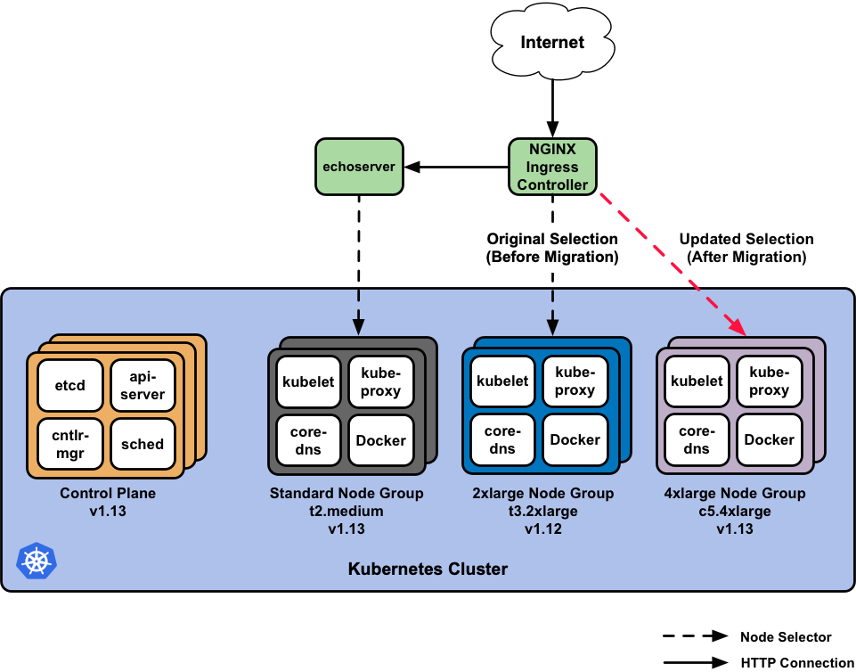
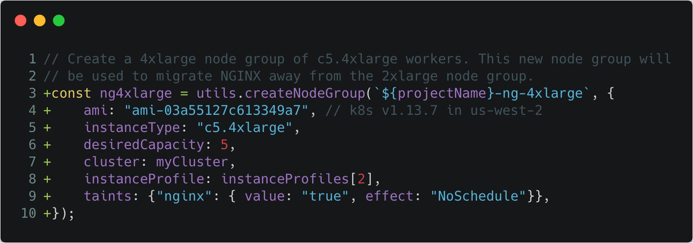
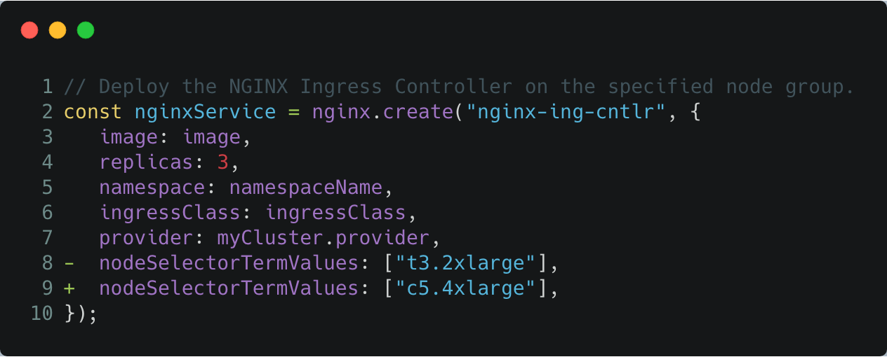
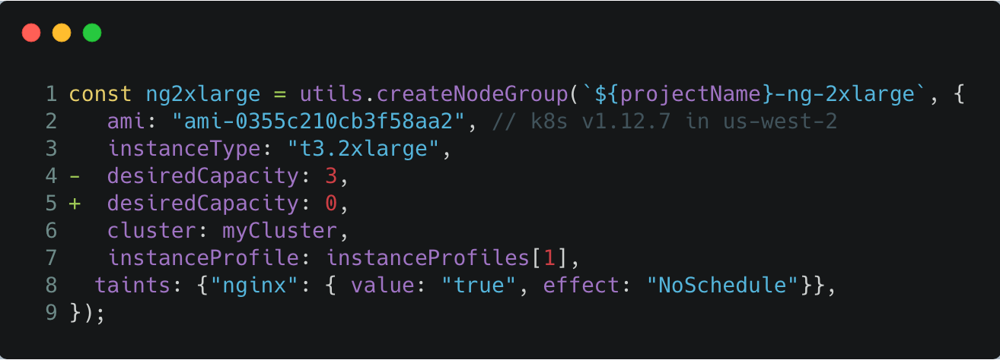
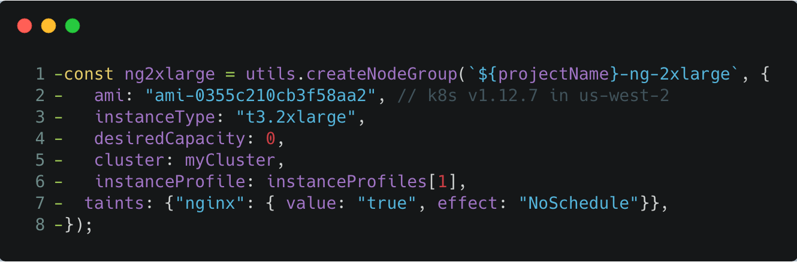

Managed Kubernetes offerings greatly reduce the overhead required in
administering Kubernetes. However, the cluster is only one of the
components under management, as app lifecycles are self-driven tasks
that vary by workloads.

In Kubernetes, node groups are a useful mechanism for creating pools of resources that can enforce
scheduling requirements. They also provide a utility for shifting
workloads around during cluster management and updates.

In this post, we'll see how to use Pulumi for Day 2 Kubernetes administration.
We'll spin up a new EKS cluster with two node groups and a given workload.
Then we'll add one more node group with an updated configuration, and migrate the workload
over to it with zero downtime using code and `kubectl`.

<!--more-->

[View the full tutorial and code.][eks-nodegroup-tutorial]



## Create an EKS cluster and Deploy the Workload

For our initial update, we will configure and launch an EKS cluster using
`v1.13` of Kubernetes, with the cluster's infrastructure dependencies
(such as VPC and IAM) defined using [Crosswalk for AWS][crosswalk-aws].
Crosswalk allows us to leverage the Pulumi libraries of common infrastructure
for AWS to simplify cloud resource instantiation and management while gaining
best-practices as defaults.

We'll also create and attach the following node groups to the cluster:

* A standard `t2.medium` worker node group using the recent `v1.13.7` worker [AMI][eks-amis], for general purpose workloads such as the [`EchoServer`][echoserver] &mdash; a simple app that echo's client request headers.
* A 2xlarge `t3.2xlarge` worker node group using an older `v1.12.7` worker [AMI][eks-amis], for use by larger, intensive workloads such as the [NGINX Ingress Controller][ingress-nginx].

With the cluster successfully created and the node groups available, Pulumi
will deploy the workload: the [`EchoServer`][echoserver], and the [NGINX Ingress Controller][ingress-nginx] that will manage its ingress.
The `echoserver` will land on the Standard node group, and NGINX is set
to specifically target the `2xlarge` node group.

Once the workload is deployed, we can validate it is up and running by accessing
the `echoserver` behind the NGINX endpoint using `curl`:


> **Note**: You can open the <a href="./k8s-cluster-workload.gif" target="_blank">GIF</a> for a maximized view.

## The Great Migration

After our initial deployment, let's say we decide to update the node group used by NGINX.

To do so, we'll move NGINX from the `2xlarge` node group over to a new, `4xlarge` worker
node group with an updated AMI, a different instance type, and a different desired instance count.

As we migrate NGINX over to the `4xlarge` and decommission the `2xlarge` node
group in the next steps, we'll also actively load test the endpoint of the
`echoserver` to ensure that we are not losing requests throughout the migration.

### Step 1: Create the new `4xlarge` node group.

Create the new, `4xlarge` node group by defining it and running an update.



### Step 2: Migrate NGINX to the `4xlarge` node group.

With the `4xlarge` node group created, we'll migrate the NGINX service away
from the `2xlarge` node group over to the `4xlarge` node group by changing
its node selector scheduling terms.

This change updates the NGINX Deployment spec to require the use of
`c5.4xlarge` nodes during scheduling, and forces a rolling update over to the
`4xlarge` node group.

NGINX is able to successfully migrate across node groups because it is
configured with HA settings, [spread-type scheduling predicates][tutorial-ha-refs],
and can gracefully terminate within the Kubernetes [Pod lifecycle][pod-lifecycle].



### Step 3: Decommission the `2xlarge` node group.

Once NGINX has been completely migrated to the `4xlarge` node group, we can
begin decommissioning the original `2xlarge` node group which is no longer in use.

Decommissioning the node group involves:

* Draining the Kubernetes nodes.
* Deleting the Kubernetes nodes from the APIServer.
* Scaling down the Auto Scaling Group to `0`.
* Deleting the node group.

Set up `kubectl` by using the `kubeconfig` from the stack output.

```bash
$ pulumi stack output kubeconfig > kubeconfig.json
$ export KUBECONFIG=$PWD/kubeconfig.json
```

To drain the `2xlarge` node group, we'll use `kubectl drain`:

```bash
for node in $(kubectl get nodes -l beta.kubernetes.io/instance-type=t3.2xlarge -o=name); do
    kubectl drain --force --ignore-daemonsets --delete-local-data --grace-period=10 "$node";
done
```

After draining has completed, use `kubectl delete node` to delete the nodes from the APIServer.

```bash
for node in $(kubectl get nodes -l beta.kubernetes.io/instance-type=t3.2xlarge -o=name); do
    kubectl delete "$node";
done
```

Scale down the node group Auto Scaling Group completely by setting
the `desiredCapacity: 0` and running an update:



Once the Auto Scaling Group has scaled down, we can delete the node group from
AWS and the Pulumi program:



## Summary

In this post, we stood up an EKS cluster with a couple of node groups, and an
`echoserver` and NGINX workload. We then created a new, updated node group and
migrated NGINX over to it.

We achieved this node group migration with zero downtime to our apps during
load testing and decommissioning of the original node group.


> **Note**: You can open the <a href="./eks-migration.gif" target="_blank">GIF</a> for a maximized view.

## Learn More

If you'd like to learn about Pulumi and how to manage your
infrastructure and Kubernetes through code, [get started today](). Pulumi is open source and free to
use.

For further examples on how to use Pulumi to create Kubernetes
clusters, or deploy workloads to a cluster, check out the rest of the
[Kubernetes tutorials]().

As always, you can check out our code on
[GitHub](https://github.com/pulumi), follow us on
[Twitter](https://twitter.com/pulumicorp), subscribe to our [YouTube
channel](https://www.youtube.com/channel/UC2Dhyn4Ev52YSbcpfnfP0Mw), or
join our [Community Slack](https://slack.pulumi.com/) channel if you have
any questions, need support, or just want to say hello.

If you'd like to chat with our team, or get hands-on assistance with
migrating your existing configuration code to Pulumi, please don't hesitate to [drop us a line]().

[eks-amis]: https://docs.aws.amazon.com/eks/latest/userguide/eks-optimized-ami.html
[ingress-nginx]: https://github.com/kubernetes/ingress-nginx
[echoserver]: https://github.com/kubernetes-retired/contrib/blob/master/ingress/echoheaders/echo-app.yaml
[pod-lifecycle]: https://kubernetes.io/docs/concepts/workloads/pods/pod/#termination-of-pods
[eks-nodegroup-tutorial]: 
[crosswalk-aws]: .
[tutorial-ha-refs]: 
