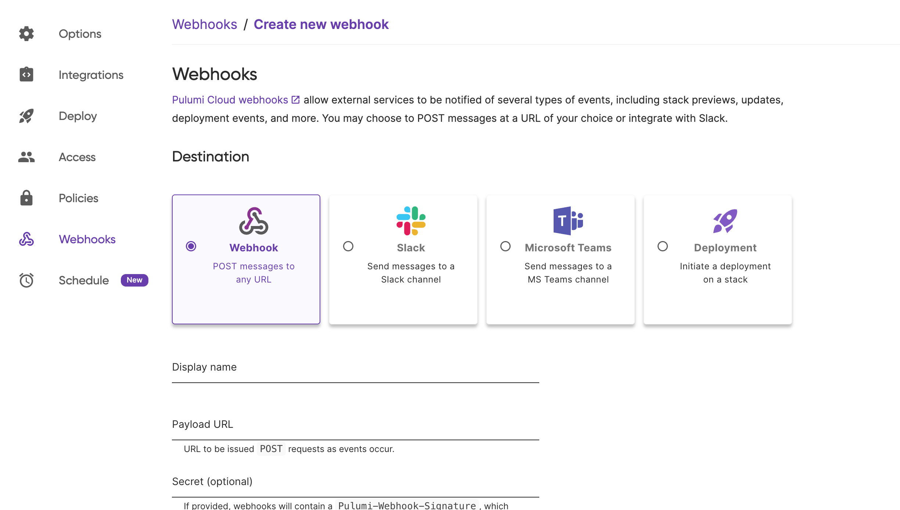

Welcome to the fourth post in our **IDP Best Practices** series. Today we're diving into the world of drift detection and remediation, those critical day 2 operations that keep your infrastructure aligned with its intended configuration long after the initial deployment.

You've built a beautiful platform with robust guardrails, comprehensive templates, and well-defined golden paths. Your developers are productive, deployments are smooth, and everything seems perfect. Then reality hits. An on-call engineer makes an emergency change through the AWS console during a 3 AM incident. A team member tweaks a security group rule to debug a connection issue and forgets to revert it. Auto-scaling adjusts capacity based on load patterns. Before you know it, your actual infrastructure has quietly diverged from what your code describes.

<!--more-->

This post continues our journey through the IDP Best Practices series. We've covered strategy and self-service infrastructure, built golden paths with components and templates, and established deployment guardrails through policy as code. Now we're tackling what happens after deployment when the real world starts making changes to your carefully crafted infrastructure.

Series roadmap:

* [How to Build an Internal Developer Platform: Strategy, Best Practices, and Self-Service Infrastructure](/blog/idp-strategy-planning-self-service-infrastructure-that-balances-developer-autonomy-with-operational-control)
* [Build Golden Paths with Infrastructure Components and Templates](/blog/golden-paths-infrastructure-components-and-templates)
* [Deployment Guardrails with Policy as Code](/blog/deployment-guardrails-with-policy-as-code)
* **Day 2 Operations: Drift Detection and Remediation** (you are here)
* Extend Your IDP for AI Applications: GPUs, Models, and Cost Controls
* Next-Gen IDPs: How to Modernize Legacy Infrastructure with Pulumi

## The Reality of Infrastructure Drift

Let me paint you a picture that might feel uncomfortably familiar. It's Saturday afternoon, and you're enjoying a barbecue with friends when your phone buzzes with that dreaded alert: production is down. You rush to your laptop, but you're not on the corporate VPN. The AWS console is accessible, but you can't reach the application itself to properly diagnose the issue.

Faced with a growing incident and impatient stakeholders, you make a quick decision. You modify the security group directly in the console, temporarily allowing access from anywhere (0.0.0.0/0) just so you can get in and fix the problem. Twenty minutes later, the issue is resolved, everyone's relieved, and you return to your barbecue. That temporary security group change? It stays there, a silent time bomb waiting to be discovered in your next security audit.

This scenario plays out in organizations every day. Your infrastructure has now drifted from its intended state, and it will continue drifting, accumulating more changes, until someone or something notices and fixes it. Each untracked change increases the gap between what you think you have and what actually exists in production.

## Understanding the Prevention vs. Detection Paradigm

When building a robust platform, you need to think in layers of defense. Your first instinct might be to prevent all drift from happening in the first place, and that's absolutely the right starting point. But prevention alone isn't enough in the messy reality of production operations.

### Prevention: The First Line of Defense

Prevention is what we've been building throughout this series. You establish code reviews where teammates scrutinize infrastructure changes before they go live. You implement automated testing that validates configurations before deployment. You deploy [CrossGuard policies](/docs/iac/packages-and-automation/crossguard) that act as guardrails, blocking misconfigurations before they can cause damage. You create [standardized components](/blog/golden-paths-infrastructure-components-and-templates) that encode best practices, making it easier to do the right thing than the wrong thing.

These preventative measures work brilliantly for changes that flow through your normal IaC pipeline. They catch typos, enforce standards, and maintain consistency across your infrastructure. But they have a critical blind spot: they can't see changes that bypass your pipeline entirely.

### Detection and Remediation: The Safety Net

This is where drift detection enters the picture. Think of it as continuous verification, constantly comparing what should exist with what actually exists. While prevention blocks most issues at the gate, detection catches everything that finds another way in.

What kinds of changes slip past prevention? Emergency modifications made during incidents when there's no time for a proper code review. Console changes made by well-meaning engineers debugging production issues. External factors you can't control, like AWS changing service limits or deprecating API endpoints. Even accidental modifications by team members who thought they were in the staging environment.

The truth is, no matter how robust your preventative controls, you need detective controls to maintain infrastructure integrity. Prevention and detection work together, creating a comprehensive defense against infrastructure chaos.

## What Is Infrastructure Drift?

Infrastructure drift sounds technical, but the concept is surprisingly simple. Drift occurs when your actual infrastructure state doesn't match your declared state in code. It's the gap between intention and reality, between what you coded and what's actually running.

To understand drift properly, you need to grasp three distinct states that Pulumi manages. First, there's the **desired state**, which is what your Pulumi program declares in code. This is your intention, your blueprint for how things should be. Then there's the **current state**, stored in Pulumi's [state file](/docs/iac/concepts/state-and-backends), which tracks what Pulumi believes exists based on its last interaction with your cloud provider. Finally, there's the **actual state**, the ground truth of what really exists in your cloud provider right now.

The journey to drift typically follows a predictable pattern. You start by running `pulumi up` to deploy your resources, and everything is in perfect harmony. Pulumi creates the resources, records their configuration in its state file, and all three states align perfectly. Time passes, and your resources continue running in the cloud, serving traffic and doing their job.

Then someone makes a manual change. Maybe they modify a resource directly in the console, or an external system alters a configuration. Suddenly, your actual state has diverged from both your current state (what Pulumi thinks exists) and your desired state (what your code says should exist). You now have drift, and it will persist until you detect and address it.

## Pulumi's Drift Detection and Remediation Workflow

Pulumi provides a complete workflow for handling drift that's both powerful and surprisingly straightforward. Rather than treating drift as an exceptional case, Pulumi makes it a routine part of infrastructure management.

### 1. Drift Detection with `pulumi refresh`

The foundation of drift detection is the [`pulumi refresh`](/docs/iac/cli/commands/pulumi_refresh) command. When you run this command, Pulumi springs into action, querying your cloud providers to discover the actual state of your resources. It then compares this reality against what it has recorded in its state file:

```bash
# Run drift detection
pulumi refresh --preview-only

# This command:
# 1. Reads your current Pulumi state
# 2. Queries cloud providers for actual resource configurations
# 3. Identifies any differences
# 4. Reports what has drifted
```

The `--preview-only` flag is particularly useful here. It shows you exactly what's drifted without making any changes to your state file. You get a clear report of the differences, allowing you to review and understand the drift before deciding how to handle it.

### 2. State Reconciliation with `pulumi refresh`

After reviewing the drift, you face a decision. If the changes are legitimate and should be preserved, you can update your state file to match reality:

```bash
# Update state file to match cloud reality
pulumi refresh

# This command:
# 1. Detects drift (as above)
# 2. Updates state file to match actual cloud state
# 3. Prepares for remediation via pulumi up
```

This reconciliation step is crucial. It acknowledges the current reality and updates Pulumi's understanding of your infrastructure without making any actual changes to your resources. You're essentially telling Pulumi, "This is what actually exists right now."

### 3. Drift Remediation with `pulumi up`

With your state file now reflecting reality, you can use [`pulumi up`](/docs/iac/cli/commands/pulumi_up) to remediate the drift. This command compares the updated state against your code and determines what changes are needed to restore your infrastructure to its intended configuration:

```bash
# Remediate drift - restore to desired state
pulumi up

# This command:
# 1. Compares updated state with your Pulumi program
# 2. Identifies required changes
# 3. Applies changes to restore infrastructure
```

This three-step dance of detect, reconcile, and remediate gives you complete control over how you handle drift. You can review changes, decide whether to keep or revert them, and ensure your infrastructure returns to its intended state.

## Automating Drift Detection with Pulumi Deployments

Running `pulumi refresh` manually works great for small teams and simple infrastructures, but it doesn't scale. As your platform grows to dozens or hundreds of stacks across multiple environments, manual drift detection becomes impossible. This is where [Pulumi Deployments](/docs/pulumi-cloud/deployments) transforms drift detection from a manual chore into an automated safeguard.

### Setting Up Automated Drift Detection

The journey to automated drift detection starts with connecting your infrastructure code to Pulumi's deployment system. Let's walk through the setup process.

#### Step 1: Configure Deployment Settings

Your first step is connecting Pulumi to your source control system using [Deployment Settings](/docs/pulumi-cloud/deployments/get-started). This integration allows Pulumi to access your infrastructure code and run automated operations:


Pulumi offers native integrations with all major version control systems. If you're using GitHub, you get full app integration with [PR previews](/docs/pulumi-cloud/deployments/ci-cd-integration-assistant), making it easy to see the impact of changes before merging. GitLab users enjoy similar functionality with merge request automation. For other Git providers or self-hosted solutions, you can use raw Git integration with direct repository access using credentials.

#### Step 2: Create Drift Detection Schedules

With your source control connected, you can now configure [automated drift detection](/docs/pulumi-cloud/deployments/drift) to run on whatever schedule makes sense for your organization. Some teams check hourly for production environments, while others might run daily checks for development stacks:


For environments where you're confident in your automation, you can take it a step further and enable automatic remediation:


With auto-remediation enabled, Pulumi not only detects drift but automatically runs `pulumi up` to restore your infrastructure to its intended state. This is powerful but should be used carefully, especially in production environments.

#### Step 3: Configure Webhooks for Notifications

Detecting drift is only valuable if the right people know about it. Pulumi's [webhook system](/docs/pulumi-cloud/webhooks) ensures your team stays informed when drift occurs:



You can route notifications wherever your team actually pays attention. Send alerts directly to Slack channels where your ops team congregates. Push notifications to Microsoft Teams if that's your collaboration platform. Use custom webhooks to integrate with PagerDuty, Datadog, or any other monitoring system. You can even use deployment triggers to automatically run dependent stacks when drift is detected and fixed.

## Programmatic Drift Detection with Pulumi Service Provider

While the Pulumi Console provides a user-friendly interface for configuring drift detection, many teams prefer to manage everything as code. The [Pulumi Service Provider](/registry/packages/pulumiservice) brings infrastructure-as-code principles to drift detection itself, allowing you to define and manage drift schedules programmatically.

### Creating Drift Schedules with Code

Instead of clicking through UI screens, you can define your drift detection schedules in the same code that defines your infrastructure. This approach ensures your drift detection configuration is version-controlled, reviewable, and reproducible:



{}

```typescript
import * as pulumi from "@pulumi/pulumi";
import * as pulumiservice from "@pulumi/pulumiservice";

const driftSchedule = new pulumiservice.DriftSchedule("production-drift-detection", {
    organization: "my-org",
    project: "core-infrastructure",
    stack: "production",

    // Run every 4 hours
    scheduleCron: "0 */4 * * *",

    // Automatically fix any drift found
    autoRemediate: true,
});

export const scheduleId = driftSchedule.scheduleId;
```

{}

{}

```python
import pulumi
import pulumi_pulumiservice as pulumiservice

drift_schedule = pulumiservice.DriftSchedule("production-drift-detection",
    organization="my-org",
    project="core-infrastructure",
    stack="production",

    # Run every 4 hours
    schedule_cron="0 */4 * * *",

    # Automatically fix any drift found
    auto_remediate=True
)

pulumi.export('schedule_id', drift_schedule.schedule_id)
```

{}

{}

```go
package main

import (
    "github.com/pulumi/pulumi-pulumiservice/sdk/go/pulumiservice"
    "github.com/pulumi/pulumi/sdk/v3/go/pulumi"
)

func main() {
    pulumi.Run(func(ctx *pulumi.Context) error {
        driftSchedule, err := pulumiservice.NewDriftSchedule(ctx, "production-drift-detection", &pulumiservice.DriftScheduleArgs{
            Organization: pulumi.String("my-org"),
            Project: pulumi.String("core-infrastructure"),
            Stack: pulumi.String("production"),

            // Run every 4 hours
            ScheduleCron: pulumi.String("0 */4 * * *"),

            // Automatically fix any drift found
            AutoRemediate: pulumi.Bool(true),
        })
        if err != nil {
            return err
        }

        ctx.Export("scheduleId", driftSchedule.ScheduleId)
        return nil
    })
}
```

{}

{}

```csharp
using Pulumi;
using PulumiService = Pulumi.PulumiService;

class Program
{
    static Task<int> Main() => Deployment.RunAsync(() => {
        var driftSchedule = new PulumiService.DriftSchedule("production-drift-detection", new PulumiService.DriftScheduleArgs
        {
            Organization = "my-org",
            Project = "core-infrastructure",
            Stack = "production",

            // Run every 4 hours
            ScheduleCron = "0 */4 * * *",

            // Automatically fix any drift found
            AutoRemediate = true,
        });

        return new Dictionary<string, object?>
        {
            { "scheduleId", driftSchedule.ScheduleId }
        };
    });
}
```

{}

{}

```java
import com.pulumi.Context;
import com.pulumi.Pulumi;
import com.pulumi.pulumiservice.DriftSchedule;
import com.pulumi.pulumiservice.DriftScheduleArgs;

public class App {
    public static void main(String[] args) {
        Pulumi.run(App::stack);
    }

    private static void stack(Context ctx) {
        var driftSchedule = new DriftSchedule("production-drift-detection", DriftScheduleArgs.builder()
            .organization("my-org")
            .project("core-infrastructure")
            .stack("production")

            // Run every 4 hours
            .scheduleCron("0 */4 * * *")

            // Automatically fix any drift found
            .autoRemediate(true)
            .build());

        ctx.export("scheduleId", driftSchedule.scheduleId());
    }
}
```

{}

{}

```yaml
name: drift-detection
runtime: yaml

resources:
  production-drift-detection:
    type: pulumiservice:index:DriftSchedule
    properties:
      organization: my-org
      project: core-infrastructure
      stack: production

      # Run every 4 hours
      scheduleCron: "0 */4 * * *"

      # Automatically fix any drift found
      autoRemediate: true

outputs:
  scheduleId: ${production-drift-detection.scheduleId}
```

{}



## Integrating with CI/CD Pipelines

While Pulumi Deployments provides excellent built-in scheduling, many teams prefer to integrate drift detection into their existing CI/CD pipelines. This approach gives you more control over the detection process and integrates naturally with your existing workflows.

### GitHub Actions Integration

For teams using GitHub Actions, adding drift detection to your [existing workflows](/docs/iac/packages-and-automation/continuous-delivery/github-actions) is straightforward:

```yaml
name: Drift Detection

on:
  schedule:
    # Run every 4 hours
    - cron: '0 */4 * * *'
  workflow_dispatch: # Allow manual triggers

jobs:
  detect-drift:
    runs-on: ubuntu-latest
    steps:
      - uses: actions/checkout@v4

      - name: Configure Pulumi
        uses: pulumi/actions@v5
        with:
          cloud-url: ${{ secrets.PULUMI_CLOUD_URL }}

      - name: Detect Drift
        run: |
          pulumi refresh --stack production --preview-only
        env:
          PULUMI_ACCESS_TOKEN: ${{ secrets.PULUMI_ACCESS_TOKEN }}

      - name: Notify on Drift
        if: failure()
        uses: actions/slack@v1
        with:
          webhook: ${{ secrets.SLACK_WEBHOOK }}
          message: "⚠️ Drift detected in production infrastructure"
```

This workflow runs every four hours and can also be triggered manually when needed. When drift is detected, it automatically sends a notification to your Slack channel, ensuring your team knows immediately.

### GitLab CI Integration

GitLab users can achieve similar functionality with [GitLab CI](/docs/iac/packages-and-automation/continuous-delivery/gitlab-ci):

```yaml
drift-detection:
  stage: monitor
  image: pulumi/pulumi:latest

  script:
    - pulumi refresh --stack production --preview-only

  only:
    - schedules  # Run on schedule only

  variables:
    PULUMI_ACCESS_TOKEN: $PULUMI_ACCESS_TOKEN

  after_script:
    - |
      if [ "$CI_JOB_STATUS" == "failed" ]; then
        curl -X POST $SLACK_WEBHOOK \
          -H 'Content-Type: application/json' \
          -d '{"text":"⚠️ Drift detected in production"}'
      fi
```

The GitLab configuration uses scheduled pipelines to run drift detection and sends notifications when drift is found. The `after_script` section ensures notifications are sent even if the drift detection itself fails.

## Handling Common Drift Scenarios

Every organization faces similar drift scenarios. Understanding how to handle these common cases will prepare you for real-world operations.

### Scenario 1: Emergency Hotfix

The most common drift scenario occurs during incidents. Someone makes an emergency change to fix production, and now you need to decide whether to keep or revert that change:

```bash
# 1. Acknowledge the drift
pulumi refresh --stack production

# 2. Review the changes
pulumi preview --stack production

# 3. Either incorporate or revert
# Option A: Accept the change
pulumi refresh --stack production --yes

# Option B: Revert to code
pulumi up --stack production --yes
```

The key here is having a clear process. First, acknowledge the drift by running refresh to update your state. Then review the changes carefully. Finally, make an explicit decision: either accept the change by updating your code to match, or revert it by running `pulumi up` to restore the original configuration.

### Scenario 2: Legitimate External Changes

Not all drift is bad. Auto-scaling groups adjust capacity based on load. Managed services update configurations automatically. Some changes are legitimate and should be preserved:

```typescript
// Mark resources that can change externally
const autoScalingGroup = new aws.autoscaling.Group("app-asg", {
    minSize: 2,
    maxSize: 10,
    // ... other config
}, {
    ignoreChanges: ["desiredCapacity"] // Ignore scaling changes
});
```

The `ignoreChanges` option tells Pulumi to ignore specific properties when detecting drift. Use it for fields that legitimately change outside your control, like auto-scaling capacity or last-modified timestamps.

### Scenario 3: Configuration Drift

Sometimes drift occurs in configuration values rather than resource structure. IP allowlists, feature flags, and environment-specific settings often drift. Handle these with Pulumi's configuration system:

```python
# Use Pulumi's configuration system
config = pulumi.Config()
allowed_ips = config.get_object("allowed_ips") or ["10.0.0.0/8"]

security_group = aws.ec2.SecurityGroup("app-sg",
    ingress=[{
        "from_port": 443,
        "to_port": 443,
        "protocol": "tcp",
        "cidr_blocks": allowed_ips  # Managed via configuration
    }]
)
```

By externalizing configuration values, you make them easier to update without code changes. This pattern works particularly well for values that change frequently or differ between environments.

## The Value of Automated Drift Detection

After implementing drift detection for hundreds of stacks, the value becomes undeniable. Organizations consistently report four major areas of improvement.

### 1. Security Compliance

Security teams sleep better knowing that unauthorized changes are detected within minutes, not discovered weeks later during an audit. Compliance becomes automatic rather than a quarterly fire drill. Every infrastructure change leaves an audit trail, making compliance reporting straightforward and comprehensive.

### 2. Operational Excellence

Incidents caused by configuration drift drop dramatically. When issues do occur, MTTR improves because teams can quickly check whether drift contributed to the problem. Change management transforms from a bureaucratic process to an automated system with complete visibility into what changed, when, and why.

### 3. Cost Optimization

Drift detection regularly uncovers cost savings. Orphaned resources created outside IaC get identified and cleaned up. Oversized instances from manual scaling get right-sized. Resource sprawl from untracked changes gets prevented before it impacts your cloud bill.

### 4. Team Productivity

Engineers stop wasting time on manual infrastructure checks. Debugging becomes faster with clear drift reports showing exactly what changed. Teams build confidence in their infrastructure state, knowing that drift detection has their back.

## Getting Started with Drift Detection

Ready to implement drift detection for your IDP? Here's a practical action plan that you can execute today.

### Quick Start Checklist

Begin with the simplest possible drift detection: a manual check on your production stack. Run `pulumi refresh --preview-only --stack production` to see if you have any existing drift. This takes just 15 minutes and often reveals surprising discrepancies.

Next, invest 30 minutes in setting up automated detection. Configure [Pulumi Deployments](/docs/pulumi-cloud/deployments/get-started), create an hourly detection schedule for your most critical stack, and set up Slack notifications so you'll know immediately when drift occurs.

Spend the next week monitoring and learning. Review the drift patterns that emerge. Identify common causes. Are certain resources drifting repeatedly? Are changes happening at predictable times? Document which changes are legitimate and which represent problems.

After a week of observation, you're ready to implement remediation. Start with non-production environments where mistakes have lower impact. Enable auto-remediation gradually, monitoring success rates and adjusting your configuration based on what you learn.

Finally, optimize and scale your drift detection. Adjust schedules based on the patterns you've observed. Implement custom workflows for complex scenarios. Expand coverage to all your environments and stacks. What starts as a simple check becomes a comprehensive system protecting your entire infrastructure.

## Conclusion: Day 2 Operations as a Competitive Advantage

Drift detection and remediation represent more than just good hygiene; they're competitive advantages in a world where infrastructure complexity keeps growing.

Teams with robust day 2 operations move faster because they have confidence in their infrastructure state. They recover quickly from incidents because they can immediately identify what changed. They maintain security without slowing development by automatically detecting and reverting unauthorized modifications. Most importantly, they scale operations without scaling headcount, automating work that would otherwise require armies of engineers manually checking infrastructure.

The math is compelling. A single undetected security group change could lead to a breach costing millions. One overlooked configuration drift might cause hours of downtime. Yet implementing comprehensive drift detection takes just hours of setup and minutes of ongoing maintenance. The ROI is immediate and substantial.

## Next Steps

Your journey to comprehensive drift detection starts with these resources:

### 📚 Essential Documentation

Dive deep into [Pulumi Deployments Drift Detection](/docs/pulumi-cloud/deployments/drift) for complete configuration options. Master the [Pulumi Refresh Command](/docs/iac/cli/commands/pulumi_refresh) that powers all drift detection. Explore the [Pulumi Service Provider](/registry/packages/pulumiservice) for managing drift detection as code. For advanced scenarios, the [Automation API Guide](/docs/using-pulumi/automation-api) shows how to build custom drift workflows.

### 🎓 Hands-On Learning

The [Drift Detection Tutorial](/tutorials/drift-detection-and-remediation) provides step-by-step guidance for implementing drift detection in your environment.

## Coming Next in the Series

Our IDP journey continues with **"Extend Your IDP for AI Applications: GPUs, Models, and Cost Controls"**. As AI workloads become central to modern applications, we'll explore how to adapt your platform for machine learning workflows. You'll learn about GPU orchestration, model deployment pipelines, and the unique cost management challenges that AI infrastructure presents.

But don't wait for the next post to get started with drift detection. Even a simple hourly check can prevent major incidents. Set up basic detection today, and your future self will thank you the next time you're debugging a production issue at 3 AM. More importantly, your on-call team will appreciate not having to debug issues caused by accumulated drift that could have been prevented.

---

**Ready to implement drift detection?** [Start your free Pulumi Cloud trial](https://app.pulumi.com/signup) and set up your first drift detection schedule in minutes. No credit card required.
