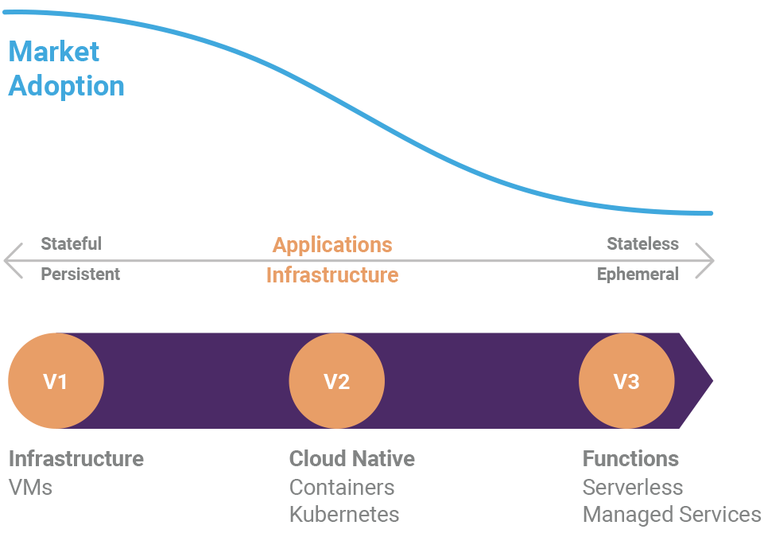

**Enterprise software has undergone a slow shift from containerless
servers to serverless containers.**

The evolution of the cloud, combined with the shift to increasingly
ephemeral infrastructure, and the connection of application code and
infrastructure code, demands a different view of cloud development and
devops.

To a first approximation, all developers are cloud developers, all
applications are cloud native, and all operations are cloud-first. Yet,
there is a lack of a consistent approach to delivering cloud native
applications and infrastructure. The tools and processes differ by
technology generation, and even by cloud vendor, and so deny the full
potential of cloud native application delivery.

In our latest white paper,
[Delivering Cloud Native Infrastructure as Code](),
we we make the case for a consistent programming model for the cloud and examine:

- How the cloud has already evolved three times as it increasingly
  moves toward stateless compute to deliver on the opportunities
  afforded by unprecedented economies of scope and scale.
- How stateless compute has shifted infrastructure management concerns
  from 'at rest' to 'in motion', and moved these concerns up the stack
  to development.
- How the growth of DSL-based tools has lead to complexity for DevOps
  teams, failed to deliver on the promised collaboration between
  development and operations functions, and does not satisfy the need
  for increasing delivery speed in the cloud.

You can read the paper in full [here](),
or download a copy [here](./Pulumi-Delivering-CNI-as-Code.pdf).

Let us know what you think!
