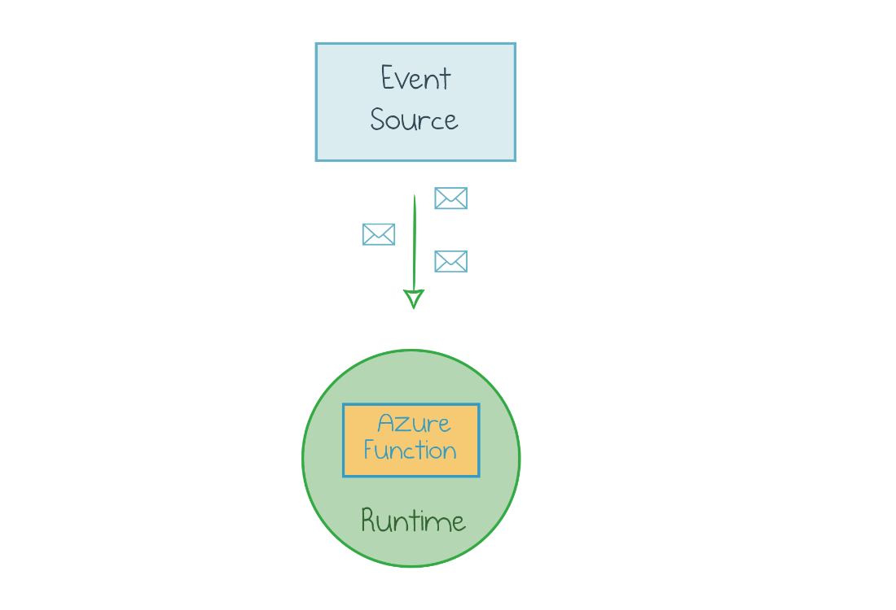
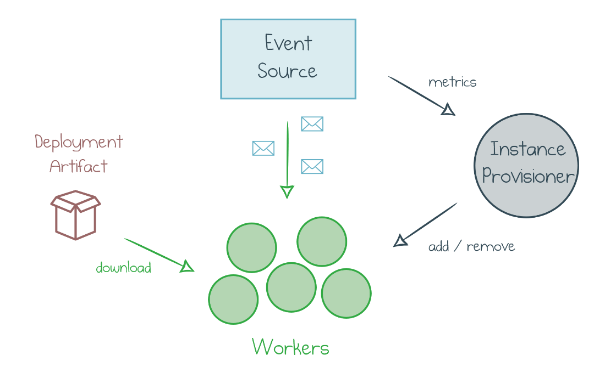
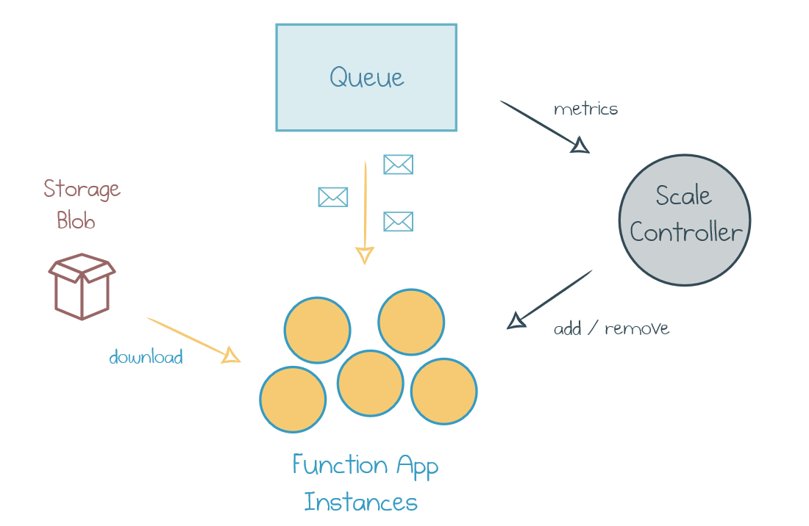
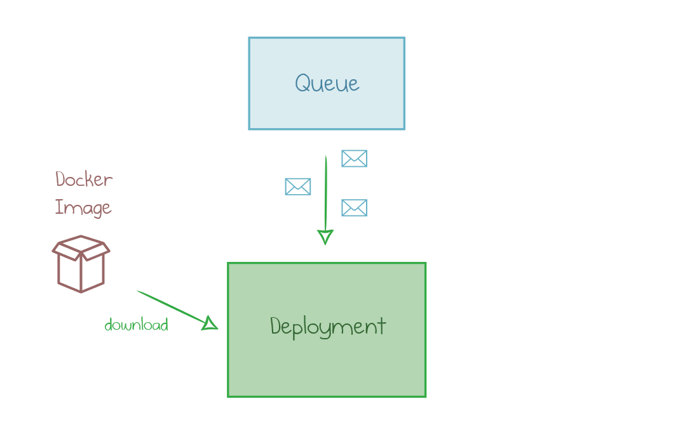
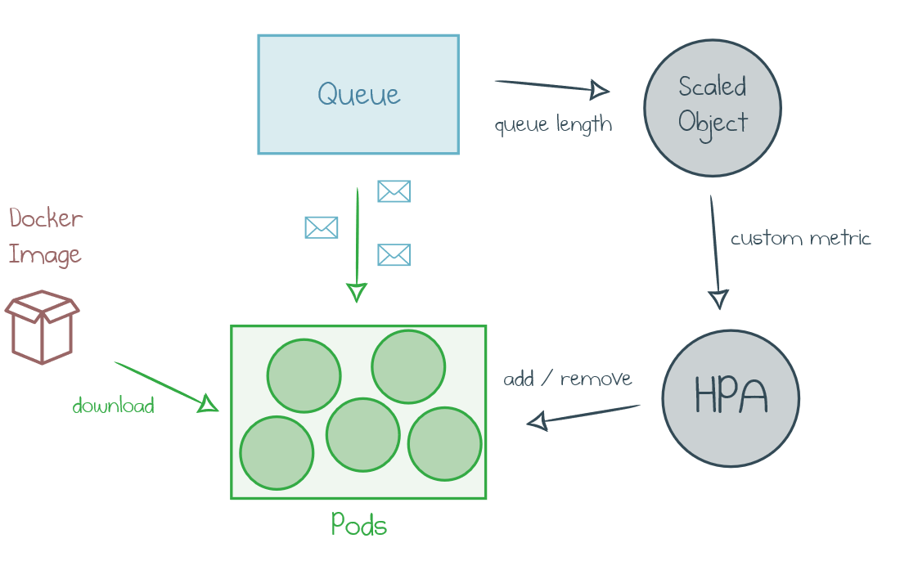

**Azure Functions** is a managed service for serverless applications in the Azure cloud. More broadly, Azure Functions is a runtime with multiple hosting possibilities. **KEDA** ([Kubernetes-based Event-Driven Autoscaling](https://cloudblogs.microsoft.com/opensource/2019/05/06/announcing-keda-kubernetes-event-driven-autoscaling-containers/)) is an emerging option to host this runtime in **Kubernetes**.

In the first part of this post, I compare KEDA with cloud-based scaling and outline the required components. In the second part, I define infrastructure as code to deploy a sample KEDA application to an Azure Kubernetes Service (AKS) cluster.

The result is a fully working example and a high-level idea of how it works. Kubernetes expertise is not required!

<!--more-->

## Autoscaling Primer

When you deploy an Azure Function, it runs within the Azure Functions runtime. The runtime is a host process which knows how to pull events from an **event source** (defined by the function trigger) and pass those to your function:



However, one instance of runtime rarely provides adequate processing capacity. If you only get one message per day, having an instance always running is wasteful. If you get thousands of events per second, one instance won’t be able to process all of them.

Automatic **horizontal scaling** solves the problem. At any point in time, several identical **workers** are crunching the events. The number N is optimized continuously to fit the current workload by adding new workers and removing underutilized ones.



{}Components of an automatically scaled application{}

**Instance Provisioner** is an extra component in the auto-scaled system. It monitors the stream of metrics from the event source and decides to add or remove workers. A massive standby pool of idle generic workers provides the workforce. Such a generic worker pulls the **artifact** of the assigned function, plugs it into the runtime, and starts processing events.

## Azure Functions Consumption Plan

**Consumption Plan** is the serverless hosting option where Azure manages all the scaling components internally. Let’s consider an example of an Azure Function triggered by a **Storage Queue**:



{}Azure Functions Consumption Plan{}

The deployment artifact is just the code packaged as a zip archive and uploaded to Blob Storage. **Scale Controller** is an internal Azure component that observes the target queue and allocates Function App instances based on the queue length fluctuations. Each instance bootstraps itself with a zip file, connects to the queue, and pulls messages to process.

The cloud provider manages all the components of the system, so developers can focus on writing business logic code. It can be [as simple as a JavaScript callback]():

``` ts
queue.onEvent("MyHandler", async (context, msg) => {
   console.log("New message: " + JSON.stringify(msg));
});
```

## KEDA

Over the last few years, Kubernetes has gained traction across many industries. KEDA is provides a way to design and run event-driven applications inside a Kubernetes cluster. KEDA implements the autoscaling components in terms of Kubernetes tools.

The target Function App is packaged together with the Azure Functions runtime into a custom **Docker image** and published to a **registry**. A Kubernetes **deployment** utilizes that image and configures the parameters to connect it to the target event source (for instance, a queue):



The application can then run on one or many instances, or **pods** in Kubernetes terms. Kubernetes has a built-in component to scale out the pods: [Horizontal Pod Autoscaler](https://kubernetes.io/docs/tasks/run-application/horizontal-pod-autoscale/) (HPA). By default, HPA makes scaling decisions based on the processor utilization of existing pods. CPU turns out to be a poor metric for event-driven applications: many workloads are not CPU-bound, so the scale-out won’t be aggressive enough to keep the queue empty. Therefore, KEDA introduces a **ScaledObject**---a [custom resource](https://kubernetes.io/docs/concepts/extend-kubernetes/api-extension/custom-resources/) which pulls metric values from the event source and feeds them as a custom metric to HPA:



{}Kubernetes-based Event-Driven Autoscaling{}

At the time of the initial KEDA preview announcement and until Kubernetes version 1.16, Horizontal Pod Autoscaler wasn’t able to scale a deployment down to zero pods. Therefore, KEDA includes an extra controller to disable the deployment if the event source is empty and re-enable it when new events come in. This duty might be delegated back to HPA in the future versions.

Now, when we know what KEDA is and how it works, it’s time to deploy a Function App!

## Deploy a Function App with KEDA and Pulumi

Here is the list of the components required to run a Function App in Kubernetes with KEDA:

- Azure Kubernetes Service cluster
- Azure Container Registry
- Helm chart keda-edge with KEDA service and custom resource definition
- Azure Storage Queue as a sample event source
- Docker image of the queue processor application
- Deployment of this image
- Scaled Object custom resource

All these components can be defined and deployed within a single Pulumi program. Below I highlight the main blocks of the program. Navigate to the [following section](#reusable-components) to look at a short and reusable component.

### AKS Cluster

KEDA can run on any Kubernetes cluster, but I choose to do so on managed AKS. My custom `AksCluster` component defines a cluster, including the required Active Directory and networking configuration. It makes multiple assumptions, so I only need to specify the main properties:

``` ts
const resourceGroup = new azure.core.ResourceGroup("keda-sample");

const aks = new AksCluster("keda-cluster", {
    resourceGroupName: resourceGroup.name,
    kubernetesVersion: "1.13.5",
    vmSize: "Standard_B2s",
    vmCount: 3,
});
```

`aks.cluster` now has all the required output values, for instance, `aks.cluster.kubeConfigRaw` configuration.

### Shared Cluster Components

The next group of components needs to be deployed just once.

Azure Container Registry is not part of the AKS cluster. Its purpose is to host Docker images of applications.

``` ts
const registry = new azure.containerservice.Registry("registry", {
    resourceGroupName: args.resourceGroup.name,
    adminEnabled: true,
    sku: "Premium",
});
```

A Helm chart `kedacore/keda-edge` deploys the KEDA service and the `ScaledObject` custom resource definition.

``` ts
const keda = new k8s.helm.v2.Chart("keda-edge", {
    repo: "kedacore",
    chart: "keda-edge",
    version: "0.0.1-2019.07.24.21.37.42-8ffd9a3",
    values: {
        logLevel: "debug",
    },
}, { providers: { kubernetes: aks.provider } });
```

### Event Source

KEDA supports multiple types of event sources, and the current list is available [here](https://github.com/kedacore/keda#event-sources-and-scalers). An event source is supported if there is a scaler which knows how to pull metrics out of it and turn them into a custom metric for HPA.

My example uses an Azure Storage Queue as the event source:

``` ts
const storageAccount = new azure.storage.Account("kedasa", {
    resourceGroupName: resourceGroup.name,
    accountTier: "Standard",
    accountReplicationType: "LRS",
});

const queue = new azure.storage.Queue("kedaqueue", {
    storageAccountName: storageAccount.name,
});
```

### Docker Image

The same Pulumi program is capable of building a Docker image and uploading it to the Container Registry.

``` ts
const dockerImage = new docker.Image("image", {
    imageName: pulumi.interpolate`${registry.loginServer}/${args.queue.name}:v1.0.0`,
    build: {
        context: "./functionapp",
    },
    registry: {
        server: registry.loginServer,
        username: registry.adminUsername,
        password: registry.adminPassword,
    },
});
```

The image refers to the folder with a `Dockerfile` in it and uses the `registry` variables to fill the credentials.

### Deployment

Now, we can define a Deployment which uses the Docker image to run our Function App on Kubernetes pods.

``` ts
const appLabels = { app: name };
const deployment = new k8s.apps.v1.Deployment(name, {
    apiVersion: "apps/v1",
    kind: "Deployment",
    metadata: {
        labels: appLabels,
    },
    spec: {
        selector: { matchLabels: appLabels },
        template: {
            metadata: {
                labels: appLabels,
            },
            spec: {
                containers: [{
                    name,
                    image: dockerImage.imageName,
                    env: [{ name: "queuename", value: args.queue.name }],
                    envFrom: [{ secretRef: {name: secretQueue.metadata.name } }],
                }],
                imagePullSecrets: [{ name: args.service.registrySecretName }],
            },
        },
    },
}, { provider: aks.provider });
```

The deployment refers to the secret value which stores the connection string to our target Storage Queue:

``` ts
const secretQueue = new k8s.core.v1.Secret("queue-secret", {
    data: {
        queueConnectionString:
            args.storageAccount.primaryConnectionString.apply(c => Buffer.from(c).toString("base64")),
    },
}, { provider: aks.provider });
```

### Scaled Object

Finally, we need to deploy an instance of the `ScaledObject` custom resource, which takes care of feeding the metrics from the queue to the Horizontal Pod Autoscaler.

``` ts
const scaledObject = new k8s.apiextensions.CustomResource("scaledobject", {
    apiVersion: "keda.k8s.io/v1alpha1",
    kind: "ScaledObject",
    metadata: {
        labels: { deploymentName: name },
    },
    spec: {
        scaleTargetRef: { deploymentName: name },
        triggers: [{
            type: "azure-queue",
            metadata: {
                type: "queueTrigger",
                connection: "queueConnectionString",
                queueName: args.queue.name,
                name: "myQueueItem",
            },
        }],
    },
}, { provider: aks.provider });
```

## Reusable Components

We can simplify the program further by creating reusable Pulumi components for a Cluster, a Service, and a Function app. After those are done, here is all the code required to deploy a Kubernetes cluster with a Function App and KEDA.

``` ts
// Create an AKS K8s cluster
const aks = new AksCluster("keda-cluster", {
    resourceGroupName: resourceGroup.name,
    kubernetesVersion: "1.13.5",
    vmSize: "Standard_B2s",
    vmCount: 3,
});

// Deploy shared components of KEDA (container registry, kedacore/keda-edge Helm chart)
const service = new KedaService("keda-edge", {
    resourceGroup,
    k8sProvider: aks.provider,
});

// Deploy a Function App which subscribes to the Storage Queue
const app = new KedaStorageQueueHandler("queue-handler", {
    resourceGroup,
    storageAccount,
    queue,
    service,
    path: "./functionapp",
});
```

You can find the full code of the components, the sample program, and steps to run it in [this example](https://github.com/pulumi/examples/tree/master/azure-ts-aks-keda).

## Conclusion

As of October 2019, the KEDA project is still in the experimental phase and should not be used for any production applications. Also, if the managed version of Azure Functions suits your needs, you should probably stick to that service. It requires less effort, provides high-level primitives, and enables unlimited elastic scaling.

However, if your company is betting on Kubernetes as the standard application platform, but you still see high value in event-driven fine-grained applications, KEDA might be an exciting option for the future.

Pulumi is a great tool to get a sample KEDA application running quickly and effortlessly. It combines Docker image creation, Kubernetes cluster provisioning, Helm chart installation, and KEDA deployment in the single program written in a familiar general-purpose language.

Get started with [Azure Kubernetes Service (AKS) Cluster and Azure Functions with KEDA](https://github.com/pulumi/examples/tree/master/azure-ts-aks-keda).
