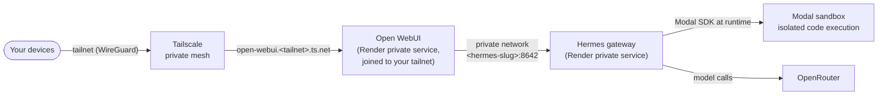
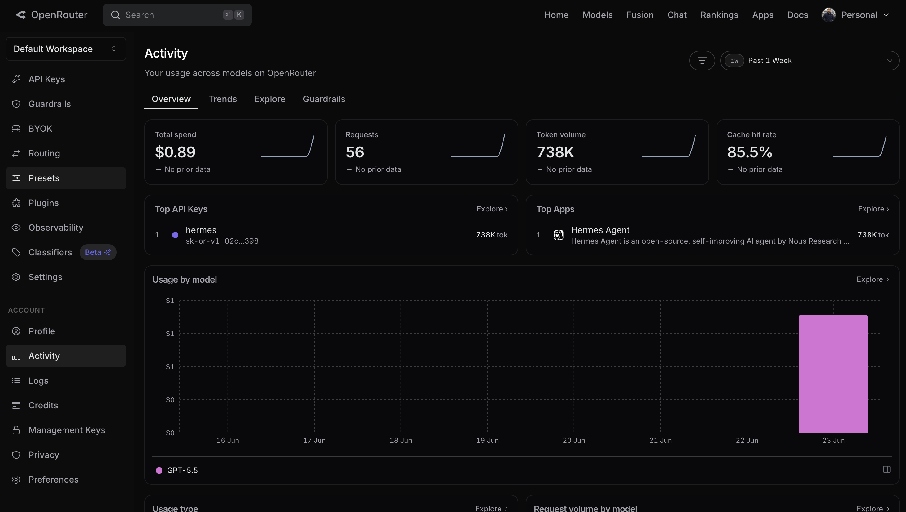
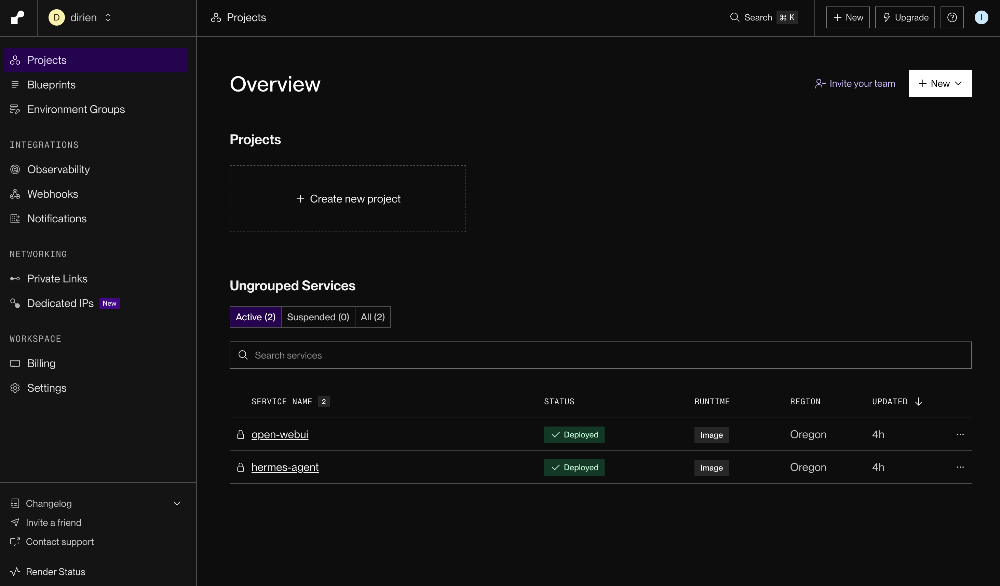
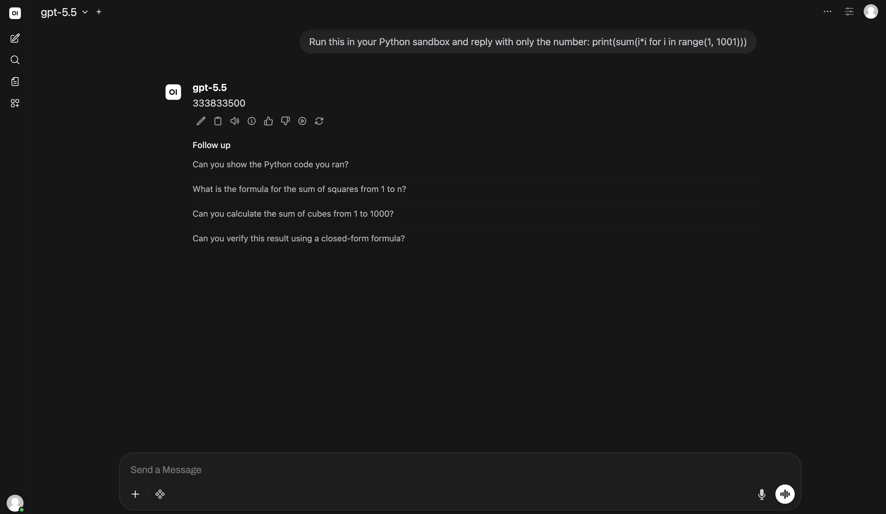
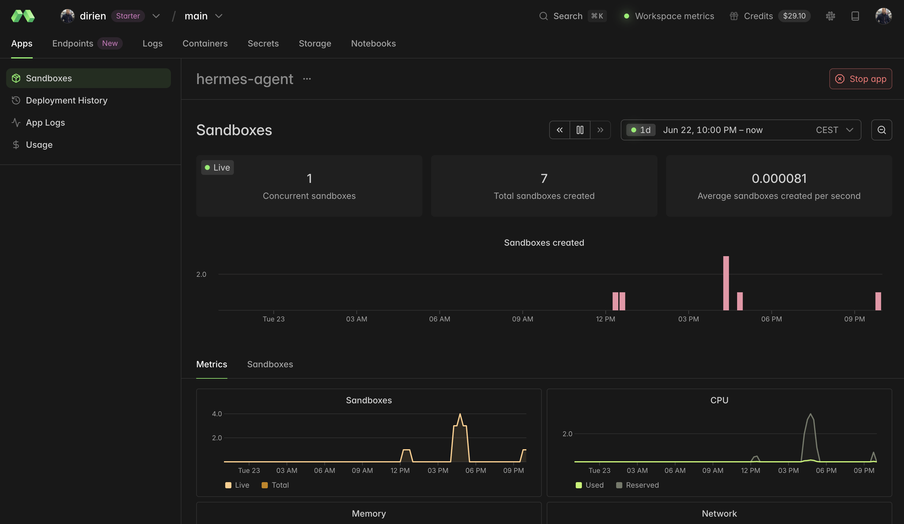

Personal AI agents had their breakout this year. [OpenClaw](/blog/deploy-openclaw-aws-hetzner/) crossed 100,000 GitHub stars within months of launching, and self-hosting your own assistant went from a hobbyist trick to something a lot of developers actually do. I wrote up how to deploy that lobster to AWS or Hetzner back when it was everywhere.

The one people are switching to now is [Hermes](https://hermes-agent.nousresearch.com/), the open-source runtime from [Nous Research](https://nousresearch.com/), and it caught on just as quickly. The reason shows up in every "I ditched OpenClaw for Hermes" thread: it actually learns, building up memory and writing its own skills as it goes instead of running off a static, human-written list.

Here is the part the launch videos skip. Hermes writes and runs its own code, with no human approving the commands. A model that can write code will eventually write a bad one, and the only thing between that command and your credentials is the sandbox it runs in. That is the box you do not want on the public internet. Researchers found [175,000 exposed Ollama servers](https://thehackernews.com/2026/01/researchers-find-175000-publicly.html) sitting open in early 2026, and attackers hijack the ones they find for compute. The fix is not a better lock on the front door. It is to have no front door at all.

<!--more-->

So this post deploys a private Hermes agent as one Pulumi program across Render, Modal, and Tailscale. The agent and its chat UI run as Render private services with no public URL, Tailscale puts the UI on your tailnet, and Modal runs the agent's code in throwaway sandboxes. One `pulumi up` to stand it up, one `pulumi destroy` to tear it down, around $50 a month. No Makefile, no CLI escape hatches, and an honest look at the few places "nothing on the public internet" still leaks.

## What is Hermes?

Hermes is the open-source, MIT-licensed agent runtime from [Nous Research](https://hermes-agent.nousresearch.com/hermes-agent). It runs continuously on a server rather than living in a browser tab, and you talk to it through a chat UI or a messaging platform like Telegram, Discord, Slack, or Signal. A few things make it more than a chatbot:

- **It is model-agnostic.** You point it at any provider. This deployment uses [OpenRouter](https://openrouter.ai/), one key that fronts [400-plus models](https://openrouter.ai/docs/guides/overview/models) across providers, with automatic failover when one is down.
- **It remembers across restarts.** Memory persists on disk, so it builds up context over time instead of resetting every session.
- **It writes its own skills.** When it works through a task, it can save that approach as a reusable skill and reach for it next time.
- **It schedules itself.** A built-in [cron](https://hermes-agent.nousresearch.com/docs/user-guide/features/cron) runs automations on a schedule, driven in plain language.
- **It runs code in a sandbox.** When the agent needs to execute code, it hands that off to an isolated, ephemeral container instead of running it next to its own process.

The difference from a cloud-hosted assistant is the usual self-hosting trade: it runs on your infrastructure with your keys, and your conversation history and memory stay on your disk.

{}
"Hermes" here is the agent runtime from Nous Research, not the Hermes family of language models that share the name. The agent is model-agnostic, and the model it talks to is a separate choice you make through OpenRouter.
{}

## Prerequisites

Before getting started, ensure you have:

- [Pulumi CLI](/docs/iac/download-install/) installed and configured
- A [Pulumi Cloud account](https://app.pulumi.com/signup)
- A [Render](https://render.com/) account, an API key, and your workspace owner ID
- A [Modal](https://modal.com/) account and a token pair (token ID and secret)
- An [OpenRouter](https://openrouter.ai/) API key with credit on the account
- A container registry you can push to; this post uses GitHub Container Registry (a GHCR username and token)
- Docker running locally (the image build rides on a local buildx engine), or a Docker-enabled CI runner
- A [Tailscale](https://tailscale.com/) account with [HTTPS enabled](https://tailscale.com/kb/1153/enabling-https) and a reusable auth key
- Node.js 18+ (for TypeScript) or Python 3.9+ (for Python), depending on the language you pick

{}
This guide routes models through OpenRouter, but Hermes works with other providers too. The model is just a routing string you pass (`gpt-5.5` here), so any model OpenRouter supports works by changing that one value.
{}

## Understanding the Hermes architecture

Strip away the dashboard clicks and the architecture is four pieces. One rule governs all of them: what the public internet is allowed to touch.



| Component | Port | Description |
|-----------|------|-------------|
| Hermes gateway | 8642 | Holds secrets and memory, talks to the model, creates Modal sandboxes. The most dangerous box, so it has no public URL. |
| [Open WebUI](https://github.com/open-webui/open-webui) | 8080 | The chat front end. Joins your tailnet and reaches Hermes over Render's private network. |
| Modal sandbox | - | Isolated, ephemeral container for running the agent's code. |
| Tailscale | - | A private [WireGuard mesh](https://tailscale.com/blog/how-tailscale-works) that makes the UI reachable to your devices only. |

The agent that can run code and read secrets is never routable from the internet, and neither is the UI in front of it. There is no inbound ingress on any box (the outbound calls to the model, to Modal, and to the image registry still cross the internet, as they have to). Expressing "which box can reach which" in code is what makes the boundary auditable: the rule lives in the program rather than in a dashboard.

The four pieces split cleanly in two: two you declare as resources, and two you hand a credential and let run.

| Layer | How you provision it | Status |
| --- | --- | --- |
| Render services, disks, secrets | official `render-oss` Terraform provider, bridged | Declarative, via one `pulumi package add`. |
| Container images | `@pulumi/docker-build` | Built and pushed during `pulumi up`. No `docker` CLI. |
| Modal sandboxes | nothing | No Terraform provider exists. A runtime credential. |
| Tailnet access (Tailscale) | nothing | No provider needed. A runtime credential, like Modal. |

Two of these four layers are credentials, not resources. That distinction often gets missed, and it is worth getting right: a provider can only manage what it can provision, and spinning up a Modal sandbox is a runtime act, not a provisioned resource. We come back to it at each layer.

## Setting up ESC for secrets management

Deploying Hermes means handling a pile of credentials: a Render API key, registry credentials, the OpenRouter key, the Modal token pair, and the Tailscale auth key. You don't want these hardcoded or scattered across environment variables. [Pulumi ESC (Environments, Secrets, and Configuration)](/docs/esc/) stores them securely and passes them directly to your Pulumi program.

Create a new ESC environment:

```bash
pulumi env init <your-org>/hermes-secrets
```

Add your secrets to the environment:

```yaml
values:
  renderApiKey:
    fn::secret: "rnd_xxxxx"
  renderOwnerId: "tea-xxxxx"
  ghcrUser: "your-github-username"
  ghcrToken:
    fn::secret: "ghp_xxxxx"
  openrouterApiKey:
    fn::secret: "sk-or-xxxxx"
  modalTokenId:
    fn::secret: "ak-xxxxx"
  modalTokenSecret:
    fn::secret: "as-xxxxx"
  tailscaleAuthKey:
    fn::secret: "tskey-auth-xxxxx"
  tailnetDnsName: "tailxxxxx.ts.net"
  pulumiConfig:
    renderApiKey: ${renderApiKey}
    ownerId: ${renderOwnerId}
    ghcrUser: ${ghcrUser}
    ghcrToken: ${ghcrToken}
    openrouterApiKey: ${openrouterApiKey}
    modalTokenId: ${modalTokenId}
    modalTokenSecret: ${modalTokenSecret}
    tailscaleAuthKey: ${tailscaleAuthKey}
    tailnetDnsName: ${tailnetDnsName}
```

{}
To find your tailnet DNS name, go to the [Tailscale admin console](https://login.tailscale.com/admin/dns), look under the **DNS** section, and find your tailnet name (e.g., `tailxxxxx.ts.net`). This is the domain suffix used for all machines in your Tailscale network.
{}

Then create a `Pulumi.dev.yaml` file in your project to reference the environment:

```yaml
environment:
  - <your-org>/hermes-secrets
```

This keeps your secrets out of your codebase and hands them to the program at deploy time. The Modal token pair and the Tailscale auth key never become resources; they ride straight through as encrypted env vars on the services that need them.

## Generating the Render SDK

Render has no first-party Pulumi provider. What it has is an official, maintained [Terraform provider](https://github.com/render-oss/terraform-provider-render), and Pulumi can turn any Terraform provider into a typed local SDK with [Any Terraform Provider](https://www.pulumi.com/docs/iac/concepts/providers/any-terraform-provider/):

```bash
pulumi package add terraform-provider render-oss/render 1.8.0
```

That one command generates a `render` SDK you import like any other package, in whatever language your stack is written in. There is no published `@pulumi/render` package and no vendor to wait on.

This is also where the provider map shows its edges. The bridge wraps a Terraform provider that already exists, so it works for Render. But Modal has no Terraform provider anywhere, so `pulumi package add terraform-provider modal-labs/modal` has nothing to fetch. That is not a gap to work around. Modal is not a provisioned resource here; Hermes creates sandboxes at runtime through the Modal SDK, and Pulumi's only job is to hold the token pair and hand it over. Tailscale lands in the same bucket: a Tailscale provider exists, but it manages your tailnet's settings, not the act of putting a container on the network, which is a runtime job done inside the image.

## Securing with Tailscale

The usual way to make a self-hosted UI reachable is to give it a public hostname and put an identity gate in front: an SSO provider, an access policy, a public DNS record, and a certificate to keep renewing. Tailscale collapses all of it into nothing you declare. There is no gate to bolt in front of a public URL, because there is no public URL. Open WebUI joins your tailnet and answers only to your own devices.

This is a stronger position than a public UI behind a login. Because there is no public URL, there is no login to harden and no certificate to renew, and Open WebUI answers only to your own devices.

Tailscale lives in the Open WebUI image rather than the Pulumi program. The image adds Tailscale and an entrypoint that brings up `tailscaled` in [userspace mode](https://tailscale.com/kb/1112/userspace-networking) (a container has no `/dev/net/tun`), joins your tailnet, and runs [`tailscale serve`](https://tailscale.com/kb/1312/serve) to expose Open WebUI on it. `serve` publishes over HTTPS to authenticated members of your tailnet only, where its sibling [`tailscale funnel`](https://tailscale.com/kb/1223/funnel) would put the same port on the public internet, the one thing this design avoids.

```dockerfile
FROM ghcr.io/open-webui/open-webui:main-slim
RUN apt-get update && apt-get install -y --no-install-recommends curl ca-certificates \
 && curl -fsSL https://tailscale.com/install.sh | sh
COPY entrypoint.sh /usr/local/bin/ts-entrypoint
ENTRYPOINT ["/usr/local/bin/ts-entrypoint"]
```

```bash
#!/usr/bin/env bash
set -e
PORT="${PORT:-8080}"
mkdir -p /app/backend/data/tailscale
# Userspace networking: a container has no /dev/net/tun. Keep node state on the disk
# so it survives restarts, and accept-dns=false so Render's DNS still resolves the
# private Hermes hostname.
tailscaled --tun=userspace-networking --statedir=/app/backend/data/tailscale &
n=0
until tailscale up --authkey="${TS_AUTHKEY}" --hostname="${TS_HOSTNAME}" --accept-dns=false; do
  n=$((n + 1)); [ "${n}" -ge 30 ] && { echo "tailnet join failed; check TS_AUTHKEY"; exit 1; }
  sleep 2
done
tailscale serve --bg "${PORT}"   # serve Open WebUI on the tailnet over HTTPS
cd /app/backend && exec bash start.sh
```

The `TS_AUTHKEY` env var on the service, pulled from ESC, is the only thing Pulumi contributes; everything else is the image doing its own networking.

{}
There is one prerequisite, the same one any Tailscale node needs for `serve`: enable HTTPS for your tailnet once in the admin console so it can get a certificate. Use a **reusable** auth key, since the service re-authenticates on every redeploy, and the join loop has a ceiling so a dead key fails the deploy in a minute instead of hanging it.
{}

To generate the reusable auth key:

1. Go to the [Tailscale admin console](https://login.tailscale.com/admin/settings/keys).
1. Click **Generate auth key**.
1. Enable **Reusable**, since the service re-authenticates on every redeploy.
1. Copy the key into your ESC environment as `tailscaleAuthKey`.

## Deploying the agent

This is the part a Makefile usually handles. Two private services, two disks, every secret an encrypted env var, and both images built and pushed during the same `pulumi up` that creates the services. No CLI runs anywhere, though the build still rides on a local Docker engine through [buildx](https://docs.docker.com/build/concepts/overview/): the `docker` call is gone, the daemon it talks to is not, so `pulumi up` needs Docker running.

Create a new Pulumi project (pick the language you prefer; the companion repo has all three):

```bash
mkdir hermes-agent-pulumi && cd hermes-agent-pulumi
pulumi new typescript
```

Install the dependencies and generate the Render SDK:

```bash
npm install @pulumi/docker-build @pulumi/random
pulumi package add terraform-provider render-oss/render 1.8.0
```

{}
Both services need the 2 GB Standard plan. The gateway and Open WebUI each exhaust memory on the 512 MB Starter and OOM on boot.
{}

Two facts make this clean. Render env var values are encrypted at rest, so a secret is only an env var, with no separate resource. And [`@pulumi/docker-build`](https://www.pulumi.com/registry/packages/docker-build/) builds and pushes an image through an embedded buildx during `pulumi up`, so the image pipeline is declarative too. Render then pulls the pushed image by digest.

### The complete program

Hermes comes first: a private Render service with no public URL, a disk for its memory, and every secret as an encrypted env var. The shared bearer key is generated in state with [`random.RandomBytes`](https://www.pulumi.com/registry/packages/random/api-docs/randombytes/), the clean replacement for `openssl rand -base64 32`; the Modal token pair and the OpenRouter key come from [config](https://www.pulumi.com/docs/iac/concepts/config/) or [Pulumi ESC](https://www.pulumi.com/docs/esc/). Render has no port field, so Hermes binds `0.0.0.0:8642` and Open WebUI reaches it at the service's read-only `slug`. Open WebUI is almost the mirror image, private too, except its image joins your tailnet (the `tailscaled` entrypoint from the previous section) and it carries the operational env vars that keep it lean: no local embedding models, and `ENABLE_PERSISTENT_CONFIG=false` so your config always wins over a stale copy in its database. One [`render.Provider`](https://www.pulumi.com/docs/iac/concepts/resources/providers/) carries your `renderApiKey` and `ownerId` into every Render resource.

Here is the whole program, copy-paste ready as your `index.ts` (or `__main__.py`, or `Pulumi.yaml`):



{}

```typescript
import * as pulumi from "@pulumi/pulumi";
import * as dockerbuild from "@pulumi/docker-build";
import * as random from "@pulumi/random";
// Local SDK generated by: pulumi package add terraform-provider render-oss/render 1.8.0
// (no @pulumi/render is published; the SDK is bridged from the official Render provider).
import * as render from "@pulumi/render";

const cfg = new pulumi.Config();

// ---------------------------------------------------------------------------
// Configuration. Non-secret values via `pulumi config set`, secrets via
// `pulumi config set --secret` or a Pulumi ESC environment (see README).
// The Render provider reads renderApiKey/renderOwnerId (or RENDER_API_KEY/RENDER_OWNER_ID).
// ---------------------------------------------------------------------------
const region = cfg.get("renderRegion") ?? "oregon";
const modelDefault = cfg.get("modelDefault") ?? "gpt-5.5";

// Container registry the images are pushed to and Render pulls from (GHCR here).
const ghcrUser = cfg.require("ghcrUser");
const ghcrToken = cfg.requireSecret("ghcrToken"); // GHCR PAT with write:packages

// Long-lived secrets supplied by you (dashboard-minted). Hold in config or ESC.
const modalTokenId = cfg.requireSecret("modalTokenId");
const modalTokenSecret = cfg.requireSecret("modalTokenSecret");
const openrouterApiKey = cfg.requireSecret("openrouterApiKey");

// Tailscale: the only "gateway". Open WebUI joins your tailnet and is reachable
// at https://<hostname>.<tailnet>.ts.net by your devices only — never public.
// Both values are already in your ESC. Enable HTTPS once in the Tailscale admin console.
const tailscaleAuthKey = cfg.requireSecret("tailscaleAuthKey");
const tailnetDnsName = cfg.require("tailnetDnsName"); // e.g. tailc6fb4e.ts.net
const webuiHostname = "open-webui";
const webuiTailnetUrl = `https://${webuiHostname}.${tailnetDnsName}`;

// Render provider auth (from ESC: pulumiConfig.renderApiKey / pulumiConfig.renderOwnerId).
const renderProvider = new render.Provider("render", {
    apiKey: cfg.requireSecret("renderApiKey"),
    ownerId: cfg.require("renderOwnerId"),
});

// ---------------------------------------------------------------------------
// Secrets generated in state (the in-IaC replacement for `openssl rand -base64 32`).
// The shared bearer authenticates Open WebUI -> Hermes; it lands on both services.
// ---------------------------------------------------------------------------
const sharedKey = new random.RandomBytes("hermes-shared-key", { length: 32 });
const webuiSecretKey = new random.RandomBytes("webui-secret-key", { length: 32 });

// ---------------------------------------------------------------------------
// Build and push both images during `pulumi up` (no docker CLI; the provider
// embeds buildx). Render then pulls them by their digest-pinned ref.
// ---------------------------------------------------------------------------
const registryAuth = [{ address: "ghcr.io", username: ghcrUser, password: ghcrToken }];

const hermesImage = new dockerbuild.Image("hermes-image", {
    context: { location: "./hermes" },
    dockerfile: { location: "./hermes/Dockerfile" },
    platforms: ["linux/amd64"],
    tags: [pulumi.interpolate`ghcr.io/${ghcrUser}/hermes-agent:latest`],
    push: true,
    registries: registryAuth,
});

const webuiImage = new dockerbuild.Image("webui-image", {
    context: { location: "./openwebui" },
    dockerfile: { location: "./openwebui/Dockerfile" },
    platforms: ["linux/amd64"],
    tags: [pulumi.interpolate`ghcr.io/${ghcrUser}/open-webui:latest`],
    push: true,
    registries: registryAuth,
});

// Credential Render uses to pull the private GHCR images.
const ghcrCredential = new render.RegistryCredential("ghcr", {
    name: "ghcr",
    registry: "GITHUB",
    username: ghcrUser,
    authToken: ghcrToken,
}, { provider: renderProvider });

// ---------------------------------------------------------------------------
// Hermes: a PRIVATE Render service. No public URL; reachable only over Render's
// private network. A disk holds its memory and workspace. Env values are
// encrypted at rest, which is how secrets ride on Render (no separate flag).
// ---------------------------------------------------------------------------
const hermes = new render.PrivateService("hermes-agent", {
    name: "hermes-agent",
    plan: "standard", // 2 GB; the gateway OOMs on starter's 512 MB
    region: region,
    runtimeSource: {
        // Render wants the bare repo in imageUrl; the tag/digest go in their own field.
        image: {
            imageUrl: pulumi.interpolate`ghcr.io/${ghcrUser}/hermes-agent`,
            digest: hermesImage.digest,
            registryCredentialId: ghcrCredential.id,
        },
    },
    disk: { name: "hermes-data", mountPath: "/opt/data", sizeGb: 5 },
    envVars: {
        PORT: { value: "8642" },
        API_SERVER_ENABLED: { value: "true" },
        API_SERVER_HOST: { value: "0.0.0.0" },
        API_SERVER_PORT: { value: "8642" },
        API_SERVER_MODEL_NAME: { value: modelDefault },
        // Auto-approve the agent's shell/terminal hooks (no TTY in a container),
        // so it can run code in the Modal sandbox without an interactive prompt.
        HERMES_ACCEPT_HOOKS: { value: "1" },
        // Secrets (encrypted at rest on Render):
        API_SERVER_KEY: { value: sharedKey.base64 },
        OPENROUTER_API_KEY: { value: openrouterApiKey },
        // Modal is a runtime credential, not a provisioned resource: Hermes creates
        // sandboxes at runtime with this token pair. No Modal provider, no Modal CLI.
        MODAL_TOKEN_ID: { value: modalTokenId },
        MODAL_TOKEN_SECRET: { value: modalTokenSecret },
    },
}, { provider: renderProvider });

// Open WebUI reaches Hermes at its Render-assigned internal hostname (the read-only
// slug), not the bare service name. Same region + same workspace share the network.
const hermesApiBaseUrl = pulumi.interpolate`http://${hermes.slug}:8642/v1`;

// ---------------------------------------------------------------------------
// Open WebUI: also a PRIVATE Render service, but the container joins your tailnet
// (tailscaled in userspace + `tailscale serve`), so you reach it at
// https://open-webui.<tailnet>.ts.net from your devices. Never public; the gate
// is tailnet membership. It still reaches Hermes over Render's private network.
// ---------------------------------------------------------------------------
const webui = new render.PrivateService("open-webui", {
    name: "open-webui",
    plan: "standard", // 2 GB; Open WebUI OOMs on starter's 512 MB
    region: region, // must match Hermes for private networking
    runtimeSource: {
        image: {
            imageUrl: pulumi.interpolate`ghcr.io/${ghcrUser}/open-webui`,
            digest: webuiImage.digest,
            registryCredentialId: ghcrCredential.id,
        },
    },
    disk: { name: "openwebui-data", mountPath: "/app/backend/data", sizeGb: 5 },
    envVars: {
        PORT: { value: "8080" }, // tailscale serve points at this; Open WebUI binds it
        OPENAI_API_BASE_URL: { value: hermesApiBaseUrl },
        ENABLE_OPENAI_API: { value: "true" },
        ENABLE_OLLAMA_API: { value: "false" },
        DEFAULT_MODELS: { value: modelDefault },
        WEBUI_AUTH: { value: "true" },
        WEBUI_URL: { value: webuiTailnetUrl },
        // Reached only over the tailnet, so the first sign-up is the admin.
        ENABLE_LOGIN_FORM: { value: "true" },
        ENABLE_SIGNUP: { value: "true" },
        DEFAULT_USER_ROLE: { value: "admin" },
        // Always apply env config; otherwise Open WebUI persists the first run's config
        // to its DB and ignores later changes.
        ENABLE_PERSISTENT_CONFIG: { value: "false" },
        // Don't load local embedding/RAG models (a big memory saver; the agent is the brain).
        RAG_EMBEDDING_ENGINE: { value: "openai" },
        BYPASS_EMBEDDING_AND_RETRIEVAL: { value: "true" },
        OFFLINE_MODE: { value: "true" },
        HF_HUB_OFFLINE: { value: "1" },
        // Secrets (encrypted at rest):
        OPENAI_API_KEY: { value: sharedKey.base64 }, // shared bearer to call Hermes
        WEBUI_SECRET_KEY: { value: webuiSecretKey.base64 },
        // Tailscale joins this container to your tailnet and serves Open WebUI on it.
        TS_AUTHKEY: { value: tailscaleAuthKey },
        TS_HOSTNAME: { value: webuiHostname },
    },
}, { dependsOn: hermes, provider: renderProvider });

export const hermesInternalUrl = hermesApiBaseUrl;
// Open this from any device on your tailnet:
export const openWebUiTailnetUrl = webuiTailnetUrl;
```

{}

{}

```python
import pulumi
import pulumi_docker_build as docker_build
import pulumi_random as random

# Local SDK generated by: pulumi package add terraform-provider render-oss/render 1.8.0
# (no pulumi_render is published; the SDK is bridged from the official Render provider).
import pulumi_render as render

cfg = pulumi.Config()

# ---------------------------------------------------------------------------
# Configuration. Non-secret values via `pulumi config set`, secrets via
# `pulumi config set --secret` or a Pulumi ESC environment (see README).
# The Render provider reads renderApiKey/renderOwnerId (or RENDER_API_KEY/RENDER_OWNER_ID).
# ---------------------------------------------------------------------------
region = cfg.get("renderRegion") or "oregon"
model_default = cfg.get("modelDefault") or "gpt-5.5"

# Container registry the images are pushed to and Render pulls from (GHCR here).
ghcr_user = cfg.require("ghcrUser")
ghcr_token = cfg.require_secret("ghcrToken")  # GHCR PAT with write:packages

# Long-lived secrets supplied by you (dashboard-minted). Hold in config or ESC.
modal_token_id = cfg.require_secret("modalTokenId")
modal_token_secret = cfg.require_secret("modalTokenSecret")
openrouter_api_key = cfg.require_secret("openrouterApiKey")

# Tailscale: the only "gateway". Open WebUI joins your tailnet and is reachable
# at https://<hostname>.<tailnet>.ts.net by your devices only -- never public.
# Enable HTTPS once in the Tailscale admin console so `tailscale serve` can get a cert.
tailscale_auth_key = cfg.require_secret("tailscaleAuthKey")
tailnet_dns_name = cfg.require("tailnetDnsName")  # e.g. tailc6fb4e.ts.net
webui_hostname = "open-webui"
webui_tailnet_url = f"https://{webui_hostname}.{tailnet_dns_name}"

# Render provider auth (from ESC: pulumiConfig.renderApiKey / pulumiConfig.renderOwnerId).
render_provider = render.Provider(
    "render",
    api_key=cfg.require_secret("renderApiKey"),
    owner_id=cfg.require("renderOwnerId"),
)

# ---------------------------------------------------------------------------
# Secrets generated in state (the in-IaC replacement for `openssl rand -base64 32`).
# The shared bearer authenticates Open WebUI -> Hermes; it lands on both services.
# ---------------------------------------------------------------------------
shared_key = random.RandomBytes("hermes-shared-key", length=32)
webui_secret_key = random.RandomBytes("webui-secret-key", length=32)

# ---------------------------------------------------------------------------
# Build and push both images during `pulumi up` (no docker CLI; the provider
# embeds buildx). Render then pulls them by their digest-pinned ref.
# ---------------------------------------------------------------------------
registry_auth = [{"address": "ghcr.io", "username": ghcr_user, "password": ghcr_token}]

hermes_image = docker_build.Image(
    "hermes-image",
    context={"location": "./hermes"},
    dockerfile={"location": "./hermes/Dockerfile"},
    platforms=["linux/amd64"],
    tags=[pulumi.Output.concat("ghcr.io/", ghcr_user, "/hermes-agent:latest")],
    push=True,
    registries=registry_auth,
)

webui_image = docker_build.Image(
    "webui-image",
    context={"location": "./openwebui"},
    dockerfile={"location": "./openwebui/Dockerfile"},
    platforms=["linux/amd64"],
    tags=[pulumi.Output.concat("ghcr.io/", ghcr_user, "/open-webui:latest")],
    push=True,
    registries=registry_auth,
)

# Credential Render uses to pull the private GHCR images.
ghcr_credential = render.RegistryCredential(
    "ghcr",
    name="ghcr",
    registry="GITHUB",
    username=ghcr_user,
    auth_token=ghcr_token,
    opts=pulumi.ResourceOptions(provider=render_provider),
)

# ---------------------------------------------------------------------------
# Hermes: a PRIVATE Render service. No public URL; reachable only over Render's
# private network. A disk holds its memory and workspace. Env values are
# encrypted at rest, which is how secrets ride on Render (no separate flag).
# ---------------------------------------------------------------------------
hermes = render.PrivateService(
    "hermes-agent",
    name="hermes-agent",
    plan="standard",  # 2 GB; the gateway OOMs on starter's 512 MB
    region=region,
    runtime_source={
        "image": {
            "image_url": pulumi.Output.concat("ghcr.io/", ghcr_user, "/hermes-agent"),
            "digest": hermes_image.digest,
            "registry_credential_id": ghcr_credential.id,
        },
    },
    disk={"name": "hermes-data", "mount_path": "/opt/data", "size_gb": 5},
    env_vars={
        "PORT": {"value": "8642"},
        "API_SERVER_ENABLED": {"value": "true"},
        "API_SERVER_HOST": {"value": "0.0.0.0"},
        "API_SERVER_PORT": {"value": "8642"},
        "API_SERVER_MODEL_NAME": {"value": model_default},
        # Auto-approve the agent's shell/terminal hooks (no TTY in a container).
        "HERMES_ACCEPT_HOOKS": {"value": "1"},
        # Secrets (encrypted at rest on Render):
        "API_SERVER_KEY": {"value": shared_key.base64},
        "OPENROUTER_API_KEY": {"value": openrouter_api_key},
        # Modal is a runtime credential: Hermes creates sandboxes at runtime with this pair.
        "MODAL_TOKEN_ID": {"value": modal_token_id},
        "MODAL_TOKEN_SECRET": {"value": modal_token_secret},
    },
    opts=pulumi.ResourceOptions(provider=render_provider),
)

# Open WebUI reaches Hermes at its Render-assigned internal hostname (the read-only slug).
hermes_api_base_url = pulumi.Output.concat("http://", hermes.slug, ":8642/v1")

# ---------------------------------------------------------------------------
# Open WebUI: also a PRIVATE Render service, but the container joins your tailnet
# (tailscaled in userspace + `tailscale serve`), so you reach it at
# https://open-webui.<tailnet>.ts.net from your devices. Never public.
# ---------------------------------------------------------------------------
webui = render.PrivateService(
    "open-webui",
    name="open-webui",
    plan="standard",  # 2 GB; Open WebUI OOMs on starter's 512 MB
    region=region,  # must match Hermes for private networking
    runtime_source={
        "image": {
            "image_url": pulumi.Output.concat("ghcr.io/", ghcr_user, "/open-webui"),
            "digest": webui_image.digest,
            "registry_credential_id": ghcr_credential.id,
        },
    },
    disk={"name": "openwebui-data", "mount_path": "/app/backend/data", "size_gb": 5},
    env_vars={
        "PORT": {"value": "8080"},  # tailscale serve points at this; Open WebUI binds it
        "OPENAI_API_BASE_URL": {"value": hermes_api_base_url},
        "ENABLE_OPENAI_API": {"value": "true"},
        "ENABLE_OLLAMA_API": {"value": "false"},
        "DEFAULT_MODELS": {"value": model_default},
        "WEBUI_AUTH": {"value": "true"},
        "WEBUI_URL": {"value": webui_tailnet_url},
        # Reached only over the tailnet, so the first sign-up is the admin.
        "ENABLE_LOGIN_FORM": {"value": "true"},
        "ENABLE_SIGNUP": {"value": "true"},
        "DEFAULT_USER_ROLE": {"value": "admin"},
        # Always apply env config; otherwise Open WebUI persists the first run's config.
        "ENABLE_PERSISTENT_CONFIG": {"value": "false"},
        # Don't load local embedding/RAG models (a big memory saver; the agent is the brain).
        "RAG_EMBEDDING_ENGINE": {"value": "openai"},
        "BYPASS_EMBEDDING_AND_RETRIEVAL": {"value": "true"},
        "OFFLINE_MODE": {"value": "true"},
        "HF_HUB_OFFLINE": {"value": "1"},
        # Secrets (encrypted at rest):
        "OPENAI_API_KEY": {"value": shared_key.base64},
        "WEBUI_SECRET_KEY": {"value": webui_secret_key.base64},
        # Tailscale joins this container to your tailnet and serves Open WebUI on it.
        "TS_AUTHKEY": {"value": tailscale_auth_key},
        "TS_HOSTNAME": {"value": webui_hostname},
    },
    opts=pulumi.ResourceOptions(depends_on=[hermes], provider=render_provider),
)

pulumi.export("hermesInternalUrl", hermes_api_base_url)
# Open this from any device on your tailnet:
pulumi.export("openWebUiTailnetUrl", webui_tailnet_url)
```

{}

{}

```yaml
name: hermes-agent-pulumi
runtime: yaml
description: Deploy a Hermes agent (Render + Modal + Tailscale) as one declarative Pulumi program.

# The Render SDK is bridged from the official Terraform provider. Run once:
#   pulumi package add terraform-provider render-oss/render 1.8.0
# Then `pulumi install` regenerates it on a fresh checkout.
packages:
  render:
    source: terraform-provider
    version: 1.1.4
    parameters:
      - render-oss/render
      - 1.8.0

config:
  renderRegion:
    type: string
    default: oregon
  modelDefault:
    type: string
    default: gpt-5.5
  ghcrUser:
    type: string
  ghcrToken:
    type: string
    secret: true
  modalTokenId:
    type: string
    secret: true
  modalTokenSecret:
    type: string
    secret: true
  openrouterApiKey:
    type: string
    secret: true
  tailscaleAuthKey:
    type: string
    secret: true
  tailnetDnsName:
    type: string
  renderApiKey:
    type: string
    secret: true
  renderOwnerId:
    type: string

variables:
  registryAuth:
    - address: ghcr.io
      username: ${ghcrUser}
      password: ${ghcrToken}
  # Open WebUI reaches Hermes at its private slug; you reach Open WebUI on the tailnet.
  hermesApiBaseUrl: http://${hermes-agent.slug}:8642/v1
  webuiTailnetUrl: https://open-webui.${tailnetDnsName}

resources:
  # Render provider auth (from config or ESC).
  render:
    type: pulumi:providers:render
    properties:
      apiKey: ${renderApiKey}
      ownerId: ${renderOwnerId}

  # Secrets generated in state: the replacement for `openssl rand -base64 32`.
  hermes-shared-key:
    type: random:RandomBytes
    properties:
      length: 32
  webui-secret-key:
    type: random:RandomBytes
    properties:
      length: 32

  # Build + push both images during `pulumi up` (no docker CLI).
  hermes-image:
    type: docker-build:Image
    properties:
      context:
        location: ./hermes
      dockerfile:
        location: ./hermes/Dockerfile
      platforms: [linux/amd64]
      tags:
        - ghcr.io/${ghcrUser}/hermes-agent:latest
      push: true
      registries: ${registryAuth}
  webui-image:
    type: docker-build:Image
    properties:
      context:
        location: ./openwebui
      dockerfile:
        location: ./openwebui/Dockerfile
      platforms: [linux/amd64]
      tags:
        - ghcr.io/${ghcrUser}/open-webui:latest
      push: true
      registries: ${registryAuth}

  # Credential Render uses to pull the private GHCR images.
  ghcr:
    type: render:RegistryCredential
    properties:
      name: ghcr
      registry: GITHUB
      username: ${ghcrUser}
      authToken: ${ghcrToken}
    options:
      provider: ${render}

  # Hermes: a PRIVATE Render service. No public URL; encrypted env vars are the secret mechanism.
  hermes-agent:
    type: render:PrivateService
    properties:
      name: hermes-agent
      plan: standard          # 2 GB; the gateway OOMs on starter's 512 MB
      region: ${renderRegion}
      runtimeSource:
        image:
          imageUrl: ghcr.io/${ghcrUser}/hermes-agent
          digest: ${hermes-image.digest}
          registryCredentialId: ${ghcr.id}
      disk:
        name: hermes-data
        mountPath: /opt/data
        sizeGb: 5
      envVars:
        PORT: { value: "8642" }
        API_SERVER_ENABLED: { value: "true" }
        API_SERVER_HOST: { value: "0.0.0.0" }
        API_SERVER_PORT: { value: "8642" }
        API_SERVER_MODEL_NAME: { value: "${modelDefault}" }
        HERMES_ACCEPT_HOOKS: { value: "1" }
        API_SERVER_KEY: { value: "${hermes-shared-key.base64}" }
        OPENROUTER_API_KEY: { value: "${openrouterApiKey}" }
        MODAL_TOKEN_ID: { value: "${modalTokenId}" }
        MODAL_TOKEN_SECRET: { value: "${modalTokenSecret}" }
    options:
      provider: ${render}

  # Open WebUI: also a PRIVATE Render service, joined to your tailnet by its image.
  open-webui:
    type: render:PrivateService
    properties:
      name: open-webui
      plan: standard          # 2 GB; Open WebUI OOMs on starter's 512 MB
      region: ${renderRegion}  # must match Hermes for private networking
      runtimeSource:
        image:
          imageUrl: ghcr.io/${ghcrUser}/open-webui
          digest: ${webui-image.digest}
          registryCredentialId: ${ghcr.id}
      disk:
        name: openwebui-data
        mountPath: /app/backend/data
        sizeGb: 5
      envVars:
        PORT: { value: "8080" }
        OPENAI_API_BASE_URL: { value: "${hermesApiBaseUrl}" }
        ENABLE_OPENAI_API: { value: "true" }
        ENABLE_OLLAMA_API: { value: "false" }
        DEFAULT_MODELS: { value: "${modelDefault}" }
        WEBUI_AUTH: { value: "true" }
        WEBUI_URL: { value: "${webuiTailnetUrl}" }
        ENABLE_LOGIN_FORM: { value: "true" }
        ENABLE_SIGNUP: { value: "true" }
        DEFAULT_USER_ROLE: { value: "admin" }
        ENABLE_PERSISTENT_CONFIG: { value: "false" }
        RAG_EMBEDDING_ENGINE: { value: "openai" }
        BYPASS_EMBEDDING_AND_RETRIEVAL: { value: "true" }
        OFFLINE_MODE: { value: "true" }
        HF_HUB_OFFLINE: { value: "1" }
        OPENAI_API_KEY: { value: "${hermes-shared-key.base64}" }
        WEBUI_SECRET_KEY: { value: "${webui-secret-key.base64}" }
        TS_AUTHKEY: { value: "${tailscaleAuthKey}" }
        TS_HOSTNAME: { value: "open-webui" }
    options:
      provider: ${render}
      dependsOn:
        - ${hermes-agent}

outputs:
  hermesInternalUrl: ${hermesApiBaseUrl}
  # Open this from any device on your tailnet:
  openWebUiTailnetUrl: ${webuiTailnetUrl}
```

{}



Neither box is published to the internet. The same code, plus the Dockerfiles and the Tailscale entrypoint, is in the companion repo:



## Cost

Two details shape the bill. The host starts on Render's free [Hobby workspace](https://render.com/pricing), but a private service with a persistent disk runs on paid compute, so you need a card on file the moment you add them. There is no free-tier version of this architecture. Both services also need the 2 GB Standard plan, since the gateway and Open WebUI each OOM on the 512 MB Starter.

| | Hermes gateway | Open WebUI |
|---|---|---|
| **Plan** | Standard (2 GB) | Standard (2 GB) |
| **Compute** | ~$25/mo | ~$25/mo |
| **Disk** | 5 GB | 5 GB |
| **Public URL** | none | none (tailnet only) |

That lands the host around $50/month, in line with what a comparable managed setup runs. [Modal](https://modal.com/pricing) and [OpenRouter](https://openrouter.ai/) bill by usage on top, so the total tracks how hard the agent works rather than a flat number. Tailscale is free for a personal tailnet, so the private gateway adds nothing to that.

{}
The [persistent disk](https://render.com/docs/disks) pins each service to a single instance, so there is no autoscaling, and a redeploy drops a few seconds of connectivity while the old instance lets go of the disk. For a single-user agent that is a fine trade, and it is why "stand it up in a second region" is a copy-the-config move and not a live failover.
{}



*The OpenRouter Activity dashboard: 56 requests and 738K tokens of `gpt-5.5` usage, all routed through one key.*

## Running the deployment

With your ESC environment referenced in `Pulumi.dev.yaml`, deploy with:

```bash
pulumi up
```

This generates the Render SDK's resources, builds and pushes both images through buildx, and creates the two private services with their disks and encrypted env vars, all in one run, with no `docker` CLI and no secret import hiding in a script. When it finishes, both services show up in the Render dashboard with no public URL.



*The `hermes-agent` and `open-webui` private services in the Render dashboard, both deployed with no public URL.*

### Access the agent

{}
Give it a few minutes after `pulumi up` finishes. The images still have to be pulled and the containers booted, and Open WebUI has to join your tailnet before the URL resolves. Refresh until it loads.
{}

Open WebUI is reachable only from a device on your tailnet, at `https://open-webui.<your-tailnet>.ts.net`, with no domain to buy, no DNS to point, and no certificate to manage. Open it, sign up so the first account becomes the admin, and ask the agent to run a Python command. It should fire up a Modal sandbox and return the result, with nothing exposed to the public internet at any point.



*Open WebUI on the tailnet URL: the `gpt-5.5` agent runs `sum(i*i for i in range(1, 1001))` in a Modal sandbox and returns `333833500`.*

When the agent runs that code, Modal builds a throwaway sandbox specifically for it. There is no Modal resource to declare, no Modal CLI to call, and no Modal provider to bridge. The Hermes service carries `MODAL_TOKEN_ID` and `MODAL_TOKEN_SECRET` as two encrypted env vars, and that is the whole footprint.



*The Modal dashboard: the per-task sandboxes the Hermes agent spun up at runtime to execute code.*

### Verify the deployment (optional)

If the chat UI does not load, give the services a few minutes to finish their first boot, then check two things:

1. **Render dashboard logs** for the `hermes-agent` and `open-webui` services, to confirm both started and pulled their images.
1. **Tailscale admin console** ([Machines](https://login.tailscale.com/admin/machines)), to confirm the `open-webui` node joined your tailnet. If it did not, the `TS_AUTHKEY` is likely expired or not reusable.

## Security considerations

Self-hosted AI servers get found fast: scanners like [Shodan](https://www.shodan.io/) and [Censys](https://censys.io/) enumerate a freshly exposed one within hours to days, and the code-capable ones are already under [active attack](https://www.pillar.security/blog/operation-bizarre-bazaar-first-attributed-llmjacking-campaign-with-commercial-marketplace-monetization). Running an always-on agent on a machine you also use for everything else invites prompt injection on top of that. The answer here is to keep the agent unroutable from the internet and to isolate the code it runs. That defeats the scanner: nobody finds an open port to attack. It does less against the agent being turned against you from the inside, which is the harder problem.

One detail makes that isolation essential. In a headless container there is no one at the terminal to approve anything, and the same is true of its cron and CI runs, so the deployment runs Hermes with `HERMES_ACCEPT_HOOKS=1` to [auto-accept the shell hooks](https://hermes-agent.nousresearch.com/docs/user-guide/features/hooks) it would otherwise pause on. The practical result is that the agent's code runs with no human in the loop, which is exactly why the Modal sandbox has to carry the weight: when the model writes a bad command, the throwaway container it runs in is what stands between that command and the gateway's credentials, not a confirmation prompt.

| Concern | Typical self-host | This deployment |
|---------|-------------------|-----------------|
| Gateway reachability | Public port, or behind a login | Private service, no public URL |
| Chat UI reachability | Public hostname + auth | Tailnet only (`tailscale serve`) |
| Code execution | Runs next to the gateway | Isolated Modal sandbox, torn down after |
| Command approval | Human approves dangerous commands | Headless: isolation replaces the prompt |
| Secrets in transit | Exposed if accessed over HTTP | Encrypted env vars; tailnet-encrypted access |

This is private, which is not the same as fully trusted. A few places the boundary still leaks:

- **The shared bearer never rotates.** Hermes is unroutable from the internet, but it is wide open to Open WebUI, and the two share one static bearer key. Whoever owns the front end owns the gateway behind it. Rotate it periodically.
- **The tailnet policy is click-ops.** The ACLs, the node's tags, and the one-time HTTPS toggle live in the Tailscale admin console, not in `pulumi up`, and the reusable key has no tag scoping its blast radius. The Tailscale provider can manage that policy declaratively if you want it in code.
- **Signup defaults to admin.** Fine on a single-user tailnet, the first thing to lock down (`ENABLE_SIGNUP`, `DEFAULT_USER_ROLE`) once more than one person can reach the URL.
- **Every messaging client is another entry point.** Each platform you wire up adds another way in, which is why the tailnet is the baseline for securing this, not the full extent of it.
- **A compromised agent can still reach out.** The private core stops external discovery, but it does not contain the agent itself. The gateway holds the Modal and OpenRouter tokens as env vars and can call out freely, so a prompt-injected agent could read its own environment and send them somewhere; the Modal sandbox isolates the code the agent runs, not the credentials it holds. Cap and rotate the [OpenRouter key](https://openrouter.ai/docs/cookbook/administration/api-key-rotation), keep the Modal token off the gateway, and allowlist outbound traffic, which on Render means a forward-proxy sidecar (Render gives you [dedicated outbound IPs](https://render.com/docs/outbound-ip-addresses) and inbound rules, but no destination egress filter).

My recommendations:

- Keep both services private; never give Hermes a public URL
- Run code in Modal sandboxes, since `HERMES_ACCEPT_HOOKS=1` means no human approves commands
- Rotate the shared bearer key and the Tailscale auth key periodically
- Cap and rotate the OpenRouter key; a leaked credential is the likelier failure mode than an open port
- Use Pulumi ESC for secrets instead of hardcoding
- Lock down Open WebUI signup once more than one person can reach it
- Manage Tailscale ACLs and tags deliberately, in the admin console or with the Tailscale provider

## What's next?

The deployment is the foundation the agent builds on. A private agent becomes useful when it remembers earlier context, runs code without a human at the terminal, and initiates contact on its own. The disk is what makes this persist: its memory and its schedule live on that disk, so they survive every restart.

**It schedules itself.** Hermes ships a first-class [cron](https://hermes-agent.nousresearch.com/docs/user-guide/features/cron) you drive in plain language, either by asking the agent in the chat window or through its CLI. The schedule takes intervals, five-field cron, or one-shots:

```bash
hermes cron create "every 1h" \
  "Scrape <listing-url> for the price, compare it with seen.json in the sandbox, message me on Telegram only if it dropped, and otherwise reply exactly [SILENT]." \
  --deliver telegram
```

The `[SILENT]` reply suppresses delivery when nothing changed, so the watcher only speaks up when there is something to say. Scheduled runs skip memory by default, so polling does not pollute what the agent has learned.

**It connects where you work, with the same secret pattern.** Messaging clients attach to the same gateway, and their tokens ride as encrypted env vars on the Hermes service, the exact shape you used for the Modal pair:

```typescript
// alongside MODAL_TOKEN_ID on the hermes service:
TELEGRAM_BOT_TOKEN: { value: cfg.requireSecret("telegramBotToken") },
```

plus a platform block you add to `config.yaml` (the image ships only the model and terminal blocks; Hermes supports the messaging platforms on top, per its docs):

```yaml
gateway:
  platforms:
    telegram:
      require_mention: true
```

With those two pieces, a few things are genuinely doable today:

1. **A price or uptime watcher** that only speaks up when something changed, using the `[SILENT]` and persistent-sandbox dedup pattern above.
1. **A daily briefing** that ranks and dedups your feeds and delivers the top items each morning, the documented [daily-briefing bot](https://hermes-agent.nousresearch.com/docs/guides/daily-briefing-bot). If you want it to adapt to your taste over time, that is the optional [Honcho](https://hermes-agent.nousresearch.com/docs/user-guide/features/honcho) memory provider's job; it reads your preferences out of the conversation itself. The built-in file memory has no version of that.
1. **A PR-review teammate** that reviews open pull requests against your repo's `AGENTS.md` conventions and saves recurring patterns as a skill, so the fifth review needs less hand-holding than the first.

A few limits are worth stating plainly, since demos tend to overstate the capabilities. Hermes does not ship Gmail, Calendar, or market integrations out of the box; those are wired up as [MCP servers](https://modelcontextprotocol.io/) or skills, which is more work than a launch video implies. It curates its own memory and improves its own skills, but it does not retrain the underlying model or autonomously change its high-level strategy, so "self-learning" here means whatever it writes into memory and skills each run.

## Conclusion

Deploying a Hermes agent with infrastructure as code means you can reproduce the setup anytime, version control it, and tear it down with a single `pulumi destroy`. Keeping both services private, with no public URL and no exposed ports, means the code-executing core never sits on the internet for someone to find.

The part worth carrying to the next service you deploy: not every layer has a provider, and that is fine. The task is to tell a real resource apart from a runtime dependency wearing a costume. Render and the images are resources you declare; Modal and Tailscale are credentials you hand over. Draw that map first, and the program follows from it.

To generate that map instead of writing it by hand, [Pulumi Neo](https://www.pulumi.com/product/neo/) can take a target architecture like this one and produce a first draft of the program. The agent side of this shift is covered in [How Building AI Agents Has Changed in 2026](/blog/how-building-ai-agents-has-changed/) and the platform side in [Agent Sprawl Is Here. Your IaC Platform Is the Answer.](/blog/agent-sprawl-iac-platform-is-the-answer/).

If you run into issues or have questions, drop by the [Pulumi Community Slack](https://slack.pulumi.com/) or [GitHub Discussions](https://github.com/pulumi/pulumi/discussions). New to Pulumi? [Get started here](/docs/get-started/).
