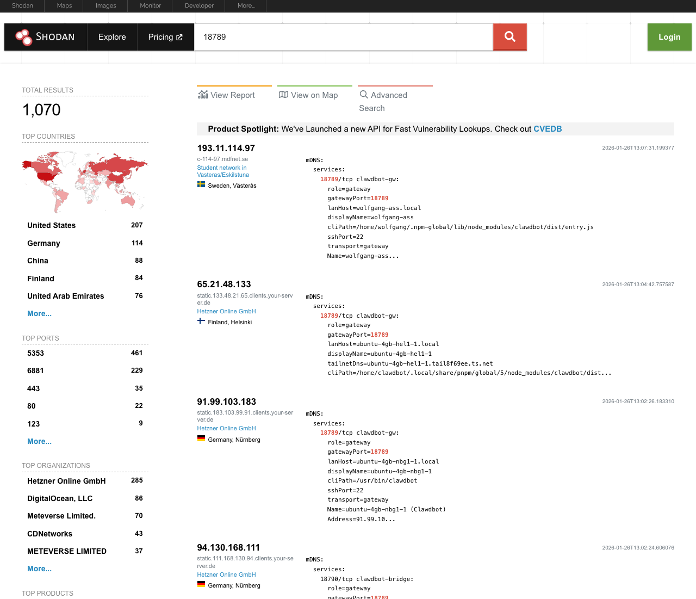

{}
**Update (January 2026):** Clawdbot is now **Moltbot** (and Clawd is now **Molty**). Anthropic asked for the change due to trademark issues. The CLI command is now `moltbot` and the new handle is [@moltbot](https://x.com/moltbot).
{}

Moltbot is everywhere right now. The open-source AI assistant [gained 9,000 GitHub stars in a single day](https://news.aibase.com/news/24901), received public praise from former Tesla AI head Andrej Karpathy, and has sparked a global run on Mac Minis as developers scramble to give this "lobster assistant" a home. Users are calling it "Jarvis living in a hard drive" and "Claude with hands"—the personal AI assistant that Siri promised but never delivered.

<!--more-->

The Mac Mini craze is real: [people are buying dedicated hardware just to run Moltbot](https://medium.com/@orami98/why-ai-enthusiasts-are-racing-to-buy-mac-minis-inside-the-clawdbot-phenomenon-16263ae0aa0a), with some enthusiasts [purchasing 40 Mac Minis at once](https://eu.36kr.com/en/p/3655411080568966). Even Logan Kilpatrick from Google DeepMind couldn't resist ordering one. But here's the thing: [you don't actually need a Mac Mini](https://dev.to/sivarampg/you-dont-need-a-mac-mini-to-run-clawdbot-heres-how-to-run-it-anywhere-217l). Moltbot runs anywhere: on a VPS, in the cloud, or on that old laptop gathering dust.

With all this hype, I had to try it myself. But instead of clicking through the AWS console or running manual commands on a VPS, I wanted to do it right from the start: infrastructure as code with Pulumi. Why? Because when I inevitably want to tear it down, spin up a new instance, or deploy to a different region, I don't want to remember which buttons I clicked three weeks ago. I want a single `pulumi up` command.

[Dan](https://x.com/d4m1n/status/2015335493886493056) got the assignment right:


In this post, I'll show you how to deploy [Moltbot](https://molt.bot/) to AWS or Hetzner Cloud (if you want European data residency or just want to spend less). We'll use Pulumi to define the infrastructure and Tailscale to keep your AI assistant off the public internet.

<!--more-->

## What is Moltbot?

Moltbot is an open-source AI assistant created by [Peter Steinberger](https://x.com/steipete) that runs on your own infrastructure. It connects to WhatsApp, Slack, Discord, Google Chat, Signal, and iMessage. It can control browsers, generate videos and images, clone your voice for voice notes, and run scheduled tasks via cron. There's a skills system for extending functionality, and you can run it on pretty much anything: Mac Mini, Raspberry Pi, VPS, laptop, or gaming PC.

The difference from cloud-hosted AI? Moltbot runs on your server, not Anthropic's. It's available 24/7 across all your devices, can schedule automated tasks, and keeps your entire conversation history locally. Check the [official Moltbot documentation](https://docs.molt.bot/) for the full feature list.

## Prerequisites

Before getting started, ensure you have:

- [Pulumi CLI](/docs/iac/download-install/) installed and configured
- A [Pulumi Cloud account](https://app.pulumi.com/signup)
- AWS account (for AWS deployment)
- Hetzner Cloud account (for European deployment)
- Anthropic API key
- Node.js 18+ installed
- Tailscale account with [HTTPS enabled](https://tailscale.com/kb/1153/enabling-https) (one-time setup in admin console)

{}
This guide uses Anthropic's API, but Moltbot works with other providers too. Check the [providers documentation](https://docs.molt.bot/providers) if you'd rather use OpenAI, Google Gemini, or a local model via Ollama.
{}

## Understanding Moltbot architecture

Moltbot uses a gateway-centric architecture where a single daemon acts as the control plane for all messaging, tool execution, and client connections:

| Component | Port | Description |
|-----------|------|-------------|
| Gateway | 18789 | WebSocket server handling channels, nodes, sessions, and hooks |
| Browser control | 18791 | Headless Chrome instance for web automation |
| Docker sandbox | - | Isolated container environment for running tools safely |

The Gateway connects to messaging platforms (WhatsApp, Slack, Discord, etc.), the CLI, the web UI, and mobile apps. The Browser component lets Moltbot open web pages, fill forms, scrape data, and download files. Docker sandboxing runs bash commands in isolated containers so your bot can execute code without risking your host system.

## Setting up ESC for secrets management

Deploying Moltbot means handling sensitive credentials: API keys, auth tokens, cloud provider secrets. You don't want these hardcoded or scattered across environment variables. [Pulumi ESC (Environments, Secrets, and Configuration)](/docs/esc/) stores them securely and passes them directly to your Pulumi program.

Create a new ESC environment:

```bash
pulumi env init <your-org>/moltbot-secrets
```

Add your secrets to the environment:

```yaml
values:
  anthropicApiKey:
    fn::secret: "sk-ant-xxxxx"
  tailscaleAuthKey:
    fn::secret: "tskey-auth-xxxxx"
  tailnetDnsName: "tailxxxxx.ts.net"
  hcloudToken:
    fn::secret: "your-hetzner-api-token"
  pulumiConfig:
    anthropicApiKey: ${anthropicApiKey}
    tailscaleAuthKey: ${tailscaleAuthKey}
    tailnetDnsName: ${tailnetDnsName}
    hcloud:token: ${hcloudToken}
```

{}
To find your Tailnet DNS name, go to the [Tailscale admin console](https://login.tailscale.com/admin/dns), look under the **DNS** section, and find your tailnet name (e.g., `tailxxxxx.ts.net`). This is the domain suffix used for all machines in your Tailscale network.
{}

Then create a `Pulumi.dev.yaml` file in your project to reference the environment:

```yaml
environment:
  - <your-org>/moltbot-secrets
```

This approach keeps your secrets out of your codebase and passes them directly to Moltbot during automated onboarding.

## Securing with Tailscale

By default, deploying Moltbot exposes SSH (port 22), the gateway (port 18789), and browser control (port 18791) to the public internet. This is convenient for testing but not ideal for production use.

[Tailscale](https://tailscale.com/) creates a secure mesh VPN that lets you access your Moltbot instance without exposing unnecessary ports publicly. When you provide a Tailscale auth key, the Pulumi program:

1. **Removes gateway and browser ports** from public access
1. **Keeps SSH as fallback** for debugging if Tailscale setup fails
1. **Installs Tailscale** on the instance during provisioning (after other dependencies)
1. **Enables Tailscale SSH** so you can SSH via Tailscale without managing keys
1. **Joins your Tailnet** automatically using the auth key

{}
The Pulumi program installs Docker, Node.js, and Moltbot first, then configures Tailscale last. This ensures that even if the Tailscale auth key is invalid or expired, you can still SSH in via the public IP to troubleshoot.
{}

To generate a Tailscale auth key:

1. Go to [Tailscale Admin Console](https://login.tailscale.com/admin/settings/keys)
1. Click "Generate auth key"
1. Enable "Reusable" if you plan to redeploy
1. Copy the key and add it to your ESC environment

## Deploying to AWS

Let's walk through the complete AWS deployment. Create a new Pulumi project:

```bash
mkdir moltbot-aws && cd moltbot-aws
pulumi new typescript
```

Install the required dependencies:

```bash
npm install @pulumi/aws @pulumi/tls
```

{}
Do not use `t3.micro` instances for Moltbot. The 1 GB memory is insufficient for installation. Use `t3.medium` (4 GB) or `t3.large` (8 GB) instead.
{}

### The Pulumi program

Running Moltbot on AWS means setting up a VPC, subnets, security groups, an EC2 instance, SSH keys, and a cloud-init script that installs everything. That's a lot of clicking in the AWS console. The Pulumi program below defines all of it in code.

Replace the contents of `index.ts` with the following:

```typescript
import * as pulumi from "@pulumi/pulumi";
import * as aws from "@pulumi/aws";
import * as tls from "@pulumi/tls";

const config = new pulumi.Config();

const instanceType = config.get("instanceType") ?? "t3.medium";
const anthropicApiKey = config.requireSecret("anthropicApiKey");
const model = config.get("model") ?? "anthropic/claude-sonnet-4";
const enableSandbox = config.getBoolean("enableSandbox") ?? true;
const gatewayPort = config.getNumber("gatewayPort") ?? 18789;
const browserPort = config.getNumber("browserPort") ?? 18791;

const tailscaleAuthKey = config.requireSecret("tailscaleAuthKey");
const tailnetDnsName = config.require("tailnetDnsName");

// Generate a random token for gateway authentication
const gatewayToken = new tls.PrivateKey("moltbot-gateway-token", {
    algorithm: "ED25519",
}).publicKeyOpenssh.apply(key => {
    const hash = require("crypto").createHash("sha256").update(key).digest("hex");
    return hash.substring(0, 48);
});

const sshKey = new tls.PrivateKey("moltbot-ssh-key", {
    algorithm: "ED25519",
});

const vpc = new aws.ec2.Vpc("moltbot-vpc", {
    cidrBlock: "10.0.0.0/16",
    enableDnsHostnames: true,
    enableDnsSupport: true,
    tags: { Name: "moltbot-vpc" },
});

const gateway = new aws.ec2.InternetGateway("moltbot-igw", {
    vpcId: vpc.id,
    tags: { Name: "moltbot-igw" },
});

const subnet = new aws.ec2.Subnet("moltbot-subnet", {
    vpcId: vpc.id,
    cidrBlock: "10.0.1.0/24",
    mapPublicIpOnLaunch: true,
    tags: { Name: "moltbot-subnet" },
});

const routeTable = new aws.ec2.RouteTable("moltbot-rt", {
    vpcId: vpc.id,
    routes: [
        {
            cidrBlock: "0.0.0.0/0",
            gatewayId: gateway.id,
        },
    ],
    tags: { Name: "moltbot-rt" },
});

new aws.ec2.RouteTableAssociation("moltbot-rta", {
    subnetId: subnet.id,
    routeTableId: routeTable.id,
});

const securityGroup = new aws.ec2.SecurityGroup("moltbot-sg", {
    vpcId: vpc.id,
    description: "Security group for Moltbot instance",
    ingress: [
        {
            description: "SSH access (fallback)",
            fromPort: 22,
            toPort: 22,
            protocol: "tcp",
            cidrBlocks: ["0.0.0.0/0"],
        },
    ],
    egress: [
        {
            fromPort: 0,
            toPort: 0,
            protocol: "-1",
            cidrBlocks: ["0.0.0.0/0"],
        },
    ],
    tags: { Name: "moltbot-sg" },
});

const keyPair = new aws.ec2.KeyPair("moltbot-keypair", {
    publicKey: sshKey.publicKeyOpenssh,
});

const ami = aws.ec2.getAmiOutput({
    owners: ["099720109477"],
    mostRecent: true,
    filters: [
        { name: "name", values: ["ubuntu/images/hvm-ssd-gp3/ubuntu-noble-24.04-amd64-server-*"] },
        { name: "virtualization-type", values: ["hvm"] },
    ],
});

const userData = pulumi
    .all([tailscaleAuthKey, anthropicApiKey, gatewayToken])
    .apply(([tsAuthKey, apiKey, gwToken]) => {
        return `#!/bin/bash
set -e

export DEBIAN_FRONTEND=noninteractive

# System updates
apt-get update
apt-get upgrade -y

# Install Docker
curl -fsSL https://get.docker.com | sh
systemctl enable docker
systemctl start docker
usermod -aG docker ubuntu

# Install NVM and Node.js for ubuntu user
sudo -u ubuntu bash << 'UBUNTU_SCRIPT'
set -e
cd ~

# Install NVM
curl -o- https://raw.githubusercontent.com/nvm-sh/nvm/v0.40.1/install.sh | bash

# Load NVM
export NVM_DIR="$HOME/.nvm"
[ -s "$NVM_DIR/nvm.sh" ] && . "$NVM_DIR/nvm.sh"

# Install Node.js 22
nvm install 22
nvm use 22
nvm alias default 22

# Install Moltbot
npm install -g moltbot@beta

# Add NVM to bashrc if not already there
if ! grep -q 'NVM_DIR' ~/.bashrc; then
    echo 'export NVM_DIR="$HOME/.nvm"' >> ~/.bashrc
    echo '[ -s "$NVM_DIR/nvm.sh" ] && . "$NVM_DIR/nvm.sh"' >> ~/.bashrc
fi
UBUNTU_SCRIPT

# Set environment variables for ubuntu user
echo 'export ANTHROPIC_API_KEY="${apiKey}"' >> /home/ubuntu/.bashrc

# Install and configure Tailscale
echo "Installing Tailscale..."
curl -fsSL https://tailscale.com/install.sh | sh
tailscale up --authkey="${tsAuthKey}" --ssh || echo "WARNING: Tailscale setup failed. Run 'sudo tailscale up' manually."

# Enable systemd linger for ubuntu user (required for user services to run at boot)
loginctl enable-linger ubuntu

# Start user's systemd instance (required for user services during cloud-init)
systemctl start user@1000.service

# Run Moltbot onboarding as ubuntu user (skip daemon install, do it separately)
echo "Running Moltbot onboarding..."
sudo -H -u ubuntu ANTHROPIC_API_KEY="${apiKey}" GATEWAY_PORT="${gatewayPort}" bash -c '
export HOME=/home/ubuntu
export NVM_DIR="$HOME/.nvm"
[ -s "$NVM_DIR/nvm.sh" ] && . "$NVM_DIR/nvm.sh"

moltbot onboard --non-interactive --accept-risk \
    --mode local \
    --auth-choice apiKey \
    --gateway-port $GATEWAY_PORT \
    --gateway-bind loopback \
    --skip-daemon \
    --skip-skills || echo "WARNING: Moltbot onboarding failed. Run moltbot onboard manually."
'

# Install daemon service with XDG_RUNTIME_DIR set
echo "Installing Moltbot daemon..."
sudo -H -u ubuntu XDG_RUNTIME_DIR=/run/user/1000 bash -c '
export HOME=/home/ubuntu
export NVM_DIR="$HOME/.nvm"
[ -s "$NVM_DIR/nvm.sh" ] && . "$NVM_DIR/nvm.sh"

moltbot daemon install || echo "WARNING: Daemon install failed. Run moltbot daemon install manually."
'

# Configure gateway for Tailscale Serve (trustedProxies + skip device pairing + set token)
echo "Configuring gateway for Tailscale Serve..."
sudo -H -u ubuntu GATEWAY_TOKEN="${gwToken}" python3 << 'PYTHON_SCRIPT'
import json
import os
config_path = "/home/ubuntu/.moltbot/moltbot.json"
with open(config_path) as f:
    config = json.load(f)
config["gateway"]["trustedProxies"] = ["127.0.0.1"]
config["gateway"]["controlUi"] = {
    "enabled": True,
    "allowInsecureAuth": True
}
config["gateway"]["auth"] = {
    "mode": "token",
    "token": os.environ["GATEWAY_TOKEN"]
}
with open(config_path, "w") as f:
    json.dump(config, f, indent=2)
print("Configured gateway with trustedProxies, controlUi, and token")
PYTHON_SCRIPT

# Enable Tailscale HTTPS proxy (requires HTTPS to be enabled in Tailscale admin console)
echo "Enabling Tailscale HTTPS proxy..."
tailscale serve --bg ${gatewayPort} || echo "WARNING: tailscale serve failed. Enable HTTPS in your Tailscale admin console first."

echo "Moltbot setup complete!"
`;
    });

const instance = new aws.ec2.Instance("moltbot-instance", {
    ami: ami.id,
    instanceType: instanceType,
    subnetId: subnet.id,
    vpcSecurityGroupIds: [securityGroup.id],
    keyName: keyPair.keyName,
    userData: userData,
    userDataReplaceOnChange: true,
    rootBlockDevice: {
        volumeSize: 30,
        volumeType: "gp3",
    },
    tags: { Name: "moltbot" },
});

export const publicIp = instance.publicIp;
export const publicDns = instance.publicDns;
export const privateKey = sshKey.privateKeyOpenssh;

// Construct the Tailscale MagicDNS hostname from the private IP
// AWS private IPs like 10.0.1.15 become hostnames like ip-10-0-1-15
const tailscaleHostname = instance.privateIp.apply(ip =>
    `ip-${ip.replace(/\./g, "-")}`
);

export const tailscaleUrl = pulumi.interpolate`https://${tailscaleHostname}.${tailnetDnsName}/`;
export const tailscaleUrlWithToken = pulumi.interpolate`https://${tailscaleHostname}.${tailnetDnsName}/?token=${gatewayToken}`;
export const gatewayTokenOutput = gatewayToken;
```

## Deploying to Hetzner

Hetzner Cloud is a solid choice if you need European data residency or want to spend less money. Spoiler: it's a lot less money.

Hetzner has similar concepts to AWS but different names. EC2 instances become Servers. Security groups become Firewalls. Same idea, different provider. The resource types come from `@pulumi/hcloud`.

Create a new project for Hetzner:

```bash
mkdir moltbot-hetzner && cd moltbot-hetzner
pulumi new typescript
```

Install the Hetzner provider:

```bash
npm install @pulumi/hcloud @pulumi/tls
```

{}
The default server type `cax21` is an ARM-based (Ampere) instance with 4 vCPUs and 8 GB RAM. ARM instances cost less for the same compute. If you need x86 architecture, use `ccx13` or similar CCX series instead.
{}

### The Hetzner Pulumi program

Replace `index.ts` with the following:

```typescript
import * as pulumi from "@pulumi/pulumi";
import * as hcloud from "@pulumi/hcloud";
import * as tls from "@pulumi/tls";

const config = new pulumi.Config();

const serverType = config.get("serverType") ?? "cax21";
const location = config.get("location") ?? "fsn1";
const anthropicApiKey = config.requireSecret("anthropicApiKey");
const model = config.get("model") ?? "anthropic/claude-sonnet-4";
const enableSandbox = config.getBoolean("enableSandbox") ?? true;
const gatewayPort = config.getNumber("gatewayPort") ?? 18789;
const browserPort = config.getNumber("browserPort") ?? 18791;

const tailscaleAuthKey = config.requireSecret("tailscaleAuthKey");
const tailnetDnsName = config.require("tailnetDnsName");

// Generate a random token for gateway authentication
const gatewayToken = new tls.PrivateKey("moltbot-gateway-token", {
    algorithm: "ED25519",
}).publicKeyOpenssh.apply(key => {
    const hash = require("crypto").createHash("sha256").update(key).digest("hex");
    return hash.substring(0, 48);
});

const sshKey = new tls.PrivateKey("moltbot-ssh-key", {
    algorithm: "ED25519",
});

const hcloudSshKey = new hcloud.SshKey("moltbot-sshkey", {
    publicKey: sshKey.publicKeyOpenssh,
});

const firewallRules: hcloud.types.input.FirewallRule[] = [
    {
        direction: "out",
        protocol: "tcp",
        port: "any",
        destinationIps: ["0.0.0.0/0", "::/0"],
        description: "Allow all outbound TCP",
    },
    {
        direction: "out",
        protocol: "udp",
        port: "any",
        destinationIps: ["0.0.0.0/0", "::/0"],
        description: "Allow all outbound UDP",
    },
    {
        direction: "out",
        protocol: "icmp",
        destinationIps: ["0.0.0.0/0", "::/0"],
        description: "Allow all outbound ICMP",
    },
    {
        direction: "in",
        protocol: "tcp",
        port: "22",
        sourceIps: ["0.0.0.0/0", "::/0"],
        description: "SSH access (fallback)",
    },
];

const firewall = new hcloud.Firewall("moltbot-firewall", {
    rules: firewallRules,
});

const userData = pulumi
    .all([tailscaleAuthKey, anthropicApiKey, gatewayToken])
    .apply(([tsAuthKey, apiKey, gwToken]) => {
        return `#!/bin/bash
set -e

export DEBIAN_FRONTEND=noninteractive

# System updates
apt-get update
apt-get upgrade -y

# Install Docker
curl -fsSL https://get.docker.com | sh
systemctl enable docker
systemctl start docker

# Create ubuntu user (Hetzner uses root by default)
useradd -m -s /bin/bash -G docker ubuntu || true

# Install NVM and Node.js for ubuntu user
sudo -u ubuntu bash << 'UBUNTU_SCRIPT'
set -e
cd ~

# Install NVM
curl -o- https://raw.githubusercontent.com/nvm-sh/nvm/v0.40.1/install.sh | bash

# Load NVM
export NVM_DIR="$HOME/.nvm"
[ -s "$NVM_DIR/nvm.sh" ] && . "$NVM_DIR/nvm.sh"

# Install Node.js 22
nvm install 22
nvm use 22
nvm alias default 22

# Install Moltbot
npm install -g moltbot@beta

# Add NVM to bashrc if not already there
if ! grep -q 'NVM_DIR' ~/.bashrc; then
    echo 'export NVM_DIR="$HOME/.nvm"' >> ~/.bashrc
    echo '[ -s "$NVM_DIR/nvm.sh" ] && . "$NVM_DIR/nvm.sh"' >> ~/.bashrc
fi
UBUNTU_SCRIPT

# Set environment variables for ubuntu user
echo 'export ANTHROPIC_API_KEY="${apiKey}"' >> /home/ubuntu/.bashrc

# Install and configure Tailscale
echo "Installing Tailscale..."
curl -fsSL https://tailscale.com/install.sh | sh
tailscale up --authkey="${tsAuthKey}" --ssh || echo "WARNING: Tailscale setup failed. Run 'sudo tailscale up' manually."

# Enable systemd linger for ubuntu user (required for user services to run at boot)
loginctl enable-linger ubuntu

# Start user's systemd instance (required for user services during cloud-init)
systemctl start user@1000.service

# Run Moltbot onboarding as ubuntu user (skip daemon install, do it separately)
echo "Running Moltbot onboarding..."
sudo -H -u ubuntu ANTHROPIC_API_KEY="${apiKey}" GATEWAY_PORT="${gatewayPort}" bash -c '
export HOME=/home/ubuntu
export NVM_DIR="$HOME/.nvm"
[ -s "$NVM_DIR/nvm.sh" ] && . "$NVM_DIR/nvm.sh"

moltbot onboard --non-interactive --accept-risk \
    --mode local \
    --auth-choice apiKey \
    --gateway-port $GATEWAY_PORT \
    --gateway-bind loopback \
    --skip-daemon \
    --skip-skills || echo "WARNING: Moltbot onboarding failed. Run moltbot onboard manually."
'

# Install daemon service with XDG_RUNTIME_DIR set
echo "Installing Moltbot daemon..."
sudo -H -u ubuntu XDG_RUNTIME_DIR=/run/user/1000 bash -c '
export HOME=/home/ubuntu
export NVM_DIR="$HOME/.nvm"
[ -s "$NVM_DIR/nvm.sh" ] && . "$NVM_DIR/nvm.sh"

moltbot daemon install || echo "WARNING: Daemon install failed. Run moltbot daemon install manually."
'

# Configure gateway for Tailscale Serve (trustedProxies + skip device pairing + set token)
echo "Configuring gateway for Tailscale Serve..."
sudo -H -u ubuntu GATEWAY_TOKEN="${gwToken}" python3 << 'PYTHON_SCRIPT'
import json
import os
config_path = "/home/ubuntu/.moltbot/moltbot.json"
with open(config_path) as f:
    config = json.load(f)
config["gateway"]["trustedProxies"] = ["127.0.0.1"]
config["gateway"]["controlUi"] = {
    "enabled": True,
    "allowInsecureAuth": True
}
config["gateway"]["auth"] = {
    "mode": "token",
    "token": os.environ["GATEWAY_TOKEN"]
}
with open(config_path, "w") as f:
    json.dump(config, f, indent=2)
print("Configured gateway with trustedProxies, controlUi, and token")
PYTHON_SCRIPT

# Enable Tailscale HTTPS proxy (requires HTTPS to be enabled in Tailscale admin console)
echo "Enabling Tailscale HTTPS proxy..."
tailscale serve --bg ${gatewayPort} || echo "WARNING: tailscale serve failed. Enable HTTPS in your Tailscale admin console first."

echo "Moltbot setup complete!"
`;
    });

const server = new hcloud.Server("moltbot-server", {
    serverType: serverType,
    location: location,
    image: "ubuntu-24.04",
    sshKeys: [hcloudSshKey.id],
    firewallIds: [firewall.id.apply(id => Number(id))],
    userData: userData,
    labels: {
        purpose: "moltbot",
    },
});

export const ipv4Address = server.ipv4Address;
export const privateKey = sshKey.privateKeyOpenssh;

// Construct the Tailscale MagicDNS hostname from the server name
// Hetzner servers use their name as the hostname
const tailscaleHostname = server.name;

export const tailscaleUrl = pulumi.interpolate`https://${tailscaleHostname}.${tailnetDnsName}/`;
export const tailscaleUrlWithToken = pulumi.interpolate`https://${tailscaleHostname}.${tailnetDnsName}/?token=${gatewayToken}`;
export const gatewayTokenOutput = gatewayToken;
```

You can find both programs in the Pulumi examples repo under `moltbot/`:



## Cost comparison

Before deploying, let's compare the costs between AWS and Hetzner for running Moltbot 24/7:

| | AWS (t3.medium) | Hetzner (cax21) |
|---|---|---|
| **vCPUs** | 2 | 4 |
| **Memory** | 4 GB | 8 GB |
| **Storage** | 30 GB gp3 (+$2.40/mo) | 80 GB NVMe (included) |
| **Traffic** | Pay per GB | 20 TB included |
| **Architecture** | x86 (Intel/AMD) | ARM (Ampere) |
| **Hourly price** | $0.0416 | €0.0104 (~$0.011) |
| **Monthly price** | ~$33 (with storage) | €6.49 (~$7) |
| **Annual cost** | ~$396 | ~$84 |

Hetzner gives you double the vCPUs, double the RAM, at less than a quarter of the price. The trade-off? ARM architecture instead of x86. But Moltbot doesn't care - it's just Node.js and Docker.

{}
Prices are for on-demand instances as of January 2026. AWS prices are for us-east-1; Hetzner prices exclude VAT. Both include standard networking and storage. Check [AWS EC2 pricing](https://aws.amazon.com/ec2/pricing/on-demand/) and [Hetzner Cloud pricing](https://www.hetzner.com/cloud/) for current rates.
{}

## Running the deployment

With your ESC environment configured in `Pulumi.dev.yaml`, deploy with:

```bash
pulumi up
```

After deployment completes, you'll see outputs similar to:

```text
Outputs:
    gatewayTokenOutput   : "786c099cc8f8bf20dbebf40b8b51b75cf5cdab25..."
    privateKey           : [secret]
    publicDns            : "ec2-x-x-x-x.compute-1.amazonaws.com"
    publicIp             : "x.x.x.x"
    tailscaleUrl         : "https://ip-10-0-1-x.tailxxxxx.ts.net/"
    tailscaleUrlWithToken: "https://ip-10-0-1-x.tailxxxxx.ts.net/?token=786c099..."
```

The `tailscaleUrlWithToken` output provides the complete URL with authentication token. Copy and paste it into your browser to access the Moltbot web UI.

{}
Output names vary slightly between providers: AWS uses `publicIp` and `publicDns`, while Hetzner uses `ipv4Address`. The Tailscale hostname is derived from the instance's private IP (AWS) or server name (Hetzner).
{}

## Automated onboarding

The Pulumi program runs Moltbot's non-interactive onboarding during instance provisioning. It uses your Anthropic API key from ESC, binds the gateway to loopback with Tailscale Serve as the HTTPS proxy, generates a secure gateway token (exported in Pulumi outputs), installs the daemon as a systemd user service, and configures `trustedProxies` and `controlUi.allowInsecureAuth` to skip device pairing when accessed via Tailscale.

The cloud-init script runs `moltbot onboard --non-interactive` with all necessary flags, then configures the gateway for secure Tailscale access. Your instance is ready as soon as provisioning finishes.

### Access the web UI

The easiest way to access the Moltbot web UI is to use the `tailscaleUrlWithToken` output from Pulumi:

```bash
# Get the full URL with token
pulumi stack output tailscaleUrlWithToken
```

Copy and paste this URL into your browser. The URL includes both the Tailscale MagicDNS hostname and the authentication token, so you can access the web UI directly.

{}
**Finding your Tailnet DNS name**: Go to the [Tailscale admin console](https://login.tailscale.com/admin/dns) and look under the **DNS** section for your tailnet name (e.g., `tailxxxxx.ts.net`). You can also find your machines and their MagicDNS hostnames in the [Machines tab](https://login.tailscale.com/admin/machines).
{}

{}
Token-based authentication provides an additional layer of security on top of Tailscale's network-level authentication. Only devices on your Tailnet can reach the URL, and the token prevents unauthorized access if someone gains access to your Tailnet.
{}

From the web UI, you can connect messaging channels (WhatsApp, Discord, Slack), configure skills and integrations, and manage settings.

### Verify the deployment

After deployment completes, SSH into your instance to verify everything is running:

```bash
# Check your Tailscale admin console for the new machine
ssh ubuntu@<tailscale-ip>

# Check Moltbot gateway status
systemctl --user status moltbot-gateway
```

### Test your assistant

{}
The cloud-init script needs a few minutes to finish. It installs Docker, Node.js, Moltbot, and Tailscale, then runs onboarding and starts the daemon. If you hit the URL right after `pulumi up` completes, the gateway probably won't be ready yet. Give it 2-3 minutes.
{}

Open the gateway dashboard using the `tailscaleUrlWithToken` output and use the built-in chat to test your assistant:


Your personal AI assistant is now running 24/7 on your own infrastructure, accessible securely through Tailscale.

## Security considerations

When self-hosting an AI assistant, security matters. Moltbot's rapid adoption meant thousands of instances spun up in days, and not everyone locked them down. The community noticed:


The tweet isn't exaggerating. A quick Shodan search shows exposed gateways on port 18789 with shell access, browser automation, and API keys up for grabs:



Don't let your instance be one of them.

| Concern | Without Tailscale | With Tailscale |
|---------|-------------------|----------------|
| SSH access | Public (port 22 open) | Public fallback + Tailscale SSH |
| Gateway access | Public (port 18789 open) | Private (Tailscale only) |
| Browser control | Public (port 18791 open) | Private (Tailscale only) |
| API keys in transit | Exposed if gateway accessed over HTTP | Protected by Tailscale encryption |
| Attack surface | 3 open ports | 1 open port (SSH fallback) |

{}
SSH remains accessible as a fallback even with Tailscale enabled. This allows you to troubleshoot if Tailscale fails to connect. Once you've confirmed Tailscale is working, you can manually remove the SSH ingress rule from your security group for maximum security.
{}

My recommendations:

- Always use Tailscale for production
- Rotate your auth keys periodically
- Use Pulumi ESC for secrets instead of hardcoding
- Enable Tailscale SSH to avoid managing keys manually
- Monitor your Tailscale admin console for unauthorized devices
- Remove the SSH fallback after confirming Tailscale works if you want zero public ports

## What's next?

Now that Moltbot is running, you can install skills (voice generation, video creation, browser automation), set up scheduled tasks with cron, invite colleagues to your Tailnet for shared access, or connect additional channels like WhatsApp and Discord.

## Conclusion

Deploying Moltbot with infrastructure as code means you can reproduce your setup anytime, version control it, and tear it down with a single command. Adding Tailscale keeps it private - no exposed ports, no hoping you configured your firewall correctly at 2am.

If you run into issues or have questions, drop by the [Pulumi Community Slack](https://slack.pulumi.com/) or [GitHub Discussions](https://github.com/pulumi/pulumi/discussions).

New to Pulumi? [Get started here](/docs/get-started/).
