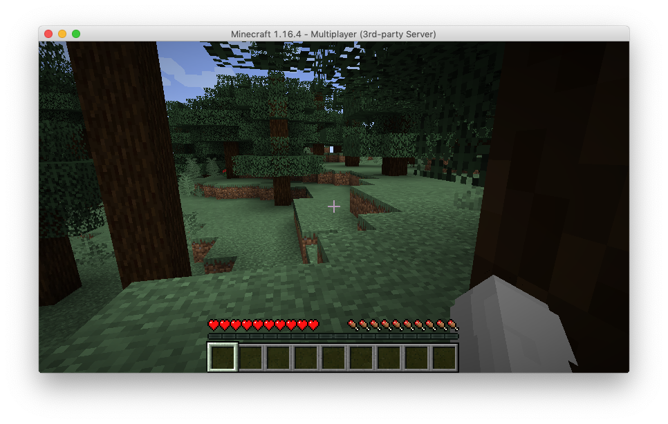

This article demonstrates how to deploy and provision a virtual machine in Azure using the Pulumi [Next Generation Azure provider](). While there are numerous examples of using the Azure console, the Azure CLI, or ARM templates to deploy and provision virtual machines, we'll use Python to implement a repeatable deployment.

<!--more-->

## Build it

There are several parts to the process. First, we need to create the network resources to make the virtual machine accessible to Minecraft clients. Second, the virtual machine needs to be created and configured with network resources, storage for server files and logs, and a way to administer it remotely. Finally, the virtual machine needs to be provisioned with the server and all the dependencies that it requires, such as Java. Let's go step by step through the process.

### Resource Group

[Resource groups](https://docs.microsoft.com/en-us/azure/azure-resource-manager/management/manage-resource-groups-portal) hold all the resources that you use for building infrastructure on Azure. They can contain all the resources for your Azure infrastructure or only the resources that you want to manage together. Resource groups let you deploy, update, and delete resources as a group.

Declaring a resource group with Pulumi is straightforward and requires a name and the location of the region.

```python
resource_group = resources.ResourceGroup("server-rg",
    resource_group_name="minecraft",
    location=location)
```

### Networking resources

Next, we want to create all the resources needed to deploy a virtual machine as a server and make it accessible to clients on the Internet, which, in our case, is a Minecraft client.

We'll create a virtual network for the server to communicate with other resources and to the Internet. The virtual network needs the resource group name, the location, and a name. We set a private IP address range and Azure will assign an IP address if a resource is deployed in that address space.

```python
net = network.VirtualNetwork(
    "server-network",
    resource_group_name=resource_group.name,
    location=location,
    virtual_network_name="server-network",
    address_space=network.AddressSpaceArgs(
        address_prefixes=["10.0.0.0/16"],
    ),
    subnets=[network.SubnetArgs(
        name="default",
        address_prefix="10.0.0.0/24",
    )]
)
```

To make the virtual machine accessible on the Internet, we create a public IP. The public IP address is dedicated to a resource unless they are unassigned by you. They are resources in their own right and can be associated with other resources such as firewalls, load balancers, and virtual machines.

```python
public_ip = network.PublicIPAddress(
    "server-ip",
    resource_group_name=resource_group.name,
    location=location,
    public_ip_address_name="server-ip",
    public_ip_allocation_method="Dynamic"
)
```

Finally, we need a resource to tie the virtual network to the virtual machine. A network interface lets a virtual machine communicate with other resources in the resource group and the Internet. In the code below we specify the subnet we created in the virtual network and set the public IP to the resource we previously created.

```python
network_iface = network.NetworkInterface(
    "server-nic",
    resource_group_name=resource_group.name,
    location=resource_group.location,
    network_interface_name="server-nic",
    ip_configurations=[network.NetworkInterfaceIPConfigurationArgs(
        name="webserveripcfg",
        subnet=network.SubnetArgs(id=net.subnets[0].id),
        private_ip_allocation_method="Dynamic",
        public_ip_address=network.PublicIPAddressArgs(id=public_ip.id),
    )]
)
```

Now that we have the networking resources available let's create the virtual machine.

### Virtual machine

There are several parts to creating a virtual machine, so we'll go through the code piece by piece. In the previous step, we created a network interface resource. We'll use that to set up the network profile for the virtual machine.

```python
network_profile=compute.NetworkProfileArgs(
        network_interfaces=[
            compute.NetworkInterfaceReferenceArgs(id=network_iface.id),
        ],
    ),
```

Next, we set the hardware profile that sets the [virtual machine size](https://docs.microsoft.com/en-us/azure/virtual-machines/sizes), determining the number of cores, amount of memory, and storage size.

```python
    hardware_profile=compute.HardwareProfileArgs(
        vm_size="Standard_A2",
    ),
```

We need to set up access to the virtual machine. The code below sets the user name and optionally the password if needed. We disable password authentication and opt to use OpenSSH keypairs to authenticate logins to the virtual machine.

```python
os_profile=compute.OSProfileArgs(
        computer_name="hostname",
        admin_username=admin_username,
        #admin_password=admin_password,
        linux_configuration=compute.LinuxConfigurationArgs(
            disable_password_authentication=True,
            ssh= {
                'publicKeys': [{
                    'keyData': public_key,
                    'path': ssh_path,
                }],
            },
        ),
    ),
```

To complete the virtual machine, we add storage via an OS disk. Note that OS disks are ephemeral and they will not retain data if the virtual machine is terminated.

```python
storage_profile=compute.StorageProfileArgs(
        os_disk=compute.OSDiskArgs(
            create_option="FromImage",
            name="myosdisk1",
            caching= "ReadWrite",
            disk_size_gb= 100,
        ),
        image_reference=compute.ImageReferenceArgs(
            publisher="canonical",
            offer="UbuntuServer",
            sku="18.04-LTS",
            version="latest",
        ),
    ),
```

### Provisioning the server

Once the virtual machine has been created, we need to provision it with the Minecraft server. The `install.sh` script installs the prerequisite software, the Minecraft server, and creates the service for starting and stopping the server. We could use [scp](https://man7.org/linux/man-pages/man1/scp.1.html) to copy the install script to the virtual machine from our local machine and then [ssh](https://man7.org/linux/man-pages/man1/ssh.1.html) into a terminal to run the script. The alternative is to use a Pulumi [dynamic resource provider]() to provision the virtual machine.  The `provisioners.py` script creates a dynamic provider that enable using scp to transfer files and send commands via ssh. Creating dynamic providers are beyond the scope of this article, but more information is [available]() on the Pulumi docs.

We provision our Minecraft server by creating the `conn` connection object defined in `provisioners.py`.

```python
conn = provisioners.ConnectionArgs(
    host= public_ip_addr.ip_address,
    username=admin_username,
    private_key=private_key,
    private_key_passphrase=private_key_passphrase,
)
```

We pass in the `conn` object to the CopyFile method which copies `install.sh` to the virtual machine via scp.

```python
cp_config = provisioners.CopyFile('config',
    conn=conn,
    src='install.sh',
    dest='install.sh',
    opts=pulumi.ResourceOptions(depends_on=[server]),
)
```

To provision the virtual machine, we call the `RemoteExec` method to make `install.sh` executable and run the script as root. The script installs all the prerequisites including Java, downloads the Minecraft server jar and configures it, and creates a service to run the Minecraft server.

```python
install = provisioners.RemoteExec('install',
    conn=conn,
    commands=['sudo chmod 755 install.sh && sudo ./install.sh'],
    opts=pulumi.ResourceOptions(depends_on=[cp_config]),
)
```

Once the virtual machine is created and provisioned, we publish the virtual machines public IP address, and we're ready to join the server!

```python
export("Minecraft Server IP Address", public_ip_addr.ip_address)
```



## Next Steps

This article demonstrates the process to create a virtual machine and provision it with a Minecraft server. However, there's always room for improvement, such as adding Azure Disk Storage to provide durable storage, add a configuration file to customize the server, and automatically updating the server jar file when a new version is released. All these options are available to you when you build your infrastructure with code.

You can download the [code](https://github.com/pulumi/examples/tree/master/azure-nextgen-py-minecraft-server) from the Pulumi examples repository on Github.

See these resources to learn more about deploying infrastructure on Azure.

- [Get Started with Azure]()
- [Azure Cloud Provider]()
- [Azure Next Generation Provider]()
- [Dynamic Providers]()
