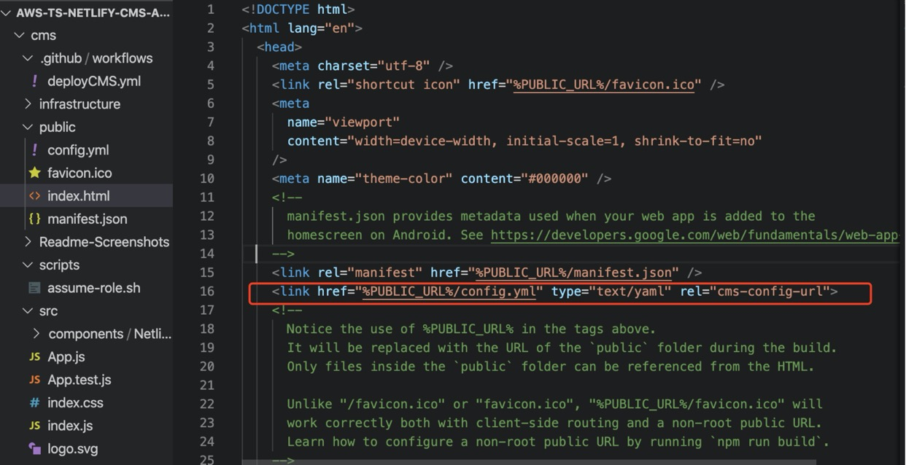
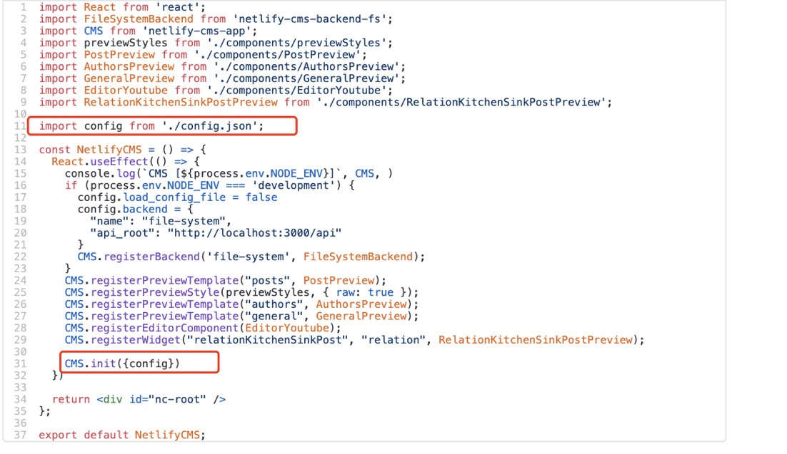
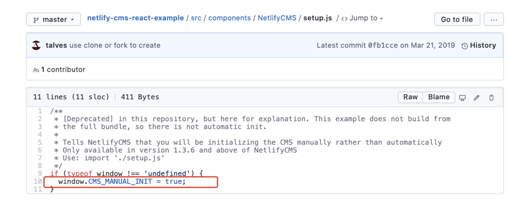
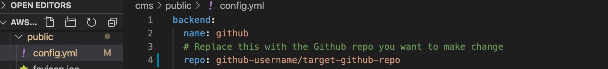
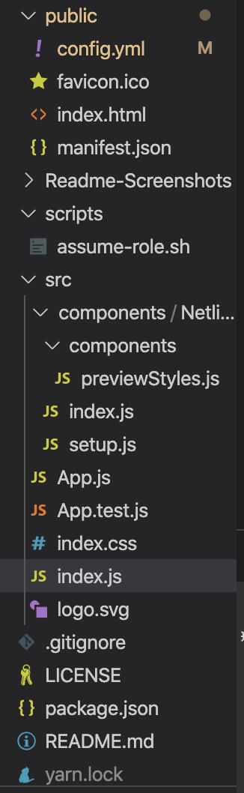
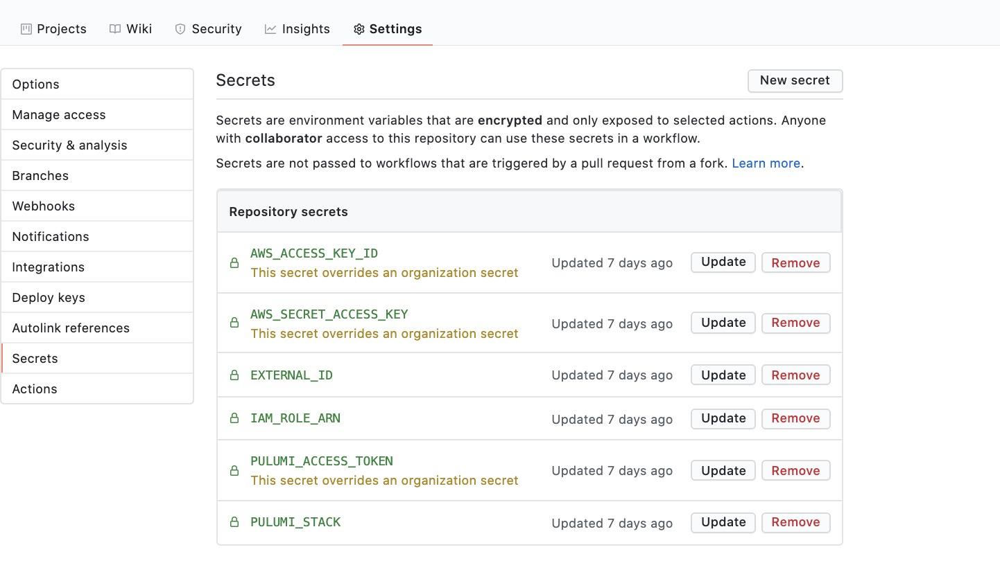
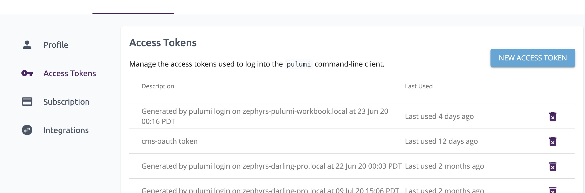

[Netlify CMS](https://www.netlifycms.org/docs/intro/) is an open-source content management system that provides UI for editing content and adopting Git workflow. Initially, we want to take advantage of it to increase efficiency to edit Pulumi's website. However, during development, we found few examples are deploying the CMS application on AWS instead of Netlify, its home platform. Therefore, in this blog post, we would like to share how to organize Netlify's file structure and use Pulumi to store the content on S3 buckets, connect to CloudFront, and configure certificate in Certificate Manager.

<!--more-->

{}
Because we are deploying CMS on AWS, we can not use Netlify's Identity Service, which manages the access token sent by Github API. We will introduce how to write the [External OAuth Client-Server](https://www.netlifycms.org/docs/external-oauth-clients/) and deploy it on AWS in the next post.
{}

For this project, we use [Nelify CMS's Github backend](https://www.netlifycms.org/docs/github-backend/). Our CMS app changes website content stored in another Github repository under the same account. The website uses Hugo as the static site generator.

## Extracting CMS As a Stand-alone React App

The [starter template](https://www.netlifycms.org/docs/start-with-a-template/) provided by Netlify implements the CMS application inside the target repository. We extract the CMS application from the target repository and copy it in another repository under the same Github account to improve the modularity.

We can use the [templates from @talves](https://github.com/ADARTA/netlify-cms-react-example) to extract the CMS as a stand-alone React application.

### CMS Configuration File

The `config.yml` file configures Netlify CMS to look for content segments that can be edited and which backend instructions it needs to follow.

The template, `cms/public/index.html` contains the entry point for React to insert the generated content under `<div id=root>`. We can change website's title, but more importantly, we linked the configuration file `cms/public/config.yml` of the Netlify CMS by following the [instructions](https://www.netlifycms.org/docs/configuration-options/).



The template uses config.json in `./src/components/NetlifyCMS/config.json`, and sets [CMS Manual Init](https://www.netlifycms.org/docs/beta-features/#manual-initialization) in file `./src/components/NetlifyCMS/setup.js` and file `./src/components/NetlifyCMS/index.js`.




Alternatively, we can add the path to the config.yml file in index.html and put config.yml in the public folder.  This reduces the steps to set the CMS init step, which can be confusing to beginners.

### Point the CMS to Another Repository

The template separates the CMS as a stand-alone React app, while the CMS remains in the target repository. We can change the value field `repo:` in the `backend:` field of the `config.yml` file to point to the specific repository that the CMS can change.



### File Structure

Simplifying the file and deleting unneeded parameters produces this:



The `./src/index.js` file is the entry point for React to create the App class inside `./public/index.html`'s  `<div id=root>`. `App` (defined in `./src/App.js`) is a React Component that returns the `NetlifyCMS` React component defined inside `./src/components/NetlifyCMS/index.js`. We can also specify the [custom preview](https://www.netlifycms.org/docs/customization/#registerpreviewtemplate) and [custom widget](https://www.netlifycms.org/docs/custom-widgets/#header) for the CMS app in this file.

To preview the CMS app content, run `yarn start`.

Now that we have preprocessed the file structure. Let's deploy the CMS onto the AWS!

## Implement Infrastructure

First, we create an `infrastructure` folder to store the Pulumi project. To create a new Pulumi project, run `pulumi new typescript` to generate a typescript template.

We can use Pulumi's [static website example](https://github.com/pulumi/examples/tree/master/aws-ts-static-website) as a model for deploying our application.

### Step 1: Build the CMS App

We need to build the website with `yarn build`. This creates a `build` folder under the root directory that holds the compiled version of the website contents to be uploaded to an S3 bucket. Once uploaded, the S3 bucket contains a working version of our CMS app, which reduces the number of files to upload.

### Step 2: Fetch Configuration

The first step is to create a stack configuration with our stack name.

```typescript
// Replace "pulumi-website-cms" with your stack name
const stackConfig = new pulumi.Config("pulumi-website-cms");
const config = {
    pathToWebsiteContents: stackConfig.require("pathToWebsiteContents"),
    targetDomain: stackConfig.require("targetDomain"),
    certificateArn: stackConfig.get("certificateArn"),
};
```

The configuration takes three parameters set with the Pulumi CLI

```bash
$ pulumi config set pulumi-website-cms:pathToWebsiteContent ../build
```

The pathToWebsiteContent parameter specifies the path to the directory with the website content. This directory is synched to the S3 bucket by using the `crawlDirectory` method. We pass in the `build` folder, which is the directory that stores our built CMS website.

Similarly, we can set the CMS's target domain name and the optional certificate arn parameter with `stackConfig.get` instead of `stackConfig.require` to get the value. For the target domain, we can use any subdomain name of an existing parent domain, and the code creates the subdomain under the parent domain automatically. For the certificate arn, if we already have a certificate registered for CMS, then we can pass it in as the certificate arn. Otherwise, the code generates a new certificate.

```bash
# replace the targetDomain with the domain name for your CMS
$ pulumi config set pulumi-website-cms:targetDomain https://some-cms-domain.com
# replace the value of certificateArn with the correct one
$ pulumi config set pulumi-website-cms:certificateArn arnarnarnxxx
```

Note that the ACM certificate has to be in the same as the project AWS region.

```bash
$ pulumi config set aws:region us-east-1
```

### Step 3: Bucket Creation

We create the S3 bucket.

```typescript
// contentBucket is the S3 bucket that the website's contents will be stored in.
const contentBucket = new aws.s3.Bucket("contentBucket",
    {
        bucket: config.targetDomain,
        acl: "public-read",
        // Configure S3 to serve bucket contents as a website. This way S3 will automatically convert
        // requests for "foo/" to "foo/index.html".
        website: {
            indexDocument: "index.html",
        },
    });
```

We crawl the content directory and convert them to bucket objects that are the content for the site.

```typescript
function crawlDirectory(dir: string, f: (_: string) => void) {
    const files = fs.readdirSync(dir);
    for (const file of files) {
        const filePath = `${dir}/${file}`;
        const stat = fs.statSync(filePath);
        if (stat.isDirectory()) {
            crawlDirectory(filePath, f);
        }
        if (stat.isFile()) {
            f(filePath);
        }
    }
}

// Sync the contents of the source directory with the S3 bucket, which will in-turn show up on the CDN.
const webContentsRootPath = path.join(process.cwd(), config.pathToWebsiteContents);
console.log("Syncing contents from local disk at", webContentsRootPath);
crawlDirectory(
    webContentsRootPath,
    (filePath: string) => {
        const relativeFilePath = filePath.replace(webContentsRootPath + "/", "");
        const contentFile = new aws.s3.BucketObject(
            relativeFilePath,
            {
                key: relativeFilePath,

                acl: "public-read",
                bucket: contentBucket,
                contentType: mime.getType(filePath) || undefined,
                source: new pulumi.asset.FileAsset(filePath),
            },
            {
                parent: contentBucket,
            });
    });
```

We also create a private CDN request log bucket for storing logs that we can use for debugging the application.

```typescript
// logsBucket is an S3 bucket that will contain the CDN's request logs.
const logsBucket = new aws.s3.Bucket("requestLogs",
    {
        bucket: `${config.targetDomain}-logs`,
        acl: "private",
    });
```

### Step 4: Certificate Creation and Validation

If the certificateArn is not provided as a configuration, the code will create a new certificate. We set the AWS region to match the Project region, which ACM certificate requires.

Then we create a new certificate.

```typescript
const certificate = new aws.acm.Certificate("certificate", {
        domainName: config.targetDomain,
        validationMethod: "DNS",
    }, { provider: eastRegion });
```

Next, we create a Route53 DNS Record which is needed when requesting the ACM certificate.

```typescript
const domainParts = getDomainAndSubdomain(config.targetDomain);
const hostedZoneId = aws.route53.getZone({ name: domainParts.parentDomain }, { async: true }).then(zone => zone.zoneId);

/**
    *  Create a DNS record to prove that we _own_ the domain we're requesting a certificate.
    *  See https://docs.aws.amazon.com/acm/latest/userguide/gs-acm-validate-dns.html for more info.
    */
const certificateValidationDomain = new aws.route53.Record(`${config.targetDomain}-validation`, {
    name: certificate.domainValidationOptions[0].resourceRecordName,
    zoneId: hostedZoneId,
    type: certificate.domainValidationOptions[0].resourceRecordType,
    records: [certificate.domainValidationOptions[0].resourceRecordValue],
    ttl: tenMinutes,
});
```

The `getDomainAndSubdomain` method for separates the parent domain and child domain.

We validate the certificate by setting the CertificateValidation resource and set the certificateArn.

```typescript
/**
     * This is a _special_ resource that waits for ACM to complete validation via the DNS record
     * checking for a status of "ISSUED" on the certificate itself. No actual resources are
     * created (or updated or deleted).
     *
     * See https://www.terraform.io/docs/providers/aws/r/acm_certificate_validation.html for slightly more detail
     * and https://github.com/terraform-providers/terraform-provider-aws/blob/master/aws/resource_aws_acm_certificate_validation.go
     * for the actual implementation.
     */
    const certificateValidation = new aws.acm.CertificateValidation("certificateValidation", {
        certificateArn: certificate.arn,
        validationRecordFqdns: [certificateValidationDomain.fqdn],
    }, { provider: eastRegion });

    certificateArn = certificateValidation.certificateArn;
```

### Configure the CloudFront distribution

We set the configuration parameters for CloudFront in distributionArgs :

```typescript
// distributionArgs configures the CloudFront distribution. Relevant documentation:
// https://docs.aws.amazon.com/AmazonCloudFront/latest/DeveloperGuide/distribution-web-values-specify.html
// https://www.terraform.io/docs/providers/aws/r/cloudfront_distribution.html
const distributionArgs: aws.cloudfront.DistributionArgs = {
    enabled: true,
    // Alternate aliases the CloudFront distribution can be reached at, in addition to https://xxxx.cloudfront.net.
    // Required if you want to access the distribution via config.targetDomain as well.
    aliases: [ config.targetDomain ],

    // We only specify one origin for this distribution, the S3 content bucket.
    origins: [
        {
            originId: contentBucket.arn,
            domainName: contentBucket.websiteEndpoint,
            customOriginConfig: {
                // Amazon S3 doesn't support HTTPS connections when using an S3 bucket configured as a website endpoint.
                // https://docs.aws.amazon.com/AmazonCloudFront/latest/DeveloperGuide/distribution-web-values-specify.html#DownloadDistValuesOriginProtocolPolicy
                originProtocolPolicy: "http-only",
                httpPort: 80,
                httpsPort: 443,
                originSslProtocols: ["TLSv1.2"],
            },
        },
    ],

    defaultRootObject: "index.html",

    // A CloudFront distribution can configure different cache behaviors based on the request path.
    // Here we just specify a single, default cache behavior which is just read-only requests to S3.
    defaultCacheBehavior: {
        targetOriginId: contentBucket.arn,

        viewerProtocolPolicy: "redirect-to-https",
        allowedMethods: ["GET", "HEAD", "OPTIONS"],
        cachedMethods: ["GET", "HEAD", "OPTIONS"],

        forwardedValues: {
            cookies: { forward: "none" },
            queryString: false,
        },

        minTtl: 0,
        defaultTtl: tenMinutes,
        maxTtl: tenMinutes,
    },

    // "All" is the most broad distribution, and also the most expensive.
    // "100" is the least broad, and also the least expensive.
    priceClass: "PriceClass_100",

    // You can customize error responses. When CloudFront receives an error from the origin (e.g. S3 or some other
    // web service) it can return a different error code, and return the response for a different resource.
    // customErrorResponses: [
    //     { errorCode: 404, responseCode: 404, responsePagePath: "/404.html" },
    // ],

    restrictions: {
        geoRestriction: {
            restrictionType: "none",
        },
    },

    viewerCertificate: {
        acmCertificateArn: certificateArn,  // Per AWS, ACM certificate must be in the us-east-1 region.
        sslSupportMethod: "sni-only",
    },

    loggingConfig: {
        bucket: logsBucket.bucketDomainName,
        includeCookies: false,
        prefix: `${config.targetDomain}/`,
    },
};

const cdn = new aws.cloudfront.Distribution("cdn", distributionArgs);
```

### Step 5: Alias Record

Next, we create an alias record that points to the CloudFront distribution.

```typescript
function createAliasRecord(
    targetDomain: string, distribution: aws.cloudfront.Distribution): aws.route53.Record {
    const domainParts = getDomainAndSubdomain(targetDomain);
    const hostedZoneId = aws.route53.getZone({ name: domainParts.parentDomain }, { async: true }).then(zone => zone.zoneId);
    return new aws.route53.Record(
        targetDomain,
        {
            name: domainParts.subdomain,
            zoneId: hostedZoneId,
            type: "A",
            aliases: [
                {
                    name: distribution.domainName,
                    zoneId: distribution.hostedZoneId,
                    evaluateTargetHealth: true,
                },
            ],
        });
}

const aRecord = createAliasRecord(config.targetDomain, cdn);
```

---

We've finished implementing our application infrastructure, and we're ready to deploy. Run `pulumi up` to execute the Pulumi code to deploy to AWS. However, there is a more convenient way to do so with Github.

## Github Workflow (Optional)

[Github Actions](https://docs.github.com/en/actions) adopts the Continuous Delivery/Integration concept and specifies a series of steps to run and deploy the program. We can take advantage of it with our CMS.

In the workflow, Github secrets are accessed from `${{ secrets.ACCESS_TOKEN }}` where `ACCESS_TOKEN` is the Github credential. We can specify the secret in the project setting of Github.



`PULUMI_STACK` is the Pulumi stack name that we are using.
`PULUMI_ACCESS_TOKEN` is required for the automatic process and can be generated by clicking the blue button "New Access Token" on the [Pulumi console's](https://app.pulumi.com) Settings.



---

## Summary and Next Step

We have deployed the stand-alone React CMS application on AWS. The [complete code](https://github.com/pulumi/examples/tree/master/aws-ts-netlify-cms-and-oauth/cms) is available in [Pulumi's Example Repository](https://github.com/pulumi/examples).

The next article will show how to deploy on AWS instead of Netlify. We describe how to substitute the Netlify Identity Service by writing an External OAuth Client-Server and deploying it on AWS. Stay tuned for our next blog post.
