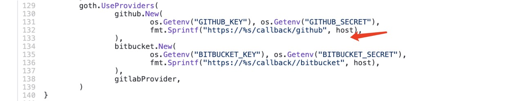

As we discussed in our [previous post](), we have deployed our CMS app on AWS rather than its default platform Netlify. In this way, we couldn't take advantage of [Netlify's Identity Service](https://docs.netlify.com/visitor-access/identity/#enable-identity-in-the-ui), which will handle Github access for Github backend of Netlify CMS. Therefore, we need to implement an [External OAuth Client Server](https://www.netlifycms.org/docs/external-oauth-clients/#header).

We have used the Go example provided by Netlify CMS, made changes to make it work, deployed it using ECS Fargate Service, and configured domain and certificate for it. In this post, we will share the way that we have done that.

<!--more-->

Backend is code packages that allow Netlify CMS to communicate with code storaging system like Github, Gitlab, and Bitbucket. In our [example code](https://github.com/pulumi/examples/tree/master/aws-ts-netlify-cms-and-oauth/cms-oauth), We used [Netlify CMS's Github backend](https://www.netlifycms.org/docs/github-backend/) of Netlify CMS to build the CMS. The OAuth Server's core code `cms-oauth/main.go` also enables authorization with backend Gitlab and Bitbucket. To do that simply change the callback URL to be `https://{{YOUR_OAUTH_SERVER_URL}}/callback/{{YOUR_BACKEND_NAME}}`. For more detail please refer to the "Environment Variable and Pulumi Stack Configuration" section.

## Make Changes to Source Code

The [OAuth Client source code provided by @igk1972](https://github.com/igk1972/netlify-cms-oauth-provider-go) provides `./dotenv/dotenv.go` which retrieves the environment variables from a file. The main.go is the body of the OAuth Client which uses the [markbetes goth](https://github.com/markbates/goth) to build the OAuth Provider. `./randstr/randstr.go` which generates a random string for the `SESSION_SECRET` environment variable that main.go is using. However, both functions could be done with Pulumi.

The random string could be generated by the `random.RandomPassword` function in this way:

```typescript
// Create a random string and also mark its `result` property as a secret,
// so it is not stored in plaintext in the stack's state. 
const sessionSecretRandomString = new random.RandomPassword("random", {
    length: 32,
}, { additionalSecretOutputs: ["result"] });
```

The environment variables could be passed in as a part of the task definition argument when we are creating a Fargate Service.

```typescript
// Create a Fargate service task that can scale out.
const appService = new awsx.ecs.FargateService("app-svc", {
    cluster,
    taskDefinitionArgs: {
        container: {
            image: img,
            memory: 128 /*MB*/,
            portMappings: [ tg ],
            environment: [
                {
                    name: "HOST",
                    // The target domain which would concatenate with callbacks in main.go
                    value: pulumi.interpolate `https://${cmsStackConfig.targetDomain}`
                },
                {
                    name: "SESSION_SECRET",
                    value: sessionSecretRandomString.result
                },
                {
                    name: "GITHUB_KEY",
                    value: cmsStackConfig.githubKey
                },
                {
                    name: "GITHUB_SECRET",
                    value: cmsStackConfig.githubSecret
                },
                {
                    name: "TARGET_PORT",
                    value: pulumi.interpolate `${inputTargetGroupPort}`
                },
                {
                    name: "GITHUB_SCOPE",
                    value: inputGithubScope
                },
            ]
        },
    },
    desiredCount: 1,
});
```

Therefore, we could safely remove those two folders `randstr` and `dotenv`.

### Specify the Github Scope

Source code didn't indicate the [github scope](https://developer.github.com/apps/building-oauth-apps/understanding-scopes-for-oauth-apps/) when it is trying to use the github.New function to create a GitHub provider. The default for the Github scope if we don't specify in the github.New function is the ready-only access to the Github repos. Because we want CMS to make edits to the target repostiory, we need ready and write access.


Thus we specify the GitHub scope as an environment variable `GITHUB_SCOPE` and the default value is `public_repo` which is to grant read and write access to all public repository. We can change this by adding an optional Pulumi configuration of GitHub scope to be the value of the desired scope. We can even add several scope values and separate them by a comma as a feature offered by `Github.New` function. The corresponding environment variable would be set during the creation of the Fargate Service inside the Pulumi program. Then main.go would read and parse `GITHUB_SCOPE` value and append to the argument of `Github.New` function.

```go
githubScope := os.Getenv("GITHUB_SCOPE")
    if githubScope == "" {
        goth.UseProviders(
            github.New(
                os.Getenv("GITHUB_KEY"), os.Getenv("GITHUB_SECRET"),
                // concatenate with the host name
                fmt.Sprintf("%s/callback/github", host),
                "public_repo",
            ),
            bitbucket.New(
                os.Getenv("BITBUCKET_KEY"), os.Getenv("BITBUCKET_SECRET"),
                fmt.Sprintf("%s/callback//bitbucket", host),
            ),
            gitlabProvider,
        )
    } else {
        scopeArray := strings.Split(githubScope, ",")
        goth.UseProviders(
            github.New(
                os.Getenv("GITHUB_KEY"), os.Getenv("GITHUB_SECRET"),
                // concatenate with the host name
                fmt.Sprintf("%s/callback/github", host),
                scopeArray...,
            ),
            bitbucket.New(
                os.Getenv("BITBUCKET_KEY"), os.Getenv("BITBUCKET_SECRET"),
                fmt.Sprintf("%s/callback//bitbucket", host),
            ),
            gitlabProvider,
        )
    }
```

## Writing a Dockerfile

Replace the working directory in the Dockerfile with the path to your cloned repository. Especially, replace zephyrz73 with your Github user name.

```dockerfile
WORKDIR /go/src/github.com/zephyrz73/aws-ts-netlify-cms-and-oauth/cms-oauth
```

In this way, it would copy the right content into the Docker Image. This is an essential step for deploying the server with AWS Fargate.

Now that CMS Server itself is deployed, we can start to implement the infrastructure.

## Infrastructure

### Deploying use ECS Fargate

For deploying the OAuth server using ECS Fargate, we could reference the [Hello Fargate Example](https://github.com/pulumi/examples/tree/master/aws-ts-hello-fargate) from the [Pulumi's example repository](https://github.com/pulumi/examples).

The simple example created an ECS cluster, Application Load Balancer (alb) and its listener, and a Fargate Service, which its container is using the Docker image we built by the docker file. There are some changes we made:

We specify the port number of the alb to be 443 which is the standard port for HTTPS instead of port 80 which is the standard port for HTTP because of the URL in main.go that we used are start with `https://`. HTTPS is also much secure to handle the CMS access token.

```typescript
// Define an ec2 application load balancer alb to distribute incomming application traffic across multiple targets, such as EC2 instances, in multiple Availability Zones.
const alb = new awsx.elasticloadbalancingv2.ApplicationLoadBalancer(
    "net-lb", { external: true, securityGroups: cluster.securityGroups });

// alb need a listener to listen to 443 the standard port for the HTTPS traffic, certificate is using the certificate we created above
const web = alb.createListener("web", {
    port: 443,
    external: true,
    protocol: "HTTPS",
    certificateArn: certificate.arn
});
```

We also created a single target group for load balancers to distribute the traffic to. In this way, the user could have a different port for the target group and don't have to use 443 https port.

``` typescript
let inputTargetGroupPort: pulumi.Input<number> = cmsStackConfig.targetGroupPort!;

if (inputTargetGroupPort === undefined) {
    inputTargetGroupPort = 80;
}

// when Listener Rule is satisfied then traffic is route to this target group.
const tg = alb.createTargetGroup("oauth-tg", {
    port: inputTargetGroupPort,
    loadBalancer: alb
});
```

The target group port was also implemented as an optional stack configuration for the user to specify a different target group port.
If the user wants to use the different port numbers, they could do so by `pulumi config set cms-OAuth:targetGroupPort` and type in the port number value. The default port is 80 which is https port for local development.

We also build a listener for the load balancer. The rule tells alb to forward all requests to the single target group we created.

```typescript
// when the request are forwarded then every requests are send to the target group we created
new awsx.lb.ListenerRule("oauth-listener-rule", web, {
    actions: [{
        type: "forward",
        targetGroupArn: tg.targetGroup.arn,
    }],
    conditions: [{
        field: "path-pattern",
        values: "/*", //wildcard says every request would be send
    }],
});
```

#### Environment Variable and Pulumi Stack Configuration

Also, as mentioned previously, when building the Fargate service, we could pass in environment variables that act as a parameter to main.go.

```typescript
// Create a Fargate service task that can scale out.
const appService = new awsx.ecs.FargateService("app-svc", {
    cluster,
    taskDefinitionArgs: {
        container: {
            image: img,
            memory: 128 /*MB*/,
            portMappings: [ tg ],
            environment: [
                {
                    name: "HOST",
                    // The target domain which would concatenate with callbacks in main.go
                    value: pulumi.interpolate `https://${cmsStackConfig.targetDomain}`
                },
                {
                    name: "SESSION_SECRET",
                    value: sessionSecretRandomString.result
                },
                {
                    name: "GITHUB_KEY",
                    value: cmsStackConfig.githubKey
                },
                {
                    name: "GITHUB_SECRET",
                    value: cmsStackConfig.githubSecret
                },
                {
                    name: "TARGET_PORT",
                    value: pulumi.interpolate `${inputTargetGroupPort}`
                },
                {
                    name: "GITHUB_SCOPE",
                    value: inputGithubScope
                },
            ]
        },
    },
    desiredCount: 1,
});
```

For `HOST` we would pass in the link that we would want this OAuth Server to have. We could set it by set the stack configuration by doing `pulumi config set pulumi-website-cms:targetDomain https://some-cms-oauth-domain.pulumi-demos.com` and replace the name with what you want the OAuth Server to have.

`SESSION_SECRET` is another environment variable to pass in main.go that we mention earlier. We generated value by using Pulumi's `random.RandomPassword` previously.

To get `GITHUB_SECRET` and `GITHUB_TOKEN`, we need to register for a Github OAuth Application. Netlify have provided [instructions](https://docs.netlify.com/visitor-access/oauth-provider-tokens/#setup-and-settings) for that.
For the Home Page Url should be the targetDomain that we build with our [previous post]().
For the Authorization callback URL we should enter `https://{{the domain of your OAuth App}}/callback/github` which is specified by the main.go.

```go
    github.New(
        os.Getenv("GITHUB_KEY"), os.Getenv("GITHUB_SECRET"),
        // concatenate with the host name
        fmt.Sprintf("%s/callback/github", host),
        "public_repo",
    )
```

If you are using different storaging system like Bitbucket and Gitlab, you can specify callback url to be `https://{{the domain of your OAuth App}}/callback/{{ backend name }}` and relace `{{backend name}}` with `bitbucket` or `github` correspondingly.

Then we can copy and paste the github key and secret as stack configuration as well.

```bash
$ pulumi config set netlify-cms-oauth-provider-infrastructure:githubKey {{YOUR_GITHUB_KEY}}
$ pulumi config set --secret netlify-cms-oauth-provider-infrastructure:githubSecret
$ {{YOUR_GITHUB_SECRET}}
```

`--secret` would safely encrypt your github secret. Also,
don't directly append the secret to the command like this `$ pulumi config set --secret netlify-cms-oauth-provider-infrastructure:githubKey {{YOUR_GITHUB_SECRET}}`.
Because it might cause the secret to being stored inside the command memory. We should only specify the key without a name and hit ENTER key, then you can type secret on next line(won't show the value)

For `TARGET_PORT` that is how we passed in the `targetGroupPort` configuration value to main.go. That is also the port number that we want the server itself to serve. We also checked if this environment variable is set in main.go in case we need to test main.go locally without Pulumi.

```go
targetGroupPort := os.Getenv("TARGET_PORT")
    if targetGroupPort == "" {
        targetGroupPort = "80"
    }
    listenPort := ":" + targetGroupPort
    fmt.Print("Started running on", listenPort, "\n")
    // listen on port 80 where we created the target group
    fmt.Println(http.ListenAndServe(listenPort, nil))
```

As mentioned previously, `GITHUB_SCOPE` is the environment variable to tell main.go what kind of access CMS needs to have on the target repository. It is also an optional stack configuration where the default is set as public_repo in the main.go. We can specify multiple scopes by a separate scope with commas.

### Create a Certificate for the OAuth Server

The process is similar how we created certificate for CMS in our [previous post]().
Similarly, we also referenced Pulumi's [static website example](https://github.com/pulumi/examples/tree/master/aws-ts-static-website).

We can extract what we need just for creating the certificate and delete irrelevant parts including uploading content to the S3 bucket and configure CloudFront. Then the rest only involves creating an east region provider, a certificate, and certificate validation.

However, for the part of creating Alias Record, the values of the alias field should be filled with information about the application load balancer that we created.

```typescript
// Creates a new Route53 DNS record pointing the domain to the CloudFront distribution.
function createAliasRecord(
    targetDomain: string, lb: awsx.elasticloadbalancingv2.ApplicationLoadBalancer): aws.route53.Record {
    const domainParts = getDomainAndSubdomain(targetDomain);
    const hostedZoneId = aws.route53.getZone({ name: domainParts.parentDomain }, { async: true }).then(zone => zone.zoneId);
    return new aws.route53.Record(
        targetDomain,
        {
            name: domainParts.subdomain,
            zoneId: hostedZoneId,
            type: "A",
            aliases: [
                {
                    name: lb.loadBalancer.dnsName,
                    zoneId: lb.loadBalancer.zoneId,
                    evaluateTargetHealth: true,
                },
            ],
        });
}
// Create the aliasRecord with targetdomain and application load balancer
const aRecord = createAliasRecord(cmsStackConfig.targetDomain, alb);
```

Then we could run `pulumi up` to deploy all of this.

### Github Workflow (Optional)

Similar to the cms folder we have to build the Github workflow under folder `cms-oauth/.github/workflows/build-and-deploy.yml`. The workflow is also using the repository secret that we set in the Github.


## Last Step

Don't forget to update the CMS configuration file.
To put all of our deployment of CMS and CMS OAuth Server together, we should specify the site_domain and URL in `./public/config.yml` of the cms folder.

```yaml
backend:
  name: github
  # Replace this with the Github repo you want to make change
  repo: github-username/target-github-repo
  # This site_domain and base_url are sudo domains
  # Replace site_domain with targetDomain pulumi stack configuration inside cms/infrastructure folder
  # Replace base_url with targetDomain pulumi stack configuration inside cms-oauth/infrastructure folder
  site_domain: https://some-cms-domain.pulumi-demos.com
  base_url: https://some-oauth-domain.pulumi-demos.com
```

The site_domain is the domain of the CMS and the base_url is the domain of OAuth Server that we deployed. They should be the same as the `targetDomain` variable we set in the stack configuration of both CMS and OAuth Server.

## In the End

Congratulations on building both CMS web application, the OAuth client-server, and deploy the infrastructure! Now if everything works perfectly, you would see the "Login with Github" button shown and click it would redirect to the Github login pages.


People with correct access could now use and see the CMS.


All codes of CMS and OAuth Client Server are available in [Pulumi's example repositories](https://github.com/pulumi/examples)'s [aws-ts-netlify-cms-and-oauth](https://github.com/pulumi/examples/tree/master/aws-ts-netlify-cms-and-oauth/cms-oauth).

---

Special Thanks to:

- Tony Alves @talves for providing [template](https://github.com/ADARTA/netlify-cms-react-example) to separate CMS as a stand-alone React App
- Igor Kuznetsov @igk1972 for providing [go code example](https://github.com/igk1972/netlify-cms-oauth-provider-go) for providing the OAuth Client-Server source code
- Paul Stack @stack72 for developing [Pulumi example of deploying Dockerized App using ECS Fargate](https://github.com/pulumi/examples/tree/master/aws-ts-hello-fargate) and [Pulumi example of deploying the static website on AWS](https://github.com/pulumi/examples/tree/master/aws-ts-static-website)
- Every Pulumi folks have ever helped me out about this~
