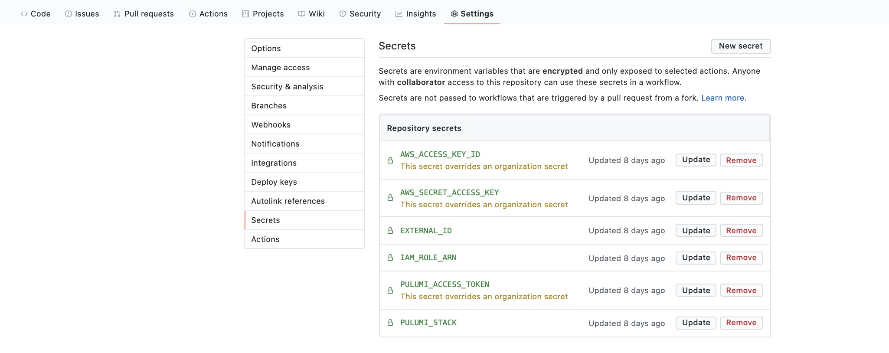
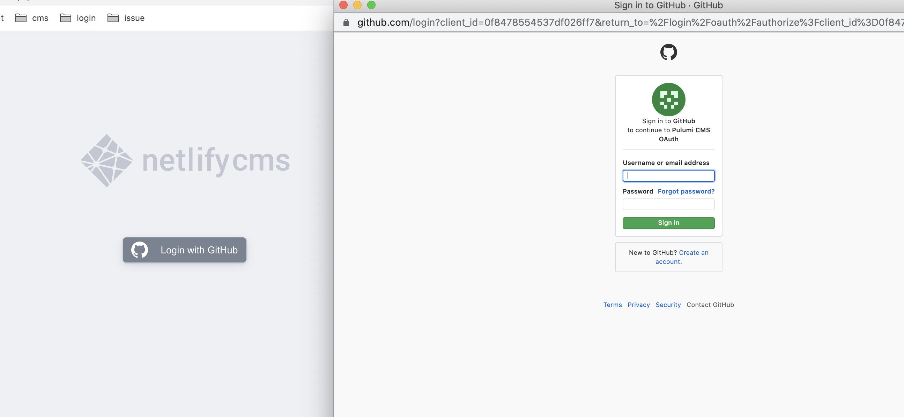
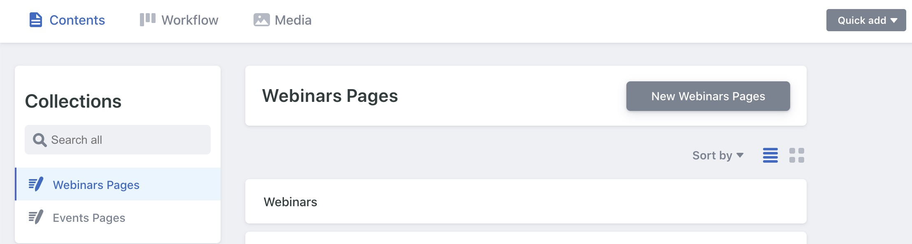

In our [previous post](), we deployed our CMS app on AWS instead of Netlify. We couldn't use [Netlify's Identity Service](https://docs.netlify.com/visitor-access/identity/#enable-identity-in-the-ui), which manages GitHub access to Netlify CMS, because we deployed on AWS. As a result, we needed to implement an external [OAuth Server](https://www.netlifycms.org/docs/external-oauth-clients/#header).

We used Netlify's Go example to deploy on ECS Fargate and configure the domain and certificate. To deploy the application on Fargate, we used a Typescript Pulumi project. This is a polyglot application where the OAuth server is implemented in Go and the infrastructure is deployed with Typescript. We'll show how we accomplished the deployment.

<!--more-->

[Backend](https://www.netlifycms.org/docs/github-backend/) is a package that supports communications between Netlify CMS and repositories like GitHub, GitLab, and Bitbucket. The Pulumi [example code](https://github.com/pulumi/examples/tree/master/aws-ts-netlify-cms-and-oauth/cms-oauth) uses backend to authenticate to the CMS. The OAuth Server also enables authorization for GitLab and Bitbucket by changing the callback URL to `https://{{YOUR_OAUTH_SERVER_URL}}/callback/{{YOUR_BACKEND_NAME}}`. To learn more about configuring OAuth Server, refer to the [Environment Variable and Pulumi Stack Configuration]() section.

## Building the OAuth Server

Netlify's CMS website provides [External OAuth Client examples](https://www.netlifycms.org/docs/external-oauth-clients/#header) for various languages and platforms. We used the [Go example](https://github.com/igk1972/netlify-cms-oauth-provider-go) as a template for our server.

In *Netlify's example*, the `./dotenv/dotenv.go` retrieves environment variables from a file. The main.go file uses [goth](https://github.com/markbates/goth) to instantiate the OAuth provider. The `./randstr/randstr.go` file generates a random string for the `SESSION_SECRET` environment variable, which is used for authentication. However,  Pulumi can implement both functions, replacing the code in goth by using Pulumi's random package.

```typescript
// Create a random string and also mark its `result` property as a secret,
// so it is not stored in plaintext in the stack's state.
const sessionSecretRandomString = new random.RandomPassword("random", {
    length: 32,
}, { additionalSecretOutputs: ["result"] });
```

Because we replaced those functions, we can remove the `randstr` and `dotenv` folders in the OAuth client example. Later, we'll show how to pass the environment variables when we create the Fargate service.

### Setting GitHub Scope

The default  [GitHub scope](https://developer.github.com/apps/building-oauth-apps/understanding-scopes-for-oauth-apps/) in Netlify's example is read-only. When we call the `github.New` function, read and write access must be set to edit a target repository.

We set `GITHUB_SCOPE` to `public_repo`, granting read and write access to a public repository. The `GITHUB_SCOPE` value is read and parsed when the Fargate Service is created, which is set in the `Github.New` function in the OAuth server. We can also set `GITHUB_SCOPE` to a list of scope values.

```go
githubScope := os.Getenv("GITHUB_SCOPE")
    if githubScope == "" {
        goth.UseProviders(
            github.New(
                os.Getenv("GITHUB_KEY"), os.Getenv("GITHUB_SECRET"),
                // concatenate with the host name
                fmt.Sprintf("%s/callback/github", host),
                "public_repo",
            ),
            bitbucket.New(
                os.Getenv("BITBUCKET_KEY"), os.Getenv("BITBUCKET_SECRET"),
                fmt.Sprintf("%s/callback//bitbucket", host),
            ),
            gitlabProvider,
        )
    } else {
        scopeArray := strings.Split(githubScope, ",")
        goth.UseProviders(
            github.New(
                os.Getenv("GITHUB_KEY"), os.Getenv("GITHUB_SECRET"),
                // concatenate with the host name
                fmt.Sprintf("%s/callback/github", host),
                scopeArray...,
            ),
            bitbucket.New(
                os.Getenv("BITBUCKET_KEY"), os.Getenv("BITBUCKET_SECRET"),
                fmt.Sprintf("%s/callback//bitbucket", host),
            ),
            gitlabProvider,
        )
    }
```

## Creating the OAuth Server Image

To build our OAuth server container, replace the working directory in the Dockerfile with the path to your repository. Setting the working directory copies the application when Docker builds the image.

```dockerfile
WORKDIR /go/src/github.com/pulumi/aws-ts-netlify-cms-and-oauth/cms-oauth
```

## Infrastructure

### Deploying to Fargate

We'll use the [Hello Fargate Example](https://github.com/pulumi/examples/tree/master/aws-ts-hello-fargate) as a template to deploy the OAuth server to AWS Fargate. This example, written in Typescript, creates an ECS cluster, an Application Load Balancer (alb) with a listener, and a Fargate Service. We’ll change the script to deploy our OAuth server Docker image.

We set the alb port to 443 to use HTTPS, which is more secure when passing the CMS access token.

```typescript
// Define an ec2 application load balancer alb to distribute incomming application traffic across multiple targets, such as EC2 instances, in multiple Availability Zones.
const alb = new awsx.elasticloadbalancingv2.ApplicationLoadBalancer(
    "net-lb", { external: true, securityGroups: cluster.securityGroups });

// alb need a listener to listen to 443 the standard port for the HTTPS traffic, certificate is using the certificate we created above
const web = alb.createListener("web", {
    port: 443,
    external: true,
    protocol: "HTTPS",
    certificateArn: certificate.arn
});
```

We create a [target group](https://docs.aws.amazon.com/elasticloadbalancing/latest/network/load-balancer-target-groups.html) for the load balancers to distribute traffic. The target group port defaults port 80 if it's not set.

``` typescript
let inputTargetGroupPort: pulumi.Input<number> = cmsStackConfig.targetGroupPort!;

if (inputTargetGroupPort === undefined) {
    inputTargetGroupPort = 80;
}

// when Listener Rule is satisfied then traffic is route to this target group.
const tg = alb.createTargetGroup("oauth-tg", {
    port: inputTargetGroupPort,
    loadBalancer: alb
});
```

We can also set the target group port as an environment variable with `pulumi config set cms-OAuth:targetGroupPort`. The load balancer implements a listener and a rule to forward all requests to the target group.

```typescript
// when the request are forwarded then every requests are send to the target group we created
new awsx.lb.ListenerRule("oauth-listener-rule", web, {
    actions: [{
        type: "forward",
        targetGroupArn: tg.targetGroup.arn,
    }],
    conditions: [{
        field: "path-pattern",
        values: "/*", //wildcard says every request would be send
    }],
});
```

#### Environment Variables and Pulumi Stack Configuration

The Fargate service requires several environment variables to start. Here are the variables we need to configure:

- HOST is the URL for the OAuth Server, and we set it by running `pulumi config set pulumi-website-cms:targetDomain <OAuth server URL>`
- SESSION_SECRET is generated by using Pulumi’s random package
- GITHUB_SECRET and GITHUB_TOKEN are provided by GitHub when the GitHub OAuth application is registered. Netlify provides instructions for obtaining these credentials
- The `targetDomain` is the URL of our CMS
- GITHUB_SCOPE sets the type of access the CMS has for the target repository

We can set the github key and secret in the stack configuration. The --secret flag encrypts your GitHub secret. It is good practice to use the --secret flag, because appending the secret in the command line stores it in the command history. The --secret flag lets you enter the secret at the prompt, which hides the value.

```bash
$ pulumi config set netlify-cms-oauth-provider-infrastructure:githubKey {{YOUR_GITHUB_KEY}}
$ pulumi config set --secret netlify-cms-oauth-provider-infrastructure:githubSecret
$ {{YOUR_GITHUB_SECRET}}
```

When the Fargate service is created, it uses the environment variables set in the Pulumi project file and generates the session secret.

```typescript
// Create a Fargate service task that can scale out.
const appService = new awsx.ecs.FargateService("app-svc", {
    cluster,
    taskDefinitionArgs: {
        container: {
            image: img,
            memory: 128 /*MB*/,
            portMappings: [ tg ],
            environment: [
                {
                    name: "HOST",
                    // The target domain which would concatenate with callbacks in main.go
                    value: pulumi.interpolate `https://${cmsStackConfig.targetDomain}`
                },
                {
                    name: "SESSION_SECRET",
                    value: sessionSecretRandomString.result
                },
                {
                    name: "GITHUB_KEY",
                    value: cmsStackConfig.githubKey
                },
                {
                    name: "GITHUB_SECRET",
                    value: cmsStackConfig.githubSecret
                },
                {
                    name: "TARGET_PORT",
                    value: pulumi.interpolate `${inputTargetGroupPort}`
                },
                {
                    name: "GITHUB_SCOPE",
                    value: inputGithubScope
                },
            ]
        },
    },
    desiredCount: 1,
});
```

The environment variables are passed to the OAuth server in main.go. For example, the callback URL  is the `targetDomain` with `callback` and the repository provider appended, e.g., `https://<targetDomain>/callback/github/`. You can also specify a different repository provider, such as Bitbucket or GitLab.

```go
    github.New(
        os.Getenv("GITHUB_KEY"), os.Getenv("GITHUB_SECRET"),
        // concatenate with the host name
        fmt.Sprintf("%s/callback/github", host),
        "public_repo",
    )
```

We also pass TARGET_PORT to targetGroupPort, which is the port used to serve the application. We can check if this variable is set in main.go if we need to test locally without Pulumi.

```go
targetGroupPort := os.Getenv("TARGET_PORT")
    if targetGroupPort == "" {
        targetGroupPort = "80"
    }
    listenPort := ":" + targetGroupPort
    fmt.Print("Started running on", listenPort, "\n")
    // listen on port 80 where we created the target group
    fmt.Println(http.ListenAndServe(listenPort, nil))
```

### Create a Certificate for the OAuth Server

We use the same process for creating a certificate that's documented in our previous post, but we use only the code for creating the certificate and discard the rest. The certificate used with the load balancer must be set to the same region as the fully qualified domain name (FQDN). The domain name in the certificate must be [validated](https://docs.aws.amazon.com/acm/latest/userguide/gs-acm-validate-dns.html).

```typescript
// Get a east provider
const eastRegion = new aws.Provider("east", {
    profile: aws.config.profile,
    region: "us-east-1", // Per AWS, ACM certificate must be in the us-east-1 region.
});

// Creating a Certificate for the given domain.
const certificate = new aws.acm.Certificate("certificate", {
    domainName: cmsStackConfig.targetDomain,
    validationMethod: "DNS",
}, { provider: eastRegion });

// Split given domain in the configuration to domain and subdomain
const domainParts = getDomainAndSubdomain(cmsStackConfig.targetDomain);

// Get the zone of the given domain
const hostedZoneId = aws.route53.getZone({ name: domainParts.parentDomain }, { async: true }).then(zone => zone.zoneId);

// The temporation record for the validation domain has 10 to be live
const tenMinutes = 60 * 10;

/**
 *  Create a DNS record to prove that we _own_ the domain we're requesting a certificate for.
 *  See https://docs.aws.amazon.com/acm/latest/userguide/gs-acm-validate-dns.html for more info.
 */
const certificateValidationDomain = new aws.route53.Record(`${cmsStackConfig.targetDomain}-validation`, {
    name: certificate.domainValidationOptions[0].resourceRecordName,
    zoneId: hostedZoneId,
    type: certificate.domainValidationOptions[0].resourceRecordType,
    records: [certificate.domainValidationOptions[0].resourceRecordValue],
    ttl: tenMinutes,
});
```

We configure the Alias Record with the application load balancer settings.

```typescript
// Creates a new Route53 DNS record pointing the domain to the CloudFront distribution.
function createAliasRecord(
    targetDomain: string, lb: awsx.elasticloadbalancingv2.ApplicationLoadBalancer): aws.route53.Record {
    const domainParts = getDomainAndSubdomain(targetDomain);
    const hostedZoneId = aws.route53.getZone({ name: domainParts.parentDomain }, { async: true }).then(zone => zone.zoneId);
    return new aws.route53.Record(
        targetDomain,
        {
            name: domainParts.subdomain,
            zoneId: hostedZoneId,
            type: "A",
            aliases: [
                {
                    name: lb.loadBalancer.dnsName,
                    zoneId: lb.loadBalancer.zoneId,
                    evaluateTargetHealth: true,
                },
            ],
        });
}
// Create the aliasRecord with targetdomain and application load balancer
const aRecord = createAliasRecord(cmsStackConfig.targetDomain, alb);
```

### GitHub Workflow (Optional)

We can automate our build with GitHub Workflow. The `build-and-deploy.yml` file in  `cms-oauth/.github/workflows/` is used by GitHub Actions to build our application. Note that the workflow uses the repository secret set in GitHub.



## Finishing Up

Our last task is to update the CMS configuration file. We combine the CMS and CMS OAuth Server deployment by setting site_domain and URL in ./public/config.yml of the CMS folder.

```yaml
backend:
  name: github
  # Replace this with the GitHub repo you want to make change
  repo: github-username/target-github-repo
  # This site_domain and base_url are placeholders, replace with the correct one.
  site_domain: https://some-cms-domain.com # CMS's domain
  base_url: https://some-oauth-domain.com # OAuth Server's domain
```

The site_domain is the CMS URL, and the base_url is the OAuth Server URL. They are the same as the `targetDomain` variable we set in the stack configuration.

## Up and Running

Congratulations on building and deploying both CMS web application and the OAuth client-server! If everything works perfectly, you should see the Login with GitHub button and click it to redirect to the GitHub login page.



People with access can now use the CMS.



You can find the project code for the CMS and the OAuth Client Server on [GitHub](https://github.com/pulumi/examples/tree/master/aws-ts-netlify-cms-and-oauth/).

---

Special Thanks to:

- Tony Alves @talves for providing the [template](https://github.com/ADARTA/netlify-cms-react-example) to separate CMS as a stand-alone React App
- Igor Kuznetsov @igk1972 for providing [go code example](https://github.com/igk1972/netlify-cms-oauth-provider-go) for providing the OAuth Client-Server source code
- Paul Stack @stack72 for developing [Pulumi example of deploying Dockerized App using ECS Fargate](https://github.com/pulumi/examples/tree/master/aws-ts-hello-fargate) and [Pulumi example of deploying the static website on AWS](https://github.com/pulumi/examples/tree/master/aws-ts-static-website)
- Everyone at Pulumi who helped me out with this project.
