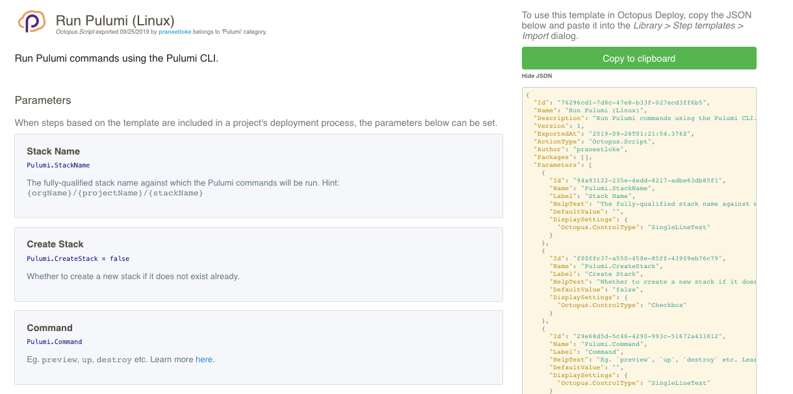

Continuous delivery is about making changes in your application and getting them into production securely, quickly, and consistently. Pulumi's infrastructure as code approach uses source code to model cloud resources, making it ideal for continuous delivery. Your infrastructure code can share the same process as your application code including running unit and integration tests, performing code reviews via Pull Requests, and examining your infrastructure using linters or static analysis tools. Like your application, your cloud infrastructure can be validated and tested before deploying to production. Pulumi can integrate into any CI/CD system (such as Jenkins, Azure DevOps, CircleCI, TravisCI, Codefresh, and others), so let's take a look at how to implement a deployment server, using Octopus as an example.

[Octopus Deploy](https://octopus.com) is a deployment automation server that integrates with your existing build pipeline or through a REST API. You can select the environments for deploying your software, and who has rights to complete a deployment. For example, the QA team can deploy to the Test environment but not to Development or Production. Different team members may trigger deployments, and the deployment process is always consistent.

## Continuous Delivery with Octopus Deploy

Deployment targets are grouped in **environments** in Octopus. Environments represent different stages of the deployment pipeline that your software passes through on its way to a release. A common practice is to create unique Development, Test, and Production environments. Octopus Deploy lets you deploy the correct versions of your software, with the right configuration for the appropriate environment.

Pulumi's [guide]() to implementing Octopus Deploy walks you through the process of implementing an environment for deploying a Python flask application on [AWS Fargate](https://aws.amazon.com/fargate/). Before starting, make sure you have met the [prerequisites]().

Octopus environments are analogous to Pulumi stacks. If you have Development, Test, and Production Octopus environments, you would create a Pulumi stack for each environment. The application being deployed is a Pulumi project. Octopus uses packages that contain the source code bundled in a supported format such as .zip files, gzip or bzip tar files,  Java archive formats such as .jar or .war, and Docker images. Pulumi apps can be packaged in the desired format and extracted onto a Octopus worker that the Pulumi CLI can access.

In Octopus, a **Process** is made up of the steps needed to execute a project. To deploy a Pulumi package, additional steps are needed to extract the code. You can add a step to a process by using the Octopus menu. In the Process section, select **Add Step** to add the package. You will need to specify the package feed, the package id and a package name. The step can be further customized by adding a script that specifies where to extract the package.

To deploy your Pulumi package, select **Add Step** again and search for the `Pulumi` template from the **Community Library Steps**. Fill out the template with the appropriate configuration parameters for your stack. Next, create a release from by selecting **Releases** and click **Create Release** and follow the instructions.

Using a CI/CD to build and deploy Pulumi applications can be a straightforward process. Try deploying a Pulumi application with Octopus Deploy with our [continuous delivery guide]().
