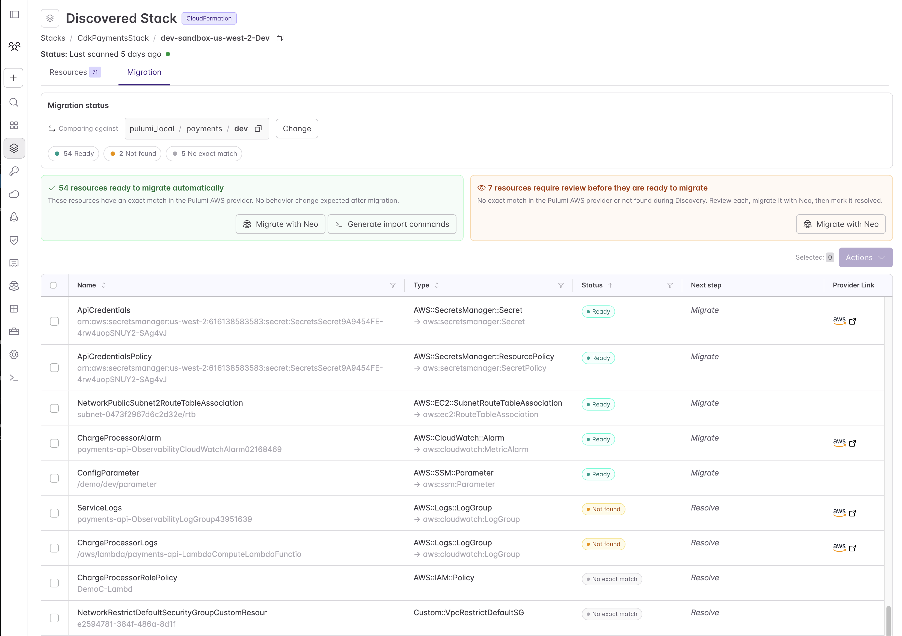

With [Discovered Stacks](/docs/insights/discovery/discovered-stacks/), Pulumi Cloud does the bookkeeping for a CloudFormation migration: every resource in the stack gets an explicit migration status, and the migration is done when the code provably matches the cloud. In this tutorial, we take one real CloudFormation stack from discovered to migrated and managed by Pulumi IaC, end to end.

<!--more-->

## What we're migrating

Our example is `payments-api`, a CloudFormation stack with 61 resources: a VPC, an Aurora ledger database behind an RDS Proxy, an assets S3 bucket, a DynamoDB ledger table, a Kinesis payment-events pipeline, and the IAM roles, KMS keys, and secrets that wire them together. The plan has five steps:

1. Find the stack in Pulumi Cloud.
1. Review the migration breakdown at a glance.
1. Start the migration.
1. Resolve the stragglers, so every resource is accounted for.
1. Confirm the quality gate: a zero-diff `pulumi preview`.

We'll use [Pulumi Neo](/docs/ai/) to do the heavy lifting, but nothing here depends on it. The same flow works with your own coding agent or entirely by hand, because migration status is derived from actual stack state — however the work gets done, the console shows the same progress.

## Step 1: Find your stack in Pulumi Cloud

Discovered Stacks builds on [Discovery](/docs/insights/discovery/), so the only prerequisite is a scanned [cloud account](/docs/insights/discovery/accounts/) — the AWS account holding your CloudFormation stacks.

Once a scan has run, open the **Stacks** page and turn on **Show Discovered Stacks**. Your CloudFormation stacks appear alongside your Pulumi stacks. The project name comes from the CloudFormation stack (`payments-api`), and the stack name encodes the account and region it came from, so the same template deployed to two regions shows up as two distinct discovered stacks.

## Step 2: Plan the migration at a glance

Open the discovered stack's **Migration** tab. It lays out all 61 resources of `payments-api` by status, so you can visualize the migration before touching anything:

- **54 Ready**: mapped to a Pulumi type and confirmed to exist — importable right now.
- **2 Not found**: mapped, but Discovery couldn't confirm their current state.
- **5 No exact match**: no direct Pulumi type. We'll come back to these in step 4.

Every row also pairs the **origin type** (`AWS::S3::Bucket`) with the **Pulumi type** it maps to (`aws:s3/bucket:Bucket`).



## Step 3: Start the migration

Most of `payments-api` has a direct migration path — 54 of its 61 resources are **Ready** — so we'll reach for the tab's quick actions and let them do the bulk of the work.

From the discovered stack's **Actions** menu, select **Migrate with Neo**. Neo asks where the code should live — a git repository, a target project and stack, a language — and then works through the migration:

1. Fetches the discovered resources and their statuses through the [Discovered Stacks API](/docs/insights/discovery/discovered-stacks/migrate/#use-the-api).
1. Imports the Ready resources in batches with `pulumi import`, building up a Pulumi program as it goes.
1. Runs `pulumi preview` after each batch and reconciles the generated code against the real cloud state.
1. Opens a pull request with the program and a migration report.

Because `pulumi import` writes state as it runs, the console updates live: statuses flip from `Ready` to `Migrated` batch by batch, without anyone marking a checkbox.

## Step 4: Resolve the stragglers

That leaves seven rows that need review. In this case, Neo handled them automatically, leaving an annotation on each that records the decision it made:

- **The 2 Not found rows** are CloudWatch log groups. Discovery couldn't confirm their state, but they're live, so the import succeeded and the resources were resolved without further inspection.
- **Three No exact match rows** are inline IAM policies, which our Pulumi AWS Provider imported as part of their parent role. The roles are already migrated, so each policy is marked resolved.
- **One** is a Secrets Manager target attachment; Pulumi expresses that link through the database's own configuration, so it's marked resolved once the database is migrated.
- **The last** is a CDK-generated custom resource that strips the rules from the VPC's default security group. Pulumi models that directly as an `aws.ec2.DefaultSecurityGroup`, so there's nothing to import — it's marked resolved.


## Step 5: The quality gate

With every resource imported or resolved, the migration earns its trust in one final check: a **zero-diff `pulumi preview`**. The generated program, run against the live cloud, proposes no changes.

```text
Resources:
    56 unchanged
```

A clean preview means the code matches reality. If it shows a diff, the code gets fixed until it doesn't; the cloud is never modified to make the code look right. And notably, there's no `pulumi up` in this story: importing already synced the state to Pulumi Cloud, so the first `up` you run is for the first real change you make after the migration.

That zero-diff preview isn't the finish line, it's a checkpoint you can build on. Imported code is faithful but rarely the code you'd write by hand: generated names, repeated blocks, inline configuration. Now that it provably matches the cloud, refactor freely — pull settings into stack config, split the program into modules, collapse repetition into loops, group related resources into components. Rerun `pulumi preview` after each change: a clean zero-diff means you reshaped the code without touching the infrastructure. When a refactor shifts a resource's identity (for example, moving it into a new component), an [alias](/docs/iac/concepts/resources/options/aliases/) keeps it a no-op.

## Where you end up

The `payments-api` program now lives in your repository, reviewed and merged like any other code. The discovered stack remains as the migration record until you decide to remove the CloudFormation stack. And because progress is derived from real state, if the CloudFormation stack changes later, those changes surface against your Pulumi stack. Migration doesn't have to be all-or-nothing either: for a larger stack, migrate resources progressively and safely by never running `pulumi up` while CloudFormation is managing the resources. That's the migration end to end: a CloudFormation stack turned into a Pulumi program you own and manage as code, every resource accounted for and provably in sync.

The same flow works for Azure Resource Manager deployments, which Discovery models as discovered stacks too. And for Pulumi-hosted Terraform stacks, a **Migration** tab offers the identical experience, with statuses derived from the Terraform state.

To go deeper:

- [Discovered Stacks documentation](/docs/insights/discovery/discovered-stacks/)
- [Migrate from a Discovered Stack](/docs/insights/discovery/discovered-stacks/migrate/)
- [Migrating from AWS CloudFormation](/docs/iac/guides/migration/migrating-to-pulumi/from-cloudformation/)
