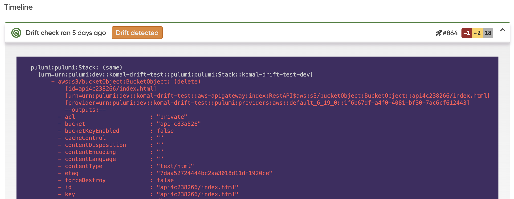
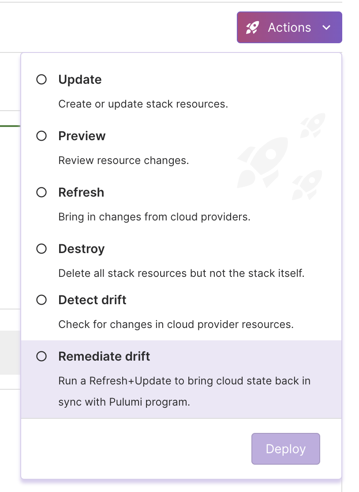

At Pulumi, we recognize the challenges platform teams face in maintaining the stability and compliance of their cloud infrastructures. One of the primary challenges is configuration drift, where the actual state of the infrastructure deviates from its intended state. This deviation can occur for various reasons, including manual adjustments made directly in the cloud provider’s console, unintended consequences of scripts, or unauthorized changes. Such drift can lead to significant problems including security vulnerabilities that open up potential breaches, compliance violations that can result in penalties, operational disruptions that affect user experience and business operations, and increased costs from unnecessary resource spend.

Today, we are excited to launch a new Drift Detection and Remediation feature in Pulumi Cloud to address these challenges. This new functionality is designed to automate the detection and correction of drift in your cloud environments, seamlessly integrating into your existing workflows, whether you use [Pulumi Deployments](/product/pulumi-deployments) or other CI/CD systems, and is supported for any resource you can manage with Pulumi, whether they are from Amazon Web Services, Microsoft Azure, Google Cloud Platform, or any of the [180+ supported providers](/registry). Drift Detection and Remediation is available today on the Enterprise and Business Critical editions of Pulumi Cloud.



### Why Pulumi Cloud Drift Detection and Remediation?

Drift Detection is the process of identifying changes in the actual state of your cloud environment that deviate from the expected configuration stored in Pulumi Cloud. This can occur when an operator makes an out-of-band change directly in the cloud provider console, bypassing the usual code deployment processes.

**Key benefits:**

- **Enhanced Security:** Stay ahead of potential security breaches caused by unauthorized changes to your infrastructure.
- **Compliance Assurance:** Ensure that your infrastructure remains compliant with organizational policies and standards after out of band changes.
- **Time and Cost Efficiency:** Reduce the time spent on tracking and rectifying configuration drift or managing a custom drift solution: leading to cost savings.
- **Risk Mitigation:** Minimize the risk of errors and potential outages by promptly identifying and addressing accidental drifts in your environments.

### How Drift Detection Works

Pulumi Cloud's Drift Detection and Remediation operates continuously, on a schedule of your choosing, comparing the state of your resources with the expected configurations defined in your Pulumi setups. Any discrepancies triggered by modifications, deletions, or additions of resources are promptly reported in the new Drift tab in the Pulumi Cloud console. Alerts can be configured to be sent via webhooks, Slack, or Microsoft Teams when drift occurs, with detailed information about the drift's nature and scope provided directly within the alerts.

For those using Pulumi Deployments, the system not only regularly detects but can also remedy the drift to align with your Pulumi program. This auto-remediation applies the last known infrastructure as code state, overwriting the drift. Auto-remediation can be set to occur by default or turned off to allow for manual intervention in the remediation of drift, depending on the criticality and nature of the stacks involved.

Under the hood, drift is detected by regularly running a new Pulumi operation we have added, `pulumi refresh --preview-only`. This operation collects the set of changes that exist between the cloud provider and the current desired state in Pulumi. These scheduled operations build on top of the new [Scheduled Deployments](/blog/scheduled-deployments) functionality as is [Time-to-Live Stacks](/blog/ttl), both of which were also announced today. If there is a delta between the cloud and the current desired state, it is presented in the Drift tab along with a “Drift detected” notification on the stack. If auto-remediation is configured, a `pulumi update --refresh` is run automatically following any detection of drift. All of this is automated by Pulumi Deployments for users who have configured Pulumi Deployments on their stack. For users who are not using Pulumi Deployments, they can configure their existing CI/CD system to run these same operations regularly, and the results will still be displayed as part of the Drift tab in Pulumi Cloud and you can receive notifications when drift is detected.

### Getting Started with Drift Detection

To get started with Drift Detection in Pulumi, select which deployment route you will be using:

- **Pulumi Deployments**: Pulumi programs are run on Pulumi-hosted compute, allowing you to set a schedule and let us handle the rest, including detecting drift, auto-remediation if you turn it on, history of each drift run and what was detected and notifications for drift events.
- **Existing CI/CD system**: Run Drift Detection by regularly running `pulumi refresh --preview-only` to see what drift is detected in the Pulumi Cloud console and get notified on drift events.

### Setting it Up in the Pulumi Cloud Console


In order to set up Drift Detection and Remediation in the Pulumi Cloud console, follow these steps:

1. Ensure Deployments Settings are configured on the stack [see the docs](/docs/pulumi-cloud/deployments/reference)
2. Navigate to the `Stack > Settings > Schedules` page
3. Select "Drift"
4. (Optional) Turn on auto-remediation if applicable
5. Set the schedule using a cron expression
6. Save the Schedule

And just like that, you have Drift Detection! To test what the output will look like you can use the Actions button in the top right on the Stack page to run an ad hoc Drift Detection operation or an Auto-remediate operation. Note: if you have never run a `pulumi refresh` on that stack before, you will want to run one before setting up Drift Detection and ensure a clean refresh state. More details on getting a clean refresh state in our documentation.



You will now see on the Drift tab, a summary of what resources have been updated or deleted, the properties that have changed, when the drift run happened and a link to the Deployment with further details.

When drift is detected, you have a couple of options:
1. _Run remediation from Pulumi Cloud_:  If you want to overwrite the changes made in your cloud provider with the most recently specified desired state of your Pulumi program.  This can be done via the "Remediate drift" option in the Actions drop down on your stack page.
2. _Run refresh from Pulumi Cloud_:  If you want to accept the changes made in your cloud provider back into your Pulumi desired state.  This can be done via the "Refresh" option in the Actions drop down on your stack page. You may also want to update your Pulumi program to align with the changes made in the cloud provider.



### Setting it Up via the API

For those who prefer to automate and script their infrastructure tasks, Drift Detection and Remediation can be configured programmatically using simple HTTP requests. Here are the new endpoints we have added:

- Create a Drift schedule
- Get a Drift schedule
- Update or delete a Drift schedule
- Pause or resume a Drift schedule
- List all schedules (includes raw Pulumi operations and Time-to-Live schedules)

Below is an example of setting up Drift Detection and Remediation on a stack, see the [Pulumi Deployments REST API documentation](/docs/pulumi-cloud/deployments/api) for more details on how to set Drift Detection and Remediation up programmatically.

**Create a Drift Detection and Remediation schedule:**

```bash
curl -H "Accept: application/vnd.pulumi+json" \
     -H "Content-Type: application/json" \
     -H "Authorization: token $PULUMI_ACCESS_TOKEN" \
     --request POST \
     --data '{"scheduleCron":"0 0 * * *","autoRemediate":true}' \
     https://api.pulumi.com/api/stacks/{organization}/{project}/{stack}/deployments/drift/schedules
```

### Setting it Up via the Pulumi Service Provider

The Pulumi Service Provider allows you to set up automated Drift Detection and Remediation in source control.



{}
```typescript
import * as pulumi from "@pulumi/pulumi";
import * as pulumiservice from "@pulumi/pulumiservice";

const organizationName = "my-org";
const projectName = "my-project";
const stackName = "production";

// Creating a DriftSchedule for automatically running drift detection
const driftDetectionSchedule = new pulumiservice.DriftSchedule("driftDetectionSchedule", {
    organization: organizationName,
    project: projectName,
    stack: stackName,
    scheduleCron: "0 0 * * *", // Run drift detection daily at midnight
    autoRemediate: true, // Automatically remediate any drift detected
});

export const driftScheduleId = driftDetectionSchedule.scheduleId;

```

{}

{}

```python
import pulumi
import pulumi_pulumiservice as pulumiservice

organization_name = "my-org"
project_name = "my-project"
stack_name = "production"

# Create a drift detection schedule
drift_detection_schedule = pulumiservice.DriftSchedule("driftDetectionSchedule",
    organization=organization_name,
    project=project_name,
    stack=stack_name,
    schedule_cron="0 0 * * *",  # Run drift detection daily at midnight
    auto_remediate=True)  # Automatically remediate any drift detected

pulumi.export('driftScheduleId', drift_detection_schedule.schedule_id)

```
{}

{}

```go
package main

import (
    "github.com/pulumi/pulumi-pulumiservice/sdk/go/pulumiservice"
    "github.com/pulumi/pulumi/sdk/v3/go/pulumi"
)

func main() {
    pulumi.Run(func(ctx *pulumi.Context) error {
        driftDetectionSchedule, err := pulumiservice.NewDriftSchedule(ctx, "driftDetectionSchedule", &pulumiservice.DriftScheduleArgs{
            Organization: pulumi.String("my-org"),
            Project: pulumi.String("my-project"),
            Stack: pulumi.String("production"),
            ScheduleCron: pulumi.String("0 0 * * *"),  // Run drift detection daily at midnight
            AutoRemediate: pulumi.Bool(true),  // Automatically remediate any drift detected
        })
        if err != nil {
            return err
        }

        ctx.Export("driftScheduleId", driftDetectionSchedule.ScheduleId)
        return nil
    })
}

```
{}

{}

```csharp
using Pulumi;
using PulumiService = Pulumi.PulumiService;

class Program
{
    static Task<int> Main() => Deployment.RunAsync(() => {
        var driftDetectionSchedule = new PulumiService.DriftSchedule("driftDetectionSchedule", new PulumiService.DriftScheduleArgs
        {
            Organization = "my-org",
            Project = "my-project",
            Stack = "production",
            ScheduleCron = "0 0 * * *",  // Run drift detection daily at midnight
            AutoRemediate = true,  // Automatically remediate any drift detected
        });

        return new Dictionary<string, object?>
        {
            { "driftScheduleId", driftDetectionSchedule.ScheduleId }
        };
    });
}

```

{}

{}

```java
import com.pulumi.Context;
import com.pulumi.Pulumi;
import com.pulumi.pulumiservice.Webhook;
import com.pulumi.pulumiservice.WebhookArgs;

public class App {
    public static void main(String[] args) {
        Pulumi.run(App::stack);
    }

    private static void stack(Context ctx) {
        var driftDetectionSchedule = new Webhook("driftDetectionSchedule", WebhookArgs.builder()
            .organization("my-org")
            .project("my-project")
            .stack("production")
            .scheduleCron("0 0 * * *") // Run drift detection daily at midnight
            .autoRemediate(true) // Automatically remediate any drift detected
            .build());

        ctx.export("driftScheduleId", driftDetectionSchedule.scheduleId());
    }
}

```
{}

{}

```yaml
name: drift-detection-setup
runtime: yaml
description: Setup of automated drift detection with Pulumi

resources:
  driftDetectionSchedule:
    type: pulumiservice:index:DriftSchedule
    properties:
      organization: my-org
      project: my-project
      stack: production
      scheduleCron: "0 0 * * *" # Run drift detection daily at midnight
      autoRemediate: true # Automatically remediate any drift detected

outputs:
  driftScheduleId: ${driftDetectionSchedule.scheduleId}

```

{}



See the [Pulumi Service Provider documentation](/registry/packages/pulumiservice/api-docs/provider) for more details on how to manage Drift Detection and Remediation in source control.

## Wrapping it up

We are thrilled to be releasing a top customer ask today and are looking forward to hearing about your experience using Drift Detection and Remediation.

Until next time, happy building!
