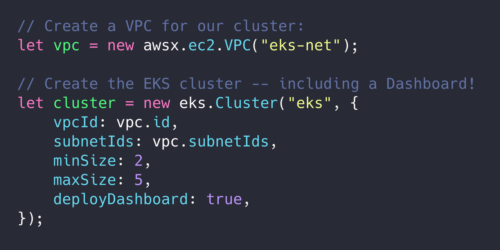
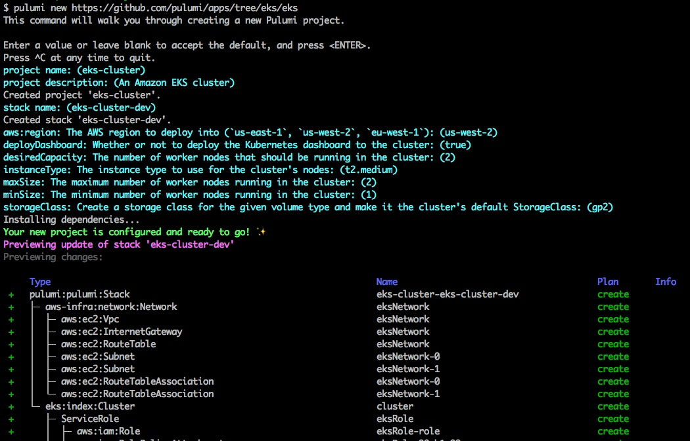
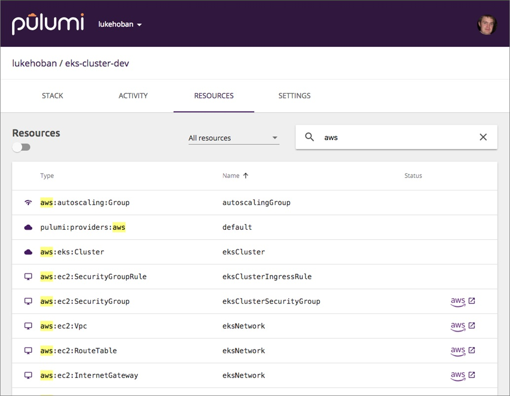

Provisioning, managing, and monitoring a Kubernetes cluster is
no easy task. AWS now offers EKS to ease a lot of that burden -- but
it's still difficult to get up and running. Pulumi's infrastructure as
code to the rescue! We can now provision an entire EKS cluster with a
CLI single gesture, thanks to [the `@pulumi/eks`
package](https://github.com/pulumi/pulumi-eks). Let's see how.



To get started, download the free and open source
[Pulumi SDK](). The SDK includes
the CLI we'll be using below, and requires AWS credentials to access
your AWS account and provision resources. If you already have the AWS
CLI installed and configured, you're already all set to go. Otherwise,
[check out the docs here]()
to set things up.

From here, there are two ways to proceed:

- Provision a new cluster with a single CLI command
- Use infrastructure as code to manage clusters ... including Kubernetes resources themselves!
<!--more-->

## Installing Amazon EKS with Pulumi

With the Pulumi CLI installed and configured, a single command will
provision your cluster:

    $ pulumi new https://github.com/pulumi/apps/eks

Using this template will walk you through configuring a few settings
such as the region you'd like to deploy into, the
[Amazon Elastic Compute Cloud](http://aws.amazon.com/ec2) (Amazon EC2)
instance type to deploy into the cluster, the cluster size, and whether to
install the Kubernetes Dashboard into your cluster automatically.

The CLI will first show you a preview of the AWS and Kubernetes
resources that will be deployed to create the cluster, before actually
performing any operation. Once you have reviewed and selected "Yes," the
cluster will begin deploying. The terminal output will be something like
the following:



Following these steps will provide a complete managed Amazon EKS
cluster, configured similar to the steps outlined in the
[Amazon EKS Getting Started guide](https://docs.aws.amazon.com/eks/latest/userguide/getting-started.html),
including optional support for Amazon EBS-backed StorageClasses and
access to the Kubernetes Dashboard. Just without any of the manual,
tedious, and irreproducible steps.

Once the deployment is complete -- it will take 10-20 minutes,
depending on how fast AWS can keep up -- you can grab the
`kubeconfig.json` needed to work with this cluster and connect to it
with [kubectl](https://kubernetes.io/docs/tasks/tools/install-kubectl/):

    $ pulumi stack output kubeconfig > kubeconfig.json
    $ KUBECONFIG=./kubeconfig.json kubectl get nodes

## Reusable AWS EKS component

This Amazon EKS installer is built on top of a reusable
[eks.Cluster](https://github.com/pulumi/pulumi-eks) component that is
available in Pulumi's infrastructure as code solution. In fact, the
command above simply created this component with sane defaults. But you
can do it by hand and programmatically. For example, here it is in
TypeScript:

```typescript
import * as aws from "@pulumi/aws";
import * as awsinfra from "@pulumi/aws-infra";
import * as eks from "@pulumi/eks";
 
// Create a VPC for our cluster.
const network = new awsinfra.Network("eksNetwork");
 
// Create the EKS cluster
const cluster = new eks.Cluster("eksCluster", {
    vpcId: network.vpcId,
    subnetIds: network.subnetIds,
    instanceType: "t2.micro",
    desiredCapacity: 2,
    minSize: 1,
    maxSize: 2,
    storageClasses: "gp2",
    deployDashboard: true,
});
 
// Export the cluster's kubeconfig.
export const kubeconfig = cluster.kubeconfig;
```

## Adding resources, and deploying Helm charts

You can extend or modify this program to change the details of their
Amazon EKS cluster, or to install additional AWS or Kubernetes resources
to associate with the cluster. For example, if applications running in
the cluster need access to an Amazon S3 bucket, simply create a new
`Bucket` resource, just like you do the cluster object:

```typescript
const bucket = new aws.s3.Bucket("assets");
```

Or, to install some Kubernetes applications automatically into the
Amazon EKS cluster (such as WordPress), just add them using the Pulumi
Kubernetes provider pointing at the newly provisioned EKS cluster:

```typescript
import * as k8s from "@pulumi/kubernetes";

// ...

const wordpress = new k8s.helm.v2.Chart("wpdev", {
    repo: "stable",
    version: "2.1.3",
    chart: "wordpress",
}, { providers: { kubernetes: cluster.provider }});
```

Pulumi makes it possible to define the cluster, AWS resources, and
Kubernetes objects needed to bootstrap your entire Kubernetes
environment, all in one place. They can then be versioned together and
exact replicas of the environment can be easily stood up independently
for operations such as testing or even disaster recovery.

As usual, by expressing these resources in code instead of in YAML, you
get many software engineering benefits, such as improved
tooling, ability to refactor using your favorite IDE, the ability to
create and share reusable components, and when using TypeScript, strong
typing to validate correctness up front.

## What's happening under the hood?

To make this whole process buttery smooth, the Pulumi EKS component
takes care of setting up all the pieces needed for an Amazon EKS
cluster:

- Creating an EKS Service Role
- Optionally creating a new Virtual Private Cloud (VPC)
- Creating an Amazon EKS cluster
- Configuring a Kubernetes provider with access to the Amazon EKS
  cluster
- Launching worker nodes in an Auto Scaling group to join the cluster
- Installing a ConfigMap into the cluster to allow new Amazon EC2
  worker nodes to join
- Installing a StorageClass into the cluster to allow provisioning
  Amazon EBS-backed PersistentVolumes
- Constructing the `kubeconfig` needed to access the cluster
- Optionally installing additional Kubernetes YAML and/or Helm charts

This involves steps that provision resources in AWS, steps that
provision resources in Kubernetes, and other custom computation to
coordinate these steps. In addition, during the deployment Pulumi also
provides complex coordination between these different steps.

## Managing Pulumi Deployments

Once you have deployed your Amazon EKS cluster and Kubernetes resources
to AWS, you can manage the deployment on
[app.pulumi.com](https://app.pulumi.com/), including deep links into the
AWS console and Kubernetes dashboard to get real-time insights on your
cluster.



All of the provisioned resources across AWS and Kubernetes are available
from this single view, along with an audit history of deployments to
this stack. The stack exports are also published in this same dashboard,
so that key outputs from a deployment are easily available and can be
shared with other users in your organization, like your kubeconfig.

[Additional management features](), including
RBAC, CI/CD integrations, and rich resource graph visualization, are
also available via the [Pulumi app](https://app.pulumi.com),
including Team and Enterprise Editions for production teams of all
sizes.

## Get Started

We've seen how Pulumi takes care of the heavy lifting with AWS EKS so
you don't have to. You can use Pulumi to easily deploy new clusters,
managed AWS resources, and then deploy Kubernetes apps to it. Support is
also available for Azure AKS, [Google GKE](),
and custom clusters (including Minikube), using the same workflow and approach.

For more information:

- [Get started with Pulumi and Kubernetes]()
- [Get started with Pulumi and AWS]()
