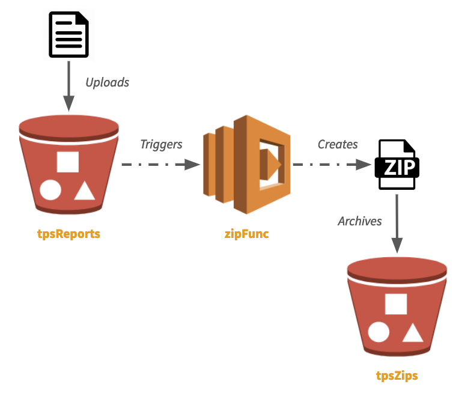
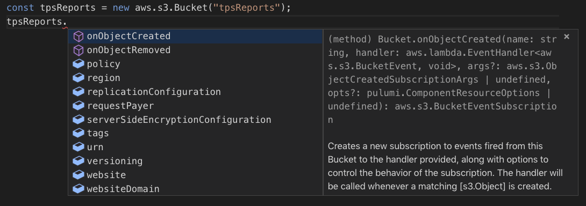
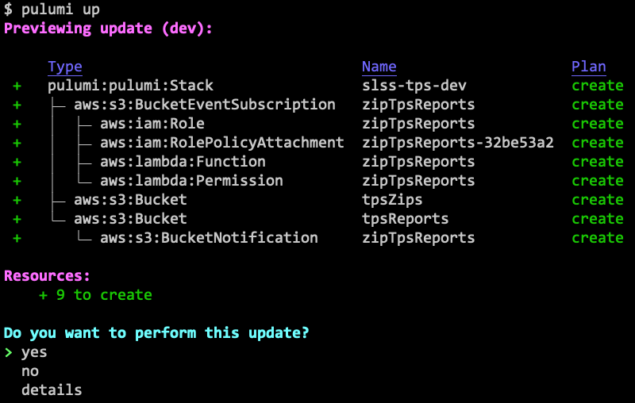
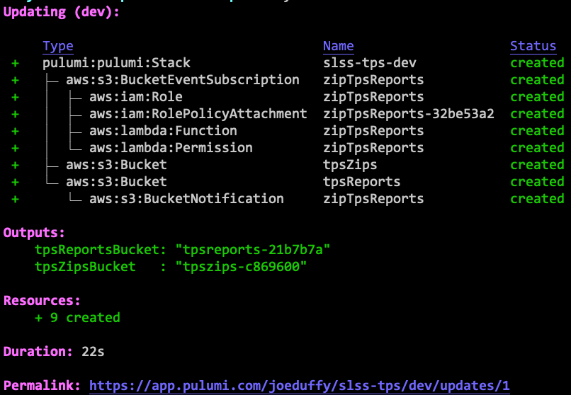
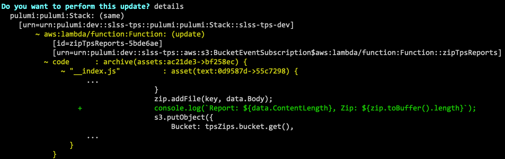

With Pulumi, you can create, deploy, and manage any cloud resource using
your favorite language. This includes application- *and* infrastructure-
related resources, often in the same program.

One area this gets really fun is serverless. Because we're using
general purpose languages, we can create resources, and then wire up
event handlers, just like normal event-driven programming. This is the
way serverless should be!

In this article, we'll see how. There's a broad range of options
depending on what you want to do, and how your team likes to operate.
We'll be using AWS and TypeScript, but other clouds and languages are
available.
<!--more-->

## A Simple Serverless App

In this article, we'll use a very simple serverless app. We have two S3
buckets: one for TPS reports, and the other to store archived zipfiles
of those reports. Anytime a new report comes in, our Lambda will zip and
archive it.

Simple enough. This can be visualized as follows:



All source code for this example is
[available on GitHub](https://github.com/pulumi/examples/tree/master/aws-ts-s3-lambda-copyzip).

## Event Sources and Event Handlers

Serverless app models today make you think of the event sources -- the
S3 buckets -- and event handlers -- the Lambdas and associated code
-- as very different things -- "infrastructure" versus "app code"
-- managed with distinct tools and workflows. Pulumi, in contrast,
gives you a single CLI, `pulumi`, to manage everything consistently.

You can create event sources and handlers in the same program, but
Pulumi's approach is flexible, allowing you to ease into serverless
without boiling the ocean. You can choose to wire functions up to
existing resources (say, if your team already created the buckets), or
even use functions your team has already made.

Also, because Pulumi provisions and manages resources, updating your
functions after creating them is easy. Just edit your code,
run `pulumi up`, and Pulumi will diff and compute the minimal set of
changes it can make to upgrade your code -- no downtime required.
We'll see this in action shortly. But first let's create our initial
app.

## Creating an Event Handler

There are multiple approaches to creating a function. Let's start with
the easiest.

### Approach 1: Magic Functions

Our favorite way to create functions is to write them inline. This blurs
the line between infrastructure and application logic in a way that
makes Pulumi programs feel like real, first class distributed apps.

First, we have our TPS reports and zips buckets (for now
we'll `new` them up, more on that later):

```typescript
import * as aws from "@pulumi/aws";
const tpsReports = new aws.s3.Bucket("tpsReports");
const tpsZips = new aws.s3.Bucket("tpsZips");
```

The bucket objects have many properties, including obvious ones like the
ARN, domain name, CORS rules, and so on. But if we look closely, we'll
see there are some `onX` methods. These register event handlers:



Let's use `onObjectCreated` to create a Lambda that will zip up any new
reports:

```typescript
tpsReports.onObjectCreated("zipTpsReports", (e) => {
   const AdmZip = require("adm-zip");
   const s3 = new aws.sdk.S3();
   for (const rec of e.Records || []) {
      const zip = new AdmZip();
      const [ buck, key ] = [ rec.s3.bucket.name, rec.s3.object.key ];
      console.log(`Zipping ${buck}/${key} into ${tpsZips.bucket.get()}/${key}.zip`);
      const data = await s3.getObject({ Bucket: buck, Key: key }).promise);
      zip.addFile(key, data.Body);
      await s3.putObject({
         Bucket: tpsZips.bucket.get(),
         Key: `${key}.zip`,
         Body: zip.toBuffer(),
      }).promise();
   }
});
```

Most of the code here is the application logic -- precisely what we
want to be focusing on! In fact, this code looks just like any ordinary
JavaScript event-driven program.

A neat thing that Pulumi can do is capture references to other
resources. So, notice here, we actually capture a reference
to `tpsZips` from within the event handler, and Pulumi figures out how
to serialize the resulting closure. For the most part, any code you
write there will work, unlocking all sorts of powerful composition
scenarios: multiple functions can be composed together, you can use
modules as usual, and so on. Just program like you normally would,
without the awkward environment variables and configuration. That's why
we call these *magic* functions.

Now, let's deploy the resources to AWS:



After confirming, `yes`, everything is up and running after just a few
seconds:



Note the resource graph. Pulumi uses real languages, which allows
encapsulation and hiding of unnecessary complexity. So underneath that
simple-looking `onObjectCreated` are many AWS resources, like IAM
attachments. This is a lot like how we can ignore all the messy OS API
calls when using Node.js abstractions.

Pulumi has many convenience functions built-in, and one of them
is `pulumi logs`, which will let us tail the logs associated with all
compute in our stack (including serverless functions):

  $ pulumi logs -f
  Collecting logs for stack dev since 2019-03-10T10:09:56.000-07:00...

Now that we're tailing the logs, let's copy a file over using the AWS
CLI:

  $ aws s3 cp ./tps001.txt s3://$(pulumi stack output tpsReportsBucket)
  upload: ../tps001.txt to s3://tpsreports-96458ef/tps001.txt

We have used the `pulumi stack output` command to conveniently fetch the
bucket name. After the upload completes, we'll see that our function
comes alive in the `pulumi logs` command:

   2019-03-10T11:10:48.617-07:00[zipTpsReports] Zipping
      tpsreports-96458ef/tps001.txt into tpszips-edfde11/tps001.txt.zip

And, sure enough, if we list the contents of the zip bucket, we will see
our newly added file:

  $ aws s3 ls s3://$(pulumi stack output tpsZipsBucket)
  2019-03-10 11:10:50     6206 tps001.txt.zip

Voila! A fully functioning serverless application.

Note also that the `CallbackFunction` class -- the powerful abstraction
behind all of this -- is exported, and offers some knobs,
in case you want to do things like reuse existing IAM roles rather than
creating new ones.
See the [`pulumi/aws/lambda` documentation]() for details.
For instance, say we want to increase the RAM available to our function from 128MB to 256MB:

```typescript
tpsReports.onObjectCreated(
   "zipTpsReports",
   new aws.lambda.CallbackFunction("zipTpsReportsFunc", {
      memorySize: 256 /*MB*/,
      callback: (e) => { /* same code as before */ },
   },
);
```

Soon we'll see how to manage and update our functions, but first let's
see some alternative coding styles.

### Approach 2: Manual Function Resources

We just saw that we can write our application logic inside of our Pulumi
program, alongside our infrastructure resource definitions. This can
feel magical and super productive. But not everybody wants to mix these
together. Sometimes you want to stick to the classic way of doing this:
keeping your function's application logic in one place, and your
function's infrastructure definition in another. This aligns more
closely with many team workflows.

There is another practical reason to want this: if your functions are
written in one language (say, C# or Java) while your Pulumi
infrastructure is authored in a different one (say, JavaScript or
Python).

Pulumi supports this, by simply defining your Lambda function like any
other infrastructure resource:

```typescript
// First, create some IAM machinery:
const zipFuncRole = new aws.iam.Role("zipTpsReportsFuncRole", {
   assumeRolePolicy: {
      Version: "2012-10-17",
      Statement: [{
         Action: "sts:AssumeRole",
         Principal: {
            Service: "lambda.amazonaws.com",
         },
         Effect: "Allow",
         Sid: "",
      }],
   },
});
new aws.iam.RolePolicyAttachment("zipTpsReportsFuncRoleAttach", {
   role: zipFuncRole,
   policyArn: aws.iam.AWSLambdaFullAccess,
});

// Next, create the Lambda function itself:
const zipFunc = new aws.lambda.Function("zipTpsReportsFunc", {
   environment: {
      variables: {
         "TPS_ZIP_BUCKET": tpsZips.bucket,
      },
   },
   code: new pulumi.asset.AssetArchive({
      ".": new pulumi.asset.FileArchive("./app"),
   }),
   runtime: "nodejs8.10",
   role: zipFuncRole.arn,
});

// Finally, register the Lambda to fire when a new TPS report arrives:
tpsReports.onObjectCreated("zipTpsReports", zipFunc);
```

Because we're taking matters into our own hands, we have to create the
IAM machinery ourselves. We also need a way to communicate the zip
bucket name, so we use an environment variable. This highlights both the
benefits and drawbacks to programming at this level -- we need to know
how to configure all of these ancillary resources, but as a result,
the
[entire power of Lambda is at our fingertips]().

Notice that we've pointed to our application logic inside of `./app`.
Pulumi will create the zipfile for you. If we instead wanted to use a
zipfile we've already packaged, just change `code` as follows:

```typescript
// ...
   code: new pulumi.asset.FileArchive("./app.zip"),
// ...
```

Using Pulumi's
[`Asset` and `Archive` classes](),
we can fetch code from anywhere -- even the network.

Although managing your functions manually isn't quite as magical, it is
practically useful, and still delivers all the usual infrastructure as
code benefits, enabling robust infrastructure management and versioning.

### Approach 3: Wire Up an Existing Function

This post is mainly about using serverless functions with Pulumi. But
what if you're using Pulumi mainly for infrastructure, and another
solution for the functions themselves? No problem -- Pulumi can still
glue everything together, even if it's not provisioning all of the
resources.

Every resource type in Pulumi has a static `get` that looks up an
existing resource. These resources aren't managed by Pulumi, but you
can still access their properties and use them. In this case, we'll
just look up an existing Lambda, `zipTpsReportsFunc`, and register it as
an event handler:

```typescript
const zipFunc = aws.lambda.Function.get("zipTpsReportsFunc", "zipTpsReports-19d51dc");
tpsReports.onObjectCreated("zipTpsReports", zipFunc);
```

We've given the function's ID, `zipTpsReports-19d51dc`, which allows
Pulumi to locate it in your account and reuse it. This can make it easy
to incrementally adopt Pulumi one piece at a time, collaborate between
teams, or stitch together resources
[managed by different stacks]().

## More About Functions

Now that we've seen the basics, let's look at a few associated
function management topics.

### Updating a Function {#updating-a-function .code-line line="246"}

Updating the function is as easy as can be. Imagine we're running into
a problem and want to do some good old fashioned `printf` debugging
inside of our lambda. Maybe we want to log the size of the report and
its resulting zipfile. Just add the relevant line:

```typescript
// ...
zip.addFile(key, data.Body);
console.log(`Report: ${data.ContentLength}, Zip: ${zip.toBuffer().length}`);
s3.putObject(
// ...
```

And run `pulumi up` -- it will show us what changed:


We can view the full diff, by choosing `details`, including a Git-like
diff of the code changes themselves!



After selecting `yes`, the function is updated in just a couple of
seconds. Similarly, we can update any of the resource definitions, and
Pulumi will figure out how to incrementally update them.

## Splitting Up your Codebase

A nice middle ground between magic and manual functions is to use your
language's module system to structure code differently. This is similar
to how you might structure a typical application: route definitions over
here, business logic over there, markup over here, etc. Pulumi can
figure out the diffs regardless of how you've structured your code, so
updates are always based only on what's changed.

For example, maybe we've defined our callback function in `./app`:

```typescript
export async function zipReport(e: aws.s3.BucketEvent): Promise<void> {
   // app code, as shown above, goes here
}
```

And now we can go back to our infrastructure code, and eliminate the
application logic entirely:

```typescript
import { zipReport } from "./app";
...
tpsReports.onObjectCreated("zipTpsReports", zipReport);
```

We can take this further and use dynamic package management to split up
the code, possibly even spreading pieces of infrastructure and
application code across multiple repos and/or packages. This works well
for larger teams with independent components versioning at their own
pace.

Lastly, it's possible to use Pulumi stacks to actually break apart your
cloud resources and functions into independently deployable pieces. This
allows teams to leverage features
like [RBAC]().
For instance, it's common for the DevOps team to manage the physical
cloud resources like queues, topics, and buckets, while the development
team authors and manages the serverless functions attached to them. Read
more about
this [here]().

## More About Event Sources

We glossed over one of the more interesting points: what resources have
event handlers associated with them, and how to get our hands on them.

## Provision a New Resource

The simplest answer here is to create a new resource in your Pulumi
program using `new`, as we saw above. Because Pulumi is an
infrastructure as code platform, any resources in any cloud are
available --
[AWS](),
[Azure](),
[GCP](),
[Kubernetes](), etc. When
you `new` one up, Pulumi understands how to provision and manage it.

We saw simple examples of this earlier:

```typescript
const tpsReports = new aws.s3.Bucket("tpsReports");
```

Note that the full set of configuration options are available on each
resource. Let's say we want to turn on server-side encryption of our
TPS archive bucket:

```typescript
const tpsReports = new aws.s3.Bucket("tpsReports", {
   serverSideEncryptionConfiguration: {
      sseAlgorithm: "AES256",
   },
});
```

Just as with functions, subsequent updates will be diffed and updated in
the minimally impactful way.

## Connect to an Existing Resource

Although it's nice we can provision the event sources and targets in a
single program, sometimes different members of the team manage different
parts of the infrastructure. For example, maybe your DevOps engineers
provision resources like buckets, topics, and so on, and your developers
wire up the functions.

Not to worry, you can import an existing resource and program against it
in the same way:

```typescript
const tpsReports = aws.s3.Bucket.get("tpsReports", "arn:aws:s3:::tpsReports-4f64efc");
```

This time, when you run your Pulumi program, you'll still see this
resource but notice it says `read` instead of `create` or `update`. This
just means that the resource is read from your account as-is. No matter
what you do, the bucket itself will not be modified by Pulumi, other
than to subscribe an event.

This, of course, can be combined with the earlier similar functionality
for functions, to glue together a bucket and a Lambda, where neither was
actually provisioned by Pulumi!

```typescript
const tpsReports = aws.s3.Bucket.get("tpsReports", "arn:aws:s3:::tpsReports-4f64efc");
const zipFunc = aws.lambda.Function.get("zipTpsReportsFunc", "zipTpsReports-19d51dc");
tpsReports.onObjectCreated("zipTpsReports", zipFunc);
```

## Other Notable Event Sources

Finally, it's worth noting there are many event handler functions
exposed in the AWS package:

- [`apigateway.x.API`](https://github.com/pulumi/examples/tree/master/aws-ts-apigateway):
  create serverless APIs using an Express.js style
- [`cloudwatch.onSchedule`]():
  fire a CloudWatch event on a particular schedule, e.g. a cron
  expression
- [`cloudwatch.Event.onEvent`]():
  fire an event when a particular CloudWatch event occurs
- [`cloudwatch.LogGroup.onEvent`]():
  fire an event when a CloudWatch logs event occurs
- [`dynamodb.Table.onEvent`]():
  fire events for DynamoDB insert, modify, or remove operations
- [`kinesis.Stream.onEvent`]():
  fire Kinesis Stream events at particular times or batch sizes
- [`s3.Bucket.onObjectCreated`]():
  trigger a function anytime an object is created in an S3 Bucket
- [`s3.Bucket.onObjectRemoved`]():
  trigger a function anytime an object is removed from an S3 Bucket
- [`s3.Bucket.onEvent`]():
  trigger a function for a wide range of S3 Bucket events
- [`sns.Topic.onEvent`]():
  fire SNS Topic events when new messages arrive
- [`sqs.Queue.onEvent`]():
  fire SQS Queue events when new messages are enqueued (or on DLQ
  events, etc)

All of these handlers can be programmed using the spectrum of techniques
outlined above.

## In Conclusion

In this post, we saw many different options for serverless programming
with Pulumi, from magic functions that make serverless feel like true
event-driven programming, to provisioning and managing infrastructure as
code.

We also saw that all of these options can be combined in any way,
depending on you and your team's needs. This is the magic of
programming languages in action!

If you'd like to try it out,
[check out the code for this post on GitHub](https://github.com/pulumi/examples/tree/master/aws-ts-s3-lambda-copyzip).
Happy serverless hacking!
