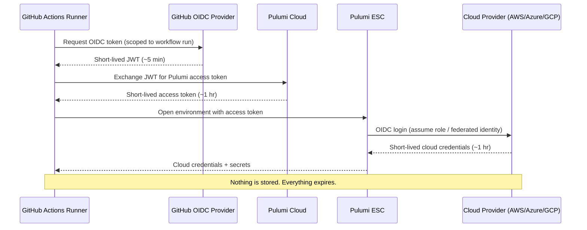

Supply chain attacks on CI/CD pipelines are accelerating. A growing pattern involves attackers compromising popular [GitHub Actions](https://github.com/features/actions) through tag poisoning — rewriting trusted version tags to point to malicious code that harvests environment variables, cloud credentials, and API tokens from runner environments. The stolen credentials are then exfiltrated to attacker-controlled infrastructure, often before anyone notices.

For every engineering organization, the question is no longer *if* your CI pipeline will encounter a compromised dependency, but *what is exposed when it does*.

At Pulumi, we asked ourselves that question — and decided the answer should be "nothing useful." Here is how we got there.

<!--more-->

## The problem with static CI secrets

Most organizations store long-lived cloud credentials, API tokens, and service account keys as GitHub repository or organization secrets. This approach has several problems:

- **Broad availability.** Every workflow run on a repository can access every secret stored in that repo. A compromised action in any workflow can read them all.
- **No expiration.** Secrets persist until someone manually rotates them. If exfiltrated, they give attackers persistent access for weeks or months.
- **No granular audit trail.** GitHub tells you a secret was used, but not which workflow, which step, or what it was used for.
- **Secret sprawl.** Across dozens or hundreds of repos, the same credentials are duplicated, making rotation a coordinated, error-prone effort.

In a supply chain attack scenario, this is exactly what attackers count on: a single compromised action that can dump a treasure trove of long-lived credentials.

## Our approach: zero static secrets

We replaced every static GitHub Secret across our CI pipelines with short-lived, dynamically fetched credentials using [Pulumi ESC](/docs/esc/) and [OpenID Connect (OIDC)](https://openid.net/developers/how-connect-works/). The credential flow works in layers, each scoped and ephemeral:

1. **GitHub generates a short-lived OIDC token** scoped to the specific workflow run, repository, and branch. This token is cryptographically signed by GitHub's OIDC provider.
1. **The token is exchanged with Pulumi Cloud** for a short-lived Pulumi access token. Pulumi Cloud validates the OIDC claims (organization, repository, branch) against a configured trust policy before issuing the token.
1. **The Pulumi access token opens an ESC environment** to retrieve the credentials the workflow needs — cloud provider keys, API tokens, or other secrets.
1. **Cloud credentials themselves are dynamic.** ESC environments use [OIDC login providers](/docs/esc/guides/configuring-oidc/) to fetch short-lived credentials directly from AWS, Azure, or GCP — no static keys stored anywhere.

The [`pulumi/esc-action`](https://github.com/marketplace/actions/esc-action) GitHub Action handles this entire flow in a single workflow step.



## What the change looks like

Before this migration, our workflows referenced static secrets stored in GitHub:

```yaml
env:
  AWS_ACCESS_KEY_ID: ${{ secrets.AWS_ACCESS_KEY_ID }}
  AWS_SECRET_ACCESS_KEY: ${{ secrets.AWS_SECRET_ACCESS_KEY }}
  PULUMI_BOT_TOKEN: ${{ secrets.PULUMI_BOT_TOKEN }}
  SLACK_WEBHOOK_URL: ${{ secrets.SLACK_WEBHOOK_URL }}
```

After the migration, workflows use OIDC to fetch everything dynamically:

```yaml
permissions:
  contents: read
  id-token: write  # Required for OIDC

steps:
  - name: Fetch secrets from ESC
    id: esc-secrets
    uses: pulumi/esc-action@v1
    env:
      ESC_ACTION_OIDC_AUTH: "true"
      ESC_ACTION_OIDC_ORGANIZATION: pulumi
      ESC_ACTION_OIDC_REQUESTED_TOKEN_TYPE: urn:pulumi:token-type:access_token:organization

  - name: Configure AWS Credentials
    uses: aws-actions/configure-aws-credentials@v4
    with:
      aws-access-key-id: ${{ steps.esc-secrets.outputs.AWS_ACCESS_KEY_ID }}
      aws-secret-access-key: ${{ steps.esc-secrets.outputs.AWS_SECRET_ACCESS_KEY }}
```

The static `secrets.*` references are gone entirely. Every credential is fetched at runtime through ESC.

## Scale: 70+ repos, zero static secrets

We did not do this for one or two flagship repos. We rolled this out across **every Pulumi provider repository** — AWS, Azure, GCP, Kubernetes, and over 60 more. The migration was managed centrally through our [`ci-mgmt`](https://github.com/pulumi/ci-mgmt) tooling, which generates consistent workflow configurations across all provider repos.

The pattern is the same everywhere:

- Each repo has a corresponding ESC environment under a `github-secrets/` project.
- All workflow-level `${{ secrets.* }}` references have been removed.
- The `pulumi/esc-action` step with OIDC auth is the single entry point for all credentials.

This consistency matters. When every repo follows the same pattern, security posture is verifiable and auditable — not a patchwork of manual configurations.

## Auditability and centralized control

Beyond eliminating static secrets, this migration gave us centralized visibility and control that GitHub Secrets simply cannot provide:

- **[Audit logging](/docs/esc/administration/audit-logs/).** ESC records which credentials were accessed, when, and by which workflow. This is a meaningful improvement over GitHub's binary "secret was used" signal.
- **Centralized access policies.** Access rules are defined once in ESC, not scattered across individual repository settings pages.
- **Single-point rotation.** When a credential needs to change, we update it in one ESC environment. All 70+ repos pick up the change on their next run — no coordinated repo-by-repo updates.
- **Dynamic credentials by default.** For cloud providers like AWS, Azure, and GCP, ESC fetches credentials via OIDC at open time. There is nothing to rotate because nothing is stored.

## What happens if a GitHub Action is compromised

With this architecture in place, here is what an attacker gets if a compromised GitHub Action runs in our CI:

- **No GitHub Secrets to dump.** The repository settings page has no stored secrets for a malicious action to exfiltrate.
- **OIDC tokens are scoped and short-lived.** The GitHub-issued JWT is valid only for the specific workflow run and expires within minutes.
- **Cloud credentials are ephemeral.** Any AWS, Azure, or GCP credentials fetched through ESC are short-lived and scoped to the role assumed during that run.
- **No persistent access.** There are no long-lived tokens to reuse hours or days later.

Compare this to the traditional model, where a single compromised action could exfiltrate AWS access keys that remain valid until someone manually rotates them — which could be weeks or months.

The goal is not to prevent every possible attack. It is to make the blast radius as small as possible when something goes wrong.

## Get started

If you want to adopt the same pattern in your own CI pipelines:

- [**Pulumi ESC GitHub Action**](/blog/announcing-pulumi-esc-github-action/) — How the action works and how to set it up.
- [**Configuring OIDC for ESC**](/docs/esc/guides/configuring-oidc/) — Set up OIDC trust between ESC and your cloud providers.
- [**Pulumi ESC documentation**](/docs/esc/) — Full documentation for environments, secrets, and configuration.

Your CI secrets do not have to be a liability. With OIDC and Pulumi ESC, they do not have to exist at all.
