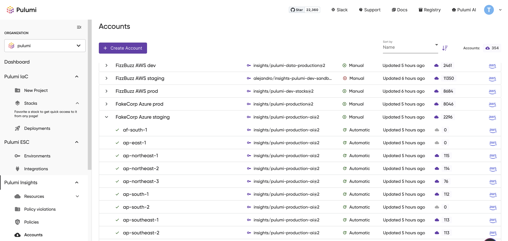

In this post, we're introducing a powerful new capability in Pulumi Insights that extends policy as code (PaC) beyond infrastructure as code to automatically govern all cloud resources in your environment. By unifying policy enforcement across both IaC and discovered resources, you can now write policies once and apply them universally - dramatically simplifying how organizations maintain security and compliance standards at scale.

<!--more-->

---

### What is Policy as Code (PaC)?

Policy as Code (PaC) is a way to define and enforce infrastructure policies using code. Instead of relying on manual processes or static configuration files, PaC enables automated policy enforcement in a consistent, versioned way. Pulumi’s CrossGuard feature allows you to write policies in general purpose programming languages, applying them across various cloud platforms such as AWS, Azure, GCP, and Kubernetes.

You can read more about CrossGuard in [Pulumi’s CrossGuard documentation](/docs/iac/using-pulumi/crossguard/).

### Accounts and Insights

Before diving into how you can configure PaC for discovered resources, it's important to understand how Pulumi discovers resources within your cloud environment regardless of how they were created. Pulumi Insights provides visibility into the state of your cloud resources by using **read only** access to your cloud environment in order to catalog the resources it contains. This is done through the **Accounts** page in Pulumi, which shows all the accounts for discovering resources you have added to your Pulumi organization. On this page, you can add new accounts which you can then add to policy groups to begin evaluating all of your cloud resources using your organization's policy as code.

After you have added an account, you can connect it with one or multiple Policy Groups to enforce the policies within those groups across your stacks and Insights accounts. Once linked to a Policy Group, your resources will be automatically evaluated against the policies you define whenever those policies or resources are updated.

---

### Setting Up Policy Groups for Discovered Resources

To apply policies to your discovered resources, you first need to set up a **Policy Group**. A Policy Group in Pulumi enforces policies across a group of stacks and accounts in your organization. Each Policy Group can contain multiple stacks and accounts, and you can assign multiple Policy Packs to these groups.

Here’s an example of the **Policy Group** configuration page, where you can create and manage policy groups:

Once your Policy Group is set up, you can add Insights Accounts to the group, which will ensure that the resources in those accounts are evaluated against the policies in the group.

---

### Running Policies on Discovered Resources

Now that your Policy Group is set up, you can start running policies against your discovered resources. Currently, Pulumi Insights supports running **resource** policies against all resource types supported by Pulumi Insights with support for **stack policies** coming soon. Pulumi Insights will evaluate each resource against the policies defined in your Policy Pack. If the resources violate any of the defined policies, those violations will show up on the **Policy Violations** page, which gives you a detailed view of any non-compliant resources.

Each violation includes details about the resource and the reason for the violation, helping you quickly identify and address issues.

---

### Key Takeaways

With Pulumi’s new PaC over discovered resources feature, you can now apply the same policies to both IaC and discovered resources across your cloud environment. This enables you to write a policy once and have it apply across all of your cloud resources. This results in consistent, compliant infrastructure no matter how resources are provisioned.

To begin securing your cloud infrastructure, here are the steps to take:

- **Set up Policy Groups** to enforce policies across stacks and accounts.
- **Link Insights Accounts** to your Policy Groups.
- **View violations** on the Policy Violations page and take action to resolve them.

This new capability is available for AWS, Azure, OCI, and Kubernetes. Stay tuned for more updates on policy enforcement and discover how you can leverage Pulumi for cloud security and compliance.

**Try it yourself**: Start enforcing policies across your discovered resources in minutes with Pulumi Insights. Check out our [getting started guide](/docs/insights/get-started/) to begin securing your entire cloud environment with policy as code.

For more information on getting started with Policy as Code, check out the following resources:

- [CrossGuard Overview](/docs/iac/using-pulumi/crossguard/)
- [Getting Started with Policy as Code](/blog/getting-started-with-pac)
