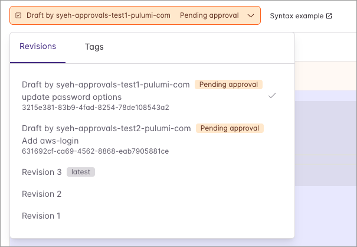
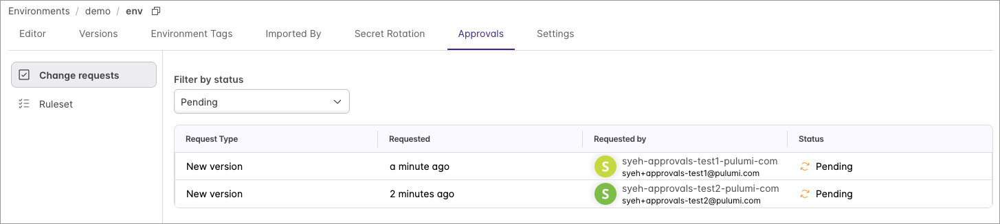
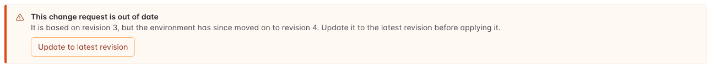
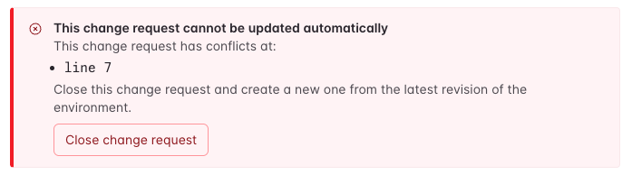

With [ESC Approvals](/docs/esc/concepts/approvals/), you can propose, review, and apply environment changes with change requests. However, we heard from users that they wanted multiple people to work on the same environment at the same time. Now you can! Each person can open their own change request for an environment and go through their own approval process.

<!--more-->

## How it works

### Creating and viewing environment drafts in the Pulumi Cloud Console

Creating environment change requests works the same as before - just edit an environment that has Approvals enabled, and click "Create Draft" once ready. You can view all change requests for the environment from either the revision picker or the Approvals tab.

### Updating the base revision, a.k.a "rebasing"

If another change request gets applied first, yours is now pointing to an older base revision. This is nothing to worry about - just click on "Update to latest revision" and your changes are reapplied on top of the latest revision (using a 3-way merge).

In the rare case that there is a merge conflict, the console will let you know where the conflict is. You can resolve this by either editing the draft or recreating the change request.

## Get started

Concurrent change requests are available today in Pulumi Cloud for any environment with approvals enabled. To set up approvals, see the [Approvals documentation](/docs/esc/concepts/approvals/). We look forward to seeing your team move faster!
