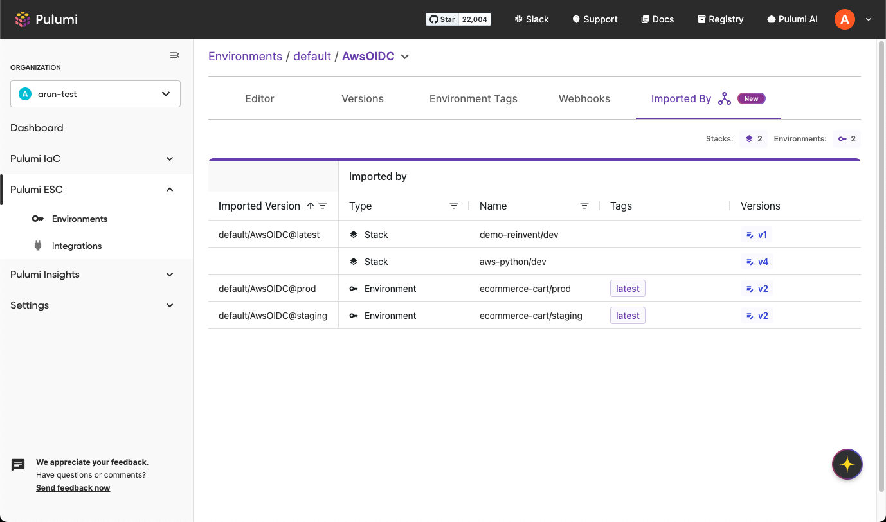

Managing secrets and configuration across multiple environments and stacks can easily become complex, leading to duplicated values, inconsistencies, and security risks. [Pulumi ESC](/product/esc) solves this with composable environments via [imports](/docs/esc/environments/imports/), allowing you to define configuration once and reuse it organization-wide.  Now, with the new capabilities to discover environment imports, you gain unprecedented visibility and control, simplifying the management of even the most complex infrastructure and applications.

<!--more-->

## Understanding Pulumi ESC Imports

Pulumi ESC lets you define secrets and configuration as code collections called [environments](/docs/esc/environments/working-with-environments/). These environments can import other environments, creating a hierarchical structure that promotes reusability, and reduces duplication and sprawl. You can centralize secrets and configuration within ESC and use them across [Pulumi IaC Stacks](/docs/esc/integrations/infrastructure/pulumi-iac/), [Pulumi Insights Accounts](/docs/pulumi-cloud/insights/accounts/), and various other platforms through our [integrations](/docs/esc/integrations/).

By using [version tags](/docs/esc/environments/versioning/#tagging-versions), imports can target specific versions of an environment. This locks down the configuration used by dependents, ensuring stability and preventing unintended changes from rolling out to your critical environments. 

## What's New?

We've added powerful discoverability features to give you clear insight into your environment dependencies:

- **New "Imported By" tab**: Easily understand downstream dependencies by clicking the "Imported By" tab for each environment. This tab shows all environments and stacks that import a specific environment, including the specific tagged version used. Filter and sort by imported versions and downstream resources to narrow in on the resources that will be affected by a change you are trying to make. 
- **Warnings for deletions and tag movements**: Pulumi ESC now warns you about the potential impact of deleting an environment or modifying version tags before you make the change, helping you avoid disruptions.
- **Enhanced environment page**: The Environments page now clearly indicates if an environment is used by other environments, stacks, or insights accounts, providing valuable relationship context at a glance.
- **Pulumi IaC stack visibility**: Environment import information is also available on the Stacks page and within individual stack overview pages.

## Conclusion 

Pulumi ESC's import feature is a paradigm shift in how you manage your secrets and configuration. The new suite of import discoverability features gives you the confidence to manage complex deployments with ease. Explore the new features and share your feedback through our [Community Slack](/community/) or [GitHub Repo](https://github.com/pulumi/esc/issues/new/choose).
