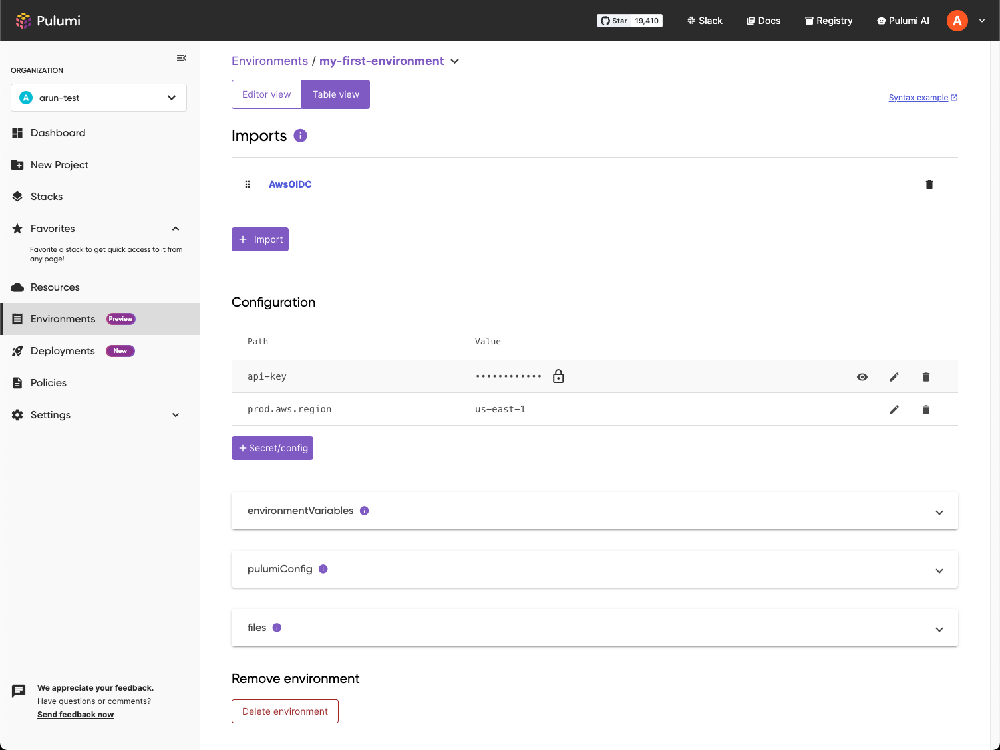

We're excited to announce the launch of the Pulumi Environments, Secrets, and Configurations ([ESC](/product/esc)) Key-Value Table Editor. At Pulumi, we're committed to providing flexible solutions that cater to diverse development needs and practices. This latest addition underscores our dedication to this principle by offering a user-friendly interface for managing complex configurations and secrets.

Pulumi ESC simplifies the management of secrets and configurations by reducing duplication and drift, empowering development teams to focus on building and deploying. The existing YAML-based code editor offers a native way for developers to author and manage configurations.

<!--more-->

The Key-Value Table Editor we are launching today introduces an alternate visual interface for handling configuration tasks, enabling the direct input of plaintext and secret values.  Key capabilities of the Table Editor include:

- **CRUD Operations**: Perform Create, Read, Update, and Delete (CRUD) operations on your secrets and  plaintext values
- **Decrypting Secrets**: Safely decrypt secrets one at a time, directly within the editor
- **Environment Imports**: [Import environments](/docs/esc/environments/#importing-other-environments) and define the order of imports to suit your project's needs
- **Variables Projections**: Make variables available as [Pulumi Config](/docs/esc/environments/#using-environments-with-pulumi-iac), [environment variables](/docs/esc/environments/#projecting-environment-variables), and files, streamlining your deployment and runtime configuration.
- **Interpolations and References**: Add references to existing path-values, or add [interpolations](/docs/esc/environments/#interpolating-values) to dynamically generate values

In the current release of the Table view, [provider configurations](/docs/esc/providers) and functions are set to read-only.  

## What’s Next?

Looking to the future, we are already working on the next set of enhancements for the Key-Value Table Editor. Soon, you will have the capability to add and edit provider configurations directly within the table view.

Pulumi ESC's diverse array of providers not only allows teams to dynamically acquire cloud provider credentials at runtime, thus eliminating the need for static, long-lived credentials but also enables retrieving secrets from external secrets managers, such as AWS Secrets Manager and HashiCorp Vault, directly within ESC. This means users can seamlessly pull and utilize secrets within ESC, enhancing security and flexibility. The upcoming provider configuration support in the Table view will offer a guided experience, simplifying the process of leveraging Pulumi ESC's comprehensive set of providers.

## Conclusion

The launch of the Key-Value Table Editor marks an important step in our mission to make infrastructure as code more accessible and manageable for developers.

Your [feedback](https://github.com/pulumi/esc/issues/new/choose) is the cornerstone of our development process. As we look ahead, we're focusing on incorporating your insights to further enhance the Key-Value Table Editor. Together, we can continue to refine and advance Pulumi ESC, making it an even more powerful tool for the developer community.

Check out our [documentation](/docs/esc) to learn more about Pulumi ESC.
