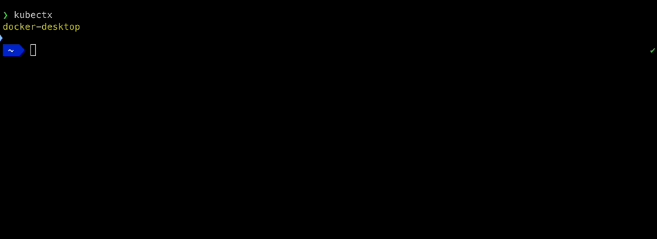

Keeping long-lived kubeconfig around on disk is insecure and error-prone. You need a secure workflow that removes tedium.
With Pulumi and ESC, we provide an automated workflow that generates a kubeconfig on-the-fly for every command using short-term credentials issued via OIDC.
This makes it easy for your team to connect to a given Kubernetes environment, and it works well with Kubernetes tools
such as `kubectl` and the Pulumi Kubernetes provider. Let's take a look.



In this post, we will create a Kubernetes cluster, deploy an application to the created cluster,
and then use `kubectl` to check on the deployed application. Pulumi gives you great flexibility to [factor your infrastructure into reusable parts](/docs/using-pulumi/organizing-projects-stacks), and we'll do that here. With ESC, we'll define an environment that provides
access to an AWS account, and use that environment to create the cluster. Then we'll define an environment that encapsulates
the kubeconfig needed to connect to that cluster.

## Create a Kubernetes Cluster

First, we create a Kubernetes cluster using the [pulumi-eks](/registry/packages/eks) component.



{}

```ts
import * as pulumi from "@pulumi/pulumi";
import * as eks from "@pulumi/eks";

const eksCluster = new eks.Cluster("eks-cluster", {});
export const kubeconfig = eksCluster.kubeconfig;
```

{}

{}

```python
import pulumi
import pulumi_eks as eks

eks_cluster = eks.Cluster("eks-cluster")
pulumi.export("kubeconfig", eks_cluster.kubeconfig)
```

{}

{}

```go
import (
	"github.com/pulumi/pulumi-eks/sdk/go/eks"
	"github.com/pulumi/pulumi/sdk/v3/go/pulumi"
)

func main() {
	pulumi.Run(func(ctx *pulumi.Context) error {
		eksCluster, err := eks.NewCluster(ctx, "eks-cluster", nil)
		if err != nil {
			return err
		}
		ctx.Export("kubeconfig", eksCluster.Kubeconfig)
		return nil
	})
}
```

{}

{}

```csharp
using System.Collections.Generic;
using System.Linq;
using Pulumi;
using Eks = Pulumi.Eks;

return await Deployment.RunAsync(() =>
{
    var eksCluster = new Eks.Cluster("eks-cluster");

    return new Dictionary<string, object?>
    {
        ["kubeconfig"] = eksCluster.Kubeconfig,
    };
});
```

{}

{}

```java
import com.pulumi.Context;
import com.pulumi.Pulumi;
import com.pulumi.eks.Cluster;

public class App {
    public static void main(String[] args) {
        Pulumi.run(App::stack);
    }

    public static void stack(Context ctx) {
        var eksCluster = new Cluster("eksCluster");

        ctx.export("kubeconfig", eksCluster.kubeconfig());
    }
}
```

{}

{}

```yaml
name: eks-cluster
runtime: nodejs
description: EKS Kubernetes Cluster
resources:
  eks-cluster:
    type: eks:Cluster
outputs:
  kubeconfig: ${eks-cluster.kubeconfig}
```

{}



This component includes an output value for the cluster's kubeconfig that we can use to connect to the cluster. However,
before we create the cluster, we need to configure AWS credentials so that Pulumi can deploy the requested changes.
While it is possible to set this configuration directly on the stack, let's see how it can be done with Pulumi ESC. First,
we create the following ESC environment (the `aws-sandbox` environment):

```yaml
values:
  aws:
    creds:
      fn::open::aws-login:
        oidc:
          duration: 1h
          roleArn: arn:aws:iam::0123456789:role/deploy-oidc
          sessionName: pulumi-environments-session
  environmentVariables:
    AWS_ACCESS_KEY_ID: ${aws.creds.keyId}
    AWS_SECRET_ACCESS_KEY: ${aws.creds.secretAccessKey}
    AWS_SESSION_TOKEN: ${aws.creds.sessionToken}
  pulumiConfig:
    aws:region: us-west-2
```

Notice that this environment uses the `aws-login` ESC provider to [dynamically load short-lived credentials using OIDC](/docs/pulumi-cloud/oidc/provider/aws/).
These credentials are then exposed as environment variables for consumers of this environment. We also set the AWS region
in the `pulumiConfig` section to configure the region for `pulumi` to manage resources with the `pulumi-aws` provider.

To have Pulumi use this ESC environment when deploying the cluster, we set the following configuration for our stack:

```yaml
environment:
  - aws-sandbox
```

The `environment` key accepts a list of ESC environments to import. When the stack is updated, `pulumi` automatically
sets the configured environment variables and stack configuration based on the ESC environment. We run our update, and
Pulumi creates our EKS cluster.

```
pulumi up --skip-preview
Updating (demo)

     Type                                   Name                                           Status
 +   pulumi:pulumi:Stack                    eks-cluster-demo                               created (577s)
 +   └─ eks:index:Cluster                   eks-cluster                                    created (561s)
 +      ├─ eks:index:ServiceRole            eks-cluster-eksRole                            created (2s)
 +      │  ├─ aws:iam:Role                  eks-cluster-eksRole-role                       created (0.78s)
 +      │  └─ aws:iam:RolePolicyAttachment  eks-cluster-eksRole-4b490823                   created (0.44s)
 +      ├─ eks:index:ServiceRole            eks-cluster-instanceRole                       created (3s)
 +      │  ├─ aws:iam:Role                  eks-cluster-instanceRole-role                  created (0.85s)
 +      │  ├─ aws:iam:RolePolicyAttachment  eks-cluster-instanceRole-3eb088f2              created (0.46s)
 +      │  ├─ aws:iam:RolePolicyAttachment  eks-cluster-instanceRole-03516f97              created (0.59s)
 +      │  └─ aws:iam:RolePolicyAttachment  eks-cluster-instanceRole-e1b295bd              created (0.75s)
 +      ├─ eks:index:RandomSuffix           eks-cluster-cfnStackName                       created (0.49s)
 +      ├─ aws:ec2:SecurityGroup            eks-cluster-eksClusterSecurityGroup            created (1s)
 +      ├─ aws:iam:InstanceProfile          eks-cluster-instanceProfile                    created (0.48s)
 +      ├─ aws:eks:Cluster                  eks-cluster-eksCluster                         created (441s)
 +      ├─ aws:ec2:SecurityGroupRule        eks-cluster-eksClusterInternetEgressRule       created (0.81s)
 +      ├─ aws:ec2:SecurityGroup            eks-cluster-nodeSecurityGroup                  created (1s)
 +      ├─ pulumi:providers:kubernetes      eks-cluster-eks-k8s                            created (0.14s)
 +      ├─ eks:index:VpcCni                 eks-cluster-vpc-cni                            created (2s)
 +      ├─ kubernetes:core/v1:ConfigMap     eks-cluster-nodeAccess                         created (0.60s)
 +      ├─ aws:ec2:SecurityGroupRule        eks-cluster-eksExtApiServerClusterIngressRule  created (1s)
 +      ├─ aws:ec2:SecurityGroupRule        eks-cluster-eksClusterIngressRule              created (1s)
 +      ├─ aws:ec2:SecurityGroupRule        eks-cluster-eksNodeInternetEgressRule          created (1s)
 +      ├─ aws:ec2:SecurityGroupRule        eks-cluster-eksNodeClusterIngressRule          created (2s)
 +      ├─ aws:ec2:SecurityGroupRule        eks-cluster-eksNodeIngressRule                 created (2s)
 +      ├─ aws:ec2:LaunchConfiguration      eks-cluster-nodeLaunchConfiguration            created (1s)
 +      ├─ aws:cloudformation:Stack         eks-cluster-nodes                              created (108s)
 +      └─ pulumi:providers:kubernetes      eks-cluster-provider                           created (0.12s)

Outputs:
    kubeconfig: {
        apiVersion     : "v1"
        clusters       : [
            [0]: {
                cluster: {
                    certificate-authority-data: "<redacted>"
                    server                    : "https://FB9978041F7B72B227B7E95F076822E4.gr7.us-west-2.eks.amazonaws.com"
                }
                name   : "kubernetes"
            }
        ]
        contexts       : [
            [0]: {
                context: {
                    cluster: "kubernetes"
                    user   : "aws"
                }
                name   : "aws"
            }
        ]
        current-context: "aws"
        kind           : "Config"
        users          : [
            [0]: {
                name: "aws"
                user: {
                    exec: {
                        apiVersion: "client.authentication.k8s.io/v1beta1"
                        args      : [
                            [0]: "eks"
                            [1]: "get-token"
                            [2]: "--cluster-name"
                            [3]: "eks-cluster-eksCluster-1268ff9"
                        ]
                        command   : "aws"
                        env       : [
                            [0]: {
                                name : "KUBERNETES_EXEC_INFO"
                                value: (json) {
                                    apiVersion: "client.authentication.k8s.io/v1beta1"
                                }

                            }
                        ]
                    }
                }
            }
        ]
    }

Resources:
    + 27 created

Duration: 9m38s
```

## Connect to the cluster

Let's create another Pulumi ESC environment called `eks-sandbox` to encapsulate the configuration
needed to connect to the EKS cluster.

```yaml
imports:
  - aws-sandbox
values:
  stacks:
    fn::open::pulumi-stacks:
      stacks:
        eks-cluster:
          stack: eks-cluster/demo
  kubeconfig: {'fn::toJSON': "${stacks.eks-cluster.kubeconfig}"}
  pulumiConfig:
    kubernetes:kubeconfig: ${kubeconfig}
  files:
    KUBECONFIG: ${kubeconfig}
```

This ESC environment uses another ESC provider to reference outputs from Pulumi stacks in your organization. In this case,
we specify that we want to read outputs from the `eks-cluster/demo` stack, and then export the `kubeconfig` output from that
stack as `pulumiConfig` and `files`. As we saw on the cluster environment, `pulumiConfig` sets configuration for Pulumi
providers, so this allows us to run our stack and deploy the application to our cluster.

We import the `aws-sandbox` environment defined earlier, to provide the user with AWS credentials to authenticate to the EKS cluster.

Since the `eks-sandbox` environment defines a `KUBECONFIG` variable that `kubectl` understands, we can run `kubectl` in the context of this environment like this:

```
$ pulumi env run eks-sandbox -- kubectl cluster-info

Kubernetes control plane is running at https://2F3303BF9E03F8D61099AAB5ED6F31A4.gr7.us-west-2.eks.amazonaws.com
CoreDNS is running at https://2F3303BF9E03F8D61099AAB5ED6F31A4.gr7.us-west-2.eks.amazonaws.com/api/v1/namespaces/kube-system/services/kube-dns:dns/proxy
```

## Deploy an application to the cluster

Now, we want to deploy an application to our new EKS cluster. While we could have included this in the same stack as the
cluster, it is generally better to follow the [separation of concerns principle](/blog/iac-recommended-practices-structuring-pulumi-projects), and manage applications separately from
the underlying infrastructure. To achieve this goal, we create a new application stack with the following program:



{}

```ts
import * as pulumi from "@pulumi/pulumi";
import * as kubernetes from "@pulumi/kubernetes";

const nginxDeployment = new kubernetes.apps.v1.Deployment("nginx-deployment", {
    metadata: {
        name: "nginx",
        labels: {
            app: "nginx",
        },
    },
    spec: {
        replicas: 3,
        selector: {
            matchLabels: {
                app: "nginx",
            },
        },
        template: {
            metadata: {
                labels: {
                    app: "nginx",
                },
            },
            spec: {
                containers: [{
                    name: "nginx",
                    image: "nginx",
                    ports: [{
                        containerPort: 80,
                    }],
                }],
            },
        },
    },
});
const nginxService = new kubernetes.core.v1.Service("nginx-service", {
    metadata: {
        name: "nginx",
    },
    spec: {
        type: "LoadBalancer",
        selector: {
            app: "nginx",
        },
        ports: [{
            protocol: "TCP",
            port: 80,
        }],
    },
});
```

{}

{}

```python
import pulumi
import pulumi_kubernetes as kubernetes

nginx_deployment = kubernetes.apps.v1.Deployment("nginx-deployment",
    metadata=kubernetes.meta.v1.ObjectMetaArgs(
        name="nginx",
        labels={
            "app": "nginx",
        },
    ),
    spec=kubernetes.apps.v1.DeploymentSpecArgs(
        replicas=3,
        selector=kubernetes.meta.v1.LabelSelectorArgs(
            match_labels={
                "app": "nginx",
            },
        ),
        template=kubernetes.core.v1.PodTemplateSpecArgs(
            metadata=kubernetes.meta.v1.ObjectMetaArgs(
                labels={
                    "app": "nginx",
                },
            ),
            spec=kubernetes.core.v1.PodSpecArgs(
                containers=[kubernetes.core.v1.ContainerArgs(
                    name="nginx",
                    image="nginx",
                    ports=[kubernetes.core.v1.ContainerPortArgs(
                        container_port=80,
                    )],
                )],
            ),
        ),
    ))
nginx_service = kubernetes.core.v1.Service("nginx-service",
    metadata=kubernetes.meta.v1.ObjectMetaArgs(
        name="nginx",
    ),
    spec=kubernetes.core.v1.ServiceSpecArgs(
        type="LoadBalancer",
        selector={
            "app": "nginx",
        },
        ports=[kubernetes.core.v1.ServicePortArgs(
            protocol="TCP",
            port=80,
        )],
    ))
```

{}

{}

```go
import (
	appsv1 "github.com/pulumi/pulumi-kubernetes/sdk/v4/go/kubernetes/apps/v1"
	corev1 "github.com/pulumi/pulumi-kubernetes/sdk/v4/go/kubernetes/core/v1"
	metav1 "github.com/pulumi/pulumi-kubernetes/sdk/v4/go/kubernetes/meta/v1"
	"github.com/pulumi/pulumi/sdk/v3/go/pulumi"
)

func main() {
	pulumi.Run(func(ctx *pulumi.Context) error {
		_, err := appsv1.NewDeployment(ctx, "nginx-deployment", &appsv1.DeploymentArgs{
			Metadata: &metav1.ObjectMetaArgs{
				Name: pulumi.String("nginx"),
				Labels: pulumi.StringMap{
					"app": pulumi.String("nginx"),
				},
			},
			Spec: &appsv1.DeploymentSpecArgs{
				Replicas: pulumi.Int(3),
				Selector: &metav1.LabelSelectorArgs{
					MatchLabels: pulumi.StringMap{
						"app": pulumi.String("nginx"),
					},
				},
				Template: &corev1.PodTemplateSpecArgs{
					Metadata: &metav1.ObjectMetaArgs{
						Labels: pulumi.StringMap{
							"app": pulumi.String("nginx"),
						},
					},
					Spec: &corev1.PodSpecArgs{
						Containers: corev1.ContainerArray{
							&corev1.ContainerArgs{
								Name:  pulumi.String("nginx"),
								Image: pulumi.String("nginx"),
								Ports: corev1.ContainerPortArray{
									&corev1.ContainerPortArgs{
										ContainerPort: pulumi.Int(80),
									},
								},
							},
						},
					},
				},
			},
		})
		if err != nil {
			return err
		}
		_, err = corev1.NewService(ctx, "nginx-service", &corev1.ServiceArgs{
			Metadata: &metav1.ObjectMetaArgs{
				Name: pulumi.String("nginx"),
			},
			Spec: &corev1.ServiceSpecArgs{
				Type: pulumi.String("LoadBalancer"),
				Selector: pulumi.StringMap{
					"app": pulumi.String("nginx"),
				},
				Ports: corev1.ServicePortArray{
					&corev1.ServicePortArgs{
						Protocol: pulumi.String("TCP"),
						Port:     pulumi.Int(80),
					},
				},
			},
		})
		if err != nil {
			return err
		}
		return nil
	})
}
```

{}

{}

```csharp
using System.Collections.Generic;
using System.Linq;
using Pulumi;
using Kubernetes = Pulumi.Kubernetes;

return await Deployment.RunAsync(() =>
{
    var nginxDeployment = new Kubernetes.Apps.V1.Deployment("nginx-deployment", new()
    {
        Metadata = new Kubernetes.Types.Inputs.Meta.V1.ObjectMetaArgs
        {
            Name = "nginx",
            Labels =
            {
                { "app", "nginx" },
            },
        },
        Spec = new Kubernetes.Types.Inputs.Apps.V1.DeploymentSpecArgs
        {
            Replicas = 3,
            Selector = new Kubernetes.Types.Inputs.Meta.V1.LabelSelectorArgs
            {
                MatchLabels =
                {
                    { "app", "nginx" },
                },
            },
            Template = new Kubernetes.Types.Inputs.Core.V1.PodTemplateSpecArgs
            {
                Metadata = new Kubernetes.Types.Inputs.Meta.V1.ObjectMetaArgs
                {
                    Labels =
                    {
                        { "app", "nginx" },
                    },
                },
                Spec = new Kubernetes.Types.Inputs.Core.V1.PodSpecArgs
                {
                    Containers = new[]
                    {
                        new Kubernetes.Types.Inputs.Core.V1.ContainerArgs
                        {
                            Name = "nginx",
                            Image = "nginx",
                            Ports = new[]
                            {
                                new Kubernetes.Types.Inputs.Core.V1.ContainerPortArgs
                                {
                                    ContainerPortValue = 80,
                                },
                            },
                        },
                    },
                },
            },
        },
    });

    var nginxService = new Kubernetes.Core.V1.Service("nginx-service", new()
    {
        Metadata = new Kubernetes.Types.Inputs.Meta.V1.ObjectMetaArgs
        {
            Name = "nginx",
        },
        Spec = new Kubernetes.Types.Inputs.Core.V1.ServiceSpecArgs
        {
            Type = "LoadBalancer",
            Selector =
            {
                { "app", "nginx" },
            },
            Ports = new[]
            {
                new Kubernetes.Types.Inputs.Core.V1.ServicePortArgs
                {
                    Protocol = "TCP",
                    Port = 80,
                },
            },
        },
    });

});
```

{}

{}

```java
import java.security.Provider.Service;
import java.util.Map;

import javax.naming.Context;

import com.pulumi.Pulumi;
import com.pulumi.kubernetes.apps_v1.Deployment;
import com.pulumi.kubernetes.apps_v1.DeploymentArgs;
import com.pulumi.kubernetes.apps_v1.inputs.DeploymentSpecArgs;
import com.pulumi.kubernetes.core_v1.ServiceArgs;
import com.pulumi.kubernetes.core_v1.inputs.PodSpecArgs;
import com.pulumi.kubernetes.core_v1.inputs.PodTemplateSpecArgs;
import com.pulumi.kubernetes.core_v1.inputs.ServiceSpecArgs;
import com.pulumi.kubernetes.meta_v1.inputs.LabelSelectorArgs;
import com.pulumi.kubernetes.meta_v1.inputs.ObjectMetaArgs;

public class App {
    public static void main(String[] args) {
        Pulumi.run(App::stack);
    }

    public static void stack(Context ctx) {
        var nginxDeployment = new Deployment("nginxDeployment", DeploymentArgs.builder()
            .metadata(ObjectMetaArgs.builder()
                .name("nginx")
                .labels(Map.of("app", "nginx"))
                .build())
            .spec(DeploymentSpecArgs.builder()
                .replicas(3)
                .selector(LabelSelectorArgs.builder()
                    .matchLabels(Map.of("app", "nginx"))
                    .build())
                .template(PodTemplateSpecArgs.builder()
                    .metadata(ObjectMetaArgs.builder()
                        .labels(Map.of("app", "nginx"))
                        .build())
                    .spec(PodSpecArgs.builder()
                        .containers(ContainerArgs.builder()
                            .name("nginx")
                            .image("nginx")
                            .ports(ContainerPortArgs.builder()
                                .containerPort(80)
                                .build())
                            .build())
                        .build())
                    .build())
                .build())
            .build());

        var nginxService = new Service("nginxService", ServiceArgs.builder()
            .metadata(ObjectMetaArgs.builder()
                .name("nginx")
                .build())
            .spec(ServiceSpecArgs.builder()
                .type("LoadBalancer")
                .selector(Map.of("app", "nginx"))
                .ports(ServicePortArgs.builder()
                    .protocol("TCP")
                    .port(80)
                    .build())
                .build())
            .build());

    }
}
```

{}

{}

```yaml
name: yaml-example
runtime: yaml
description: Deployment + Service
resources:
  nginx-deployment:
    type: kubernetes:apps/v1:Deployment
    properties:
      metadata:
        name: nginx
        labels:
          app: nginx
      spec:
        replicas: 3
        selector:
          matchLabels:
            app: nginx
        template:
          metadata:
            labels:
              app: nginx
          spec:
            containers:
            - name: nginx
              image: "nginx"
              ports:
              - containerPort: 80
  nginx-service:
    type: kubernetes:core/v1:Service
    properties:
      metadata:
        name: nginx
      spec:
        type: LoadBalancer
        selector:
          app: nginx
        ports:
        - protocol: TCP
          port: 80
```

{}



We need to set some configuration before we deploy this stack. In this case, we need a `kubeconfig` to allow
the [pulumi-kubernetes](/registry/packages/kubernetes) provider to connect to our EKS cluster.

We import the `eks-sandbox` environment with the following stack configuration:

```yaml
environment:
  - eks-sandbox
```

Now we update our stack, and see that our application gets deployed to the cluster,
without needing to manually configure any credentials -- ESC automatically injects them for us!

```
pulumi up --skip-preview
Updating (demo)

     Type                              Name               Status
 +   pulumi:pulumi:Stack               yaml-example-demo  created (0.31s)
 +   ├─ kubernetes:core/v1:Service     nginx-service      created (10s)
 +   └─ kubernetes:apps/v1:Deployment  nginx-deployment   created (2s)

Resources:
    + 3 created

Duration: 13s
```

Now that the application is deployed, let's take a look using `kubectl`:

```
$ esc run eks-sandbox -- kubectl get deployments

NAME    READY   UP-TO-DATE   AVAILABLE   AGE
nginx   3/3     3            3           103s
```

{}
ESC environments can be used with the `pulumi` CLI using the [pulumi env](/docs/cli/commands/pulumi_env/) command, or with
the new standalone [esc CLI](/docs/esc-cli).
{}

## Export Files

As we see in the ESC environment definition named `eks-sandbox`, there's a `files` section (under `values`)
for defining values that are automatically exported as temporary files when you run the environment. You can use
this feature to generate configuration files to support your preferred tools. Pulumi exports each key-value pair
as a temporary file containing the actual value, and an associated environment variable pointing to it.

Earlier we exported an environment variable named `KUBECONFIG` with a dynamic value based on a stack output.
Here's a similar example with the configuration declared statically:

```yaml
values:
  files:
    KUBECONFIG: |
      apiVersion: v1
      kind: Config
      clusters:
      - cluster:
          server: https://127.0.0.1:6443
        name: docker-desktop
```

## Conclusion

Pulumi ESC makes it easier than ever to tame infrastructure complexity. For this demo, we created two reusable
ESC environments to configure AWS and Kubernetes credentials, created an EKS cluster, deployed a load-balanced
application to the cluster, and configured our local toolchain to connect to the cluster.
Since we factored the shared configuration into ESC environments, it is easy to extend this example to deploy additional
AWS or Kubernetes resources. Pulumi ESC supports dynamic credentials using OIDC across AWS, Azure, and Google Cloud, with
additional providers on the roadmap. Check out the following links to learn more about Pulumi ESC today!

* [Getting Started](/docs/pulumi-cloud/esc/get-started)
* [Documentation](/docs/pulumi-cloud/esc)
* [Open Source](https://github.com/pulumi/esc)
* [Community Slack](https://slack.pulumi.com/)
