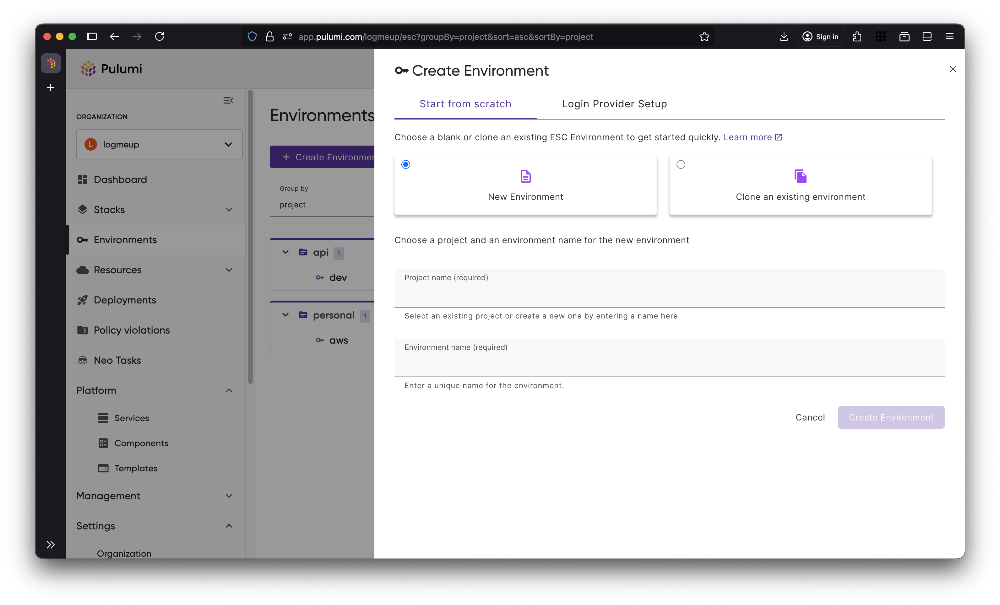
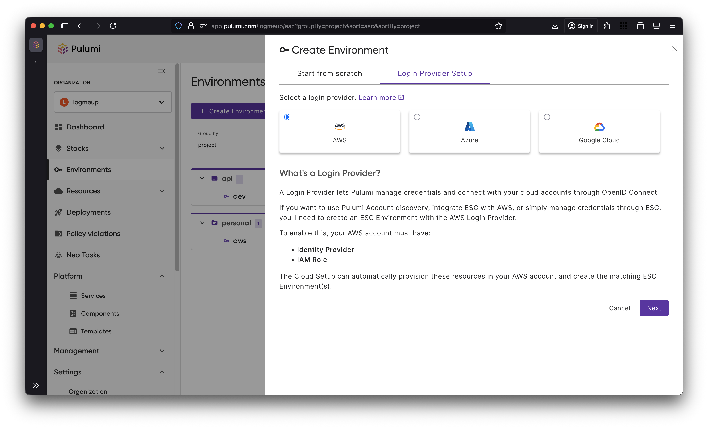
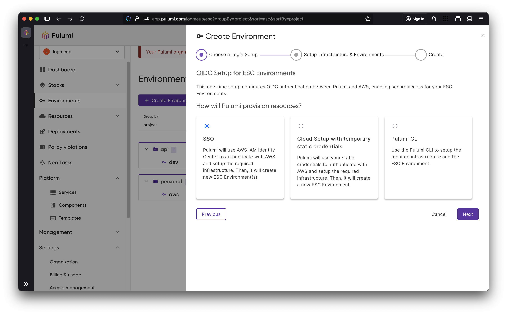
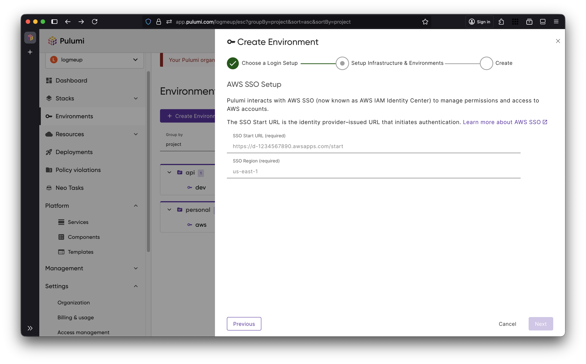
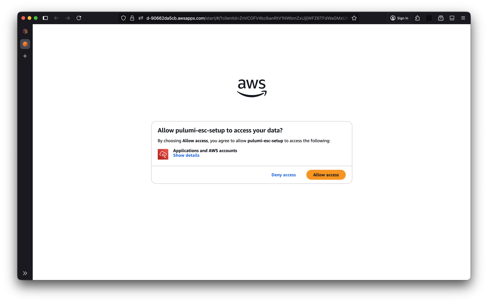
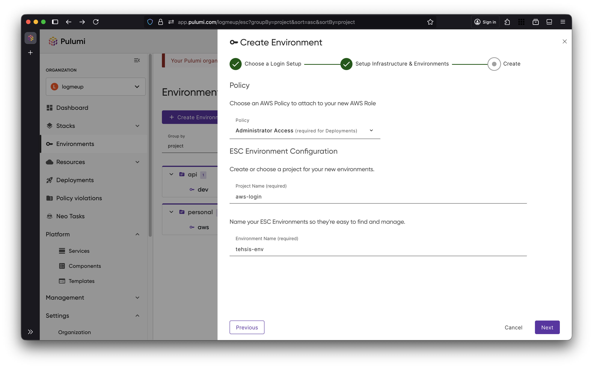

Pulumi ESC (Environments, Secrets, and Configuration) provides centralized secrets management and configuration orchestration across your infrastructure and applications. Today, we’re excited to introduce a redesigned onboarding experience and a simpler, automated way to set up Pulumi ESC as an OpenID Connect (OIDC) provider.

<!--more-->

## A new and refreshed onboarding experience

Pulumi ESC helps you manage configuration for Pulumi programs, handle secret rotation, and centralize secrets stored across multiple providers.

We’ve now started simplifying these workflows from the moment you create a new Environment. The redesigned onboarding experience helps you get the most out of ESC.



## Using Pulumi ESC as an OIDC Provider

Among its many uses, [Pulumi ESC can act as an OpenID Connect (OIDC) provider](/docs/esc/environments/configuring-oidc/), issuing short-lived, signed tokens that external systems can exchange for temporary cloud credentials. This eliminates hard-coded credentials and improves your security posture.

Other Pulumi offerings, such as [Pulumi Insights](/product/pulumi-insights/), use this mechanism to securely scan resources across your organization.

## A simpler way to setup OIDC for your cloud providers

Setting up an OIDC provider manually can involve multiple steps and be error-prone. To simplify this, Pulumi ESC now offers automated setup for AWS, Azure, and Google Cloud directly from the onboarding flow.



For each login provider, we offer different setup options to suit your needs. You can log in with your cloud credentials and let Pulumi Cloud handle the rest, or you can create your resources from your own machine using the Pulumi CLI.



Previously, you had to go to the AWS Console to create an identity provider, create and configure an IAM Role, and set up the trust policy before finally creating your ESC Environment.

Now, you can just use SSO, giving Pulumi Cloud permissions to create the necessary resources automatically.





After we have finished setting up the trust relationship with AWS, we'll setup a new ESC environment for you under the specified project.



Once setup is complete, your new environment is ready to issue short-lived credentials.

```bash
esc run aws-login/tehsis-env -- aws s3 ls
```

You can now access your cloud resources securely, without worrying about managing long-lived credentials.

## What's next?

This is just the beginning of our work to simplify Pulumi ESC setup and onboarding. We’re continuing to refine how teams configure, secure, and manage environments to make getting started with ESC as smooth as possible.

Try [Pulumi ESC](/docs/esc/environments/) today and see how it can streamline your secrets and configuration management!
