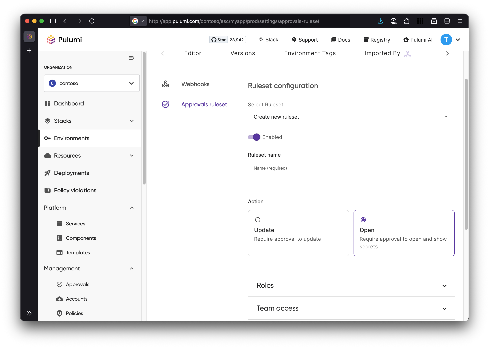
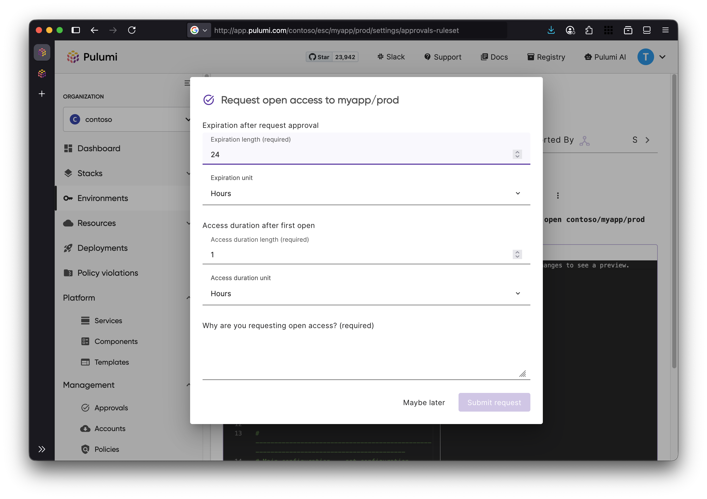
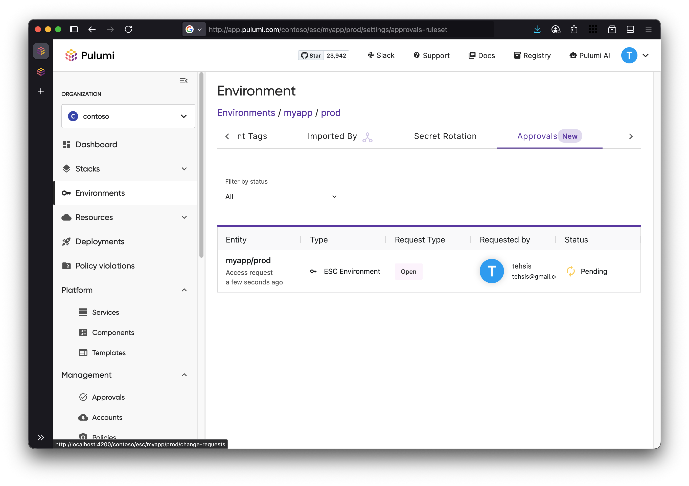

Many teams live with the fear that an environment, staging or production, **might be accidentally opened, exposing credentials or sensitive systems before anyone even notices**.

We’re excited to announce a new feature for Pulumi ESC: [Open approvals](/docs/esc/administration/approvals). A **governance capability that lets organizations require review and sign-off before an environment is opened** (i.e. activated or exposed)

<!--more-->

## Expanding on our mission to enforce compliance and security without slowing teams down

You may recall that earlier this year we introduced [Approvals for updates](../approvals-in-pulumi-esc), which allows teams to require review and sign-off before applying modifications to environment configurations. We are now extending Pulumi ESC auditing and governance capabilities to enable Just in time (JIT) access control.

Many organizations require more robust guardrails around when an environment becomes active or accessible. Open Approvals introduces a gate before environment activation, enforcing that every environment open is intentional, reviewed, and governed.

Open Approvals introduces a gate before environment activation, enforcing that every environment open is intentional, reviewed, and governed.

## How it works

When configuring Approvals gates for your environments under **Settings → Approval Rulesets**, you can now gate _Open_ actions in addition to Updates.
From this very same UI, you can define the approvals requirements:

- Number of required reviewers
- Specific teams or individuals allowed to approve
- Whether self-approval is permitted



Once a ruleset is defined, all open operations in the corresponding environment will require to be approved before proceeding.

To create an open request, users need to specify the approval duration, how long they need access after opening the environment, and a description explaining why access is needed.



Approvals can be later review and approved from the Approvals tab.



A request access can also be created from the CLI via the newly introdcued `env open-request` command.

```bash
$ esc env open-request org/project/env --access-duration=2h --grant-expiration=1h
```

## Closing notes

Open approvals expands on Pulumi ESC support for compliance and governance capability while we stay true to our goal:  empower teams to move fast while staying secure and compliant: no matter where or how changes happen.

We’re excited about what’s ahead and look forward to building it together with your feedback.

You can learn more about [Approvals in Pulumi ESC Docs](../../docs/esc/administration/Approvals).
