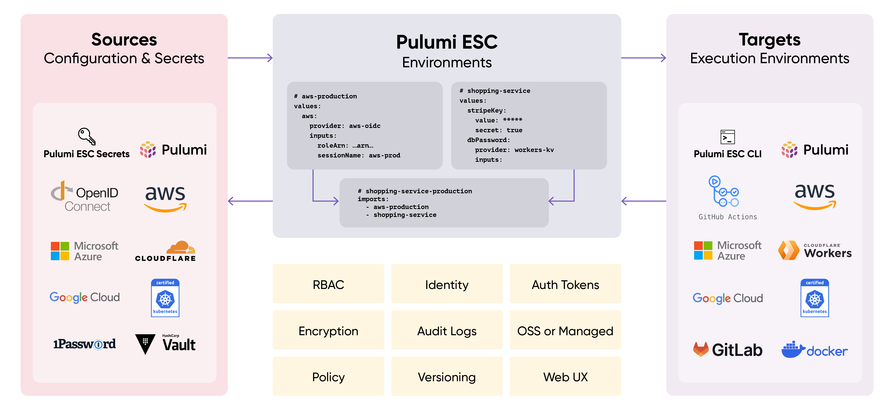
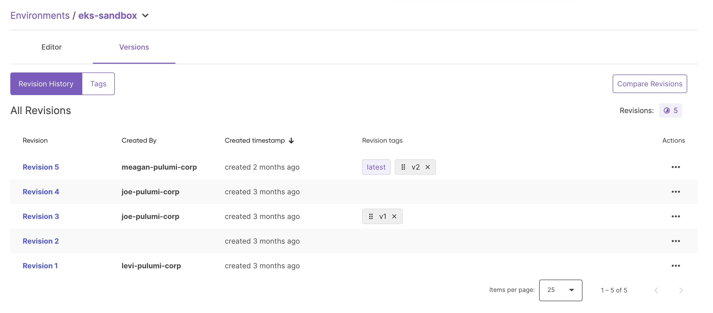
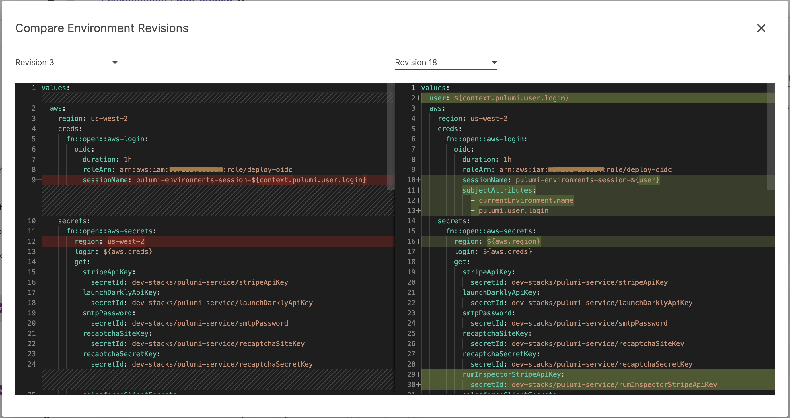
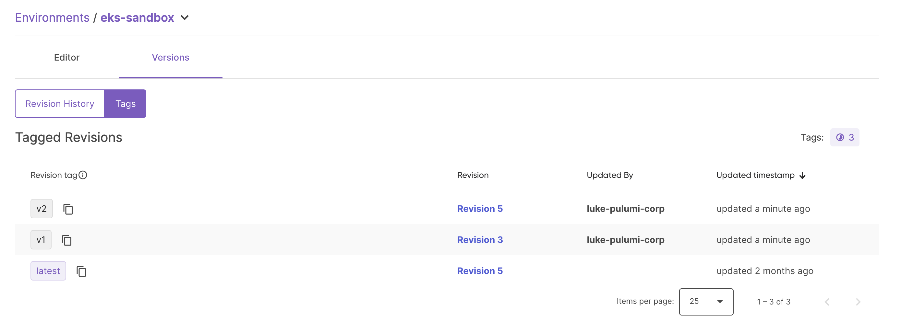

Last October we launched [Pulumi ESC](https://www.pulumi.com/docs/esc/), a new secrets and configuration management offering from Pulumi that manages and tames secrets and configuration complexity across all of your cloud applications and infrastructure.  We’ve seen incredible adoption of ESC over the last 6 months, with thousands of developers now managing their secrets and configuration via ESC.

Today, we are excited to announce the most significant collection of Pulumi ESC enhancements since the initial launch, with three major new features that bring best-in-class software engineering capabilities to bear on your Secrets and Configuration management needs.

<!--more-->

* [__Versioning__](/blog/esc-versioning-launch):  Pulumi ESC now supports versioning of environments, allowing you to see and audit every change to the secrets and configuration for an environment, pin references to an environment to a specific version or version tag, and safely roll back an environment to a previous version.

* [__SDKs__](/blog/esc-sdk-launch): Pulumi ESC now has SDKs available for Python, TypeScript/JavaScript and Go, enabling ESC to be used directly within applications, tools and services to retrieve and manage secrets and configuration values at runtime.

* [__Environments as Code with IaC__](/blog/esc-automation-api-pulumi-service-provider-launch): New support for defining and managing Pulumi ESC environments, secrets, and configuration from within Pulumi IaC programs allows source-controlled environment specification and managing secrets and configuration lifecycles via code.

All three of these new features double down on Pulumi ESC’s unique approach to secrets and configuration management, which combines a hierarchical and composable approach to defining environments, integration with a wide variety of existing secrets stores and a wide variety of secrets consumers, and a rich configuration-as-code approach. 

Together, these provide the richest experience in the market today for developers to apply software engineering best practices to their secrets and configuration management, enabling the management of secrets and configuration complexity at scale across complex collections of environments and applications.

## What is Pulumi ESC?

Pulumi ESC is a new category of configuration-as-code product, motivated by our experience working with hundreds of Pulumi IaC customers to address their needs in managing secrets and configuration at scale within their Pulumi infrastructure and across other cloud applications and infrastructure projects.

Pulumi ESC enables teams to aggregate secrets and configuration from many sources, manage hierarchical collections of configuration and secrets ("environments"), and consume those configuration and secrets from a variety of different application and infrastructure services. Pulumi ESC works hand-in-hand with Pulumi IaC to simplify configuration management, but also works independently from Pulumi IaC, as a solution for managing environments, secrets and configuration for _any_ application or infrastructure project.



## ESC Versioning

Safely managing the rollout of secrets and configuration changes to applications and infrastructure is one of the fundamental and critically important jobs that a software engineering team does. And yet, state-of-the-art secrets and configuration versioning still typically involve inflexible and bespoke systems for modifying configuration and/or copy/pasting across different environments. Pulumi ESC offers the ability to compose environments to avoid copy/paste, and also now supports rich versioning features to enable full auditability and safe rollout of configuration changes across environments.

There are two core features to Pulumi ESC versioning:

* Visibility into the history of every change made to an environment.
* The ability to pin any environment reference to a specific revision, or specific tagged version.

These offer the same sort of rich versioning typically seen in other software engineering ecosystems, like Git,  Docker, or NPM - but now applied to your secrets and configuration management as well.  

You can see the history of changes to an environment:



And then see the diff between any two versions of an environment:



Revisions can also be tagged to provide semantically meaningful names to specific revisions.  These tags can be moved later on to point to new versions when you are ready to roll them out to consumers.  The latest tag automatically always points to the latest revision.



Most importantly though, you can also then refer to a specific version of an environment anywhere you reference one.

When you run a command with `esc run` you you can specify `providers@v2` to pick the `v2` tag instead of the default `latest`:

```bash
$ esc run acmecorp/providers@v2 -- aws sts get-caller-identity
{
    "UserId": "AROAY65FYVYP33NYY5FOU:environments-session",
    "Account": "358361613858",
    "Arn": "arn:aws:sts::358361613858:assumed-role/environments-oidc/environments-session"
}
```

When you import another environment you can import a pinned version.  This enables changes to be made to the target environment without automatically being picked up by the consumer.  This allows phased rollout, with careful testing of new major versions before they are pushed out to production environments.

```yaml
imports:
  - ai-staging-aws@v3
values:
  pulumiConfig:
    clusterPetName: gold-kiwi
    clusterTags:
      cluster: ${pulumiConfig.clusterPetName}
    aws:defaultTags:
      tags: ${pulumiConfig.clusterTags}
```

Read more about Pulumi ESC versioning in the [launch blog post](/blog/esc-versioning-launch).

## ESC SDKs for Python, TypeScript/JavaScript and Go

Pulumi ESC was designed from the beginning to support consuming secrets and configuration from any application or infrastructure project.  While we have seen lots of early usage combining ESC with Pulumi IaC, the two are not fundamentally tied together at all, and ESC is designed to serve the needs of any complex configuration and secrets management workload.  

One of the most important places where secrets and configuration are consumed is in application and service code at runtime.  This can take many forms - a few illustrative examples include:

* An application that pulls configuration data at startup time
* An operational tool that pulls in temporary credentials to perform operations within a cloud account
* A control plane service that pushes configuration and secrets changes into other systems to keep configuration up to date and secrets actively rotated

In all cases, it’s important to be able to embed ESC within your application code.  At launch, ESC supported a public REST API, but now this has been extended with convenient and easy to use SDKs in the most popular languages - Python, TypeScript/JavaScript and Go.

To use ESC from within your applications, just import the SDK and add a few lines of code:

```py
import pulumi_esc_sdk as esc
import os

configuration = esc.Configuration(access_token=os.environ['PULUMI_ACCESS_TOKEN'])
client =  esc.EscClient(configuration)

env, vals, txt = client.open_and_read_environment("acmecorp", "dev-stacks")

print(vals['aws']['secrets']['stripeApiKey'])
```

Running this gets the Stripe API Key for this environment:

```bash
$ python3 __main__.py 
rk_test_3c88Pc8ZfdBredactedrEhDU11b42wI5KZ
```

Lots more details on the features and capabilities of the new Pulumi ESC SDKs in their [launch blog post](/blog/esc-sdk-launch).

# Environments as Code with IaC

Pulumi ESC helps to manage configuration and secrets complexity at scale via composition and reuse.  But many users still want to go further and version control the definitions of their environments, secrets and configuration.  

To enable this, along with many other powerful code-based environment management scenarios, we’ve added support for defining and managing Pulumi ESC Environments via Pulumi IaC itself.  New [`Environment`](/registry/packages/pulumiservice/api-docs/environment/) and [`EnvironmentVersionTag`](/registry/packages/pulumiservice/api-docs/environmentversiontag/) resources are available now in the Pulumi Cloud Provider in the Pulumi registry.

Managing the desired state of environments via infrastructure-as-code programs brings the most robust tools for managing version-controlled desired state definition possible to the realm of secrets and configuration management. And leveraging Pulumi’s best-in-class IaC capabilities and programming model offers the deepest possible software engineering capabilities for defining and managing configuration and secrets as code across environments.

Environment contents can be specified either inline, or in external files, and changes deployed into your Pulumi Cloud account via a simple `pulumi up`.

```typescript
import * as service from "@pulumi/pulumiservice";
import * as pulumi from "@pulumi/pulumi";

var environment = new service.Environment("testing-environment", {
  organization: "service-provider-test-org",
  name: "testing-environment-ts",
  yaml: new pulumi.asset.StringAsset(`\
values:
  myKey1: "myValue1"
  myNestedKey:
    myKey2: "myValue2"
    myNumber: 1`,
  ),
});
```

For more on managing Pulumi ESC Environments using Pulumi IaC, check out the [launch blog post](/blog/esc-automation-api-pulumi-service-provider-launch).

## Conclusion

[Pulumi ESC](/product/esc/) is a secrets and configuration management offering that provides best-in-class software engineering features for managing secrets and configuration complexity at scale. Today, we are extending this even further with:

* Rich [versioning](/blog/esc-versioning-launch) support for auditability and controlled configuration change rollout.  
* [SDKs](/blog/esc-sdk-launch) to easily embed ESC at runtime within applications, tools and services.
* Support for source controlling environment specifications using [`Environment` resources in Pulumi IaC](/blog/esc-automation-api-pulumi-service-provider-launch) programs.

Pulumi ESC has already been adopted by thousands of engineers to manage secrets and configuration complexity.  Check it out and get started with Pulumi ESC today!

You can learn more about Pulumi ESC at:

* [Getting Started](/docs/pulumi-cloud/esc/get-started)
* [Documentation](/docs/pulumi-cloud/esc)
* [Open Source](https://github.com/pulumi/esc)
* [Community Slack](https://slack.pulumi.com/)
