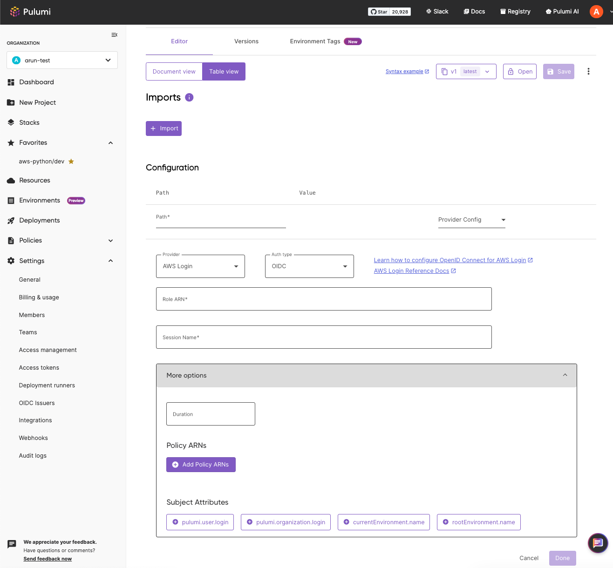

We are pleased to announce a major update to the [Pulumi ESC](/product/esc)’s Table Editor: full support for provider configurations is now live! When we [first introduced the ESC Table view](/blog/esc-key-value-table-editor-launch), our goal was to offer a user-friendly interface for managing complex configuration and secrets for your applications and infrastructure. This has empowered teams to focus on what they do best—building and deploying software.

In our initial launch, the Table Editor allowed you to perform CRUD operations on your secrets and plaintext values, decrypt secrets, import environments, and manage variables—all within a visual interface. Today, we’re taking the next step by enabling full read-write support for provider configurations within the Table Editor. This new capability allows you to add, edit, and manage your provider configurations directly from the table view, offering a more integrated and seamless experience.

<!--more-->

## Primer on ESC Provider Configuration

[Pulumi ESC’s provider ecosystem](/docs/esc/providers/) is one of its most powerful features. It supports two categories of providers:

- **Dynamic Cloud Provider Credentials**:  Dynamically acquire credentials from cloud providers like [AWS](/docs/esc/providers/aws-login/), [Azure](/docs/esc/providers/azure-login/), [GCP](/docs/esc/providers/gcp-login/), and [Vault](/docs/esc/providers/vault-login/) at runtime, eliminating the need for static, long-lived credentials. This enhances security by removing the reliance on dotenv files, locally stored secrets, or long-lived credentials in CI/CD environments, strengthening your workflows’ overall security.
- **Dynamic Secret Retrieval**: ESC retrieves secrets from external secrets managers, such as [AWS Secrets Manager](/docs/esc/providers/aws-secrets/), [1Password](/docs/esc/providers/1password-secrets/), and [HashiCorp Vault](/docs/esc/providers/vault-secrets/), securely pulling them directly into your environments. Whether you are migrating or utilizing Pulumi ESC’s rich toolset, you can retrieve sensitive information at runtime and apply it seamlessly to your applications.

## Enhancing the Table Editor: Provider Configuration Support

With the addition of provider configuration support in the Table view, incorporating Pulumi ESC provider capabilities into your workflow is now more straightforward. A clean, user-friendly form provides step-by-step guidance, promoting best practices like [OIDC](/docs/pulumi-cloud/oidc/) adoption and the secure handling of sensitive data. This streamlined approach reduces the need for external documentation, making the entire process more intuitive and efficient.

## Conclusion

The new provider configuration support in the ESC Table view marks another step in our efforts to simplify and enhance the developer experience. We’re eager to see how you’ll leverage this new capability to streamline your workflows and strengthen your infrastructure’s security. As always, your feedback is invaluable to our development process, and we’re committed to continually improving the Table Editor and other Pulumi tools based on your needs. Please share your feedback with us [here](https://github.com/pulumi/esc/issues/new/choose).

Check out our [documentation](/docs/esc) to learn more about Pulumi ESC.
