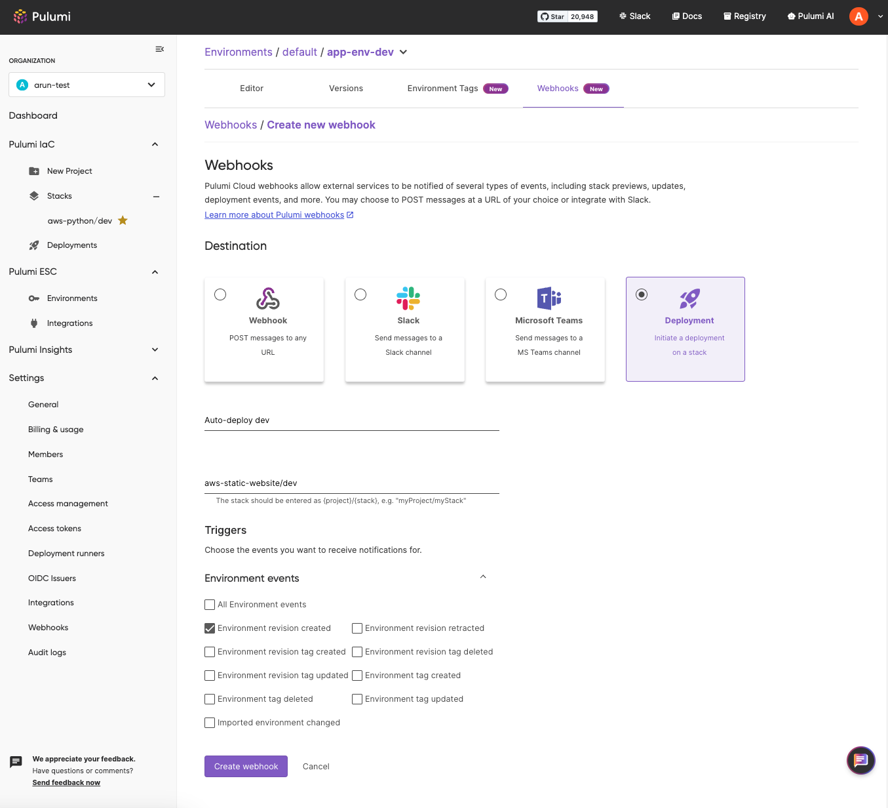

Managing secrets and configurations across multiple environments and teams can be a complex juggling act for development teams. [Pulumi ESC](/docs/esc/), our developer-friendly secrets management product, simplifies this process and accelerates your development cycle. Today, we're excited to make this process even easier with the launch of Webhooks for Pulumi ESC, a powerful new feature that allows you to send a custom trigger to any URL endpoint, enabling you to automate workflows and keep your infrastructure and applications up to date. Pulumi ESC Webhooks also integrates seamlessly with popular communication platforms like Slack and Microsoft Teams.

<!--more-->

With Pulumi ESC Webhooks, you can now receive real-time notifications and trigger automated actions based on specific events within your Pulumi ESC [Environments](/docs/esc/environments/).  For example, you can set up a Webhook to notify your team’s Slack channel or automatically trigger a deployment pipeline via a POST request when a new environment revision is created due to changes in secrets and configuration. Webhooks can be triggered by changes to [version tags](/docs/esc/environments/#tagging-versions) and [environment tags](/blog/esc-projects-environment-tags-launch/#introducing-environment-tags), and can be configured per environment or at the organization level for all environments.

Take your automation further by creating Webhooks that trigger [Pulumi Deployments](/docs/pulumi-cloud/deployments/), automatically updating your infrastructure in response to configuration changes in Pulumi ESC—without writing custom code and all within the Pulumi Cloud Console.

Hierarchical configurations where one environment [imports](/docs/esc/environments/#importing-other-environments) others are fundamental to Pulumi ESC. If an environment is importing another environment, any changes made to the imported environment trigger a Webhook configured within the current environment. The Webhook will notify you that the environment has changed, and you can call back to open the environment using [SDK](/docs/esc/sdk/), [REST API](/docs/pulumi-cloud/cloud-rest-api/#environments), [Pulumi Service Provider](/registry/packages/pulumiservice/api-docs/environment/), and [Automation API](/blog/esc-automation-api-pulumi-service-provider-launch/#streamline-automated-workflows-with-automation-api-enhancements), and get the latest secrets and configuration.

## Getting Started with Pulumi ESC Webhooks

Setting up Webhooks is straightforward. You can use the Pulumi Cloud Console, the Pulumi Service Provider, or REST API.

### Using Pulumi Cloud Console

- Navigate to the "Webhooks" tab under settings for organization-wide Webhooks or within an individual environment's top navigation bar.
- Select your desired integration (Slack, Microsoft Teams, Pulumi Deployments, or generic JSON Webhooks).
- Configure the Webhook details, including the events you want to trigger notifications on.



### Using Pulumi Service Provider

Here is a sample code in TypeScript:

```typescript
const environmentWebhook = new service.Webhook("env-webhook", {
  active: true,
  displayName: "env-webhook",
  organizationName: "my-org",
  projectName: environment.project,
  environmentName: environment.name,
  payloadUrl: "https://example.com",
  filters: [WebhookFilters.EnvironmentRevisionCreated, WebhookFilters.ImportedEnvironmentChanged],
})
```

## Benefits of Pulumi ESC Webhooks

Pulumi ESC Webhooks offer a range of benefits designed to enhance visibility, streamline workflows, and automate key processes related to your secrets and configuration management:

- **Effortless Automation and Streamlined Workflows**: Automatically trigger actions based on ESC events such as application restarts, infrastructure deployments, or configuration updates. Easily integrate Pulumi ESC Webhooks into your CI/CD pipelines to automate builds, tests, and deployments whenever environment updates occur.
- **Seamless Integration with Pulumi Deployments**: Whether you need to update your infrastructure, preview changes, or create temporary infrastructure with [TTL](/docs/pulumi-cloud/deployments/ttl/) or [review stacks](/docs/pulumi-cloud/deployments/review-stacks/), Pulumi ESC Webhooks handles all these scenarios, making deployments faster and easier.
- **Real-time Awareness and Collaboration**: Receive instant notifications about critical changes in your Pulumi ESC environments, fostering better communication and collaboration between developers, operations teams, and security personnel. This real-time awareness enables faster incident response times, minimizing downtime and security risks.

## Conclusion

Webhooks for Pulumi ESC equip your team with tools to improve visibility, streamline workflows, and automate key processes related to your secrets and configuration management. By integrating seamlessly with your existing communication and development tools, Pulumi ESC Webhooks empower you to automate and streamline your infrastructure management, giving you greater control and agility.

Dive into our [documentation](/docs/esc/webhooks/) and explore the possibilities of Pulumi ESC Webhooks! As always, share any feedback or open new issues in our [GitHub repository](https://github.com/pulumi/esc/issues/new/choose).
