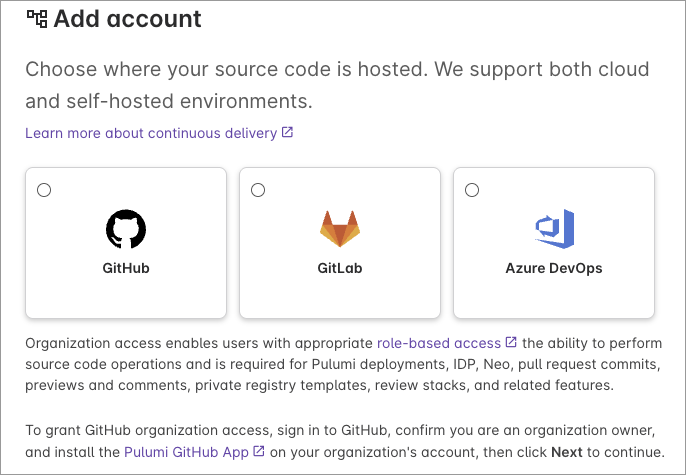
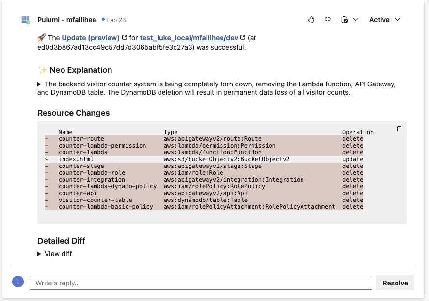

Your version control provider shouldn't limit your infrastructure workflows. Pulumi Cloud now works with [GitHub](/docs/version-control/github-app/), [GitHub Enterprise Server](/docs/version-control/github-app/#github-enterprise-server-support), [Azure DevOps](/docs/version-control/azure-devops-integration/), and [GitLab](/docs/version-control/gitlab/). Every team gets the same [deployment pipelines](/docs/deployments/deployments/), [PR previews](/docs/deployments/deployments/review-stacks/), and [AI-powered change summaries](/docs/ai/) regardless of where their code lives.

<!--more-->

## Connect multiple providers and accounts

You can connect multiple VCS providers to a single Pulumi organization simultaneously, like GitHub, GitLab, and Azure DevOps all at once. You can also connect multiple accounts of the same provider, such as two separate GitHub organizations or two GitLab groups. This means teams that work across different repositories, providers, or organizational boundaries can manage everything from one place.


GitHub Enterprise Server is currently limited to one connection per Pulumi organization.


## What your team can do

### Deploy on every push

Connect a repository to a stack, and infrastructure deploys automatically when you push. Configure path filters to trigger only when relevant files change, and manage environment variables and secrets directly in Pulumi Cloud. No external CI/CD pipeline required.

### Preview changes on pull requests

Every pull request gets an infrastructure preview so reviewers can see exactly what will change before merging. The preview runs the same Pulumi operations your deployment would, giving your team confidence that a merge won't break anything.

### Neo explains your changes

[Neo](/product/neo/) posts AI-generated summaries on your pull requests explaining what infrastructure changes mean in plain language. Reviewers who aren't Pulumi experts can still understand the impact of a change without reading resource diffs.

### Let Neo open pull requests for you

Ask Neo to make infrastructure changes and it opens pull requests directly against your connected repositories. Describe what you want in natural language, and Neo writes the code, opens the PR, and kicks off a preview, all without leaving Pulumi Cloud.

### Detect and fix drift

Schedule [drift detection](/docs/pulumi-cloud/deployments/drift/) to catch out-of-band changes automatically. When someone modifies infrastructure outside of your Pulumi programs, drift detection flags the difference so your team can remediate before it causes issues.

### Secure authentication

Pulumi Cloud authenticates with your VCS provider using OIDC or OAuth so no long-lived credentials need to be stored. Short-lived tokens keep your deployment pipelines secure without manual secret rotation.

### Set up new projects from your VCS

The new project wizard discovers your organizations, repositories, and branches so you can scaffold and deploy a new stack without leaving Pulumi Cloud. Pick your repo, choose a branch, and you're ready to deploy.

## Getting started

1. An org admin configures the integration under **Settings** > **Version Control**.
1. Authorize with your VCS provider.
1. Deploy infrastructure with first-class workflows.

For setup details, see the docs for [GitHub](/docs/version-control/github-app/), [GitHub Enterprise Server](/docs/version-control/github-app/#github-enterprise-server-support), [Azure DevOps](/docs/version-control/azure-devops-integration/), and [GitLab](/docs/version-control/gitlab/).


